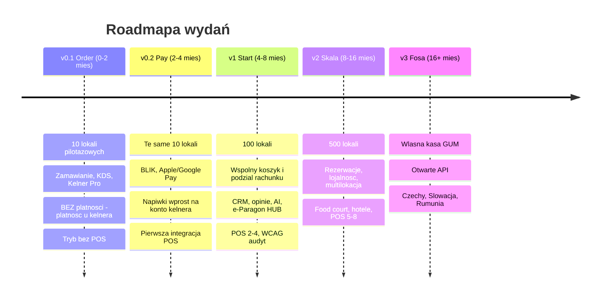

# 01 · Produkt, zakres i roadmapa

> Wymagany kontekst: [`00_INDEX.md`](00_INDEX.md) — konwencje ID i glosariusz.
> Dane rynkowe, konkurencja i cennik: `../01_Koncepcja_produktu.md` §1–2, §7–8. Tu nie powtarzane.

---

## 1. Zdanie definiujące produkt

> Gość skanuje kod przy stoliku, zamawia w swoim języku bez instalacji i rejestracji, dozamawia
> przez cały wieczór, płaci BLIK-iem, dzieli rachunek i zostawia napiwek konkretnemu kelnerowi —
> i wychodzi, nie czekając na terminal.

**Czym to nie jest:** cyfrowym menu. „Nasze menu w QR" to produkt, który rynek już raz odrzucił.
Sprzedajemy **pominięcie kolejki i pominięcie terminala**, nie kartę dań na ekranie.

---

## 2. Pięć zasad produktowych

Każda z nich jest testem, który przechodzi każda projektowana funkcja. Funkcja, która oblewa
test, jest przeprojektowywana albo wypada z zakresu.

| # | Zasada | Test operacyjny |
|---|---|---|
| **Z1** | Gość nigdy nic nie instaluje | Czy da się użyć bez pobierania, logowania i podawania danych? Imię i telefon — tylko jeśli gość sam zechce, i najwcześniej przy płatności |
| **Z2** | Kelner nigdy nie traci | Czy kelnerowi będzie z tym **lepiej**? Jeśli funkcja odbiera mu napiwek, kontakt z gościem albo kontrolę — przeprojektowujemy |
| **Z3** | Papierowe menu zostaje | Nie walczymy z papierem. QR to drugi tor dla tych, którzy się spieszą |
| **Z4** | Nie jesteśmy właścicielem gościa | Dane gościa należą do lokalu. Jesteśmy procesorem, nie administratorem (`LEG-008`). To jednocześnie argument sprzedażowy przeciw Wolt |
| **Z5** | Każda funkcja ma metrykę w złotych | Nie „wygodnie", tylko „+3,20 zł do średniego rachunku" albo „−1,4 h pracy kelnera na zmianę" |

**Z2 jest zasadą nadrzędną.** Wynika z niej cała dystrybucja: konkurenci sprzedają właścicielowi
„mniej personelu", personel to czuje i cicho sabotuje wdrożenie. Dlatego wdrożone systemy QR
osiągają 5–15% udziału zamówień. Nasz cel to 40%+ i osiągamy go tym, że kelner **zarabia więcej**
i sam mówi gościowi „proszę zeskanować, będzie szybciej".

---

## 3. Cztery powierzchnie

| Powierzchnia | Aplikacja | Użytkownik | Kontekst użycia |
|---|---|---|---|
| **Gość** | PWA (Next.js), bez instalacji | Konsument | Telefon w ręku, słabe 3G, ciemny lokal, hałas, pośpiech |
| **Kelner** | PWA / aplikacja mobilna | Kelner, barman | Jedna ręka, w ruchu, ciemno, ekran w kieszeni fartucha |
| **Kuchnia** | KDS na ekranie stacjonarnym | Kucharz, barman | Czytanie z 2 m, mokre ręce, para, brak czasu |
| **Panel** | Aplikacja webowa | Manager, właściciel | Biurko, laptop, analiza po zmianie |

Cztery różne konteksty ⇒ **cztery różne języki wizualne**, nie jeden responsywny layout.
Szczegóły: [`05_System_Projektowy.md`](05_System_Projektowy.md) §3.

---

## 4. Katalog funkcji

Kolumna **Wydanie** jest wiążąca — to jest źródło prawdy o zakresie.
Kolumna **Metryka** realizuje zasadę Z5.

### 4.1. Powierzchnia gościa — `F-G-*`

#### Szybkość

| ID | Funkcja | Opis | Metryka | Wydanie |
|---|---|---|---|---|
| `F-G-001` | Zero-install PWA | First paint < 1 s na 3G. Krytyczny CSS inline, obrazy WebP/AVIF, cache menu na CDN | Odrzucenia z powodu ładowania → 0 | **v0.1** |
| `F-G-002` | Zamawianie bez rejestracji | Tożsamość = token urządzenia. Dane dopiero przy płatności, opcjonalnie | −40% porzuceń na kroku rejestracji | **v0.1** |
| `F-G-008` | Statyczny kod QR stolika | Drukowany raz na zawsze, dynamika po stronie serwera | Zero przedruków dla lokalu | **v0.1** |
| `F-G-005` | Tag NFC na stoliku | Przyłożenie telefonu zamiast skanowania. Działa po ciemku. NTAG213 ≈ 1,5 zł/szt. | Konwersja skan→zamówienie +? (do zmierzenia w pilocie) | **v0.1** |
| `F-G-007` | „Zamów to samo" | Powtórzenie poprzedniej kolejki jednym tapnięciem | Główny przypadek użycia barów. Bezpośrednio +obroty | **v0.1** |
| `F-G-030` | Status zamówienia i ETA | Uczciwy status: przyjęte / w przygotowaniu / gotowe. ETA z rzeczywistych czasów KDS | −wezwań kelnera „gdzie moje danie" | **v0.1** |
| `F-G-031` | Dozamówienie w ramach rachunku | Kolejna partia dokłada się do tej samej sesji, nie zakłada nowego rachunku | +pozycji na sesję | **v0.1** |
| `F-G-003` | Tokenizacja karty | Drugie odwiedziny dowolnego lokalu w sieci = 1 tapnięcie | Retencja gościa w systemie | **v0.2** |
| `F-G-006` | Kolejka offline | Sieć padła → zamówienie w kolejce, synchronizacja po powrocie. **Granice: `02` §6.3** | Przewaga nad ORDI, które wprost nie działa offline | **v1** |

**Cele czasowe:** nowy gość — od zeskanowania do potwierdzonego zamówienia **< 20 s**.
Gość powracający — **< 8 s**. Rozbicie na budżety per ekran: [`05`](05_System_Projektowy.md) §7.

#### Menu, języki, alergeny

| ID | Funkcja | Opis | Metryka | Wydanie |
|---|---|---|---|---|
| `F-G-029` | Alergeny na ekranie pozycji | 14 alergenów, **przed dodaniem do koszyka**, nie w PDF w stopce. Legenda na tym samym ekranie | Obowiązek prawny `LEG-009`. Jednocześnie fundament `F-G-009` | **v0.1** |
| `F-G-012` | Cztery języki | PL / UA / EN / DE, autodetekcja z ustawień telefonu. Tłumaczenie AI + jednorazowa korekta przy onboardingu | ~1 mln Ukraińców w PL + turystyka. Argument sprzedażowy w Krakowie, Gdańsku, Zakopanem, Wrocławiu | **v0.1** |
| `F-G-013` | Żywa lista 86 (widok gościa) | Kuchnia oznacza „skończyło się" → pozycja natychmiast znika ze wszystkich stolików | Zabija najczęstszą skargę na cyfrowe menu | **v0.1** |
| `F-G-009` | Konwersacyjny filtr menu | Gość pisze lub mówi: „bez glutenu, nie za ostre, coś lekkiego do 60 zł" → menu się przebudowuje. PL/UA/EN/DE | Zamienia obowiązek prawny w główną funkcję. Nikt z konkurencji tego nie ma | **v1** |
| `F-G-010` | Upsell na danych lokalu | Model uczony na faktycznych rachunkach **tego** lokalu: co realnie kupują razem, jaka marża | **+8–12% średniego rachunku** | **v1** |
| `F-G-011` | Dobór napojów (AI sommelier) | Wino / piwo / koktajl do konkretnego dania, z uzasadnieniem w jednym zdaniu | Napoje = najwyższa marża. Każdy złoty idzie w EBITDA | **v1** |
| `F-G-014` | Zamawianie głosowe | Dyktowanie zamiast tapania | Dostępność (`LEG-011`) + szybkość w ciemnym barze | **v2** |
| `F-G-015` | „Smak pamięta" | Przy powrocie: „Ostatnio brałeś Żywiec i burgera. To samo?" | Retencja gościa | **v2** |

#### Doświadczenie grupowe

Najsilniejszy wyróżnik. Tego nie ma ani Wolt, ani firmy POS-owe.

| ID | Funkcja | Opis | Metryka | Wydanie |
|---|---|---|---|---|
| `F-G-016` | Wspólny koszyk stolika | Wszyscy przy stoliku skanują ten sam kod i widzą wspólny koszyk na żywo: „Marek dodał 2× Żywiec". Jedna osoba zatwierdza | Zdejmuje barierę „a kto będzie zamawiał?" | **v1** |
| `F-G-017` | Podział rachunku | Trzy tryby: **po równo**, **po pozycjach**, **ręcznie**. Każdy płaci swoją metodą | Legendarny ból w PL. Kelner z kalkulatorem i pięcioma terminalami to 10 minut na stolik. ⚠️ Wpływ na marżę: `TUN-007` | **v1** |
| `F-G-018` | „Ta kolejka na mnie" | Ktoś ogłasza, że stawia kolejkę — pozycje innych przypinają się do jego rachunku | Mechanika społeczna zwiększająca wolumen zamówienia | **v1** |
| `F-G-019` | Niezależne linki płatnicze | Każdy uczestnik dostaje własny link na swoją część. Kto wychodzi wcześniej — płaci i wychodzi | Nikt nie „wisi" na rachunku | **v1** |
| `F-G-020` | Kto co zamówił | Kuchnia i kelner widzą, komu podać które danie — po imieniu lub miejscu przy stole | −błędów przy podaniu | **v1** |
| `F-G-021` | Serwowanie etapami (coursing) | „Podaj wszystko razem" / „Przystawki teraz, dania za 20 minut" | Zachowuje etykietę restauracyjną. Logika delivery tego z zasady nie umie | **v1** |
| `F-G-022` | Quiz oczekiwania | Brandowany miniquiz stolika. Nagroda — zniżka na deser | Czas oczekiwania → narzędzie dosprzedaży | **v2** |

#### Płatność, napiwki, dokumenty

| ID | Funkcja | Opis | Metryka | Wydanie |
|---|---|---|---|---|
| `F-G-027` | „Zapłacę u kelnera" | Gotówka lub terminal kelnera. **Przycisk obowiązkowy zawsze** — art. 59ea UUP zabrania wymuszania bezgotówkowości (`LEG-012`) | Zgodność + gość starszy nie odpada | **v0.1** |
| `F-G-028` | Wezwanie kelnera | Przycisk „Poproszę kelnera" na **każdym** ekranie | Realizacja Z2: technologia nie zastępuje człowieka, tylko woła go dokładnie wtedy, gdy trzeba | **v0.1** |
| `F-G-032` | Potwierdzenie alkoholu — widok gościa | Pozycje alkoholowe czekają na potwierdzenie personelu przy podaniu. Gość widzi uczciwy status, nie „błąd" | Zgodność `LEG-010` bez psucia UX | **v0.1** |
| `F-G-004` | BLIK + Apple Pay + Google Pay | BLIK to standard de facto w PL. Apple/Google dla turystów | Bez BLIK produkt w PL nie istnieje. ⚠️ Ekonomia zależy od miksu: `DEC-009` | **v0.2** |
| `F-G-023` | Zapłać i wyjdź | Gość płaci w telefonie i wychodzi. Nie czeka na terminal | Główna obietnica produktu. Rotacja stolika **+8–15%** | **v0.2** |
| `F-G-024` | Napiwek dla konkretnego kelnera | Gość widzi, komu dziękuje — ze zdjęciem. Presety **5% / 10%** (polska norma wg MFR 2025) + własna kwota. Środki idą **wprost na konto kelnera** (`LEG-006`) | Napiwki kelnera **+15%**. ⚠️ Presety to `TUN-005` | **v0.2** |
| `F-G-026` | Faktura na NIP | Dla gości biznesowych, dane z GUS po numerze NIP | Segment B2B lunch | **v0.2** |
| `F-G-025` | e-Paragon przez HUB Paragonowy | Paragon trafia do aplikacji gościa przez HUB KAS, **bez zbierania e-maila**. Anonimowy KID | Wyróżnik techniczny. ⚠️ Zależny od `DEC-005` | **v1** |
| `F-G-033` | Zgody marketingowe | Moment składania zamówienia to **jedyne legalne okno** na zebranie zgody (art. 398 PKE — nie wolno nawiązać kontaktu, żeby dopiero poprosić o zgodę). Osobne checkboxy, bez pre-tick, rozdzielone kanały | Zasila `F-P-001` i `F-P-003`. Wymóg `LEG-007` | **v1** |

### 4.2. Powierzchnia kelnera — `F-K-*` («Kelner Pro»)

To nasza jedyna naprawdę niezajęta pozycja na rynku. **Żaden konkurent nie czyni kelnera
beneficjentem.**

| ID | Funkcja | Opis | Dlaczego kelner to polubi | Wydanie |
|---|---|---|---|---|
| `F-K-003` | Tablica stanu stolików | Kto czeka, kto zamówił, kto nie zapłacił od 25 minut, gdzie wciśnięto przycisk wezwania | Zastępuje bieganie „sprawdzić stolik 7" | **v0.1** |
| `F-K-004` | Powiadomienie „stolik 12 woła" | Push z `F-G-028` | Wołany dokładnie wtedy, kiedy trzeba | **v0.1** |
| `F-K-005` | Zamawianie z telefonu kelnera | Ten sam interfejs dla gości, którzy nie chcą QR (starsi, turyści). Kelner przyjmuje zamówienie przy stoliku | Koniec biegania do terminala POS. **Oszczędność ~1,5 h na zmianę** | **v0.1** |
| `F-K-008` | Potwierdzenie alkoholu | Krok potwierdzenia wieku przy podaniu, z zapisem w logu | Personel wykonuje art. 15 ust. 2 osobiście, a log ma wartość dowodową przy kontroli (`LEG-010`) | **v0.1** |
| `F-K-009` | Zamknięcie sesji stolika | Ręczne zamknięcie sesji przez kelnera | Bez tego następny gość zobaczy cudzy koszyk (`RULE-021`) | **v0.1** |
| `F-K-010` | Przyjęcie płatności gotówką | Oznaczenie rachunku jako zapłaconego gotówką lub terminalem | Domyka `F-G-027` | **v0.1** |
| `F-K-001` | Napiwki wprost na konto | Split w bramce płatniczej: lokalowi rachunek, kelnerowi napiwek, nam prowizja. **Lokal nie dotyka tych środków** | Więcej niż gotówką (89% Polaków daje napiwki, ale nie zawsze ma gotówkę) + czysto podatkowo (`LEG-006`) | **v0.2** |
| `F-K-006` | Osobisty kod QR kelnera | Gość skanujący ze stojaka przypisuje się do kelnera obsługującego sekcję | Zdejmuje obawę „mój napiwek trafi do kogoś innego" | **v0.2** |
| `F-K-002` | Ranking napiwków | Ranking kelnerów wg napiwków, ocen, upsellu. Miesięczny, z historią | Grywalizacja, która w HoReCa realnie działa | **v1** |
| `F-K-007` | Mój upsell | Ile dodatkowych złotych kelner przyniósł rekomendacjami | Podstawa systemu premiowego | **v1** |

### 4.3. Powierzchnia kuchni — `F-D-*`

| ID | Funkcja | Opis | Wydanie |
|---|---|---|---|
| `F-D-001` | Kitchen Display System | Zamówienia na ekranie, kodowanie kolorem wg czasu oczekiwania | **v0.1** |
| `F-D-002` | Lista 86 jednym tapnięciem | „Skończyło się" → pozycja znika ze wszystkich menu natychmiast | **v0.1** |
| `F-D-003` | Bump i czas przygotowania | Faktyczny czas każdego dania → dane do analityki i do uczciwego ETA dla gościa | **v0.1** |
| `F-D-005` | Autodruk na drukarki bonowe | Dla lokali, które nie chcą ekranów. **Jedyna droga w trybie bez POS** (`P2`) | **v0.1** |
| `F-D-004` | Coursing / timing podania | Sterowanie kolejnością podania, spójne z wyborem gościa w `F-G-021` | **v1** |
| `F-D-006` | Stacje | Podział na grill / sałatki / bar | **v1** |

### 4.4. Panel managera i właściciela — `F-P-*`

| ID | Funkcja | Opis | Dlaczego za to płacą | Wydanie |
|---|---|---|---|---|
| `F-P-010` | Onboarding lokalu | Kreator uruchomienia: import menu, generowanie QR, konta personelu, parowanie POS, checklist startowy | Od tego zależy obietnica „szkolenie w 40 minut". **Brak w koncepcji — dodane (`P7`)** | **v0.1** |
| `F-P-009` | Edytor menu | Kategorie, pozycje, modyfikatory, alergeny, tłumaczenia, zdjęcia, ceny | Warunek konieczny wszystkiego | **v0.1** |
| `F-P-011` | Generator kodów i stojaków | QR/NFC per stolik, plik do druku, mapa sali | Nasza obsługa wdrożenia | **v0.1** |
| `F-P-012` | Konta personelu i role | Kelner, kucharz, manager, właściciel. Sekcje sali | Podstawa RBAC | **v0.1** |
| `F-P-014` | Pulpit | Zamówienia, przychód, rotacja stolika | Codzienny widok managera | **v0.1** |
| `F-P-007` | Rotacja stolika | Średni czas od zajęcia do zapłaty, przed i po wdrożeniu | **Nasza główna metryka dowodowa ROI.** To ona sprzedaje pilot na 30. dzień | **v0.1** |
| `F-P-015` | Uprawnienia planu | Mapowanie plan taryfowy → funkcje. Plan Menu = 0 zł musi być realnie ograniczony | Bez tego monetyzacja nie działa. **Wymóg v0, nie v1 (`P8`)** | **v0.1** |
| `F-P-013` | Parowanie POS | Konfiguracja integracji, mapowanie pozycji menu, test połączenia | Warunek `v0.2` | **v0.2** |
| `F-P-001` | CRM gości | Telefon/e-mail zebrane przy płatności z poprawną zgodą (`F-G-033`). Historia wizyt, ulubione dania, RFM | **Główny argument przeciw Wolt: baza jest wasza, nie marketplace'u** | **v1** |
| `F-P-002` | Przechwytywanie opinii | Zadowolony (4–5) → link do Google Maps. Niezadowolony (1–3) → prywatny feedback + alert do managera | Sprzedaje się na pierwszym demo. Ocena Google = ruch = przychód | **v1** |
| `F-P-004` | Menu engineering | Macierz Stars / Puzzles / Plowhorses / Dogs automatycznie z rzeczywistej sprzedaży i marży | Konsulting za 5 tys. zł wbudowany w abonament | **v1** |
| `F-P-005` | Analityka kelnerów | Sprzedaż, upsell, napiwki, rotacja, średni czas obsługi | Podstawa premii — i zwolnień. Właściciele to uwielbiają | **v1** |
| `F-P-003` | Autokampanie | „Nie był 30 dni → kawa gratis", „Urodziny → deser", „Zamawiał tylko w porze lunchu → oferta wieczorna" | Retencja jest 5× tańsza od pozyskania | **v2** |
| `F-P-006` | Mapa cieplna stolików i godzin | Które stoliki i w jakich godzinach ile przynoszą | Planowanie zmian, przemeblowanie sali | **v2** |
| `F-P-008` | Multilokacja | Porównanie filii, zbiorcza analityka, wspólne menu z lokalnymi cenami | Sieci to najdroższy segment | **v2** |
| `F-P-016` | Prognoza odpisów i zakupów | Przewidywanie zużycia na podstawie historii sprzedaży | Redukcja strat | **v2** |

### 4.5. Nadbudowy segmentowe — `F-S-*`

| ID | Funkcja | Segment | Wydanie |
|---|---|---|---|
| `F-S-005` | Rezerwacja stolika z wyborem miejsca | Restauracje | **v2** |
| `F-S-002` | Stemple i lojalność | Kawiarnie, fast casual | **v2** |
| `F-S-001` | Zamówienie na wynos, kolejka z numerem, push „gotowe" | Kawiarnie, fast casual | **v2** |
| `F-S-003` | Tryb bez kelnera, wiele kuchni na jeden rachunek, sezonowe QR | Ogródki piwne, food courty, eventy | **v2** |
| `F-S-004` | QR w pokoju / przy basenie, integracja PMS, zamówienie na godzinę | Hotele, SPA | **v2** |

> `F-S-005` **rezerwacja** to najwyżej oceniana technologia przez polskich gości (78%, MFR 2025/2026)
> — wyżej niż kioski (72%). Jest w v2 wyłącznie dlatego, że nie broni naszej fosy. Jeśli sprzedaż
> pokaże, że domyka transakcje, przesunięcie do v1 jest uzasadnione (`DEC-011`).

### 4.6. Fosa — `F-X-*`

| ID | Funkcja | Opis | Wydanie |
|---|---|---|---|
| `F-X-001` | Własna certyfikowana kasa wirtualna (GUM) | Pozwala sprzedawać lokalom **bez POS w ogóle** i przejąć pełny stos | **v3** |
| `F-X-002` | Otwarte API i marketplace integracji | ⚠️ Ewolucja w marketplace uruchamia obowiązki DAC7 (`LEG-013`) | **v3** |
| `F-X-003` | Ekspansja: Czechy, Słowacja, Rumunia | Podobna złożoność fiskalna = ta sama fosa | **v3** |

---

## 5. Roadmapa

Kluczowa zmiana wobec koncepcji: **v0 rozdzielone na v0.1 i v0.2** (`P1`).

### 5.1. Dlaczego v0 jest rozdzielone

Koncepcja umieszcza w v0 napiwki przez split w bramce płatniczej. Jednocześnie sama przyznaje, że:

- **BLIK-split na wielu odbiorców naraz nie jest potwierdzony u żadnego PSP** (§10 p.9c —
  cytat: „to rozstrzyga, czy nasz model napiwków jest w ogóle możliwy")
- **Kwalifikacja podatkowa napiwków czeka na ORD-IN** (§6.3), a błąd oznacza dla lokalu
  obciążenie PIT+ZUS ~40% od każdego napiwku

Wiązanie całego pilotu z dwiema nierozstrzygniętymi zewnętrznymi zależnościami jest ryzykiem,
którego nie trzeba brać.

| Wydanie | Waliduje | Zależności zewnętrzne |
|---|---|---|
| **v0.1** | Główne ryzyko produktu: **czy goście w ogóle skanują i zamawiają** (cel 40% udziału zamówień wobec 5–15% u konkurencji) oraz czy kelnerzy nie sabotują | **Żadnych.** Płatność u kelnera, tryb bez POS |
| **v0.2** | Ekonomię jednostkową i model napiwków | Umowa z PSP + `DEC-009` (stawki) + ORD-IN (`DEC-003`, `DEC-004`) |

Jeśli v0.1 pokaże udział zamówień poniżej ~20%, problemem jest produkt lub pozycjonowanie —
i dowiadujemy się tego **zanim** wydamy budżet na integracje płatnicze i opinie prawne.

### 5.2. Tryb bez POS (`P2`)

Koncepcja wymaga w v0 jednej integracji POS. Beachhead — ogródki piwne i tarasy — często POS-a
nie ma wcale.

**Rozwiązanie:** adapter POS z implementacją pustą (`MOD-pos-sync`, wariant `null`).
Zamówienia trafiają do KDS albo na drukarkę bonową (`F-D-005`), fiskalizacja zostaje ręcznie
na kasie lokalu. Architektonicznie darmowe, komercyjnie rozszerza rynek pilotu.

⚠️ **Ograniczenie do zakomunikowania klientowi:** w trybie bez POS to lokal odpowiada za
terminowe wystawienie paragonu. Nie przejmujemy tego obowiązku (`LEG-002`).

### 5.3. Decyzje architektoniczne, które muszą być podjęte w v0.1

Choć funkcje są w późniejszych wydaniach, **model danych musi je uwzględniać od pierwszego dnia**,
bo retrofit oznacza przepisanie:

| Co | Dlaczego już w v0.1 | Dokument |
|---|---|---|
| `ENT-TableSession` z **wieloma uczestnikami** | Wspólny koszyk (`F-G-016`) i podział rachunku (`F-G-017`) są w v1, ale sesja jednoosobowa to inna domena. Retrofit = przepisanie (`P3`) | [`03`](03_Model_Domenowy.md) |
| **Multitenancy** (`Tenant` → `Venue`) | Multilokacja jest w v2, ale izolacja danych wpisana po fakcie to migracja całej bazy | [`03`](03_Model_Domenowy.md), [`04`](04_Architektura_Moduly.md) |
| **Drabina tożsamości gościa** | CRM (v1) i „smak pamięta" (v2) zakładają tożsamość silniejszą niż token urządzenia (`P4`) | [`03`](03_Model_Domenowy.md) §5 |
| **Uprawnienia planu** (`MOD-entitlements`) | Pięć planów taryfowych z darmowym poziomem wymaga bramkowania funkcji od startu (`P8`) | [`04`](04_Architektura_Moduly.md) |
| **WCAG 2.1 AA w tokenach** | Ustawa z 26.04.2024 obowiązuje od 28.06.2025. Retrofit dostępności jest droższy i blokuje przetargi sieciowe (`LEG-011`) | [`05`](05_System_Projektowy.md) |
| **Pieniądze jako liczby całkowite w groszach** | Zmiana typu po wdrożeniu płatności to migracja danych finansowych | [`03`](03_Model_Domenowy.md) §6 |

---

## 6. Świadomie poza zakresem

Nie budujemy. Zapisane, żeby nie wracało jako „a może jednak".

| Czego nie robimy | Dlaczego |
|---|---|
| **Własnej fiskalizacji przed v3** | Certyfikacja GUM to 6–12 miesięcy. Do v3 fiskalizuje POS albo lokal (`LEG-002`) |
| **Trzymania środków gościa na własnym rachunku** | Wymaga licencji MIP/KIP. Art. 150 ust. 1 UUP: do 5 mln zł kary lub 2 lata pozbawienia wolności. **Czerwona linia** (`LEG-001`) |
| **Puli napiwków (pooling)** | Prawie zawsze przekwalifikowywana na przychód ze stosunku pracy (`LEG-006`) |
| **Obowiązkowego service charge domyślnie** | To część ceny usługi: VAT 8% i obowiązkowo na paragonie. Napiwek ma być zawsze opcjonalny (`LEG-005`) |
| **Trybu „tylko aplikacja" bez gotówki** | Art. 59ea UUP tego zakazuje (`LEG-012`) |
| **Bycia agentem obu stron** | Niszczy wyłączenie z art. 6 pkt 2 UUP i wywraca cały model przepływu środków (`LEG-001`) |
| **Budowania własnej bazy gości „dla siebie"** | Jesteśmy procesorem. Naruszenie art. 28 ust. 10 RODO — i utrata głównego argumentu przeciw Wolt (`LEG-008`, zasada Z4) |
| **Robotów kelnerskich, kiosków, własnego hardware'u** | Najniżej oceniana technologia w badaniu (37%). Sprzeczne z zasadą Z2 |
| **Delivery i marketplace'u** | Inna domena, inny model. Dodatkowo uruchamia DAC7 (`LEG-013`) |
| **Rezygnacji z papierowego menu** | Zasada Z3. Lokal bez papieru traci starszych gości |

---

## 7. Metryki sukcesu

### 7.1. Bramki pilotu (v0.1, 30 dni, mierzone w tygodniu 1 i 4)

| Metryka | Cel | Znaczenie |
|---|---|---|
| Udział zamówień przez QR | **> 40% w 90 dni** | Główna. U konkurencji 5–15%. Jeśli < 20% — problem z produktem, nie ze sprzedażą |
| Konwersja skan → zamówienie | **> 55%** | Jakość ścieżki gościa |
| Rotacja stolika | **+8–15%** | Dowód ROI dla właściciela |
| Średni rachunek | **+8–12%** | Wymaga `F-G-010` — pełny efekt dopiero w v1 |
| Czas od zajęcia stolika do pierwszego zamówienia | **−4 min** | Bezpośredni efekt `F-G-001` i `F-G-007` |

### 7.2. Bramki v0.2

| Metryka | Cel |
|---|---|
| Napiwki na kelnera | **+15%** |
| Udział BLIK w miksie płatności | **> 65%** — poniżej tego progu ekonomia jednostkowa się nie spina (`DEC-009`) |
| Udział „zapłać i wyjdź" wśród zapłaconych rachunków | **> 50%** |

### 7.3. Techniczne (obowiązują od v0.1)

| Metryka | Cel |
|---|---|
| First paint PWA gościa na 3G | **< 1 s** |
| Skan → potwierdzone zamówienie, nowy gość | **< 20 s** |
| Skan → potwierdzone zamówienie, gość powracający | **< 8 s** |
| Opóźnienie zamówienie → KDS | **< 2 s** (p95) |
| Dostępność w godzinach serwisu | **> 99,5%** |
| Zdarzenie płatności → POS (fiskalizacja) | **< 5 s** (p99) — wymóg podatkowy, nie wydajnościowy (`LEG-003`) |

---

## 8. Powiązane dokumenty

- Kto i jak używa tych funkcji → [`02_Aktorzy_Scenariusze.md`](02_Aktorzy_Scenariusze.md)
- Jak to jest zamodelowane → [`03_Model_Domenowy.md`](03_Model_Domenowy.md)
- Jak moduły się komunikują → [`04_Architektura_Moduly.md`](04_Architektura_Moduly.md)
- Jak to wygląda → [`05`](05_System_Projektowy.md), [`06`](06_Ekrany_Gosc.md), [`07`](07_Ekrany_Kelner_KDS.md), [`08`](08_Ekrany_Panel.md), [`09`](09_Ekrany_v2_v3.md)
- Co jeszcze do rozstrzygnięcia i gdzie tuningować → [`10_Tuning_Decyzje_Ryzyka.md`](10_Tuning_Decyzje_Ryzyka.md)
