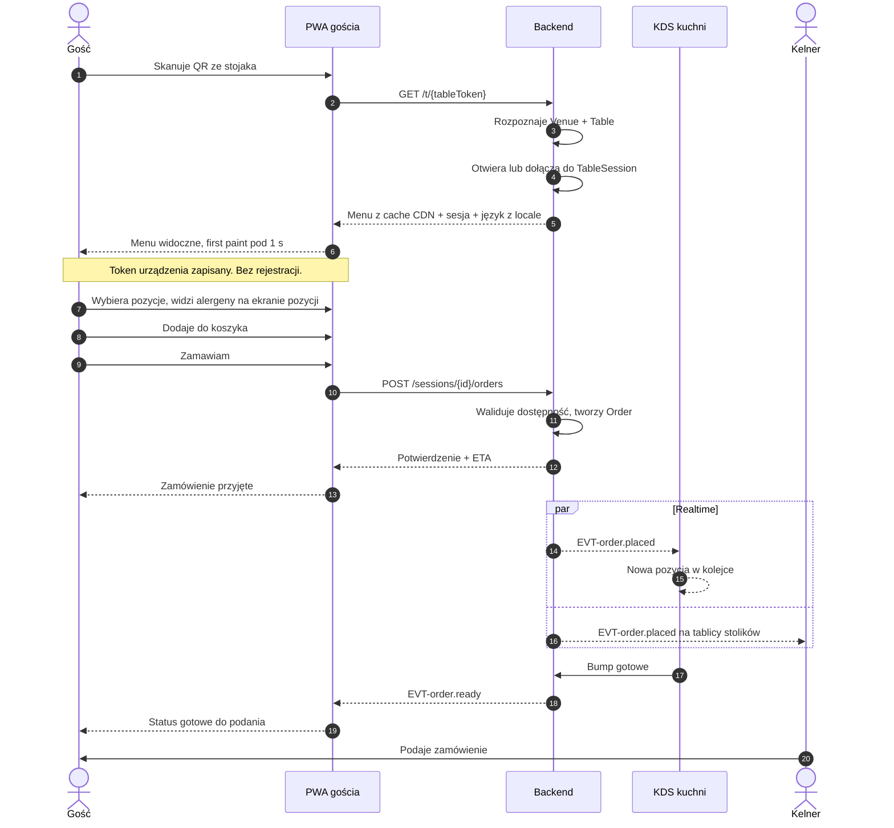
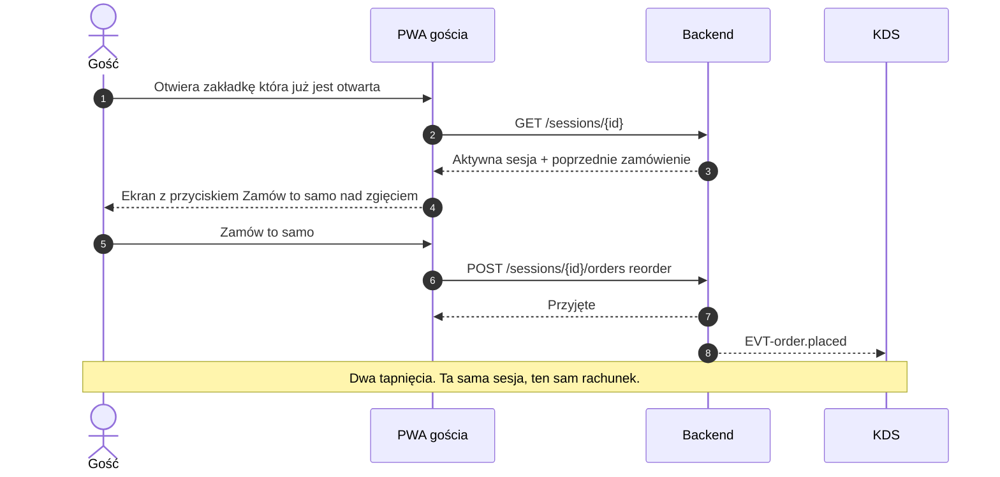
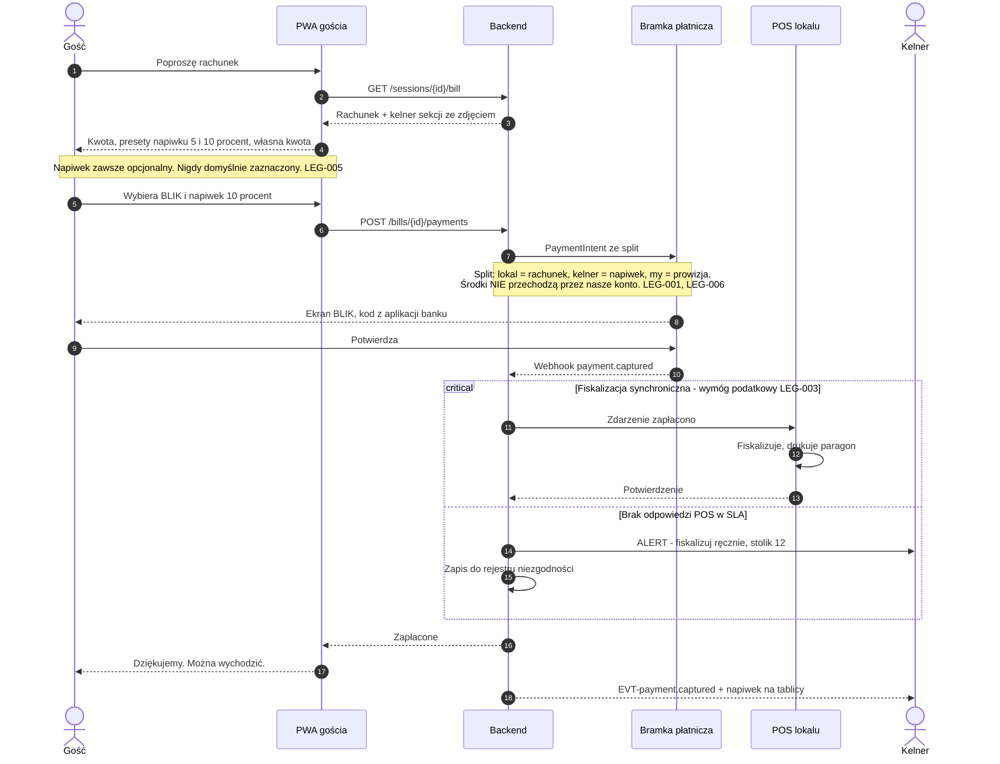
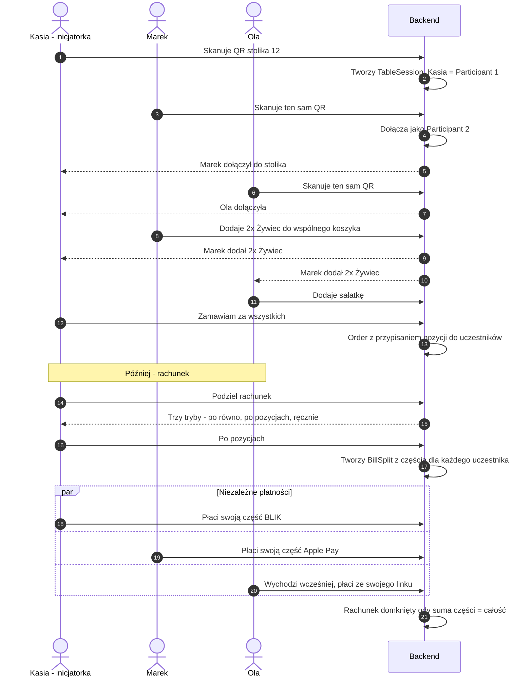
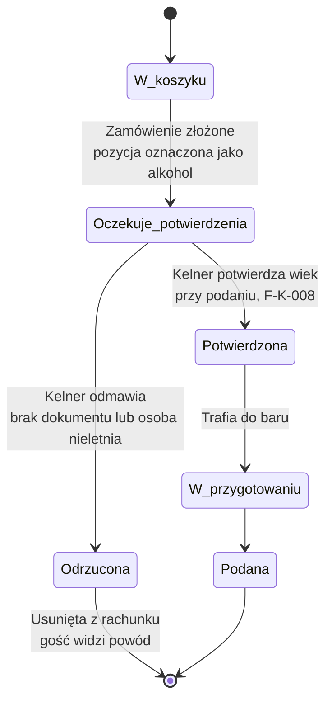
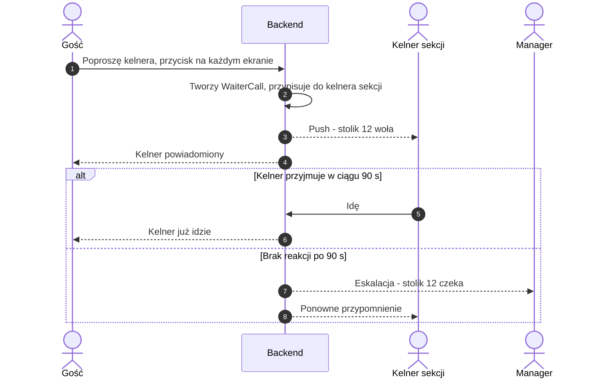
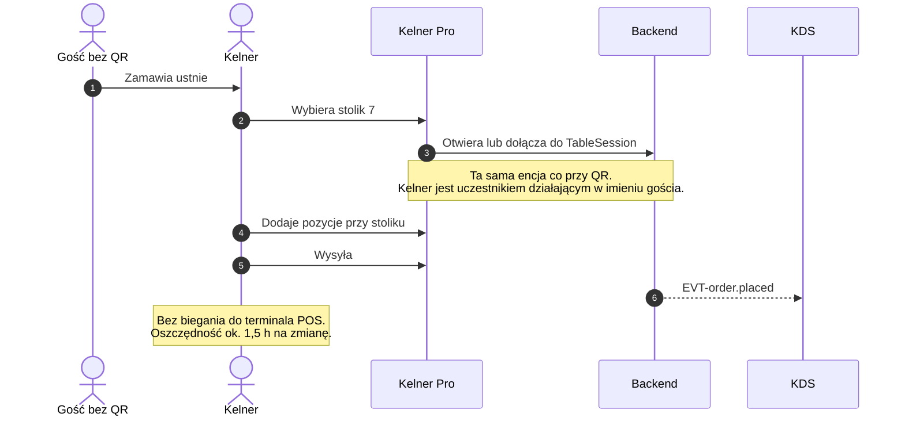
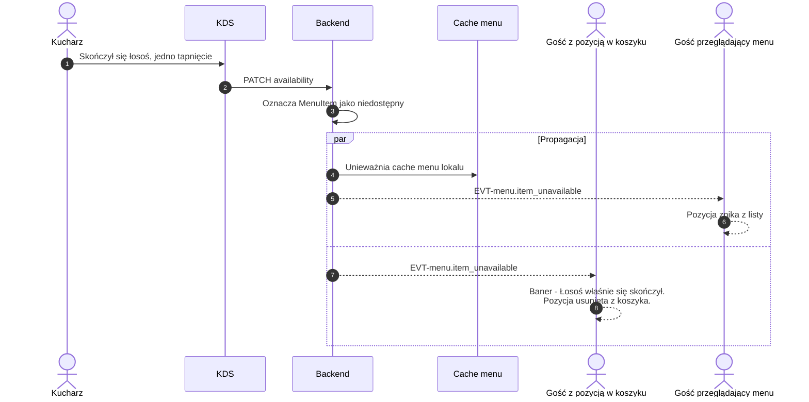
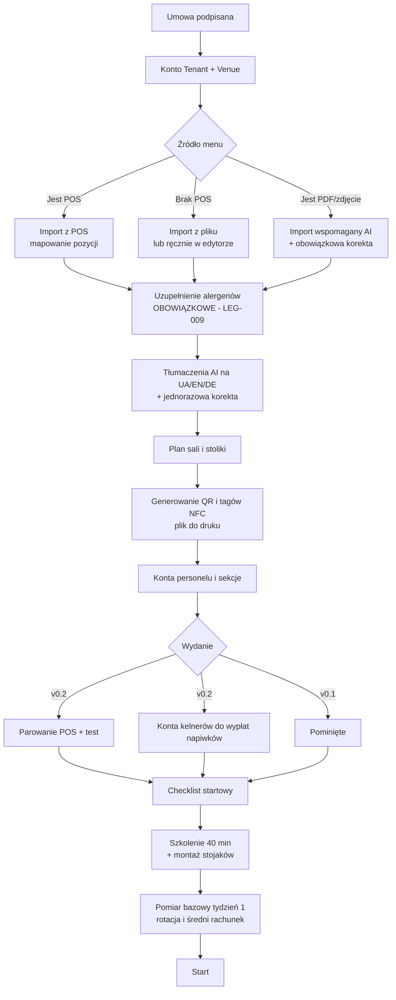
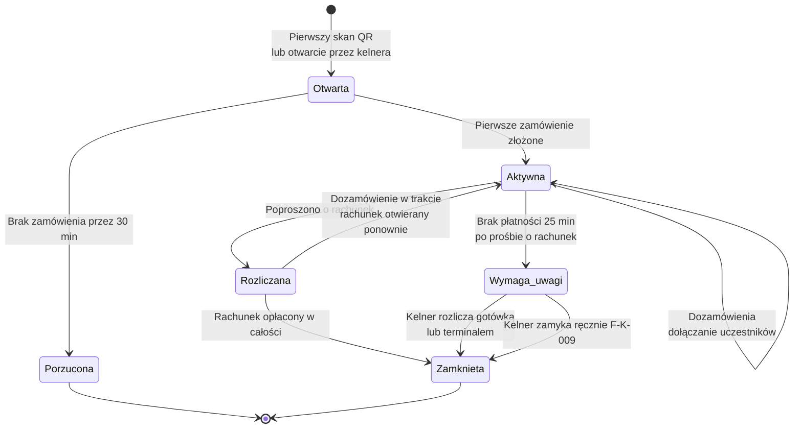

# 02 · Aktorzy i scenariusze

> Wymagany kontekst: [`00_INDEX.md`](00_INDEX.md). Funkcje `F-*` zdefiniowane w [`01`](01_Produkt_Zakres_Roadmapa.md).
> Encje i stany, do których odwołują się przepływy: [`03`](03_Model_Domenowy.md).

---

## 1. Aktorzy

### 1.1. Ludzie

| Aktor | Kim jest | Główna potrzeba | Powierzchnia |
|---|---|---|---|
| **Gość** | Konsument przy stoliku. Nie ma naszej aplikacji i nie będzie jej instalował | Zamówić szybko, nie łapiąc wzroku kelnera. Zapłacić i wyjść | PWA gościa |
| **Kelner** | Obsługuje sekcję sali. Pracuje na napiwkach | Mniej biegania, więcej napiwków, nie stracić kontaktu z gościem | Kelner Pro |
| **Kucharz / barman** | Wykonuje zamówienia | Czytelna kolejka, możliwość zdjęcia pozycji z menu w sekundę | KDS |
| **Manager lokalu** | Prowadzi zmianę, układa menu i grafik | Widzieć, co się dzieje teraz. Rozliczyć zmianę | Panel |
| **Właściciel** | Decyduje o zakupie i o tym, czy zostajemy | Dowód w złotych: rotacja, średni rachunek, koszt pracy | Panel |
| **Właściciel sieci** | Wiele lokali (v2) | Porównanie filii, wspólne menu z lokalnymi cenami | Panel, tryb sieci |
| **Administrator platformy** | My | Wdrożenie lokalu, wsparcie, diagnostyka | Panel wewnętrzny |

### 1.2. Systemy zewnętrzne

| System | Rola | Kierunek | Od wydania |
|---|---|---|---|
| **POS lokalu** | Fiskalizacja, źródło menu, magazyn | Dwustronny | v0.2 (v0.1 = tryb `null`, `P2`) |
| **PSP / bramka płatnicza** | BLIK, karty, Apple/Google Pay, **split** | Dwustronny + webhooki | v0.2 |
| **HUB Paragonowy KAS** | e-Paragon dla gościa | Wychodzący | v1 (zależny od `DEC-005`) |
| **Drukarka bonowa** | Wydruk zamówień bez KDS | Wychodzący | v0.1 |
| **Google Maps / Profil Firmy** | Kierowanie zadowolonych gości na opinie | Wychodzący (link) | v1 |
| **Dostawca push / WebPush** | Powiadomienia dla kelnera i gościa | Wychodzący | v0.1 |
| **KSeF** | Nasz własny billing wobec lokali | Dwustronny | v1 (`LEG-014`) |
| **GUS / REGON API** | Dane firmy po numerze NIP dla faktury | Wychodzący | v0.2 |
| **PMS hotelowy** | Dopisanie do rachunku pokoju | Dwustronny | v2 |

---

## 2. Persony

Trzy persony, które realnie zmieniają decyzje projektowe. Nie marketing — ograniczenia.

### P1 · Kasia, 29 lat — gość w ogródku piwnym

Piątek, 20:30, Kraków. Sześć osób przy stoliku, głośno, ciemno. Kelner nie podchodzi od 15 minut.
Bateria 18%. Kasia chce zamówić kolejkę dla wszystkich i nie chce wstawać.

**Wymusza:** `F-G-001` (ładowanie < 1 s przy słabym zasięgu i baterii), tryb ciemny jako
domyślny wieczorem, `F-G-007` („Zamów to samo"), duże cele dotykowe przy ruchu i hałasie,
`F-G-016` (wspólny koszyk — bo ona nie chce być jedyną, która zamawia i płaci).

### P2 · Marek, 41 lat — kelner z 12-letnim stażem

Nie ufa technologii, bo poprzedni system w innym lokalu zabrał mu napiwki na konto właściciela.
Obsługuje 14 stolików. Jeśli uzna, że system mu szkodzi — powie gościom „lepiej zamówić u mnie"
i wdrożenie umrze.

**Wymusza:** całą zasadę Z2. Konkretnie: `F-K-001` (napiwek widocznie idzie na **jego** konto),
`F-K-006` (osobisty QR — pewność, że to jego napiwek), `F-G-028` (przycisk wezwania — dowód,
że nie jest wypychany), `F-K-005` (przyjmowanie zamówień z telefonu — narzędzie, nie zastępstwo).
Aplikacja obsługiwana **jedną ręką**, w ruchu, ekran czytelny w ciemnym lokalu.

### P3 · Pan Andrzej, 58 lat — właściciel restauracji

Kupował już system, który „miał wszystko" i z którego personel nie korzysta. Nie interesuje go
nowoczesność. Pyta jedno: ile na tym zarobię i co się stanie, jak wyłączycie serwery.

**Wymusza:** `F-P-007` (rotacja stolika przed/po — dowód w złotych na 30. dzień pilotu),
przejrzystość prowizji bez gwiazdek, `F-G-027` (gotówka zostaje — jego goście płacą gotówką),
zasadę Z3 (papier zostaje), eksport własnych danych.

---

## 3. Przepływy podstawowe

### 3.1. S1 · Nowy gość, pierwsze zamówienie (v0.1)

Ścieżka krytyczna produktu. Budżet: **< 20 s** od zeskanowania do potwierdzenia.

**Punkty ryzyka:** krok 2–6 to cały budżet czasowy. Menu musi iść z cache brzegowego, a otwarcie
sesji nie może blokować renderu. Szczegóły budżetu: [`05`](05_System_Projektowy.md) §7.

### 3.2. S2 · Dozamówienie — „jeszcze jedno piwo" (v0.1)

Najczęstszy przypadek w barach. Budżet: **< 8 s**.

> **Decyzja projektowa:** przy powracającym gościu „Zamów to samo" musi być **nad zgięciem**,
> nie w głębi menu. Inaczej cel 8 s jest nieosiągalny. Wariant do przetestowania: `TUN-001`.

### 3.3. S3 · Zapłać i wyjdź z napiwkiem (v0.2)

Zawiera najważniejsze ograniczenie prawne całego produktu.

⚠️ **Blok `critical` to nie ozdobnik.** Jeśli gość płaci przed podaniem dań, jest to przedpłata
i obowiązek podatkowy powstaje w momencie zapłaty. Fiskalizacja asynchroniczna „na koniec zmiany"
jest ryzykiem podatkowym dla klienta. SLA na przekazanie zdarzenia to obowiązkowy punkt umowy
(`LEG-003`, `DEC-003`).

### 3.4. S4 · Wspólny koszyk i podział rachunku (v1)

Najsilniejszy wyróżnik. Tego nie ma ani Wolt, ani firmy POS-owe.

⚠️ **Ekonomia:** cztery płatności zamiast jednej dają ten sam przychód brutto, ale wyższy koszt
PSP na składowej stałej. To znany kompromis — sterowanie nim opisane w `TUN-007`, wymóg wobec
PSP w `DEC-009b`.

### 3.5. S5 · Pozycja alkoholowa z potwierdzeniem personelu (v0.1)

Koncepcja opisuje ten wymóg prawny, ale nie mówi, co gość widzi w międzyczasie. Tu to domykamy.

**Co widzi gość:** pozycja ze statusem „Czeka na potwierdzenie przez obsługę" — nie „błąd",
nie milczenie. Reszta zamówienia idzie do kuchni normalnie.

**Co widzi kelner:** zamówienie z wyróżnioną pozycją alkoholową i krokiem potwierdzenia przy
podaniu. Potwierdzenie jest logowane — ma wartość dowodową przy kontroli (`LEG-010`).

**Czego nie robimy:** samodzielnej deklaracji gościa „mam 18+" jako jedynego środka. Jest
niewystarczająca.

### 3.6. S6 · Wezwanie kelnera (v0.1)

> To jest funkcja realizująca zasadę Z2 w najczystszej postaci. Wniosek z badania ARC jest
> jednoznaczny: goście nie chcą rezygnować z kontaktu z kelnerem. Technologia ma go **wołać
> precyzyjnie**, a nie zastępować.

### 3.7. S7 · Kelner przyjmuje zamówienie z telefonu (v0.1)

Ścieżka dla gości, którzy nie chcą QR — starszych, turystów, nieufnych. Ta sama domena, inne wejście.

**Konsekwencja architektoniczna:** zamówienie od kelnera i od gościa to **ta sama** encja `Order`
w tej samej `TableSession`. Różni je wyłącznie pole źródła. Dwie osobne ścieżki byłyby błędem.

### 3.8. S8 · Lista 86 podczas serwisu (v0.1)

⚠️ **Przypadek, którego koncepcja nie rozstrzyga:** co, gdy pozycja idzie w 86, kiedy jest już
w czyimś **otwartym koszyku**? Reguła: pozycja jest usuwana z koszyka z widocznym, nieblokującym
banerem i propozycją zamiennika. **Nigdy po cichu.** Formalnie: `RULE-014` w [`03`](03_Model_Domenowy.md).

Jeśli pozycja jest już w **złożonym zamówieniu** — nie znika. Decyduje kuchnia i kelner
(`RULE-015`).

### 3.9. S9 · Onboarding lokalu (v0.1)

Brakująca powierzchnia z koncepcji (`P7`). Od niej zależy obietnica „szkolenie w 40 minut".

**Bramka jakości:** lokal nie może wystartować bez kompletu alergenów. To nie jest preferencja
UX, tylko obowiązek prawny bez progu wielkości lokalu (`LEG-009`).

### 3.10. S10 · Cykl życia sesji stolika (v0.1)

Luka z koncepcji o realnych skutkach dla prywatności (`P5`).

**Reguły zamknięcia (`RULE-021`):**

| Warunek | Skutek |
|---|---|
| Rachunek opłacony w całości | Sesja zamknięta automatycznie |
| Brak zamówienia przez 30 min od otwarcia | Sesja porzucona, zwalnia stolik |
| Kelner zamyka ręcznie | Zawsze możliwe, także z niezerowym rachunkiem po zapłacie gotówką |
| Nowy skan QR przy zamkniętej sesji | Otwiera **nową** sesję |
| Nowy skan QR przy aktywnej sesji | **Dołącza** jako uczestnik — patrz `E7` i `E8` poniżej |
| Koniec dnia serwisowego lokalu | Wszystkie otwarte sesje wymagają rozliczenia przez managera |

⚠️ **Bez tych reguł następny gość przy tym samym stoliku zobaczy koszyk i rachunek poprzednika.**
To błąd prywatności, nie usterka UX.

---

## 4. Przypadki brzegowe

Miejsca, w których wdrożenia zwykle się wykładają. Każdy ma rozstrzygnięcie, nie „do ustalenia".

| ID | Sytuacja | Rozstrzygnięcie |
|---|---|---|
| **E1** | Sieć gościa padła w trakcie kompletowania koszyka | Koszyk trzymany lokalnie. Baner „Brak połączenia — zamówienie wyśle się automatycznie". Po powrocie sieci — synchronizacja z rewalidacją dostępności (`F-G-006`, v1) |
| **E2** | Lokal stracił internet — KDS i Kelner Pro offline | **Uczciwie: kolejka na telefonie gościa nic nie da.** PWA pokazuje „System chwilowo niedostępny — proszę zamówić u kelnera" i eksponuje `F-G-028`. Papierowe menu zostaje (zasada Z3). Granice trybu offline: `P9` |
| **E3** | Gość wyszedł bez zapłaty | Sesja → `Wymaga_uwagi` po 25 min od prośby o rachunek. Alert do kelnera i managera. **Nie obciążamy nikogo automatycznie** — to strata lokalu, tak jak przy papierowym rachunku. Raportowane w panelu |
| **E4** | POS nie odpowiada w momencie zapłaty | Płatność **nie jest wstrzymywana** — pieniądze gościa już poszły. Alert do kelnera „fiskalizuj ręcznie, stolik 12", zapis w rejestrze niezgodności, ponowienia z backoffem. Widoczne w panelu jako zaległość fiskalna (`LEG-003`) |
| **E5** | Pozycja idzie w 86, będąc w otwartym koszyku | Usuwana z widocznym banerem i propozycją zamiennika. Nigdy po cichu (`RULE-014`) |
| **E5b** | Pozycja idzie w 86, będąc w **złożonym** zamówieniu | Nie znika. Decyduje kuchnia — realizuje albo anuluje pozycję z powiadomieniem gościa (`RULE-015`) |
| **E6** | Podział rachunku: trzech zapłaciło, czwarty nie | Rachunek pozostaje częściowo opłacony. Po 15 min: powiadomienie do pozostałych uczestników i do kelnera z brakującą kwotą. Kelner domyka gotówką lub terminalem. **Zapłacone części nie są zwracane** |
| **E7** | Dwa telefony skanują ten sam stolik | To jest zamierzone — tak działa wspólny koszyk (`F-G-016`). Do v1, kiedy UI jest jednoosobowy, drugie urządzenie dostaje własny widok tej samej sesji |
| **E8** | Gość skanuje stolik, przy którym trwa **cudza** sesja | Ekran rozstrzygający: „Przy tym stoliku jest otwarty rachunek. Dołączasz do niego, czy zaczynasz nowy?". Wybór nowego rachunku wymaga potwierdzenia kelnera (`F-K-009`) — zabezpiecza przed przejęciem cudzego rachunku |
| **E9** | Płatność przeszła, fiskalizacja nie | Patrz `E4`. Płatność jest źródłem prawdy, fiskalizacja to zobowiązanie do nadrobienia — nigdy odwrotnie |
| **E10** | Zmiana kelnera w trakcie trwania sesji | Napiwek trafia do kelnera **przypisanego w momencie zapłaty**. Zmiana przypisania jest logowana. Sporne przypadki rozstrzyga manager — my nie dzielimy napiwków, bo pooling przekwalifikowuje je na przychód ze stosunku pracy (`LEG-006`) |
| **E11** | Gość przesiada się do innego stolika | Kelner przenosi sesję w Kelner Pro. Kody QR pozostają statyczne, sesja jest przypisywana |
| **E12** | Anulowanie pozycji po wysłaniu do kuchni | Możliwe wyłącznie przez kelnera, ze wskazaniem powodu. Gość nie anuluje sam po przyjęciu przez kuchnię. Zapisywane do analityki strat |
| **E13** | Bateria padła albo gość zamknął przeglądarkę | Sesja żyje po stronie serwera. Ponowny skan tego samego QR wraca do sesji — o ile token urządzenia przetrwał. **Jeśli nie** (tryb prywatny, wyczyszczona pamięć) — gość dołącza jako nowy uczestnik, a rachunek domyka kelner. To bezpośrednia konsekwencja drabiny tożsamości (`P4`) |
| **E14** | QR zeskanowany, gdy lokal jest zamknięty | Ekran „Zamknięte. Otwieramy jutro o 12:00" + godziny otwarcia + menu w trybie tylko do przeglądania. Bez możliwości zamówienia |
| **E15** | Płatność w trakcie, gość dokłada pozycję | Nowa pozycja trafia do **nowego** rachunku w tej samej sesji. Trwająca płatność jest niezmienna po utworzeniu intencji (`RULE-018`) |
| **E16** | Duplikat webhooka od PSP | Idempotencja po `provider_event_id` z ograniczeniem UNIQUE. Standard dla wszystkich integracji przychodzących |

---

## 5. Macierz uprawnień

Kto co może. Szczegóły egzekwowania: [`04`](04_Architektura_Moduly.md) §8.

| Działanie | Gość | Kelner | Kucharz | Manager | Właściciel |
|---|:---:|:---:|:---:|:---:|:---:|
| Przeglądanie menu | ✅ | ✅ | ✅ | ✅ | ✅ |
| Składanie zamówienia | ✅ | ✅ | — | ✅ | ✅ |
| Anulowanie pozycji po przyjęciu | — | ✅ | — | ✅ | ✅ |
| Potwierdzenie alkoholu | — | ✅ | — | ✅ | ✅ |
| Oznaczenie 86 | — | ✅ | ✅ | ✅ | ✅ |
| Zamknięcie sesji stolika | — | ✅ | — | ✅ | ✅ |
| Przyjęcie płatności gotówką | — | ✅ | — | ✅ | ✅ |
| Podgląd napiwków — **własnych** | — | ✅ | — | ✅ | ✅ |
| Podgląd napiwków — **cudzych** | — | — | — | ✅ | ✅ |
| Edycja menu i cen | — | — | — | ✅ | ✅ |
| Podgląd marż i kosztów | — | — | — | ✅ | ✅ |
| Analityka kelnerów | — | — | — | ✅ | ✅ |
| Dane CRM gości | — | — | — | ✅ | ✅ |
| Konfiguracja POS i płatności | — | — | — | — | ✅ |

⚠️ **Kelner nie widzi marż ani kosztów.** Widzi wyłącznie własne napiwki i własny upsell.
Egzekwowane dwiema warstwami: polityką dostępu i usuwaniem pól w warstwie API.

---

## 6. Powiązane dokumenty

- Encje i stany użyte w przepływach → [`03_Model_Domenowy.md`](03_Model_Domenowy.md)
- Zdarzenia `EVT-*` z diagramów → [`04_Architektura_Moduly.md`](04_Architektura_Moduly.md) §4
- Ekrany realizujące te przepływy → [`06`](06_Ekrany_Gosc.md), [`07`](07_Ekrany_Kelner_KDS.md), [`08`](08_Ekrany_Panel.md)
