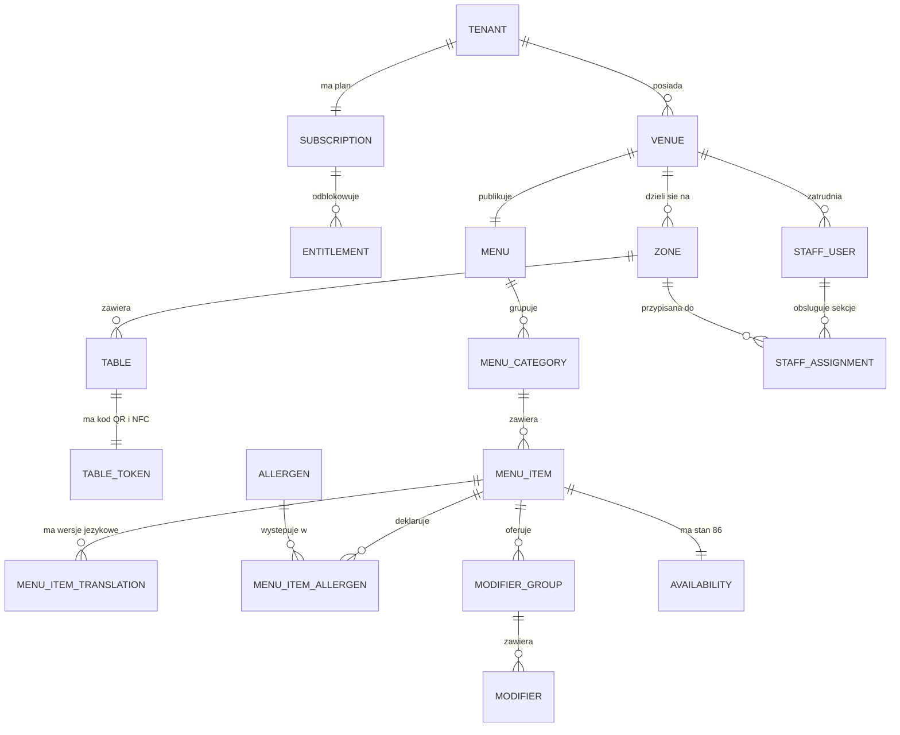
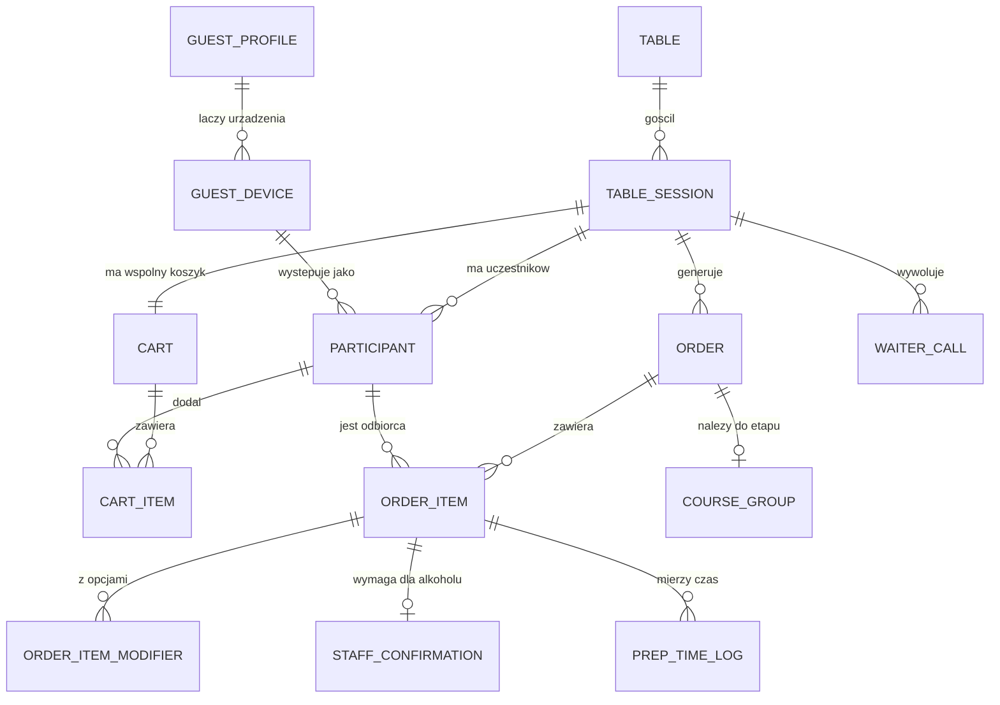
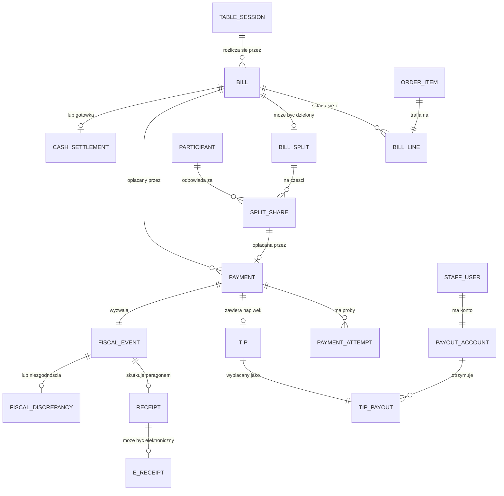
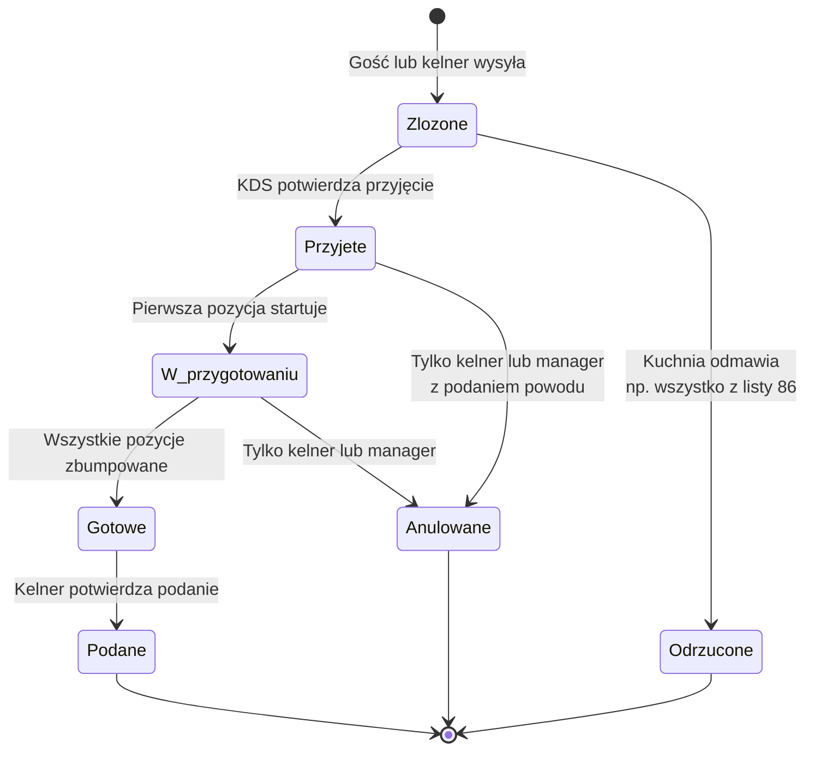
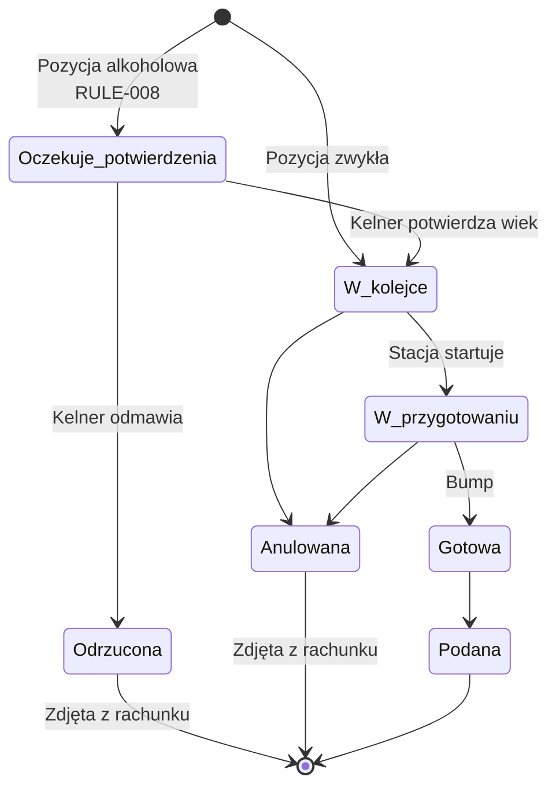
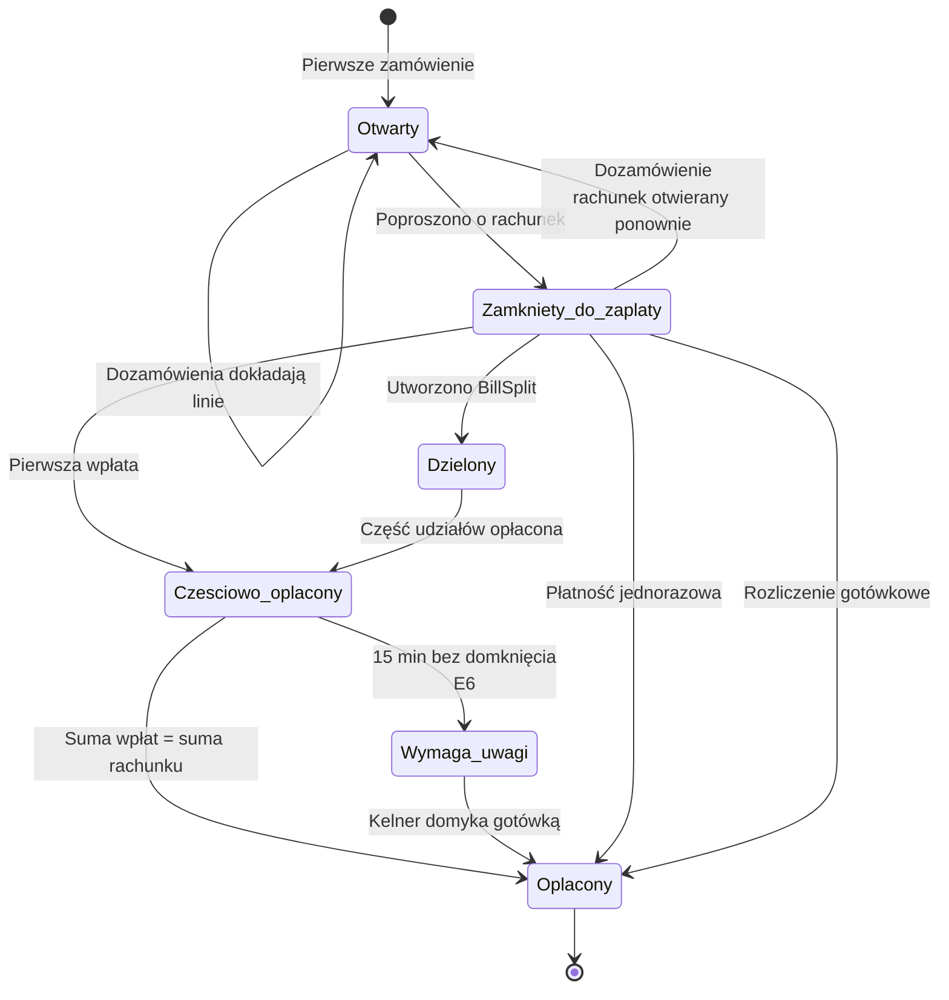
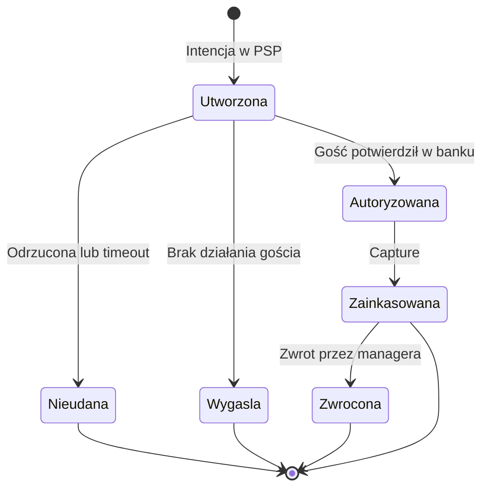
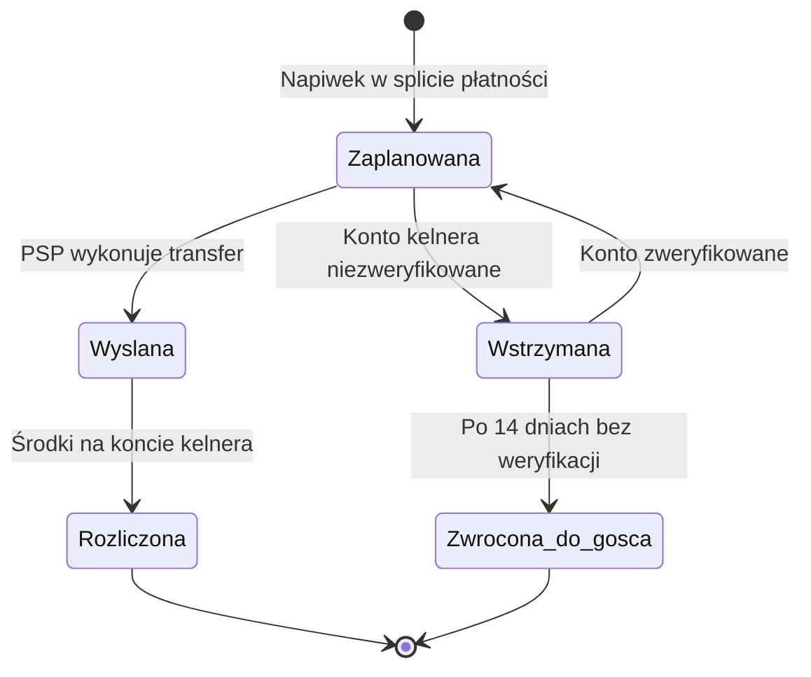

# 03 · Model domenowy

> Wymagany kontekst: [`00_INDEX.md`](00_INDEX.md). Przepływy, które ten model obsługuje: [`02`](02_Aktorzy_Scenariusze.md).
> Podział na moduły i zdarzenia: [`04`](04_Architektura_Moduly.md).

---

## 1. Cztery decyzje modelowania, których nie wolno cofnąć

Te decyzje muszą być podjęte **w v0.1**, choć część funkcji, które je uzasadniają, przychodzi
później. Retrofit każdej z nich oznacza przepisanie i migrację danych produkcyjnych.

| # | Decyzja | Uzasadnienie |
|---|---|---|
| **D1** | **Session-first.** `TableSession` ma od początku **wielu uczestników**, nawet gdy UI v0.1 pokazuje jednego gościa | Wspólny koszyk (`F-G-016`) i podział rachunku (`F-G-017`) przychodzą w v1. Sesja jednoosobowa to zupełnie inna domena — retrofit to przepisanie (`P3`) |
| **D2** | **Multitenancy od pierwszej migracji.** `Tenant` → `Venue`, każda tabela domenowa niesie `venue_id` | Multilokacja jest w v2, ale dopisanie izolacji po fakcie to migracja całej bazy przy działającym ruchu (`P3`) |
| **D3** | **Pieniądze jako liczby całkowite w groszach.** Nigdy `float`, nigdy `number` dla kwot | Zmiana typu po uruchomieniu płatności to migracja danych finansowych z ryzykiem rozjazdu sald (§6) |
| **D4** | **Ceny i stawki VAT zamrażane w momencie zamówienia** | Rachunek sprzed zmiany cennika musi dać się odtworzyć co do grosza. Dowód przy reklamacji i przy kontroli |

---

## 2. Mapa encji

### 2.1. Najemca, lokal, katalog

### 2.2. Sesja, koszyk, zamówienie

### 2.3. Rachunek, płatność, fiskalizacja

---

## 3. Encje

Kolumna **Kluczowe pola** wymienia to, co niesie znaczenie domenowe. Pola techniczne
(`id`, `created_at`, `updated_at`, `venue_id`) pomijamy — `venue_id` jest **obowiązkowe w każdej
tabeli domenowej** zgodnie z D2.

### 3.1. Najemca i lokal

| Encja | Kluczowe pola | Uwagi |
|---|---|---|
| `ENT-Tenant` | `name`, `nip`, `billing_email`, `ksef_enabled` | Granica izolacji danych. Sieć lub pojedynczy właściciel |
| `ENT-Venue` | `tenant_id`, `name`, `address`, `timezone`, `service_hours`, `pos_adapter`, `currency` | `pos_adapter` = `null` w trybie bez POS (`P2`). `currency` = `PLN` do v3 (`RULE-027`) |
| `ENT-Subscription` | `tenant_id`, `plan`, `period`, `starts_at`, `ends_at`, `trial_ends_at` | `plan` ∈ `menu` \| `order` \| `pay` \| `growth` \| `network` |
| `ENT-Entitlement` | `subscription_id`, `feature_key`, `enabled`, `limit` | Mapowanie plan → funkcje. Sprawdzane na granicy API (`RULE-025`) |
| `ENT-Zone` | `venue_id`, `name`, `sort_order` | Sekcja sali. Podstawa przypisania kelnera |
| `ENT-Table` | `zone_id`, `label`, `seats`, `is_active` | `label` to numer widoczny dla gościa i personelu |
| `ENT-TableToken` | `table_id`, `token`, `medium`, `revoked_at` | `medium` ∈ `qr` \| `nfc`. **Token jest stały** — kody drukowane raz na zawsze (`F-G-008`). Rotacja przez `revoked_at` + nowy rekord |

### 3.2. Katalog

| Encja | Kluczowe pola | Uwagi |
|---|---|---|
| `ENT-Menu` | `venue_id`, `version`, `published_at` | Wersjonowane. Publikacja unieważnia cache brzegowy |
| `ENT-MenuCategory` | `menu_id`, `name`, `sort_order`, `available_hours` | `available_hours` obsługuje karty lunchowe i śniadaniowe |
| `ENT-MenuItem` | `category_id`, `name`, `description`, `price_gross`, `vat_rate`, `is_alcohol`, `photo_url`, `prep_time_minutes`, `cost_gross` | `price_gross` w groszach (D3). `is_alcohol` uruchamia `RULE-008`. `cost_gross` **nigdy nie trafia do API kelnera** |
| `ENT-MenuItemTranslation` | `menu_item_id`, `locale`, `name`, `description`, `source` | `locale` ∈ `pl` \| `uk` \| `en` \| `de`. `source` ∈ `manual` \| `ai` \| `ai_reviewed` — **`ai` bez korekty nie może być opublikowane** |
| `ENT-Allergen` | `code`, `name_pl`, `icon` | Słownik zamknięty: 14 alergenów z rozporządzenia (UE) 1169/2011 |
| `ENT-MenuItemAllergen` | `menu_item_id`, `allergen_code`, `presence` | `presence` ∈ `contains` \| `may_contain` |
| `ENT-ModifierGroup` | `menu_item_id`, `name`, `min_select`, `max_select`, `is_required` | Rozmiar, dodatki, stopień wysmażenia |
| `ENT-Modifier` | `group_id`, `name`, `price_delta_gross` | `price_delta_gross` może być ujemny |
| `ENT-Availability` | `menu_item_id`, `state`, `changed_by`, `changed_at`, `auto_restore_at` | `state` ∈ `available` \| `eighty_six`. `auto_restore_at` przywraca pozycję na starcie kolejnego dnia serwisowego |

### 3.3. Ludzie

| Encja | Kluczowe pola | Uwagi |
|---|---|---|
| `ENT-StaffUser` | `venue_id`, `name`, `email`, `phone`, `role`, `photo_url`, `is_active` | `role` ∈ `waiter` \| `cook` \| `manager` \| `owner`. `photo_url` używane w ekranie napiwku (`F-G-024`) |
| `ENT-StaffAssignment` | `staff_user_id`, `zone_id`, `shift_start`, `shift_end` | Kto obsługuje którą sekcję i kiedy. Źródło przypisania napiwku (`RULE-020`) |
| `ENT-PayoutAccount` | `staff_user_id`, `psp_account_id`, `status`, `verified_at` | Konto kelnera **w PSP**, nie u nas. Warunek `F-K-001` |
| `ENT-GuestDevice` | `device_token`, `guest_profile_id`, `locale`, `first_seen_at`, `last_seen_at` | Szczebel 2 drabiny tożsamości (§5) |
| `ENT-GuestProfile` | `phone`, `phone_verified_at`, `display_name`, `psp_customer_id` | Szczebel 3–4. Powstaje dopiero, gdy gość sam poda dane |
| `ENT-Consent` | `guest_profile_id`, `venue_id`, `channel`, `granted`, `granted_at`, `text_version`, `withdrawn_at` | `channel` ∈ `email` \| `sms` \| `push`. **Osobno per kanał, bez pre-tick** (`RULE-023`) |

### 3.4. Sesja i zamówienie

| Encja | Kluczowe pola | Uwagi |
|---|---|---|
| `ENT-TableSession` | `table_id`, `state`, `opened_at`, `closed_at`, `closed_by`, `assigned_waiter_id` | **Rdzeń domeny.** Maszyna stanów w §4.1 i [`02`](02_Aktorzy_Scenariusze.md) §3.10 |
| `ENT-Participant` | `session_id`, `guest_device_id`, `staff_user_id`, `display_name`, `seat_label`, `joined_at` | Dokładnie jedno z `guest_device_id` / `staff_user_id` jest wypełnione — kelner zamawiający w imieniu gościa też jest uczestnikiem (`S7`) |
| `ENT-Cart` | `session_id` | Jeden wspólny koszyk na sesję. W v0.1 UI pokazuje tylko pozycje własnego uczestnika |
| `ENT-CartItem` | `cart_id`, `participant_id`, `menu_item_id`, `qty`, `note`, `modifiers` | Byt tymczasowy. Znika po złożeniu zamówienia |
| `ENT-Order` | `session_id`, `sequence_no`, `source`, `state`, `placed_by_participant_id`, `course_group_id`, `placed_at` | `source` ∈ `guest_qr` \| `staff_app`. `sequence_no` rośnie w obrębie sesji — „kolejka 1, kolejka 2" |
| `ENT-OrderItem` | `order_id`, `menu_item_id`, `qty`, `state`, `for_participant_id`, `unit_price_gross`, `vat_rate`, `name_snapshot`, `is_alcohol_snapshot` | Pola `*_snapshot` realizują D4 — cena i nazwa zamrożone w momencie zamówienia (`RULE-026`) |
| `ENT-OrderItemModifier` | `order_item_id`, `modifier_id`, `name_snapshot`, `price_delta_snapshot` | Także zamrożone |
| `ENT-StaffConfirmation` | `order_item_id`, `staff_user_id`, `confirmed_at`, `outcome`, `reason` | `outcome` ∈ `confirmed` \| `refused`. **Zapis ma wartość dowodową przy kontroli** (`LEG-010`) |
| `ENT-CourseGroup` | `session_id`, `label`, `serve_after_minutes`, `state` | Coursing: „przystawki teraz, dania za 20 minut" (`F-G-021`, `F-D-004`) |
| `ENT-PrepTimeLog` | `order_item_id`, `station`, `started_at`, `bumped_at` | Zasila uczciwe ETA i analitykę kuchni |
| `ENT-WaiterCall` | `session_id`, `requested_at`, `acknowledged_at`, `acknowledged_by`, `escalated_at` | Eskalacja do managera po 90 s bez reakcji |

### 3.5. Rachunek i płatność

| Encja | Kluczowe pola | Uwagi |
|---|---|---|
| `ENT-Bill` | `session_id`, `state`, `total_gross`, `total_vat`, `service_charge_gross`, `opened_at`, `settled_at` | Sesja może mieć wiele rachunków (`E15`). `service_charge_gross` to **część ceny usługi z VAT 8%**, nie napiwek (`RULE-005`) |
| `ENT-BillLine` | `bill_id`, `order_item_id`, `description`, `qty`, `unit_price_gross`, `vat_rate`, `line_total_gross` | Kopia z `OrderItem` w momencie otwarcia rachunku |
| `ENT-BillSplit` | `bill_id`, `mode`, `created_by_participant_id`, `state` | `mode` ∈ `equal` \| `by_items` \| `manual` |
| `ENT-SplitShare` | `split_id`, `participant_id`, `amount_gross`, `state`, `payment_link_token` | Suma udziałów **musi** równać się dokładnie sumie rachunku (`RULE-017`) |
| `ENT-Payment` | `bill_id`, `split_share_id`, `method`, `amount_gross`, `tip_gross`, `state`, `psp_intent_id`, `idempotency_key` | `method` ∈ `blik` \| `card` \| `apple_pay` \| `google_pay` \| `cash` \| `terminal`. Niezmienny po utworzeniu intencji (`RULE-018`) |
| `ENT-PaymentAttempt` | `payment_id`, `psp_status`, `error_code`, `attempted_at` | Historia prób. Diagnostyka nieudanych BLIK-ów |
| `ENT-Tip` | `payment_id`, `amount_gross`, `target_staff_user_id`, `basis` | `basis` ∈ `percent` \| `fixed`. **Bez VAT — nie jest przychodem lokalu** (`RULE-004`) |
| `ENT-TipPayout` | `tip_id`, `payout_account_id`, `psp_transfer_id`, `state`, `settled_at` | **Split w PSP prosto na konto kelnera. Nie przechodzi ani przez lokal, ani przez nas** (`LEG-006`) |
| `ENT-CashSettlement` | `bill_id`, `staff_user_id`, `amount_gross`, `settled_at`, `method` | `method` ∈ `cash` \| `venue_terminal`. Domyka `F-G-027` |

### 3.6. Fiskalizacja

| Encja | Kluczowe pola | Uwagi |
|---|---|---|
| `ENT-FiscalEvent` | `payment_id`, `state`, `dispatched_at`, `acknowledged_at`, `attempts` | Wysyłane **synchronicznie** po zainkasowaniu płatności (`LEG-003`) |
| `ENT-Receipt` | `fiscal_event_id`, `pos_receipt_number`, `issued_at`, `total_gross` | Wystawia **lokal**, nie my |
| `ENT-EReceipt` | `receipt_id`, `hub_kid`, `delivered_at` | `hub_kid` = anonimowy identyfikator z HUB Paragonowy. **E-mail gościa niepotrzebny** (`F-G-025`) |
| `ENT-FiscalDiscrepancy` | `fiscal_event_id`, `reason`, `detected_at`, `resolved_at`, `resolved_by` | Rejestr przypadków `E4` — płatność przeszła, fiskalizacja nie. Widoczny w panelu jako zaległość |

### 3.7. CRM i opinie (v1)

| Encja | Kluczowe pola | Uwagi |
|---|---|---|
| `ENT-Guest` | `venue_id`, `guest_profile_id`, `first_visit_at`, `visit_count`, `total_spend_gross`, `rfm_segment` | ⚠️ **Rekord należy do `Venue`, nie do platformy** (`RULE-024`, zasada Z4). Jesteśmy procesorem |
| `ENT-GuestVisit` | `guest_id`, `session_id`, `spend_gross`, `visited_at` | Historia dla RFM i „smak pamięta" |
| `ENT-Review` | `session_id`, `rating`, `comment`, `routed_to` | `routed_to` ∈ `google` (ocena 4–5) \| `private` (1–3) → alert do managera (`F-P-002`) |

---

## 4. Maszyny stanów

### 4.1. `TableSession`

Zdefiniowana w [`02`](02_Aktorzy_Scenariusze.md) §3.10. Reguły przejść: `RULE-021`.

Stany: `Otwarta` → `Aktywna` → `Rozliczana` → `Zamknieta`, plus `Porzucona` i `Wymaga_uwagi`.

### 4.2. `Order`

⚠️ **Gość nie anuluje zamówienia po przyjęciu przez kuchnię** (`RULE-007`). Może wyłącznie
wezwać kelnera. Anulowanie zawsze wymaga powodu i trafia do analityki strat.

### 4.3. `OrderItem`

Pozycja ma własny cykl, bo alkohol i etapy serwowania rozjeżdżają ją z zamówieniem nadrzędnym.

### 4.4. `Bill`

### 4.5. `Payment`

⚠️ **`Zainkasowana` uruchamia bezwarunkowo `FiscalEvent`.** Brak potwierdzenia z POS w ramach SLA
**nie cofa płatności** — tworzy `FiscalDiscrepancy` i alert do kelnera (`E4`, `LEG-003`).

### 4.6. `TipPayout`

⚠️ **Nie ma stanu „na koncie lokalu" ani „w puli".** Każdy taki stan przekwalifikowuje napiwek
na przychód ze stosunku pracy z pełnym PIT i ZUS (`LEG-006`). Jeśli kelner nie ma zweryfikowanego
konta, napiwek **nie jest oferowany gościowi w UI** — nie „zbierany na później".

---

## 5. Drabina tożsamości gościa

Koncepcja mówi „token urządzenia, bez rejestracji", ale własne funkcje koncepcji — tokenizacja
karty, „smak pamięta", CRM, napiwek dla konkretnego kelnera — po cichu zakładają silniejszą
tożsamość. Token ginie w trybie prywatnym i po wyczyszczeniu pamięci (`P4`).

| Szczebel | Czym jest | Co odblokowuje | Trwałość | Podstawa RODO |
|---|---|---|---|---|
| **T0 · Anonim** | Brak identyfikatora. Sam skan | Przeglądanie menu, alergeny, języki | Do zamknięcia karty | Brak danych osobowych |
| **T1 · Sesja** | Token sesji związany ze stolikiem | Zamawianie, dozamawianie, wezwanie kelnera, wspólny koszyk | Do zamknięcia sesji | Uzasadniony interes — realizacja zamówienia |
| **T2 · Urządzenie** | `device_token` w pamięci lokalnej | „Zamów to samo" między wizytami, język, ostatni lokal | Do wyczyszczenia pamięci | Uzasadniony interes + informacja |
| **T3 · Profil** | Zweryfikowany numer telefonu | CRM, „smak pamięta", historia rachunków, linki płatnicze przy podziale | Trwała, do usunięcia przez gościa | **Zgoda**, osobno per kanał (`RULE-023`) |
| **T4 · Płatniczy** | Token karty w PSP | Płatność jednym tapnięciem w każdym lokalu sieci | Trwała, zarządzana przez PSP | Zgoda + umowa z PSP |

**Reguły drabiny:**

1. **Wejście zawsze na T1.** Nigdy nie prosimy o dane przed złożeniem zamówienia (zasada Z1).
2. **Awans wyłącznie z inicjatywy gościa** — przy płatności lub przy wyraźnej propozycji korzyści.
3. **Degradacja jest normalna, nie błędem.** Gość w trybie prywatnym spada na T1 przy każdej
   wizycie. Produkt musi działać w pełni na T1 — patrz `E13`.
4. **Funkcje T3+ nigdy nie są warunkiem zamówienia.** Zamówienie i płatność muszą być możliwe na T1.
5. **Dane T3–T4 należą do `Venue`**, nie do platformy (`RULE-024`, `LEG-008`).

---

## 6. Zasady operacji na pieniądzach

> Ta sekcja ma rangę reguły, nie konwencji. Naruszenie oznacza rozjazd sald.

### 6.1. Reprezentacja

| Warstwa | Typ | Uwagi |
|---|---|---|
| PostgreSQL | `BIGINT` — kwota w **groszach** | Nigdy `FLOAT`, `REAL`, `DOUBLE PRECISION` |
| TypeScript | `bigint` albo dedykowany typ `Money` | **Nigdy `number` dla kwot.** `number` dopuszczalny wyłącznie dla ilości i procentów |
| JSON API | **String** kwoty w groszach + waluta | `{ "amount": "12345", "currency": "PLN" }` = 123,45 zł. String, bo `bigint` nie serializuje się do JSON |
| Interfejs użytkownika | Konwersja **tylko na granicy renderu** | `123,45 zł` — polski format, przecinek dziesiętny, spacja przed `zł` |

**Zakazane w kodzie:** `parseFloat` na kwocie, `toFixed` jako mechanizm zaokrąglania,
arytmetyka zmiennoprzecinkowa na `price`, `total`, `vat`, `tip`, `cost`, `margin`.

### 6.2. Zaokrąglanie (`RULE-002`)

- Zaokrąglenie **HALF_UP** do pełnego grosza, wykonywane **raz**, na końcu obliczenia.
- Obliczenia pośrednie (VAT, procent napiwku, udział w podziale) prowadzone na liczbach
  całkowitych z mnożeniem przed dzieleniem.

**Reszta z dzielenia przy podziale rachunku:** rachunek 100,00 zł na 3 osoby daje
33,33 + 33,33 + **33,34**. Reszta trafia **deterministycznie do uczestnika inicjującego podział**.
Nigdy nie ginie i nigdy nie jest rozrzucana losowo. Suma udziałów musi równać się sumie
rachunku co do grosza (`RULE-017`).

### 6.3. VAT (`RULE-003`)

| Kategoria | Stawka | Uwagi |
|---|---|---|
| Żywność serwowana na miejscu | 8% | Domyślna dla gastronomii |
| Napoje alkoholowe | 23% | Dlatego `vat_rate` jest **na pozycji**, nie na rachunku |
| Napoje bezalkoholowe | zależnie od rodzaju | Ustawiane w edytorze menu |
| **Service charge** | 8% | To **część ceny usługi**, obowiązkowo na paragonie (`RULE-005`) |
| **Napiwek** | **brak** | Nie jest przychodem lokalu ani usługą (`RULE-004`) |

Ceny w menu podawane są **brutto** — tak, jak widzi je gość. VAT wyliczany wstecz przy
generowaniu linii rachunku.

### 6.4. Napiwek — granica prawna w modelu (`RULE-004`)

| Wolno | Nie wolno |
|---|---|
| Napiwek jako osobna instrukcja splitu w PSP z odbiorcą = konto kelnera | Napiwek jako linia rachunku lokalu |
| Napiwek zawsze opcjonalny, nigdy zaznaczony domyślnie | Napiwek doliczany automatycznie |
| Presety **5% / 10%** + własna kwota | Presety w stylu amerykańskim 15/20/25 (`TUN-005`) |
| Odbiorca = kelner przypisany w momencie zapłaty | Pula wspólna z późniejszym podziałem — **pooling** |
| Napiwek 0 zł jako pełnoprawny wybór bez tarcia | Ekran wymuszający wybór napiwku, żeby przejść dalej |

---

## 7. Katalog reguł biznesowych

| ID | Reguła | Egzekwowana w |
|---|---|---|
| `RULE-001` | Wszystkie kwoty to liczby całkowite w groszach. Brak typów zmiennoprzecinkowych | Schemat bazy + typ `Money` |
| `RULE-002` | Zaokrąglenie HALF_UP raz, na końcu. Reszta przy podziale → inicjator | `MOD-billing` |
| `RULE-003` | `vat_rate` jest atrybutem pozycji, nie rachunku. Alkohol 23%, żywność 8% | `MOD-catalog`, `MOD-billing` |
| `RULE-004` | Napiwek nie jest przychodem lokalu: bez VAT, poza rachunkiem, zawsze opcjonalny | `MOD-tips` |
| `RULE-005` | Service charge jest częścią ceny usługi: VAT 8%, obowiązkowo na paragonie | `MOD-billing` |
| `RULE-006` | Suma rachunku = suma linii. Rachunek niezmienny po utworzeniu intencji płatniczej | `MOD-billing` |
| `RULE-007` | Gość nie anuluje zamówienia po przyjęciu przez kuchnię. Kelner i manager — tak, z powodem | `MOD-ordering` |
| `RULE-008` | Pozycja `is_alcohol` wymaga `StaffConfirmation` przed skierowaniem do przygotowania | `MOD-ordering` |
| `RULE-009` | Płatność gotówką musi być dostępna zawsze. Tryb „tylko aplikacja" jest niedozwolony | `MOD-billing`, UI |
| `RULE-010` | Pozycja menu nie może zostać opublikowana bez zadeklarowanych alergenów | `MOD-catalog` |
| `RULE-011` | Ceny są atrybutem `Venue`. Sieć dzieli katalog, ale nie ceny | `MOD-catalog` |
| `RULE-012` | Token urządzenia jest globalny dla platformy, sesja jest lokalna dla stolika | `MOD-identity` |
| `RULE-013` | Token stolika jest stały. Unieważnienie wymaga nowego rekordu, nie edycji | `MOD-tables` |
| `RULE-014` | Pozycja oznaczona 86 znika z otwartych koszyków z widocznym banerem. Nigdy po cichu | `MOD-catalog` → `MOD-ordering` |
| `RULE-015` | Pozycja oznaczona 86 **nie** znika ze złożonych zamówień. Decyduje kuchnia | `MOD-kitchen` |
| `RULE-016` | Uczestnik widzi wspólny koszyk i wspólny rachunek, ale **nie** metody płatności innych | `MOD-session` |
| `RULE-017` | Suma udziałów podziału musi równać się sumie rachunku co do grosza | `MOD-billing` |
| `RULE-018` | Płatność jest niezmienna po utworzeniu intencji. Dopłaty tworzą nowy rachunek | `MOD-payments` |
| `RULE-019` | Wszystkie zdarzenia przychodzące są idempotentne po `provider_event_id` z UNIQUE | `MOD-payments`, `MOD-pos-sync` |
| `RULE-020` | Odbiorcą napiwku jest kelner przypisany do sekcji **w momencie zapłaty** | `MOD-tips` |
| `RULE-021` | Cykl życia sesji stolika wg [`02`](02_Aktorzy_Scenariusze.md) §3.10. Sesja porzucona po 30 min bez zamówienia | `MOD-session` |
| `RULE-022` | `FiscalEvent` wysyłany synchronicznie po zainkasowaniu. Brak potwierdzenia → `FiscalDiscrepancy` + alert, **nigdy cofnięcie płatności** | `MOD-fiscal` |
| `RULE-023` | Zgody marketingowe: osobno per kanał, bez pre-tick, ze znacznikiem czasu i wersją treści | `MOD-crm` |
| `RULE-024` | Dane gościa należą do `Venue`. Eksportowalne i usuwalne na żądanie. Platforma jest procesorem | `MOD-crm` |
| `RULE-025` | Uprawnienia planu sprawdzane na granicy API, nie w interfejsie | `MOD-entitlements` |
| `RULE-026` | Nazwa, cena i stawka VAT zamrażane w `OrderItem` w momencie zamówienia | `MOD-ordering` |
| `RULE-027` | Jedna waluta — PLN — do wydania v3 | Globalnie |

---

## 8. Niezmienniki

Warunki, które muszą być prawdziwe **zawsze**. Kandydaci na testy właściwościowe i ograniczenia bazy.

| # | Niezmiennik |
|---|---|
| **I1** | `Bill.total_gross` = Σ `BillLine.line_total_gross` + `service_charge_gross` |
| **I2** | Σ `SplitShare.amount_gross` = `Bill.total_gross` — dokładnie, bez tolerancji |
| **I3** | Σ zainkasowanych `Payment.amount_gross` ≤ `Bill.total_gross`. Nadpłata jest niemożliwa |
| **I4** | `Tip.amount_gross` **nigdy** nie wchodzi do `Bill.total_gross` |
| **I5** | Każdy `OrderItem` z `is_alcohol_snapshot = true` ma `StaffConfirmation` zanim wejdzie w `W_przygotowaniu` |
| **I6** | Aktywna `TableSession` na jeden `Table` — **maksymalnie jedna**. Ograniczenie UNIQUE częściowe |
| **I7** | Każdy `Payment` w stanie `Zainkasowana` ma dokładnie jeden `FiscalEvent` |
| **I8** | `MenuItem` w opublikowanym `Menu` ma ≥ 1 rekord `MenuItemAllergen` albo jawny znacznik „brak alergenów" |
| **I9** | Każdy rekord domenowy ma `venue_id`, a każde zapytanie jest nim filtrowane |
| **I10** | `TipPayout` nigdy nie wskazuje na konto `Tenant` ani platformy — wyłącznie na `PayoutAccount` kelnera |
| **I11** | `Participant` ma wypełnione dokładnie jedno z `guest_device_id` / `staff_user_id` |
| **I12** | `MenuItemTranslation` ze `source = 'ai'` nie występuje w opublikowanym `Menu` |

---

## 9. Powiązane dokumenty

- Moduły posiadające te encje i zdarzenia między nimi → [`04_Architektura_Moduly.md`](04_Architektura_Moduly.md)
- Przepływy używające tych stanów → [`02_Aktorzy_Scenariusze.md`](02_Aktorzy_Scenariusze.md)
- Ograniczenia prawne `LEG-*` stojące za regułami → [`10_Tuning_Decyzje_Ryzyka.md`](10_Tuning_Decyzje_Ryzyka.md) §4
