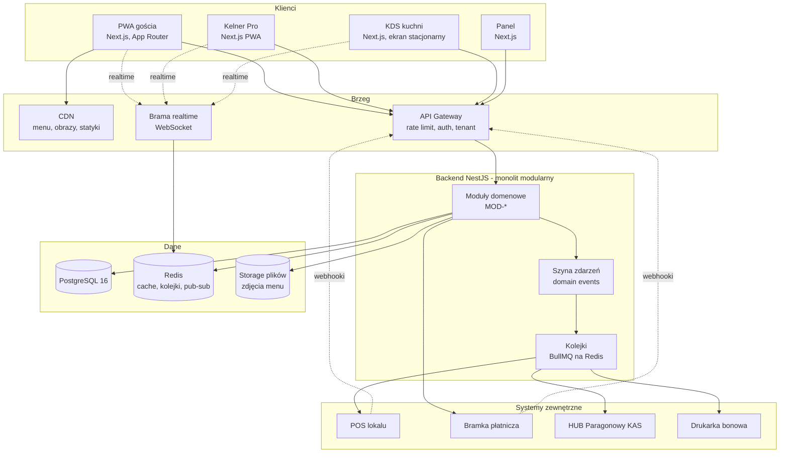
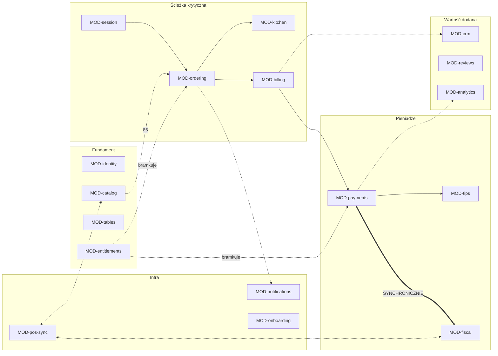

# 04 · Architektura i interakcja międzymodułowa

> Wymagany kontekst: [`00_INDEX.md`](00_INDEX.md), encje z [`03`](03_Model_Domenowy.md).
> Stos: **Next.js (PWA) + NestJS + PostgreSQL**, Node/TypeScript.

---

## 1. Topologia



### 1.1. Dlaczego monolit modularny, a nie mikroserwisy

| Argument | Konsekwencja |
|---|---|
| Cel pilotu to 10 lokali, cel v2 to 500 | Skala nie wymusza rozdzielenia procesów |
| Fiskalizacja musi być **synchroniczna** w granicy < 5 s (`LEG-003`) | Granica sieciowa w tym miejscu to dodatkowe ryzyko, nie korzyść |
| Zespół jest mały | Koszt operacyjny mikroserwisów przewyższa zysk |
| Granice modułów są jednak realne | Egzekwowane w kodzie (§3), więc wydzielenie w v3 pozostaje możliwe |

**Kandydaci do wydzielenia w v3**, jeśli obciążenie wymusi: `MOD-analytics`, `MOD-crm`,
`MOD-pos-sync`. Wszystkie są asynchroniczne i nie leżą na ścieżce krytycznej.

### 1.2. Cztery osobne aplikacje frontendowe

Jeden kod nie obsłuży czterech kontekstów (patrz [`01`](01_Produkt_Zakres_Roadmapa.md) §3).
PWA gościa ma budżet **< 1 s first paint na 3G** — nie może nieść kodu panelu managera.

| Aplikacja | Renderowanie | Kluczowe ograniczenie |
|---|---|---|
| PWA gościa | SSR + agresywny cache brzegowy, minimum JS | Budżet wagi jest twardy: [`05`](05_System_Projektowy.md) §7 |
| Kelner Pro | PWA, offline-first dla tablicy stolików | Jedna ręka, ciemny lokal |
| KDS | SPA, długo żyjąca sesja WebSocket | Czytelność z 2 m, brak interakcji poza bumpem |
| Panel | SPA, bez ograniczeń wagi | Biurko, laptop |

---

## 2. Mapa modułów

Kolumna **Posiada** oznacza wyłączne prawo zapisu do tych encji. Inne moduły czytają wyłącznie
przez interfejs albo reagują na zdarzenia.

| Moduł | Posiada (encje z [`03`](03_Model_Domenowy.md)) | Od wydania |
|---|---|---|
| `MOD-identity` | `Tenant`, `Venue`, `StaffUser`, `GuestDevice`, `GuestProfile` | v0.1 |
| `MOD-entitlements` | `Subscription`, `Entitlement` | v0.1 |
| `MOD-catalog` | `Menu`, `MenuCategory`, `MenuItem`, `Modifier*`, `Allergen*`, `Availability` | v0.1 |
| `MOD-tables` | `Zone`, `Table`, `TableToken`, `StaffAssignment` | v0.1 |
| `MOD-session` | `TableSession`, `Participant`, `Cart`, `CartItem`, `WaiterCall` | v0.1 |
| `MOD-ordering` | `Order`, `OrderItem`, `OrderItemModifier`, `StaffConfirmation`, `CourseGroup` | v0.1 |
| `MOD-kitchen` | `PrepTimeLog`, routing na stacje, kolejka wydruków | v0.1 |
| `MOD-billing` | `Bill`, `BillLine`, `BillSplit`, `SplitShare`, `CashSettlement` | v0.1 |
| `MOD-notifications` | Rejestr subskrypcji push, brama WebSocket | v0.1 |
| `MOD-onboarding` | Kreator uruchomienia, import menu, generowanie kodów | v0.1 |
| `MOD-analytics` | Modele odczytu, agregaty, rotacja stolika | v0.1 |
| `MOD-payments` | `Payment`, `PaymentAttempt`, adapter PSP | v0.2 |
| `MOD-tips` | `Tip`, `TipPayout`, `PayoutAccount` | v0.2 |
| `MOD-fiscal` | `FiscalEvent`, `Receipt`, `EReceipt`, `FiscalDiscrepancy` | v0.2 |
| `MOD-pos-sync` | Adaptery POS, mapowania, dziennik synchronizacji | v0.2 |
| `MOD-crm` | `Guest`, `GuestVisit`, `Consent`, kampanie | v1 |
| `MOD-reviews` | `Review`, routing opinii | v1 |



---

## 3. Zasady interakcji międzymodułowej

To jest sedno dokumentu. Naruszenie którejkolwiek z zasad zamienia monolit modularny
w monolit zwyczajny — i wtedy wydzielenie czegokolwiek w v3 przestaje być możliwe.

### Z-A1 · Moduł jest wyłącznym właścicielem swoich tabel

Zapisywać do tabeli może **tylko** moduł, który ją posiada (§2). Inne moduły nie mają dostępu
do jej repozytoriów ani encji ORM.

### Z-A2 · Komunikacja odbywa się dwoma kanałami — i żadnym innym

| Kanał | Kiedy | Postać |
|---|---|---|
| **Zdarzenie domenowe** (asynchronicznie) | Domyślnie. „Coś się stało, kogo to obchodzi — niech reaguje" | `EVT-*`, §4 |
| **Port jawny** (synchronicznie) | Tylko dla granic z §5. „Potrzebuję odpowiedzi, żeby kontynuować" | Interfejs TypeScript wstrzykiwany przez DI |

**Zakazane:** import repozytorium innego modułu, import jego encji ORM, wywołanie jego serwisu
wewnętrznego z pominięciem portu.

### Z-A3 · Brak złączeń SQL między modułami

Zapytanie nie może łączyć tabel należących do różnych modułów. Potrzebujesz danych z dwóch
modułów w jednym widoku — zbuduj **model odczytu** w `MOD-analytics`, aktualizowany zdarzeniami.

**Uzasadnienie:** złączenie międzymodułowe to ukryta zależność, której kompilator nie wychwyci.
To ona zabija możliwość wydzielenia modułu.

### Z-A4 · Odwołania między modułami wyłącznie po identyfikatorze

`Order` niesie `menu_item_id`, ale **nie** relację ORM do `MenuItem`. Dane potrzebne w chwili
zamówienia są **kopiowane jako snapshot** (`RULE-026`) — nazwa, cena, stawka VAT, znacznik alkoholu.

To nie jest denormalizacja z lenistwa. To wymaganie domenowe: rachunek sprzed zmiany cennika
musi dać się odtworzyć co do grosza (D4).

### Z-A5 · Zdarzenia opisują fakty, nie polecenia

`EVT-payment.captured` — dobrze. `EVT-send-receipt` — źle. Producent nie wie i nie ma prawa
wiedzieć, kto go słucha.

### Z-A6 · Konsumenci zdarzeń muszą być idempotentni

Każdy handler musi znieść wielokrotne dostarczenie tego samego zdarzenia. Kolejka gwarantuje
**at-least-once**, nie exactly-once (`RULE-019`).

### Z-A7 · Systemy zewnętrzne wyłącznie za warstwą antykorupcyjną

Żaden typ pochodzący z API POS-a albo PSP nie przenika do domeny. Adapter tłumaczy na model
domenowy i z powrotem. Uzasadnienie: 6–8 integracji POS o różnych modelach danych, a rynek jest
rozdrobniony i żaden POS nie ma > 30% udziału.

### Z-A8 · Uprawnienia planu sprawdzane na granicy API

Nigdy w interfejsie użytkownika. Ukrycie przycisku nie jest zabezpieczeniem (`RULE-025`).

### Z-A9 · Każde zapytanie filtrowane po `venue_id`

Egzekwowane na poziomie repozytorium bazowego, nie pozostawione uważności programisty (`I9`).
Kandydat na Row-Level Security w PostgreSQL od v2.

---

## 4. Katalog zdarzeń

Nazewnictwo: `EVT-<moduł>.<fakt w czasie przeszłym>`.

### 4.1. Sesja i zamawianie

| Zdarzenie | Producent | Konsumenci | Ładunek |
|---|---|---|---|
| `EVT-session.opened` | `MOD-session` | `MOD-tables`, `MOD-analytics`, realtime sala | `sessionId`, `tableId`, `venueId`, `openedAt` |
| `EVT-session.participant_joined` | `MOD-session` | realtime sesji, `MOD-analytics` | `sessionId`, `participantId`, `displayName` |
| `EVT-session.closed` | `MOD-session` | `MOD-analytics`, `MOD-crm`, `MOD-reviews` | `sessionId`, `closedBy`, `durationMinutes`, `totalGross` |
| `EVT-session.abandoned` | `MOD-session` | `MOD-tables`, `MOD-analytics` | `sessionId`, `reason` |
| `EVT-order.placed` | `MOD-ordering` | `MOD-kitchen`, `MOD-billing`, `MOD-notifications`, `MOD-pos-sync`, `MOD-analytics` | `orderId`, `sessionId`, `items[]`, `source`, `courseGroupId` |
| `EVT-order.accepted` | `MOD-kitchen` | `MOD-session` (ETA dla gościa), realtime | `orderId`, `etaMinutes` |
| `EVT-order.item_ready` | `MOD-kitchen` | `MOD-notifications`, realtime sesji | `orderItemId`, `station` |
| `EVT-order.ready` | `MOD-kitchen` | `MOD-notifications`, realtime | `orderId` |
| `EVT-order.served` | `MOD-ordering` | `MOD-analytics` | `orderId`, `servedBy` |
| `EVT-order.cancelled` | `MOD-ordering` | `MOD-kitchen`, `MOD-billing`, `MOD-analytics` | `orderId`, `reason`, `cancelledBy` |
| `EVT-order.alcohol_confirmed` | `MOD-ordering` | `MOD-kitchen`, dziennik audytu | `orderItemId`, `staffUserId`, `outcome` |
| `EVT-waiter.called` | `MOD-session` | `MOD-notifications`, realtime sala | `sessionId`, `tableLabel`, `assignedWaiterId` |
| `EVT-waiter.call_escalated` | `MOD-session` | `MOD-notifications` (manager) | `sessionId`, `waitedSeconds` |

### 4.2. Katalog

| Zdarzenie | Producent | Konsumenci | Ładunek |
|---|---|---|---|
| `EVT-menu.published` | `MOD-catalog` | unieważnienie CDN, `MOD-pos-sync`, realtime | `venueId`, `menuVersion` |
| `EVT-menu.item_unavailable` | `MOD-catalog` | realtime **wszystkich sesji lokalu**, `MOD-ordering`, `MOD-pos-sync` | `venueId`, `menuItemId`, `changedBy` |
| `EVT-menu.item_available` | `MOD-catalog` | jw. | `venueId`, `menuItemId` |

> `EVT-menu.item_unavailable` jest zdarzeniem o najszerszym zasięgu w systemie — dociera do
> **każdej otwartej sesji w lokalu**. Konsument w `MOD-ordering` realizuje `RULE-014`
> (usunięcie z otwartych koszyków z banerem) i **nie** rusza złożonych zamówień (`RULE-015`).

### 4.3. Rachunek, płatność, napiwek

| Zdarzenie | Producent | Konsumenci | Ładunek |
|---|---|---|---|
| `EVT-bill.opened` | `MOD-billing` | realtime sesji | `billId`, `sessionId` |
| `EVT-bill.requested` | `MOD-billing` | `MOD-notifications` (kelner), realtime | `billId`, `totalGross` |
| `EVT-bill.split_created` | `MOD-billing` | realtime sesji, `MOD-notifications` | `billId`, `mode`, `shares[]` |
| `EVT-bill.settled` | `MOD-billing` | `MOD-session`, `MOD-crm`, `MOD-analytics`, `MOD-reviews` | `billId`, `sessionId`, `totalGross`, `method` |
| `EVT-bill.underpaid` | `MOD-billing` | `MOD-notifications` (kelner + manager) | `billId`, `missingGross`, `unpaidShares[]` |
| `EVT-payment.authorized` | `MOD-payments` | `MOD-billing` | `paymentId`, `amountGross` |
| **`EVT-payment.captured`** | `MOD-payments` | **`MOD-fiscal` (synchronicznie)**, `MOD-billing`, `MOD-tips`, `MOD-analytics` | `paymentId`, `billId`, `amountGross`, `tipGross`, `method` |
| `EVT-payment.failed` | `MOD-payments` | realtime sesji, `MOD-analytics` | `paymentId`, `errorCode` |
| `EVT-payment.refunded` | `MOD-payments` | `MOD-billing`, `MOD-fiscal`, `MOD-analytics` | `paymentId`, `amountGross`, `reason` |
| `EVT-tip.allocated` | `MOD-tips` | `MOD-notifications` (kelner), `MOD-analytics` | `tipId`, `staffUserId`, `amountGross` |
| `EVT-tip.payout_settled` | `MOD-tips` | `MOD-notifications`, `MOD-analytics` | `tipPayoutId`, `staffUserId` |
| `EVT-tip.payout_blocked` | `MOD-tips` | `MOD-notifications` (manager) | `tipId`, `reason` |

### 4.4. Fiskalizacja

| Zdarzenie | Producent | Konsumenci | Ładunek |
|---|---|---|---|
| `EVT-fiscal.receipt_issued` | `MOD-fiscal` | `MOD-billing`, realtime sesji | `receiptId`, `posReceiptNumber` |
| `EVT-fiscal.discrepancy_detected` | `MOD-fiscal` | `MOD-notifications` (kelner + manager), panel | `fiscalEventId`, `reason`, `billId` |
| `EVT-fiscal.ereceipt_delivered` | `MOD-fiscal` | realtime sesji | `receiptId`, `hubKid` |

### 4.5. CRM i opinie (v1)

| Zdarzenie | Producent | Konsumenci | Ładunek |
|---|---|---|---|
| `EVT-guest.consent_granted` | `MOD-crm` | `MOD-analytics` | `guestProfileId`, `venueId`, `channel`, `textVersion` |
| `EVT-guest.consent_withdrawn` | `MOD-crm` | wstrzymanie kampanii | `guestProfileId`, `channel` |
| `EVT-review.submitted` | `MOD-reviews` | `MOD-notifications` przy ocenie 1–3, `MOD-analytics` | `reviewId`, `rating`, `routedTo` |

---

## 5. Granice synchroniczne

**Domyślnie wszystko jest asynchroniczne.** Poniższa lista jest **zamknięta** — dopisanie do niej
czegokolwiek wymaga jawnej decyzji `DEC-*`, bo każda granica synchroniczna zmniejsza odporność systemu.

| # | Granica | Dlaczego musi być synchroniczna | Limit czasu | Zachowanie przy przekroczeniu |
|---|---|---|---|---|
| **S1** | `MOD-payments` → `MOD-fiscal` → POS | **Wymóg podatkowy.** Paragon musi być wystawiony nie później niż w chwili przyjęcia zapłaty. Przy przedpłacie obowiązek podatkowy powstaje w momencie zapłaty (`LEG-003`) | **5 s (p99)** | `FiscalDiscrepancy` + alert do kelnera. **Płatność nie jest cofana** (`E4`, `RULE-022`) |
| **S2** | `MOD-ordering` → `MOD-catalog` | Nie wolno przyjąć zamówienia na pozycję z listy 86 | 200 ms | Odrzucenie pozycji z komunikatem. Reszta zamówienia przechodzi |
| **S3** | `MOD-ordering` → `MOD-entitlements` | Lokal na planie Menu (0 zł) nie może składać zamówień | 50 ms, z cache | Cache Redis, TTL 60 s. Przy braku cache — odmowa (fail-closed) |
| **S4** | `MOD-billing` → `MOD-payments` | Kwota intencji płatniczej musi odpowiadać aktualnemu rachunkowi | 500 ms | Odmowa utworzenia płatności |
| **S5** | `MOD-session` → `MOD-tables` | Rozstrzygnięcie tokenu stolika przy skanie | 100 ms, z cache | Cache brzegowy, TTL 300 s |

**Wszystko inne jest asynchroniczne**, w tym: aktualizacja CRM, analityka, ranking napiwków,
synchronizacja menu z POS, e-Paragon do HUB, wysyłka opinii, kampanie, powiadomienia push.

---

## 6. Warstwa realtime

Redis pub/sub za bramą WebSocket. Kanały są **wielodostępne z izolacją najemcy** — autoryzacja
subskrypcji sprawdza `venue_id` przy każdym połączeniu.

| Kanał | Subskrybenci | Zdarzenia |
|---|---|---|
| `session.{sessionId}` | Uczestnicy sesji (PWA gościa) | Status zamówienia, wspólny koszyk, 86 dotyczące ich pozycji, status rachunku i płatności |
| `venue.{venueId}.kitchen` | KDS | `order.placed`, `order.cancelled`, coursing, zmiany stacji |
| `venue.{venueId}.floor` | Kelner Pro — cała zmiana | Stany stolików, wezwania kelnera, alerty rachunków |
| `venue.{venueId}.menu` | Wszystkie PWA lokalu | `menu.item_unavailable`, `menu.item_available`, `menu.published` |
| `staff.{staffUserId}` | Konkretny kelner | Wezwanie z jego sekcji, napiwek, alert fiskalny |
| `venue.{venueId}.manager` | Panel | Eskalacje, zaległości fiskalne, rachunki wymagające uwagi |

### 6.1. Odporność

| Zagadnienie | Rozwiązanie |
|---|---|
| Zerwane połączenie | Ponowienie z wykładniczym backoffem, po odzyskaniu — pełne odświeżenie stanu, nie odtwarzanie zdarzeń |
| KDS działa całą dobę | Heartbeat co 30 s, widoczny wskaźnik połączenia, automatyczne przeładowanie przy zmianie wersji |
| Kolejność zdarzeń | Każde zdarzenie niesie `sequenceNo` sesji. Klient odrzuca zdarzenia starsze niż stan, który już ma |
| Gość zamknął kartę | Zdarzenia nie są kolejkowane dla nieobecnego klienta. Po ponownym otwarciu — pełne pobranie stanu |

---

## 7. Adaptery systemów zewnętrznych

### 7.1. POS — `MOD-pos-sync`

Rynek POS jest rozdrobniony, żaden gracz nie ma > 30% udziału. Docelowo 6–8 integracji dla
pokrycia ~60% rynku. To znaczy, że warstwa antykorupcyjna nie jest luksusem (Z-A7).

```
interface PosAdapter {
  pullMenu(venueId): Promise<MenuSnapshot>
  pushOrder(order: Order): Promise<PosOrderRef>
  notifyPaid(payment: Payment): Promise<FiscalAck>   // granica S1
  cancelOrder(ref: PosOrderRef, reason): Promise<void>
  healthCheck(): Promise<PosHealth>
}
```

| Wariant adaptera | Zachowanie | Wydanie |
|---|---|---|
| `null` | Bez POS. Zamówienia do KDS lub na drukarkę bonową. **Fiskalizacja ręcznie po stronie lokalu** (`P2`) | v0.1 |
| `dotykacka` | Pierwsza integracja — najbardziej otwarte API, już pełni rolę huba dla konkurencji | v0.2 |
| `gopos` | Najszerzej rozpowszechniony, przejrzyste warunki partnerskie | v1 |
| `posbistro`, `syrve`, `poster` | Kolejne | v1 |
| `lsi`, `storyous`, `papu`, `izzyrest` | Rozszerzenie pokrycia | v2 |

**Reguły adapterów:**

1. Ponowienia: `tries = 4`, backoff `[0 s, 30 s, 300 s]`.
2. Idempotencja przychodzących zdarzeń po `(provider, provider_event_id)` z ograniczeniem UNIQUE (`RULE-019`).
3. Webhooki: weryfikacja HMAC na **surowym ciele** żądania, porównanie w czasie stałym.
4. Żaden typ POS-a nie przekracza granicy adaptera.
5. `healthCheck` co 60 s. Utrata POS-a jest widoczna w panelu **zanim** zauważy ją gość.

⚠️ **Wybór pierwszej integracji jest otwartą decyzją** — `DEC-007`.

### 7.2. PSP — `MOD-payments`

```
interface PaymentProvider {
  createIntent(bill, method, split: SplitInstruction[]): Promise<Intent>
  capture(intentId): Promise<Capture>
  refund(paymentId, amount): Promise<Refund>
  registerPayoutAccount(staffUser): Promise<PayoutAccountRef>
  verifyWebhook(rawBody, signature): boolean
}
```

**Wymagania wobec PSP** — od nich zależy, czy model biznesowy jest w ogóle wykonalny:

| # | Wymaganie | Konsekwencja braku |
|---|---|---|
| W1 | **Środki gościa nigdy nie trafiają na nasze konto.** Split wykonywany w bramce | Wymóg licencji MIP/KIP. Art. 150 ust. 1 UUP: do 5 mln zł kary lub 2 lata pozbawienia wolności (`LEG-001`) |
| W2 | **BLIK-split na wielu odbiorców jednocześnie** (lokal + kelner + my) | **Model napiwków nie działa w ogóle.** Największa niewiadoma projektu (`DEC-009c`) |
| W3 | Składowa stała pobierana **raz z rachunku**, nie z każdego udziału podziału | Podział rachunku zjada marżę (`TUN-007`, `DEC-009b`) |
| W4 | Osobne stawki dla BLIK i dla kart | Przy 1,9% + 0,30 zł karta jest transakcją stratną (`DEC-009a`) |
| W5 | Konta wypłat dla kelnerów jako osobnych odbiorców | `F-K-001` niewykonalne |

Kandydaci: Przelewy24, Tpay, Autopay, Stripe Connect, Adyen for Platforms. Wybór: `DEC-009`.

### 7.3. HUB Paragonowy — `MOD-fiscal`

Asynchroniczny, **poza** granicą S1. Kolejność jest nienegocjowalna:

```
1. Płatność zainkasowana
2. POS fiskalizuje  ← S1, synchronicznie, wymóg podatkowy
3. Paragon istnieje
4. DOPIERO TERAZ e-Paragon do HUB  ← asynchronicznie
```

Gość otrzymuje anonimowy identyfikator KID — **adres e-mail nie jest potrzebny**. To zaleta
zgodna z zasadą Z4 i z RODO.

⚠️ **Nierozstrzygnięte:** jeśli fiskalizuje POS, to POS ma dane paragonu. Kto wysyła do HUB-a —
my czy POS? Trzy scenariusze i ich konsekwencje: `DEC-005`.

---

## 8. Wielodostępność i uprawnienia

### 8.1. Izolacja danych

| Poziom | Mechanizm |
|---|---|
| Zapytania | Każde repozytorium filtruje po `venue_id` z kontekstu żądania. Egzekwowane w klasie bazowej, nie zostawione uważności (`I9`, Z-A9) |
| Kontekst żądania | `tenantId` + `venueId` rozstrzygane w bramie i przenoszone w kontekście asynchronicznym |
| Zadania w tle | Kontekst najemcy przenoszony w ładunku zadania. Zadanie bez kontekstu **nie startuje** |
| Realtime | Autoryzacja subskrypcji kanału sprawdza przynależność do lokalu |
| Baza danych | Row-Level Security w PostgreSQL jako druga warstwa — od v2 |

### 8.2. Dwie osobne warstwy kontroli

Łatwo je pomylić, a robią co innego:

| Warstwa | Pytanie | Realizacja |
|---|---|---|
| **Uprawnienia planu** (`MOD-entitlements`) | Czy **lokal zapłacił** za tę funkcję? | Klucz funkcji → plan. Sprawdzane na granicy API (Z-A8) |
| **Role** (RBAC) | Czy **ten użytkownik** ma prawo do tej operacji? | Rola → uprawnienie. Macierz w [`02`](02_Aktorzy_Scenariusze.md) §5 |

Obie muszą przejść. Lokal na planie Growth, gdzie kelner próbuje zobaczyć marże — plan pozwala,
rola nie. Odmowa.

### 8.3. Usuwanie pól w warstwie API

Sama polityka dostępu nie wystarcza. Zasób API **usuwa pola** przed serializacją:

| Rola | Pola nigdy nie serializowane |
|---|---|
| Kelner | `cost_gross`, marże, wskaźniki procentowe rentowności, napiwki innych kelnerów |
| Kucharz | wszystko finansowe |
| Gość | wszystko poza własną sesją, własnym rachunkiem i publicznym menu |

Dwie warstwy, bo pojedyncza zawsze kiedyś przecieka.

---

## 9. Kolejki i niezawodność

| Kolejka | Zadania | Priorytet |
|---|---|---|
| `critical` | Ponowienia fiskalizacji, wypłaty napiwków | Najwyższy |
| `realtime` | Rozgłaszanie WebSocket, push | Wysoki |
| `integrations` | Synchronizacja POS, e-Paragon HUB, wydruki bonowe | Średni |
| `analytics` | Modele odczytu, agregaty, RFM | Niski |
| `campaigns` | Wysyłka marketingowa (v2) | Najniższy, ograniczany przepustowością |

**Zasady:**

1. Zadania idempotentne (Z-A6) — kolejka gwarantuje at-least-once.
2. Kolejka martwych listów dla każdej kolejki, przeglądana w panelu wewnętrznym.
3. `critical` monitorowana alertem: zaległość > 10 zadań = alert natychmiastowy.
4. Kampanie ograniczane przepustowością per lokal — nie wolno spalić reputacji domeny lokalu.

---

## 10. Powiązane dokumenty

- Encje, których dotyczą te moduły → [`03_Model_Domenowy.md`](03_Model_Domenowy.md)
- Przepływy, które te zdarzenia realizują → [`02_Aktorzy_Scenariusze.md`](02_Aktorzy_Scenariusze.md)
- Budżet wydajności wymuszający podział frontendów → [`05_System_Projektowy.md`](05_System_Projektowy.md) §7
- Otwarte decyzje `DEC-*` → [`10_Tuning_Decyzje_Ryzyka.md`](10_Tuning_Decyzje_Ryzyka.md) §3
