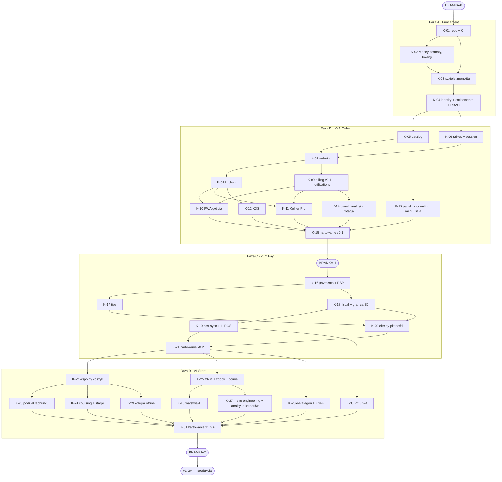

# ROADMAP — plan wykonawczy do produkcji

> **Produkt:** zamawianie przy stoliku przez QR/NFC dla rynku polskiego
> **Stos:** Next.js (PWA) + NestJS + PostgreSQL 16 + Redis, Node/TypeScript, monolit modularny
> **Stan wyjściowy:** greenfield — dokumentacja gotowa (`_docs_Nowa/`), kodu nie ma
> **Źródło prawdy o zakresie:** [`_docs_Nowa/01_Produkt_Zakres_Roadmapa.md`](_docs_Nowa/01_Produkt_Zakres_Roadmapa.md) §4

---

## 0. Jak czytać ten dokument

Ten plik **nie jest** powtórzeniem dokumentacji produktowej. Jest **planem wykonawczym**:
rozbiciem pracy na kroki `K-nn`, z których **każdy da się wykonać w jednym oknie kontekstowym**
(przyjęty budżet ≈ 500 k tokenów: lektura + implementacja + testy + poprawki).

Każdy krok jest samowystarczalny. Agent, który dostaje zadanie „wykonaj `K-07`", ma w opisie
kroku **komplet odnośników**, których potrzebuje, i nie musi zgadywać.

| Chcesz | Idź do |
|---|---|
| Zrozumieć, co znaczy „gotowe do produkcji" | §1 |
| Wiedzieć, co blokuje start i kiedy | §2 (bramki `BRAMKA-*`) |
| Poznać wybory technologiczne i otwarte decyzje techniczne | §3 |
| Poznać konwencje kodu, nazw stanów, układ repozytorium | §4 |
| Wiedzieć, kiedy krok jest skończony | §5 (globalna DoD) i sekcja **Definicja ukończenia** w kroku |
| Zobaczyć całą kolejność i zależności | §7 |
| Wykonać konkretny krok | §8 |
| Sprawdzić, czy nic nie wypadło z zakresu | §9 (macierze pokrycia) |
| Zobaczyć, co świadomie jest poza tą roadmapą | §10 |

### Zasada nadrzędna tego planu

**Kolejność kroków wynika z ryzyka, nie z wygody.** Najpierw domykamy to, czego retrofit
oznacza przepisanie (`D1`–`D4`, `O1`–`O10`), potem to, co waliduje główną hipotezę produktową
(v0.1 — czy goście w ogóle skanują), a dopiero na końcu to, co zależy od zewnętrznych
rozstrzygnięć (v0.2 — PSP, ORD-IN).

---

## 1. Definicja produkcji i „zera długów"

### 1.1. Co znaczy „gotowe do produkcji"

**Produkcja = wydanie v1 „Start"** — produkt komercyjnie sprzedawany, obsługujący 100 lokali,
z płatnościami, napiwkami, fiskalizacją, podziałem rachunku, CRM i pełną zgodnością prawną.

Kroki `K-01` … `K-31` doprowadzają dokładnie do tego stanu. Po ich wykonaniu:

- wszystkie funkcje `F-*` przypisane do v0.1, v0.2 i v1 są zaimplementowane i przetestowane;
- wszystkie ekrany `SCR-*` z wydań v0.1–v1 istnieją we wszystkich stanach;
- wszystkie reguły `RULE-001` … `RULE-027` są egzekwowane w kodzie **lub** w schemacie bazy;
- wszystkie niezmienniki `I1` … `I12` mają test właściwościowy albo ograniczenie bazy;
- wszystkie ograniczenia `LEG-001` … `LEG-015` mają udokumentowaną realizację;
- wszystkie wymagania `O1` … `O10` (drzwi do v2/v3) są spełnione w schemacie;
- wszystkie decyzje `DEC-*` blokujące dane wydanie są zamknięte przed jego startem.

**v2 i v3 są poza zakresem tej roadmapy** — świadomie, patrz §10.

### 1.2. Co znaczy „zero długów"

Dług techniczny w tym projekcie definiujemy operacyjnie. **Krok nie jest ukończony**, jeśli
zostawia po sobie którąkolwiek z poniższych rzeczy:

| # | Dług | Dlaczego zakazany |
|---|---|---|
| **L1** | Kod bez testu pokrywającego ścieżkę główną i co najmniej jeden przypadek brzegowy z [`02`](_docs_Nowa/02_Aktorzy_Scenariusze.md) §4 | Bez testu regresja jest kwestią czasu |
| **L2** | `TODO`, `FIXME`, `@ts-ignore`, `any`, `as unknown as` w kodzie produkcyjnym | Znacznik „wrócę tu" to dług, którego nikt nie spłaca |
| **L3** | Reguła `RULE-*` albo niezmiennik `I*` „zaimplementowany w UI" bez egzekwowania po stronie serwera | Ukrycie przycisku nie jest zabezpieczeniem (`Z-A8`) |
| **L4** | Funkcja bez metryki (zasada **Z5**) | Nie da się ocenić, czy działa |
| **L5** | Ekran bez kompletu stanów: ładowanie, pusty, błąd **z działaniem**, offline, brak uprawnień | Lista kontrolna z [`06`](_docs_Nowa/06_Ekrany_Gosc.md), [`07`](_docs_Nowa/07_Ekrany_Kelner_KDS.md), [`08`](_docs_Nowa/08_Ekrany_Panel.md) |
| **L6** | Przekroczony budżet wagi albo czasu z [`05`](_docs_Nowa/05_System_Projektowy.md) §7 | Przekroczenie to **niezaliczona kompilacja**, nie ostrzeżenie |
| **L7** | Kontrast, cel dotykowy, fokus albo obsługa klawiaturą niespełniające WCAG 2.1 AA | `LEG-011` — wymóg ustawowy z sankcją |
| **L8** | Migracja bez odpowiednika `down` albo bez testu na danych | Ścieżka wyjścia musi istnieć zanim jest potrzebna |
| **L9** | Nowy moduł bez wpisu w macierzy pokrycia (§9) i bez ADR dla decyzji nieoczywistej | Wiedza w głowie to dług |
| **L10** | Import między modułami z pominięciem portu albo złączenie SQL między modułami | `Z-A1`, `Z-A3` — zabija możliwość wydzielenia w v3 |
| **L11** | Kwota jako `number`, `float`, `parseFloat`, `toFixed` jako zaokrąglanie | `RULE-001`, `D3` — rozjazd sald |
| **L12** | Zapytanie domenowe bez filtra `venue_id` | `I9`, `Z-A9` — wyciek danych między lokalami |

**Egzekwowanie:** L2, L10, L11, L12 są blokowane przez lint i testy architektoniczne w CI (§6).
Reszta jest pozycją listy kontrolnej w przeglądzie kodu i w Definicji Ukończenia kroku.

---

## 2. Bramki nieprogramistyczne

Cztery bramki. **Bramka nie jest krokiem** — nie pisze się przy niej kodu. Jest warunkiem
wejścia do fazy. Otwarcie fazy z niezamkniętą bramką to podjęcie ryzyka, którego nie trzeba brać.

### `BRAMKA-0` — przed `K-01`

| Co | ID | Dlaczego blokuje |
|---|---|---|
| **Własne repozytorium git** | `DEC-014` | `0_Rastaran` leży dziś wewnątrz repozytorium projektu Drukarnia ERP — innego produktu. Pierwszy commit kodu do cudzego repo to koszt, który rośnie z każdym dniem |
| **10 wywiadów pogłębionych: 5 właścicieli, 5 kelnerów** | `DEC-010` | Weryfikacja hipotezy „kelner jest beneficjentem" — założenia, na którym stoi **cała dystrybucja** (zasada Z2). Powinno się zdarzyć **przed** v0.1, nie po |
| Wybór hostingu i regionu przetwarzania danych (UE) | `DEC-020` (nowa, §3.3) | Decyduje o architekturze wdrożenia i o treści umowy powierzenia |

> ⚠️ `DEC-010` nie blokuje technicznie ani jednej linijki kodu — blokuje **sens** budowania
> powierzchni Kelner Pro w obecnym kształcie. Jeśli wywiady obalą hipotezę, zmienia się priorytet
> `K-11`, a nie termin.

### `BRAMKA-1` — przed `K-16` (start fazy v0.2 Pay)

Wszystkie pozycje z [`10`](_docs_Nowa/10_Tuning_Decyzje_Ryzyka.md) §3.1 — „przed pierwszą złotówką":

| Co | ID | Konsekwencja braku |
|---|---|---|
| Umowa z PSP w trybie split + **pisemne potwierdzenie**, że środki gościa nie trafiają na nasze konto | `DEC-001` | Wymóg licencji MIP/KIP. Art. 150 ust. 1 UUP: do 5 mln zł kary lub 2 lata pozbawienia wolności (`LEG-001`) |
| Jednostronna umowa agencyjna z lokalem (agent **wyłącznie** lokalu, art. 6 pkt 2 UUP) | `DEC-002` | Utrata wyłączenia spod reżimu usług płatniczych |
| **ORD-IN:** moment wystawienia paragonu przy przedpłacie przez PSP | `DEC-003` | Architektura fiskalna i treść SLA — czyli cały `K-18` |
| **ORD-IN:** napiwki — PIT i ZUS przy splicie wprost na konto kelnera | `DEC-004` | Cała funkcja napiwków. Błąd = obciążenie lokalu ~40% od każdego napiwku (`LEG-006`) |
| Szablon umowy powierzenia przetwarzania (art. 28 RODO) | `DEC-006` | Każda umowa z lokalem (`LEG-008`) |
| **Wybór PSP i rzeczywiste stawki** — trzy pytania `a`/`b`/`c` | `DEC-009` | Najbardziej krytyczny punkt ekonomii. Odpowiedź „nie" na `DEC-009c` (BLIK-split na wielu odbiorców) **wymusza przeprojektowanie `K-17` przed jego rozpoczęciem** |
| Wybór pierwszej integracji POS | `DEC-007` | Zakres `K-19` |

> ⚠️ **`DEC-009c` zadaj jako pierwsze pytanie każdemu PSP, przed jakąkolwiek pracą nad `MOD-tips`.**
> To jest największa niewiadoma projektu.

### `BRAMKA-2` — przed wydaniem v1 GA (zamknięcie `K-31`)

| Co | ID |
|---|---|
| **HUB Paragonowy vs POS — kto wysyła e-paragon** (trzy scenariusze A/B/C) | `DEC-005` |
| Status druku sejmowego nr 2358 (alkohol) + projekt MZ o ograniczeniach nocnych 22:00–6:00 | `DEC-008` |
| Czy przesunąć rezerwacje (`F-S-005`) do v1 | `DEC-011` |
| P2B (UE) 2019/1150: regulamin, procedura zmian (15 dni), wewnętrzny kanał skarg | `DEC-015`, `LEG-015` |
| Trzy obowiązki formalne z ustawy o dostępności: sekcja „Dostępność" w regulaminie, zgłoszenie do Ministra Cyfryzacji przy niezgodności, udokumentowana ocena adekwatności przy wyłączeniu z art. 21 | `LEG-011` |
| Dostawca AI dla `F-G-009`/`010`/`011` i tłumaczeń — koszt, RODO, umowa powierzenia | `DEC-018` (nowa, §3.3) |

### `BRAMKA-3` — przed v2/v3 (poza zakresem tej roadmapy)

`DEC-012` (DAC7 przy marketplace), `DEC-013` (własna kasa GUM — profil odpowiedzialności prawnej).

---

## 3. Ustalenia techniczne roadmapy

### 3.1. Co jest zamknięte

Wynika wprost z [`04`](_docs_Nowa/04_Architektura_Moduly.md) §1 i [`05`](_docs_Nowa/05_System_Projektowy.md) — **nie podlega renegocjacji w krokach**:

| Obszar | Ustalenie |
|---|---|
| Architektura | **Monolit modularny** NestJS. Nie mikroserwisy. Granice modułów egzekwowane w kodzie (`Z-A1`…`Z-A9`) |
| Frontend | **Cztery osobne aplikacje** Next.js: gość, Kelner Pro, KDS, panel. Nie jeden responsywny layout |
| Baza | PostgreSQL 16. Kwoty jako `BIGINT` w groszach (`D3`, `RULE-001`) |
| Kolejki | BullMQ na Redis. Pięć kolejek wg [`04`](_docs_Nowa/04_Architektura_Moduly.md) §9 |
| Realtime | Redis pub/sub za bramą WebSocket. Kanały wg [`04`](_docs_Nowa/04_Architektura_Moduly.md) §6 |
| Kroje pisma | **Systemowy stos. 0 kB pobranych fontów.** Nienegocjowalne — to jedna trzecia budżetu gościa |
| Dostępność | WCAG 2.1 AA **w tokenach od pierwszego dnia** (`LEG-011`) |
| Multitenancy | Od **pierwszej migracji** (`D2`). Nie po fakcie |

### 3.2. Co rekomendujemy (zmiana nie przesuwa granic kroków)

Te wybory nie są w dokumentacji produktowej, bo są implementacyjne. Poniżej rekomendacja
z uzasadnieniem — jeśli zespół wybierze inaczej, **struktura kroków się nie zmienia**.

| Obszar | Rekomendacja | Uzasadnienie |
|---|---|---|
| Monorepo | **pnpm workspaces + Turborepo** | 4 frontendy + backend + pakiety wspólne. Turborepo lżejsze od nx przy tej skali |
| TypeScript | 5.x, `strict: true`, `noUncheckedIndexedAccess: true`, `exactOptionalPropertyTypes: true` | `any` jest długiem `L2`, więc kompilator musi go wyłapać |
| ORM | **Drizzle ORM** + ręcznie recenzowany SQL migracji | Potrzebujemy: `BIGINT` bez magii, **częściowych indeksów UNIQUE** (`I6`), przygotowania pod RLS (v2), pełnej kontroli nad zapytaniami filtrowanymi po `venue_id`. Patrz `DEC-016` |
| Walidacja API | **zod** na granicy (`nestjs-zod`) | Jedno źródło typu i schematu. Kontrakt API generowany z zod, nie pisany ręcznie |
| Testy | **Vitest** (jednostkowe/integracyjne), **Playwright** (E2E), **fast-check** (właściwościowe dla `I1`–`I4`), **Testcontainers** (PG + Redis) | Niezmienniki pieniężne wymagają testów właściwościowych, nie przykładowych |
| Realtime — protokół | **Natywny WebSocket**, własny cienki klient (~1–2 kB) | Klient socket.io to ~15–20 kB gzip = **jedna trzecia budżetu 60 kB JS** PWA gościa ([`05`](_docs_Nowa/05_System_Projektowy.md) §7.3). Patrz `DEC-017` |
| CSS | **Tailwind v4 na zmiennych CSS** z [`05`](_docs_Nowa/05_System_Projektowy.md) §2–4 | Tokeny są już zdefiniowane jako `--color-*`. Tailwind tylko je konsumuje. Panel może dokładać cięższe biblioteki, gość nie |
| i18n | Słowniki statyczne ładowane po stronie serwera, **zero runtime i18n u gościa** | Budżet. Gość dostaje wyłącznie swój język, nie cztery |
| Logi i telemetria | pino (JSON) + OpenTelemetry + Sentry | `MOD-analytics` to modele odczytu domeny, nie monitoring |
| Uwierzytelnianie personelu | Hasło (argon2id) + sesja w httpOnly cookie; **PIN zmiany** jako szybkie przełączenie w obrębie urządzenia lokalu | `SCR-K-01` to „start zmiany", nie „logowanie". Kelner nie wpisuje hasła 20 razy dziennie. Patrz `DEC-021` |
| Tożsamość gościa | Podpisany token sesji (T1) + `device_token` w `localStorage` (T2) | [`03`](_docs_Nowa/03_Model_Domenowy.md) §5. Degradacja do T1 jest normą, nie błędem |

### 3.3. Nowe otwarte decyzje techniczne

Do **dopisania do** [`10_Tuning_Decyzje_Ryzyka.md`](_docs_Nowa/10_Tuning_Decyzje_Ryzyka.md) §3.2.
Numeracja kontynuuje istniejącą (ostatnia w dokumentacji: `DEC-015`). Identyfikator raz nadany
nigdy nie jest zmieniany ani użyty ponownie.

| ID | Decyzja | Kontekst | Do kiedy |
|---|---|---|---|
| `DEC-016` | **ORM i narzędzie migracji** | Drizzle (rekomendacja) vs Prisma. Kryteria: częściowe indeksy UNIQUE, `BIGINT`, przygotowanie pod RLS, kontrola nad filtrem `venue_id` w klasie bazowej | `K-01` |
| `DEC-017` | **Protokół realtime** | Natywny WebSocket (rekomendacja) vs socket.io. Kryterium rozstrzygające: budżet 60 kB JS u gościa | `K-03` |
| `DEC-018` | **Dostawca AI** dla tłumaczeń (`K-05`), filtru konwersacyjnego, upsellu i doboru napojów (`K-26`) | Koszt na lokal, umowa powierzenia (dane menu i historia sprzedaży lokalu), region przetwarzania, zachowanie przy niedostępności dostawcy | `K-05` (tłumaczenia), `BRAMKA-2` (funkcje v1) |
| `DEC-019` | **Kanał powiadomień push** | ⚠️ **Nietrywialne:** WebPush na iOS wymaga dodania PWA do ekranu głównego — co łamie zasadę **Z1** („gość nigdy nic nie instaluje"). Wniosek roboczy: **push wyłącznie dla personelu**, gość dostaje aktualizacje przez otwarte połączenie WebSocket. To wpływa na `F-G-030` i na wariant C w `TUN-004` | `K-09` |
| `DEC-020` | **Hosting, region, dostawca infrastruktury** | Dane osobowe gości lokali muszą pozostać w UE (`LEG-008`). Wpływa na treść umowy powierzenia (`DEC-006`) | `BRAMKA-0` |
| `DEC-021` | **Model uwierzytelniania personelu** | Hasło + sesja vs PIN zmiany na urządzeniu lokalu vs kombinacja. Wpływa na `SCR-K-01` i na wartość dowodową logu potwierdzeń wieku (`LEG-010`) — log musi wskazywać **konkretną osobę**, nie „urządzenie" | `K-04` |

---

## 4. Konwencje repozytorium i kodu

### 4.1. Układ monorepo

```
/
├── apps/
│   ├── api/              # NestJS — monolit modularny
│   ├── guest/            # Next.js — PWA gościa   (budżet twardy)
│   ├── waiter/           # Next.js — Kelner Pro   (PWA, offline-first do odczytu)
│   ├── kds/              # Next.js — KDS kuchni   (SPA, sesja 14 h)
│   └── panel/            # Next.js — panel        (SPA, bez limitu wagi)
├── packages/
│   ├── money/            # typ Money, arytmetyka w groszach, HALF_UP, podział reszty
│   ├── formats/          # formaty polskie (05 §10), lokalizacje pl/uk/en/de
│   ├── design-tokens/    # tokeny z 05 §2–5 jako CSS + TS
│   ├── ui/               # komponenty wspólne z 05 §8.1
│   ├── contracts/        # schematy zod + typy API, współdzielone front↔back
│   └── realtime-client/  # cienki klient WebSocket (DEC-017)
├── docs/
│   ├── adr/              # decyzje architektoniczne, ADR-nnn
│   └── runbooks/         # procedury operacyjne
├── _docs_Nowa/           # dokumentacja produktowa — ŹRÓDŁO PRAWDY, nie edytować w krokach
├── 01_Koncepcja_produktu.md
├── ROADMAP.md            # ten plik
└── CLAUDE.md
```

**Moduł backendu** (`apps/api/src/modules/<nazwa>/`) ma zawsze ten sam kształt:

```
mod-ordering/
├── domain/           # encje, maszyny stanów, reguły — zero zależności od frameworka
├── application/      # przypadki użycia, handlery zdarzeń
├── infrastructure/   # repozytoria (Drizzle), adaptery zewnętrzne
├── api/              # kontrolery, schematy zod, zasoby (usuwanie pól!)
├── events/           # definicje EVT-* produkowanych przez ten moduł
├── ports/            # interfejsy TS wystawiane innym modułom (tylko granice z 04 §5)
└── index.ts          # PUBLICZNE API modułu — jedyne, co wolno importować z zewnątrz
```

### 4.2. Nazewnictwo — polski w treści, angielski w kodzie

Glosariusz [`00_INDEX.md`](_docs_Nowa/00_INDEX.md) §5 jest wiążący. Dokumentacja i copy UI: **polski**.
Identyfikatory encji, zdarzeń, tabel, kolumn i wartości enumeracji: **angielski**.

Tabele: `venues`, `table_sessions`, `order_items`, `bill_lines` — liczba mnoga, `snake_case`.

### 4.3. Kanoniczne nazwy stanów

Dokumentacja podaje stany po polsku (bo opisuje domenę). W kodzie obowiązuje poniższe
odwzorowanie. **Nie wymyślać własnego** — te wartości trafiają do bazy i do API.

**`TableSession`** ([`02`](_docs_Nowa/02_Aktorzy_Scenariusze.md) §3.10, `RULE-021`):

| Dokumentacja | W kodzie | Uwaga |
|---|---|---|
| — | `reserved` | **Zarezerwowana.** Nieużywany w v0.1, obecny w typie od pierwszej migracji (`O1`) |
| Otwarta | `open` | |
| Aktywna | `active` | |
| Rozliczana | `billing` | |
| Zamknięta | `closed` | |
| Porzucona | `abandoned` | `TUN-016`: 30 min bez zamówienia |
| Wymaga uwagi | `needs_attention` | `TUN-015`: 25 min bez płatności |

**`Order`** ([`03`](_docs_Nowa/03_Model_Domenowy.md) §4.2): `placed` · `accepted` · `in_preparation` · `ready` · `served` · `rejected` · `cancelled`

**`OrderItem`** ([`03`](_docs_Nowa/03_Model_Domenowy.md) §4.3): `awaiting_staff_confirmation` · `queued` · `in_preparation` · `ready` · `served` · `rejected` · `cancelled`

> Nazwa `awaiting_staff_confirmation` pochodzi wprost z [`00_INDEX.md`](_docs_Nowa/00_INDEX.md) `P6` — nie skracać.

**`Bill`** ([`03`](_docs_Nowa/03_Model_Domenowy.md) §4.4): `open` · `closed_for_payment` · `split` · `partially_paid` · `paid` · `needs_attention`

**`Payment`** ([`03`](_docs_Nowa/03_Model_Domenowy.md) §4.5): `created` · `authorized` · `captured` · `failed` · `expired` · `refunded`

**`TipPayout`** ([`03`](_docs_Nowa/03_Model_Domenowy.md) §4.6): `scheduled` · `sent` · `settled` · `held` · `returned_to_guest`

> ⚠️ **Nie istnieje** stan `pooled` ani `on_venue_account`. Każdy taki stan przekwalifikowuje
> napiwek na przychód ze stosunku pracy z pełnym PIT i ZUS (`LEG-006`).

**Enumeracje w bazie:** jako `TEXT` z ograniczeniem `CHECK`, **nie** jako typ `ENUM` PostgreSQL.
Powód: `Payment.method` musi być rozszerzalny bez migracji typu (`O4` — hotele dokładają
`room_charge`), a zmiana typu `ENUM` na produkcji przy działającym ruchu to operacja blokująca.

### 4.4. Reprezentacja pieniędzy — skrót obowiązujący wszędzie

Pełna definicja: [`03`](_docs_Nowa/03_Model_Domenowy.md) §6. Skrót do zapamiętania:

| Warstwa | Typ | Przykład |
|---|---|---|
| PostgreSQL | `BIGINT` — grosze | `12345` |
| TypeScript | `Money` (branded `bigint`) | `Money.fromGrosze(12345n)` |
| JSON API | **string** + waluta | `{ "amount": "12345", "currency": "PLN" }` |
| UI | konwersja **tylko na granicy renderu** | `123,45 zł` |

**Doprecyzowania, których dokumentacja nie zawiera, a które muszą być rozstrzygnięte w `K-02`:**

1. **HALF_UP = zaokrąglenie w stronę od zera** (jak `BigDecimal.ROUND_HALF_UP`). Ma znaczenie,
   bo `Modifier.price_delta_gross` **może być ujemny** ([`03`](_docs_Nowa/03_Model_Domenowy.md) §3.2).
2. **Stawka VAT jako liczba całkowita w punktach bazowych**: `800` = 8,00%, `2300` = 23,00%.
   Powód: `O10` wymaga stawek jako danych, a rynki CZ/SK/RO mają stawki ułamkowe.
3. **VAT liczony wstecz od kwoty brutto**, bo ceny w menu są brutto ([`03`](_docs_Nowa/03_Model_Domenowy.md) §6.3):
   `vat = round_half_up(gross × rate / (10000 + rate))` — mnożenie **przed** dzieleniem, na `bigint`.
4. **Reszta z dzielenia przy podziale rachunku** trafia deterministycznie do uczestnika
   inicjującego podział. Nigdy nie ginie, nigdy nie jest rozrzucana losowo (`RULE-002`, `I2`).
5. **Kolumna `currency`** (`CHAR(3)`) obecna na `venues`, `bills`, `payments` od pierwszej
   migracji. Wartość `PLN` do v3 (`RULE-027`), ale schemat dopuszcza więcej (`O10`).

### 4.5. Commity i gałęzie

`feat:` `fix:` `refactor:` `test:` `docs:` `chore:` `perf:` — treść po angielsku, ciało wyjaśnia
**dlaczego**. Jeden commit = jedna logiczna zmiana. Nigdy `--no-verify`.

Gałąź na krok: `krok/K-07-mod-ordering`. Scalenie do `main` wyłącznie przy zielonym CI
i zamkniętej Definicji Ukończenia kroku.

---

## 5. Globalna Definicja Ukończenia

**Obowiązuje w każdym kroku, dodatkowo do pozycji wymienionych w samym kroku.**
Krok bez kompletu poniższych punktów nie jest ukończony — jest długiem `L1`–`L12`.

- [ ] **Testy.** Ścieżka główna + przypadki brzegowe z [`02`](_docs_Nowa/02_Aktorzy_Scenariusze.md) §4 dotyczące tego kroku. Progi pokrycia z §6.
- [ ] **Reguły serwerowe.** Każda `RULE-*` z zakresu kroku egzekwowana po stronie serwera lub w schemacie bazy — nie w UI (`L3`).
- [ ] **Niezmienniki.** Każdy `I*` z zakresu kroku ma test właściwościowy **albo** ograniczenie bazy. Preferowane oba.
- [ ] **Izolacja najemcy.** Każda nowa tabela domenowa ma `venue_id`. Każde zapytanie filtrowane w klasie bazowej repozytorium (`I9`, `Z-A9`).
- [ ] **Granice modułów.** Zero importów spoza `index.ts` innego modułu. Zero złączeń SQL między modułami. Weryfikowane testem architektonicznym (`Z-A1`, `Z-A3`).
- [ ] **Idempotencja.** Każdy handler zdarzenia znosi wielokrotne dostarczenie (`Z-A6`, `RULE-019`).
- [ ] **Usuwanie pól.** Zasoby API usuwają pola niedostępne dla roli **przed serializacją** ([`04`](_docs_Nowa/04_Architektura_Moduly.md) §8.3). Test per rola, nie tylko dla admina.
- [ ] **Uprawnienia planu.** Nowe funkcje mają klucz w `MOD-entitlements`, sprawdzany na granicy API (`RULE-025`, `Z-A8`).
- [ ] **Migracje.** `up` i `down`, przetestowane na kopii danych. Forward-only na produkcji.
- [ ] **Ekrany.** Komplet stanów: ładowanie (szkielet, nie spinner), pusty, błąd **z działaniem**, offline, brak uprawnień (`L5`).
- [ ] **Dostępność.** Kontrast ≥ 4,5:1 w obu motywach, cele ≥ 48 px, widoczny fokus, pełna obsługa klawiaturą, `prefers-reduced-motion` (`LEG-011`).
- [ ] **Copy.** Polski, właściwy rejestr per powierzchnia ([`05`](_docs_Nowa/05_System_Projektowy.md) §11). Zero „Ups!", zero wykrzykników w komunikatach systemowych. Treści o wadze prawnej ([`05`](_docs_Nowa/05_System_Projektowy.md) §11.4) **nieprzeredagowywane**.
- [ ] **Budżet.** Jeśli krok dotyka PWA gościa — budżet z [`05`](_docs_Nowa/05_System_Projektowy.md) §7.3 zmierzony w CI.
- [ ] **Metryka.** Każda funkcja ma zdefiniowaną metrykę w złotych albo w czasie (zasada **Z5**).
- [ ] **ADR.** Decyzja nieoczywista → `docs/adr/ADR-nnn-*.md`. Krótko: kontekst, decyzja, konsekwencje, odrzucone warianty.
- [ ] **Macierz pokrycia.** §9 zaktualizowana: każdy `F-*`, `SCR-*`, `RULE-*`, `LEG-*` z kroku oznaczony jako zrealizowany.
- [ ] **Zero `L2`.** Brak `TODO`, `FIXME`, `@ts-ignore`, `any` w kodzie produkcyjnym.

---

## 6. Bramki jakości w CI

Konfigurowane w `K-01`, rozszerzane w kolejnych krokach. **Czerwona bramka = niezaliczona
kompilacja**, nie ostrzeżenie.

| Bramka | Narzędzie | Próg |
|---|---|---|
| Typy | `tsc --noEmit`, `strict` | 0 błędów. `no-explicit-any` jako **error** |
| Lint domenowy — pieniądze | własna reguła ESLint | Zakaz `parseFloat`, `toFixed`, `Number(` i arytmetyki `number` na identyfikatorach `*price*`, `*amount*`, `*total*`, `*vat*`, `*tip*`, `*cost*`, `*margin*`, `*gross*` (`L11`, `RULE-001`) |
| Lint architektoniczny | `dependency-cruiser` | Zakaz importu między modułami z pominięciem `index.ts`. Zakaz importu encji ORM innego modułu (`L10`, `Z-A1`) |
| Lint SQL | test integracyjny | Każda tabela domenowa ma `venue_id`. Każde repozytorium dziedziczy z bazowego (`L12`, `I9`) |
| Lint dostępności | ESLint + stylelint | Zakaz `outline: none`. Zakaz surowych wartości kolorów poza `packages/design-tokens` |
| Kontrast tokenów | test jednostkowy | Wszystkie pary tokenów ≥ 4,5:1 (tekst) i ≥ 3:1 (elementy) **w obu motywach** ([`05`](_docs_Nowa/05_System_Projektowy.md) §6) |
| Testy jednostkowe i integracyjne | Vitest + Testcontainers | Pokrycie: `money`/`MOD-billing`/`MOD-payments`/`MOD-tips`/`MOD-fiscal` **≥ 90%** · pozostałe moduły domenowe **≥ 80%** · reszta **≥ 60%** |
| Testy właściwościowe | fast-check | `I1`, `I2`, `I3`, `I4` — obowiązkowo. Bez wyjątków |
| E2E | Playwright | Scenariusze `S1`–`S10` właściwe dla wydania |
| Dostępność E2E | `axe-core` w Playwright | 0 naruszeń krytycznych i poważnych na każdym ekranie |
| Budżet wagi (gość) | `size-limit` + Lighthouse CI | HTML ≤ 14 kB · krytyczny CSS ≤ 8 kB · JS ≤ 60 kB gz · obrazy pierwszego ekranu ≤ 120 kB · **całość ≤ 200 kB** · **fonty = 0 kB** |
| Budżet czasu (gość) | Lighthouse CI, profil 3G | FCP ≤ 1,0 s · LCP ≤ 2,0 s · TTI ≤ 2,5 s |
| Migracje | test na kopii schematu | `up` i `down` przechodzą. Brak utraty danych |
| Sekrety | `gitleaks` | 0 znalezisk |
| Zależności | `pnpm audit` + `osv-scanner` | 0 podatności krytycznych i wysokich |

---

## 7. Mapa kroków

### 7.1. Przegląd

| Faza | Kroki | Wydanie | Co powstaje |
|---|---|---|---|
| **A · Fundament** | `K-01` … `K-04` | — | Repozytorium, CI, rdzeń pieniężny, tokeny, szkielet monolitu, tożsamość, uprawnienia |
| **B · Order** | `K-05` … `K-15` | **v0.1** | Zamawianie, KDS, Kelner Pro, panel, onboarding. **Bez płatności w aplikacji**. Tryb bez POS |
| **C · Pay** | `K-16` … `K-21` | **v0.2** | BLIK, Apple/Google Pay, napiwki wprost na konto kelnera, fiskalizacja, pierwsza integracja POS |
| **D · Start** | `K-22` … `K-31` | **v1 GA** | Wspólny koszyk, podział rachunku, coursing, CRM, opinie, AI, analityka wartości, e-Paragon, POS 2–4 |

### 7.2. Zależności



### 7.3. Co można prowadzić równolegle

| Równolegle | Warunek |
|---|---|
| `K-05` i `K-06` | Oba zależą tylko od `K-04`, nie od siebie |
| `K-10`, `K-11`, `K-12` | Po `K-08` i `K-09`. Trzy różne aplikacje, wspólny tylko `packages/ui` |
| `K-13` i `K-14` | Różne ekrany panelu, różne moduły backendu |
| `K-17` i `K-18` | Oba po `K-16`. `MOD-tips` i `MOD-fiscal` nie zależą od siebie |
| `K-25`, `K-28`, `K-30` | Trzy niezależne gałęzie fazy D |

⚠️ **Nie zrównoleglać** `K-16` → `K-17`: jeśli `DEC-009c` da odpowiedź „nie", `K-17` wymaga
przeprojektowania **przed** napisaniem pierwszej linii.

---

## 8. Kroki

### Szablon opisu kroku

Każdy krok ma tę samą strukturę. **Sekcja „Wczytaj przed startem" jest wiążąca** — to jest
komplet kontekstu potrzebny do wykonania kroku. Nie wczytuj całego katalogu `_docs_Nowa/`;
wczytaj dokładnie to, co wymieniono, plus [`00_INDEX.md`](_docs_Nowa/00_INDEX.md) zawsze.

---

# Faza A · Fundament

> Faza A nie produkuje ani jednej funkcji widocznej dla użytkownika. Produkuje **rzeczy,
> których retrofit oznacza przepisanie**: rdzeń pieniężny, multitenancy, granice modułów,
> tokeny dostępności. Skrócenie tej fazy jest najdroższą oszczędnością w całym projekcie.

---

## `K-01` · Repozytorium, monorepo, CI/CD, środowiska

| | |
|---|---|
| **Wydanie** | — (fundament) |
| **Zależy od** | `BRAMKA-0` (`DEC-014`, `DEC-020`) |
| **Odblokowuje** | `K-02`, `K-03` |
| **Budżet lektury** | ~12 k tokenów |

**Cel.** Powstaje puste, ale kompletnie uzbrojone repozytorium: monorepo z pięcioma aplikacjami
i sześcioma pakietami, potok CI z bramkami jakości z §6, trzy środowiska (lokalne, staging,
produkcja) i szkielet dokumentacji decyzji. **Zero kodu domenowego.**

**Wczytaj przed startem**

- [`00_INDEX.md`](_docs_Nowa/00_INDEX.md) — całość (konwencje ID, glosariusz)
- [`04_Architektura_Moduly.md`](_docs_Nowa/04_Architektura_Moduly.md) §1 (topologia), §1.2 (cztery aplikacje)
- [`05_System_Projektowy.md`](_docs_Nowa/05_System_Projektowy.md) §7 (budżet wydajności — bo bramki CI muszą go mierzyć)
- `ROADMAP.md` §3 (ustalenia techniczne), §4 (konwencje), §5 (globalna DoD), §6 (bramki CI)

**Zakres**

- Monorepo: `pnpm` workspaces + Turborepo, układ katalogów wg §4.1.
- `apps/api` — pusty projekt NestJS z konfiguracją, health check, strukturą katalogów modułów.
- `apps/guest`, `apps/waiter`, `apps/kds`, `apps/panel` — puste projekty Next.js z poprawną konfiguracją renderowania (gość: SSR + minimum JS; KDS i panel: SPA).
- `packages/*` — puste pakiety z `package.json`, `tsconfig`, eksportami.
- `docker-compose.yml` — PostgreSQL 16, Redis 7, storage plików. Środowisko lokalne startuje jedną komendą.
- Potok CI: wszystkie bramki z §6, które da się uruchomić bez kodu domenowego (typy, lint, sekrety, zależności, budżet wagi na pustych aplikacjach jako linia bazowa).
- Środowiska: lokalne, staging, produkcja. Migracje uruchamiane osobnym zadaniem, nie przy starcie aplikacji.
- `docs/adr/ADR-001-monolit-modularny.md` — utrwalenie decyzji z [`04`](_docs_Nowa/04_Architektura_Moduly.md) §1.1.
- Rozstrzygnięcie i zapis `DEC-016` (ORM).

**Kontekst dodatkowy**

- **Budżet wagi mierzymy od pierwszego dnia**, na pustej aplikacji. Linia bazowa „pusty Next.js"
  pokazuje, ile z 200 kB zjada sam framework — to jest liczba, którą trzeba znać, **zanim**
  ktoś doda pierwszą bibliotekę. Jeśli pusty `apps/guest` już nie mieści się w budżecie, to
  jest problem `K-01`, a nie `K-10`.
- Cztery aplikacje frontendowe **nie dzielą** konfiguracji Tailwinda ani listy zależności.
  Wspólne są wyłącznie `packages/design-tokens` i `packages/ui`. Panel może importować ciężkie
  biblioteki; `apps/guest` ma zakaz importu czegokolwiek, co nie przeszło budżetu.
- Migracje **nie startują automatycznie** z aplikacją. Zadanie osobne, uruchamiane świadomie —
  bo `K-06` wprowadza częściowy indeks UNIQUE, którego zakładanie na żywej tabeli wymaga
  `CONCURRENTLY` i decyzji operatora.
- Nie konfigurować jeszcze RLS w PostgreSQL. To druga warstwa izolacji, planowana na v2
  ([`04`](_docs_Nowa/04_Architektura_Moduly.md) §8.1). Pierwsza warstwa (`K-03`) musi działać sama.

**Definicja ukończenia**

- [ ] `pnpm install && pnpm dev` uruchamia komplet: API + 4 aplikacje + PostgreSQL + Redis.
- [ ] `pnpm build`, `pnpm lint`, `pnpm typecheck`, `pnpm test` przechodzą na czystym klonie.
- [ ] CI blokuje merge przy czerwonej bramce — zweryfikowane celowo zepsutym commitem.
- [ ] Budżet wagi `apps/guest` zmierzony i zapisany jako linia bazowa w CI.
- [ ] `gitleaks` i skan zależności w potoku, 0 znalezisk.
- [ ] Wdrożenie na staging działa z potoku, nie z laptopa.
- [ ] `DEC-016` rozstrzygnięte, zapisane jako ADR i dopisane do [`10`](_docs_Nowa/10_Tuning_Decyzje_Ryzyka.md) §3.2.
- [ ] Globalna DoD (§5) w części dotyczącej tego kroku.

**Czego NIE robić w tym kroku**

- Żadnych encji, migracji domenowych, endpointów biznesowych.
- Żadnego uwierzytelniania — to `K-04`.
- Nie instalować bibliotek UI „na zapas". Każda zależność w `apps/guest` musi mieć uzasadnienie
  w budżecie.

---

## `K-02` · Rdzeń wspólny: `Money`, formaty polskie, tokeny projektowe, biblioteka UI

| | |
|---|---|
| **Wydanie** | — (fundament) |
| **Zależy od** | `K-01` |
| **Odblokowuje** | `K-03` i każdy krok dotykający kwot lub interfejsu |
| **Budżet lektury** | ~18 k tokenów |

**Cel.** Powstaje warstwa, której **nie da się później podmienić**: typ pieniężny, formaty
polskie, tokeny projektowe spełniające WCAG 2.1 AA w obu motywach i komponenty wspólne.

**Wczytaj przed startem**

- [`00_INDEX.md`](_docs_Nowa/00_INDEX.md) — całość
- [`03_Model_Domenowy.md`](_docs_Nowa/03_Model_Domenowy.md) §6 **w całości** (reprezentacja, zaokrąglanie, VAT, granica prawna napiwku), §7 (`RULE-001`–`RULE-005`), §8 (`I1`–`I4`)
- [`05_System_Projektowy.md`](_docs_Nowa/05_System_Projektowy.md) **w całości** — to jest dokument źródłowy tego kroku
- `ROADMAP.md` §4.4 (doprecyzowania pieniężne), §6 (bramki kontrastu i budżetu)

**Zakres**

- `packages/money`: typ `Money` (branded `bigint`, grosze), arytmetyka (dodawanie, odejmowanie,
  mnożenie przez ilość, procent), zaokrąglenie **HALF_UP w stronę od zera**, obliczanie VAT
  wstecz od brutto, podział kwoty na N części z deterministyczną resztą, serializacja do JSON
  jako string + waluta, parser z JSON.
- `packages/formats`: formaty z [`05`](_docs_Nowa/05_System_Projektowy.md) §10 — kwota, kwota z tysiącami, data, data opisowa,
  godzina, data z godziną, czas trwania, numer stolika, telefon, NIP, procent. Lokalizacje
  `pl` / `uk` / `en` / `de`; interfejs ukraiński używa **polskiego formatu waluty**.
- `packages/design-tokens`: tokeny z [`05`](_docs_Nowa/05_System_Projektowy.md) §2.2 (jasny), §2.3 (ciemny), §3.2 (trzy skale
  typograficzne: gość/panel, Kelner Pro, KDS), §4 (odstępy, promienie, cienie, `--touch-min`),
  §5 (ruch). Eksport jako CSS i jako typy TS.
- `packages/ui`: komponenty wspólne z [`05`](_docs_Nowa/05_System_Projektowy.md) §8.1 — `Button`, `IconButton`, `Input`,
  `Textarea`, `Select`, `Checkbox`, `Radio`, `Switch`, `Badge`, `Chip`, `Card`, `Sheet`,
  `Dialog`, `Toast`, `Tabs`, `Skeleton`, `EmptyState`, `ErrorState`, `Spinner`, `Avatar`,
  `Money`, `Timer`, `LanguageSwitcher`, `ThemeToggle`.
- Reguła ESLint blokująca arytmetykę zmiennoprzecinkową na kwotach (§6).
- Test kontrastu wszystkich par tokenów w obu motywach.

**Reguły obowiązkowe**

`RULE-001` (grosze, zero float) · `RULE-002` (HALF_UP raz, reszta do inicjatora) ·
`RULE-003` (VAT na pozycji) · `RULE-027` (PLN do v3, ale schemat dopuszcza więcej — `O10`) ·
`I1`–`I4` jako testy właściwościowe.

**Kontekst dodatkowy**

- **Testy właściwościowe, nie przykładowe.** `fast-check` na losowych kwotach: suma podziału
  równa się kwocie dzielonej **zawsze**, dla dowolnego N i dowolnej kwoty, w tym ujemnej
  (modyfikatory) i zerowej. To jest miejsce, gdzie test przykładowy przepuści błąd.
- **`Money` nie ma metody `toNumber()`.** Jeśli ktoś jej potrzebuje, robi coś źle. Wyjście
  z typu prowadzi wyłącznie przez `toGrosze(): bigint`, `toJSON(): string` i `format(locale)`.
- **`--touch-min: 48px` to nie sugestia.** WCAG wymaga 44 px; bierzemy zapas, bo kontekst to
  hałas, ruch i jedna ręka. Komponent `Button` nie może być mniejszy — brak wariantu „small",
  który to łamie.
- **KDS ma osobną skalę typograficzną**, nie responsywną wersję panelu ([`05`](_docs_Nowa/05_System_Projektowy.md) §3.2).
  Tokeny `--kds-text-*` są osobnymi tokenami, nie mnożnikiem.
- **Status na KDS kodowany trzema środkami naraz** — kolor + licznik liczbowy + grubość
  obramowania ([`05`](_docs_Nowa/05_System_Projektowy.md) §2.4). Komponent musi to wymuszać strukturalnie, żeby nie
  dało się użyć samego koloru (`WCAG 1.4.1`).
- **Kolory statusu są zarezerwowane.** Zielony/żółty/czerwony nigdy jako kolor marki. Warto
  to wyrazić w typach: `Button` przyjmuje `variant`, gdzie `danger` istnieje, ale `success`
  jako wariant przycisku — nie.

**Definicja ukończenia**

- [ ] `Money` pokryty w ≥ 95%, z testami właściwościowymi dla `I1`–`I4`.
- [ ] Podział `100,00 zł` na 3 daje `33,33 + 33,33 + 33,34`, a reszta trafia do inicjatora — test jawny.
- [ ] VAT liczony wstecz od brutto dla stawek `800` i `2300` punktów bazowych — test na wartościach granicznych.
- [ ] Wszystkie pary tokenów przechodzą test kontrastu w motywie jasnym **i** ciemnym.
- [ ] Każdy komponent `packages/ui` ma stan: domyślny, hover, focus (widoczny obrys 2 px), aktywny, wyłączony, ładowanie.
- [ ] `prefers-reduced-motion: reduce` zeruje wszystkie przejścia — test.
- [ ] Reguła ESLint dla kwot wykrywa `parseFloat`, `toFixed`, `Number(` i arytmetykę `number` — zweryfikowana na celowo błędnym kodzie.
- [ ] Zero pobieranych krojów pisma — test w CI sprawdzający brak `@font-face` i żądań do hostów fontów.
- [ ] Globalna DoD (§5).

**Czego NIE robić w tym kroku**

- Nie budować komponentów specyficznych dla powierzchni (`MenuItemCard`, `TableCard`,
  `TicketCard`) — one powstają w krokach `K-10`…`K-14`, bo ich kształt wynika z makiet.
- Nie dodawać obsługi wielu walut. `RULE-027`: PLN do v3. Schemat dopuszcza, kod nie implementuje.
- Nie wprowadzać systemu ikon — to `K-10` (razem z alergenami, gdzie piktogram ma wymóg prawny).

---

## `K-03` · Szkielet monolitu modularnego

| | |
|---|---|
| **Wydanie** | — (fundament) |
| **Zależy od** | `K-01`, `K-02` |
| **Odblokowuje** | `K-04` i wszystkie moduły domenowe |
| **Budżet lektury** | ~20 k tokenów |

**Cel.** Powstaje mechanika, która sprawia, że **granice modułów są egzekwowane przez maszynę,
a nie przez uważność programisty**: kontekst najemcy, repozytorium bazowe z obowiązkowym filtrem
`venue_id`, szyna zdarzeń domenowych, kolejki, brama realtime i obserwowalność.

**Wczytaj przed startem**

- [`00_INDEX.md`](_docs_Nowa/00_INDEX.md) — całość
- [`04_Architektura_Moduly.md`](_docs_Nowa/04_Architektura_Moduly.md) **w całości** — to jest dokument źródłowy tego kroku. Szczególnie §3 (`Z-A1`–`Z-A9`), §4 (nazewnictwo zdarzeń), §5 (**zamknięta** lista granic synchronicznych), §6 (realtime), §8 (wielodostępność), §9 (kolejki)
- [`03_Model_Domenowy.md`](_docs_Nowa/03_Model_Domenowy.md) §1 (`D1`–`D4`), §8 (`I9`)
- [`09_Ekrany_v2_v3.md`](_docs_Nowa/09_Ekrany_v2_v3.md) §8 (`O1`–`O10` — wymagania wobec schematu)
- `ROADMAP.md` §4.1 (kształt modułu), §4.3 (nazwy stanów), §6

**Zakres**

- **Kontekst żądania**: `tenantId` + `venueId` rozstrzygane w bramie, przenoszone w kontekście
  asynchronicznym (`AsyncLocalStorage`). Zadanie w tle bez kontekstu najemcy **nie startuje**.
- **Repozytorium bazowe**: każde zapytanie filtrowane po `venue_id` w klasie bazowej. Ominięcie
  wymaga jawnego, nazwanego wyjątku, logowanego i policzalnego (`I9`, `Z-A9`).
- **Szyna zdarzeń domenowych**: publikacja w transakcji zapisu (outbox), dostarczenie
  at-least-once, handlery idempotentne po kluczu zdarzenia (`Z-A5`, `Z-A6`).
- **Kolejki BullMQ**: `critical`, `realtime`, `integrations`, `analytics`, `campaigns` z
  priorytetami wg [`04`](_docs_Nowa/04_Architektura_Moduly.md) §9. Kolejka martwych listów dla każdej. Alert przy zaległości
  `critical` > 10 zadań.
- **Brama realtime**: WebSocket + Redis pub/sub. Sześć kanałów z [`04`](_docs_Nowa/04_Architektura_Moduly.md) §6. **Autoryzacja
  subskrypcji sprawdza przynależność do lokalu przy każdym połączeniu.** Heartbeat 30 s,
  ponowienie z wykładniczym backoffem, `sequenceNo` na zdarzeniu, pełne odświeżenie stanu po
  odzyskaniu połączenia (nie odtwarzanie zdarzeń).
- **`packages/realtime-client`**: cienki klient, budżet ≤ 2 kB gz.
- **Rejestr granic synchronicznych**: `S1`–`S5` z [`04`](_docs_Nowa/04_Architektura_Moduly.md) §5 jako jawna, **zamknięta**
  konstrukcja w kodzie, z limitem czasu i zachowaniem przy przekroczeniu per granica.
- **Test architektoniczny**: import z pominięciem `index.ts` modułu = błąd CI. Złączenie SQL
  między tabelami różnych modułów = błąd CI.
- Obserwowalność: pino (JSON), OpenTelemetry, korelacja `requestId` przez kolejki i realtime.

**Reguły obowiązkowe**

`Z-A1`–`Z-A9` · `RULE-019` (idempotencja po `provider_event_id` z UNIQUE) · `I9` · `D2`.

**Kontekst dodatkowy**

- **Lista granic synchronicznych jest zamknięta.** Dopisanie szóstej wymaga decyzji `DEC-*`
  ([`04`](_docs_Nowa/04_Architektura_Moduly.md) §5). Wyraź to w kodzie: granice jako skończony typ sumaryczny, nie jako
  dowolne wywołanie. Dzięki temu dopisanie granicy jest widoczne w przeglądzie kodu.
- **Outbox, nie publikacja bezpośrednia.** Zdarzenie musi być zapisane w tej samej transakcji
  co zmiana stanu. Inaczej `EVT-order.placed` poleci przy nieudanym zapisie zamówienia — i KDS
  pokaże danie, którego nie ma w bazie.
- **`sequenceNo` jest per sesja, nie globalny** ([`04`](_docs_Nowa/04_Architektura_Moduly.md) §6.1). Klient odrzuca zdarzenia
  starsze niż stan, który już ma.
- **Zdarzenia nie są kolejkowane dla nieobecnego klienta.** Gość zamknął kartę → po ponownym
  otwarciu pełne pobranie stanu. Nie budować odtwarzania zdarzeń dla gościa.
- **KDS żyje 14 h.** Brama musi znieść połączenie bez rozłączenia przez dobę, z automatycznym
  przeładowaniem przy zmianie wersji aplikacji ([`04`](_docs_Nowa/04_Architektura_Moduly.md) §6.1). To jest wymaganie na
  bramę, nie na KDS.
- **Kanał `venue.{venueId}.menu` ma najszerszy zasięg w systemie** — `EVT-menu.item_unavailable`
  dociera do **każdej otwartej sesji w lokalu**. Zaprojektuj rozgłaszanie tak, żeby lokal ze
  120 aktywnymi sesjami nie generował 120 osobnych zapytań do bazy.
- Rozstrzygnij `DEC-017` (protokół realtime) i zapisz jako ADR.

**Definicja ukończenia**

- [ ] Zapytanie domenowe bez `venue_id` jest niemożliwe do napisania bez jawnego wyjątku — test.
- [ ] Zadanie w tle bez kontekstu najemcy nie startuje — test.
- [ ] Subskrypcja kanału cudzego lokalu jest odrzucana — test bezpieczeństwa.
- [ ] Handler zdarzenia wywołany dwukrotnie z tym samym zdarzeniem daje ten sam skutek — test dla każdego typu handlera.
- [ ] Import z pominięciem `index.ts` modułu psuje CI — zweryfikowane celowo błędnym commitem.
- [ ] Złączenie SQL między modułami psuje CI — jw.
- [ ] Klient realtime mieści się w 2 kB gz.
- [ ] Połączenie WebSocket przetrwa 14 h w teście długotrwałym (może być skrócony przez przyspieszenie heartbeatu, ale wtedy jawnie udokumentowany).
- [ ] Kolejka martwych listów działa i jest widoczna w panelu wewnętrznym.
- [ ] `DEC-017` zapisane jako ADR.
- [ ] Globalna DoD (§5).

**Czego NIE robić w tym kroku**

- Nie tworzyć żadnego modułu domenowego. Tu powstaje **mechanika**, nie domena.
- Nie konfigurować RLS — druga warstwa, v2 ([`04`](_docs_Nowa/04_Architektura_Moduly.md) §8.1).
- Nie budować panelu wewnętrznego do kolejek jako pełnej aplikacji — wystarczy Bull Board za uwierzytelnieniem.

---

## `K-04` · `MOD-identity` + `MOD-entitlements` + RBAC + drabina tożsamości

| | |
|---|---|
| **Wydanie** | v0.1 |
| **Zależy od** | `K-03` |
| **Odblokowuje** | wszystkie moduły domenowe |
| **Budżet lektury** | ~22 k tokenów |

**Cel.** Powstaje odpowiedź na dwa **różne** pytania, które łatwo pomylić: „czy **lokal zapłacił**
za tę funkcję" (`MOD-entitlements`) i „czy **ten użytkownik** ma prawo do tej operacji" (RBAC).
Plus drabina tożsamości gościa `T0`–`T4`, bez której CRM i „smak pamięta" są niewykonalne.

**Wczytaj przed startem**

- [`00_INDEX.md`](_docs_Nowa/00_INDEX.md) — całość
- [`03_Model_Domenowy.md`](_docs_Nowa/03_Model_Domenowy.md) §3.1 (Tenant, Venue, Subscription, Entitlement), §3.3 (Ludzie), **§5 w całości** (drabina tożsamości), §7 (`RULE-012`, `RULE-024`, `RULE-025`)
- [`04_Architektura_Moduly.md`](_docs_Nowa/04_Architektura_Moduly.md) **§8 w całości** (izolacja, dwie warstwy kontroli, usuwanie pól), §5 granica `S3`
- [`02_Aktorzy_Scenariusze.md`](_docs_Nowa/02_Aktorzy_Scenariusze.md) §1 (aktorzy), **§5 (macierz uprawnień)**, `E13`
- [`08_Ekrany_Panel.md`](_docs_Nowa/08_Ekrany_Panel.md) `SCR-P-13` (plan i uprawnienia)
- [`10_Tuning_Decyzje_Ryzyka.md`](_docs_Nowa/10_Tuning_Decyzje_Ryzyka.md) `TUN-023` (zawartość planu Menu 0 zł), `LEG-008`
- `ROADMAP.md` §3.3 (`DEC-021`)

**Zakres**

- **Encje**: `ENT-Tenant`, `ENT-Venue`, `ENT-Subscription`, `ENT-Entitlement`, `ENT-StaffUser`,
  `ENT-GuestDevice`, `ENT-GuestProfile`.
- **Drabina tożsamości** `T0` … `T4` ([`03`](_docs_Nowa/03_Model_Domenowy.md) §5) z pięcioma regułami drabiny.
  W v0.1 realnie działają `T0`–`T2`; `T3` i `T4` mają miejsce w schemacie i w API, ale są
  zasilane dopiero w `K-16` i `K-25`.
- **RBAC**: sześć ról z [`02`](_docs_Nowa/02_Aktorzy_Scenariusze.md) §5 — gość, kelner, kucharz, manager, właściciel,
  administrator platformy. Macierz uprawnień jako dane, nie jako `if`-y w kontrolerach.
- **Usuwanie pól w warstwie API** ([`04`](_docs_Nowa/04_Architektura_Moduly.md) §8.3): kelner nigdy nie widzi `cost_gross`,
  marż, wskaźników procentowych rentowności ani cudzych napiwków; kucharz — nic finansowego;
  gość — nic poza własną sesją, własnym rachunkiem i publicznym menu.
- **`MOD-entitlements`**: pięć planów (`menu`, `order`, `pay`, `growth`, `network`), mapowanie
  plan → klucz funkcji, sprawdzanie **na granicy API** (`RULE-025`, `Z-A8`), granica `S3`
  (50 ms, cache Redis TTL 60 s, **fail-closed** przy braku cache).
- Uwierzytelnianie personelu wg `DEC-021`; uwierzytelnianie gościa: podpisany token sesji.
- `SCR-P-13` — ekran planu i uprawnień w panelu.

**Reguły obowiązkowe**

`RULE-012` (token urządzenia globalny, sesja lokalna dla stolika) · `RULE-024` (dane gościa
należą do `Venue`) · `RULE-025` (uprawnienia planu na granicy API) · `D2` · `I9` · `LEG-008`.

**Kontekst dodatkowy**

- **To są dwie osobne warstwy i obie muszą przejść** ([`04`](_docs_Nowa/04_Architektura_Moduly.md) §8.2). Lokal na planie
  Growth, gdzie kelner próbuje zobaczyć marże: plan pozwala, rola nie → odmowa. Nie da się tego
  wyrazić jednym mechanizmem i próba jest częstym błędem.
- **Fail-closed przy braku cache uprawnień.** Granica `S3` ma 50 ms. Jeśli Redis nie odpowiada,
  odmawiamy — nie przepuszczamy „na wszelki wypadek". Lokal na planie Menu (0 zł) nie może
  składać zamówień, a błąd w drugą stronę to darmowe wydanie produktu.
- **Zawartość planu Menu (0 zł)** wg `TUN-023` wariant A + okres próbny 30 dni z wariantu C:
  menu QR, 4 języki, alergeny, lista 86, wezwanie kelnera — **bez zamawiania**. Bez limitów
  ilościowych: atakujemy konkurencję za karanie wzrostu, więc sami tego nie robimy.
- **Degradacja tożsamości jest normą, nie błędem** ([`03`](_docs_Nowa/03_Model_Domenowy.md) §5 reguła 3). Gość w trybie
  prywatnym spada na `T1` przy każdej wizycie. Produkt musi działać **w pełni** na `T1` —
  zamówienie i płatność nigdy nie mogą wymagać `T3+` (reguła 4). Przypadek `E13`.
- **Log potwierdzenia wieku ma wartość dowodową** (`LEG-010`, `K-07`). To znaczy, że
  uwierzytelnianie personelu musi wskazywać **konkretną osobę**, nie „urządzenie w lokalu".
  Jeśli `DEC-021` wybierze PIN zmiany, PIN musi być indywidualny.
- **Nie budujemy własnej bazy gości „dla siebie"** (`LEG-008`, zasada **Z4**). `ENT-GuestProfile`
  jest współdzielony technicznie, ale rekord `ENT-Guest` (v1, `K-25`) należy do `Venue`.
  Ta granica musi być widoczna w modelu już teraz, żeby `K-25` nie był przepisywaniem.

**Definicja ukończenia**

- [ ] Macierz uprawnień z [`02`](_docs_Nowa/02_Aktorzy_Scenariusze.md) §5 pokryta testem **dla każdej roli osobno** — nie tylko dla admina.
- [ ] Kelner odpytujący zasób z `cost_gross` dostaje odpowiedź **bez tego pola**, nie 403 z polem w logu — test na kształt odpowiedzi.
- [ ] Lokal na planie `menu` dostaje odmowę przy próbie złożenia zamówienia — na granicy API, nie w UI.
- [ ] Brak Redisa → uprawnienia fail-closed, nie fail-open — test.
- [ ] Gość na `T1` może przejść pełną ścieżkę zamówienia — test E2E bez `localStorage`.
- [ ] Awans na `T3` możliwy wyłącznie z inicjatywy gościa — brak ścieżki, w której system prosi o telefon przed zamówieniem.
- [ ] `SCR-P-13` w komplecie stanów.
- [ ] `DEC-021` rozstrzygnięte i zapisane jako ADR.
- [ ] Globalna DoD (§5).

**Czego NIE robić w tym kroku**

- Nie implementować `ENT-Guest`, `ENT-GuestVisit`, `ENT-Consent` — to `K-25` (v1). Tu powstaje
  wyłącznie `GuestDevice` i `GuestProfile`.
- Nie implementować `ENT-PayoutAccount` — to `K-17` (v0.2).
- Nie budować ekranu rejestracji gościa. **Nie ma takiego ekranu** (zasada **Z1**).

---

# Faza B · v0.1 „Order"

> **Co waliduje ta faza:** główne ryzyko produktu — **czy goście w ogóle skanują i zamawiają**
> (cel > 40% udziału zamówień wobec 5–15% u konkurencji) oraz czy kelnerzy nie sabotują wdrożenia.
> **Zależności zewnętrzne: żadne.** Płatność u kelnera, tryb bez POS ([`01`](_docs_Nowa/01_Produkt_Zakres_Roadmapa.md) §5.1).
>
> Jeśli v0.1 pokaże udział zamówień poniżej ~20%, problemem jest produkt lub pozycjonowanie —
> i dowiadujemy się tego **zanim** wydamy budżet na integracje płatnicze i opinie prawne.

---

## `K-05` · `MOD-catalog` — menu, alergeny, tłumaczenia, lista 86

| | |
|---|---|
| **Wydanie** | v0.1 |
| **Zależy od** | `K-04` |
| **Odblokowuje** | `K-07`, `K-13` |
| **Budżet lektury** | ~20 k tokenów |

**Cel.** Powstaje katalog z **twardą bramką prawną**: pozycja bez kompletu alergenów nie
przechodzi publikacji, tłumaczenie maszynowe bez korekty człowieka nie przechodzi publikacji.
Plus lista 86 — zdarzenie o najszerszym zasięgu w systemie.

**Wczytaj przed startem**

- [`00_INDEX.md`](_docs_Nowa/00_INDEX.md) — całość
- [`03_Model_Domenowy.md`](_docs_Nowa/03_Model_Domenowy.md) §2.1 (ERD katalogu), **§3.2 (Katalog)**, §6.3 (VAT), §7 (`RULE-003`, `RULE-010`, `RULE-011`, `RULE-014`, `RULE-015`), §8 (`I8`, `I12`)
- [`04_Architektura_Moduly.md`](_docs_Nowa/04_Architektura_Moduly.md) §4.2 (zdarzenia katalogu), §5 granica `S2`, §6 kanał `venue.{venueId}.menu`
- [`02_Aktorzy_Scenariusze.md`](_docs_Nowa/02_Aktorzy_Scenariusze.md) §3.8 (`S8` — lista 86 w czasie serwisu), `E5`, `E5b`
- [`10_Tuning_Decyzje_Ryzyka.md`](_docs_Nowa/10_Tuning_Decyzje_Ryzyka.md) `LEG-009` (alergeny), `LEG-004` (sprzedawcą alkoholu jest lokal), `TUN-017` (przywracanie listy 86)
- [`01_Produkt_Zakres_Roadmapa.md`](_docs_Nowa/01_Produkt_Zakres_Roadmapa.md) §4.1 — `F-G-029`, `F-G-012`, `F-G-013`
- `ROADMAP.md` §3.3 (`DEC-018` — dostawca AI)

**Zakres**

- **Encje**: `ENT-Menu` (wersjonowane), `ENT-MenuCategory` (`available_hours` — karty lunchowe),
  `ENT-MenuItem`, `ENT-MenuItemTranslation`, `ENT-Allergen` (słownik zamknięty: **14** alergenów
  z rozporządzenia (UE) 1169/2011), `ENT-MenuItemAllergen`, `ENT-ModifierGroup`, `ENT-Modifier`,
  `ENT-Availability`.
- **Funkcje**: `F-G-029` (alergeny), `F-G-012` (4 języki), `F-G-013` (żywa lista 86), `F-D-002`
  (oznaczenie 86 jednym tapnięciem — API; ekran w `K-12`).
- **Publikacja jako jawna czynność** z blokadą: `I8` (komplet alergenów albo jawny znacznik
  „brak alergenów") i `I12` (`MenuItemTranslation.source = 'ai'` nie występuje w opublikowanym menu).
- **Zdarzenia**: `EVT-menu.published`, `EVT-menu.item_unavailable`, `EVT-menu.item_available`.
- **Granica `S2`**: `MOD-ordering` → `MOD-catalog`, 200 ms. Przekroczenie → odrzucenie pozycji
  z komunikatem, **reszta zamówienia przechodzi**.
- Unieważnienie cache brzegowego przy publikacji i przy zmianie dostępności.
- Tłumaczenia wspomagane AI ze znacznikiem `source` ∈ `manual` | `ai` | `ai_reviewed`.
- `auto_restore_at` — przywrócenie pozycji na starcie kolejnego dnia serwisowego (`TUN-017`).

**Reguły obowiązkowe**

`RULE-003` (`vat_rate` na pozycji, nie na rachunku — alkohol 23%, żywność 8%) ·
`RULE-010` (brak publikacji bez alergenów) · `RULE-011` (ceny są atrybutem `Venue`; sieć dzieli
katalog, nie ceny) · `RULE-014` (86 usuwa z **otwartych koszyków** z widocznym banerem) ·
`RULE-015` (86 **nie** rusza złożonych zamówień) · `I8` · `I12` · `LEG-009`.

**Kontekst dodatkowy**

- **`LEG-009` to bramka, nie ostrzeżenie.** Obowiązek informacji o 14 alergenach dla żywności
  nieopakowanej **nie ma progu wielkości lokalu** i informacja ustna nie wystarcza. Publikacja
  musi być fizycznie niemożliwa bez kompletu — nie „ostrzeżenie, które da się kliknąć dalej".
- **Odpowiedzialność jest rozdzielona**: za **treść** danych o alergenach odpowiada lokal
  (art. 8 FIC), za **wyświetlenie** — my. Interfejs kreatora musi to komunikować wprost
  ([`08`](_docs_Nowa/08_Ekrany_Panel.md) `SCR-P-01`).
- **`vat_rate` jest na pozycji, nie na rachunku** — bo napój alkoholowy ma 23%, a jedzenie 8%.
  Rachunek na jednej stawce jest błędem domenowym, nie uproszczeniem.
- **Ceny w menu są brutto** ([`03`](_docs_Nowa/03_Model_Domenowy.md) §6.3) — tak, jak widzi je gość. VAT liczony wstecz.
- **`cost_gross` nigdy nie trafia do API kelnera** ([`03`](_docs_Nowa/03_Model_Domenowy.md) §3.2). Usuwanie pól z `K-04`
  musi objąć ten zasób — i to jest pierwszy realny test tamtej warstwy.
- **`EVT-menu.item_unavailable` ma najszerszy zasięg w systemie** ([`04`](_docs_Nowa/04_Architektura_Moduly.md) §4.2): dociera do
  **każdej otwartej sesji w lokalu**. Konsument w `MOD-ordering` (`K-07`) realizuje `RULE-014`
  i **nie rusza** złożonych zamówień (`RULE-015`). Rozróżnienie `E5` vs `E5b` jest tu kluczowe.
- **Sprzedawcą alkoholu jest zawsze lokal** (`LEG-004`). Znacznik `is_alcohol` uruchamia
  `RULE-008` w `K-07`, ale też wpływa na copy — nigdy nie sugerujemy, że sprzedajemy alkohol my.
- **Import ze zdjęcia/PDF daje `source = 'ai'` i alergeny do weryfikacji.** Żadne z nich nie
  przejdzie publikacji bez ludzkiej korekty. Kreator (`K-13`) na tym stoi.
- Rozstrzygnij `DEC-018` w części dotyczącej tłumaczeń: dostawca, koszt na lokal, umowa
  powierzenia (menu lokalu to jego dane), zachowanie przy niedostępności dostawcy.

**Definicja ukończenia**

- [ ] Próba publikacji menu z pozycją bez alergenów kończy się odmową z listą brakujących pozycji — test.
- [ ] Próba publikacji z tłumaczeniem `source = 'ai'` kończy się odmową (`I12`) — test.
- [ ] Słownik alergenów ma dokładnie 14 pozycji i jest zamknięty — nie da się dodać piętnastej przez API.
- [ ] Oznaczenie 86 propaguje się do wszystkich otwartych sesji lokalu w ≤ 2 s — test z 100 sesjami.
- [ ] Pozycja 86 znika z otwartych koszyków (`RULE-014`) i **nie znika** ze złożonych zamówień (`RULE-015`) — dwa osobne testy.
- [ ] Granica `S2` respektuje 200 ms; przy przekroczeniu odrzuca **tylko** dotkniętą pozycję.
- [ ] `cost_gross` nieobecny w odpowiedzi dla roli kelnera i kucharza — test per rola.
- [ ] `auto_restore_at` przywraca pozycje na starcie dnia serwisowego — test z przesunięciem czasu.
- [ ] Publikacja unieważnia cache brzegowy — test integracyjny.
- [ ] Globalna DoD (§5).

**Czego NIE robić w tym kroku**

- Nie budować edytora menu — to `K-13` (`SCR-P-02`, `SCR-P-03`).
- Nie budować filtru konwersacyjnego `F-G-009` — to `K-26` (v1). Tu powstaje wyłącznie
  struktura danych, która go umożliwi.
- Nie implementować synchronizacji z POS — to `K-19` (v0.2).

---

## `K-06` · `MOD-tables` + `MOD-session` — kody, sesja stolika, uczestnicy, wezwanie kelnera

| | |
|---|---|
| **Wydanie** | v0.1 |
| **Zależy od** | `K-04` |
| **Odblokowuje** | `K-07`, `K-11`, `K-13` |
| **Budżet lektury** | ~22 k tokenów |

**Cel.** Powstaje **rdzeń domeny**: `TableSession` z wieloma uczestnikami od pierwszego dnia
(`D1`) i formalny cykl życia sesji (`RULE-021`), bez którego następny gość przy tym samym
stoliku zobaczy koszyk i rachunek poprzednika — **błąd prywatności, nie usterka UX**.

**Wczytaj przed startem**

- [`00_INDEX.md`](_docs_Nowa/00_INDEX.md) — całość
- [`03_Model_Domenowy.md`](_docs_Nowa/03_Model_Domenowy.md) **§1 (`D1`, `D2`)**, §2.2 (ERD sesji), §3.1 (`Zone`, `Table`, `TableToken`), §3.3 (`StaffAssignment`), **§3.4 (Sesja)**, §4.1, §7 (`RULE-012`, `RULE-013`, `RULE-016`, `RULE-021`), §8 (`I6`, `I11`)
- [`02_Aktorzy_Scenariusze.md`](_docs_Nowa/02_Aktorzy_Scenariusze.md) §3.1 (`S1`), §3.2 (`S2`), §3.6 (`S6` — wezwanie kelnera), §3.7 (`S7` — kelner zamawia), **§3.10 (`S10` — cykl życia sesji)**, `E3`, `E7`, `E8`, `E11`, `E13`, `E14`
- [`04_Architektura_Moduly.md`](_docs_Nowa/04_Architektura_Moduly.md) §4.1 (zdarzenia sesji), §5 granica `S5`, §6 kanały `session.*` i `venue.*.floor`
- [`09_Ekrany_v2_v3.md`](_docs_Nowa/09_Ekrany_v2_v3.md) **§8 (`O1`, `O2`)** — wymagania wobec schematu sesji
- [`06_Ekrany_Gosc.md`](_docs_Nowa/06_Ekrany_Gosc.md) `SCR-G-08` (stany graniczne sesji)
- [`10_Tuning_Decyzje_Ryzyka.md`](_docs_Nowa/10_Tuning_Decyzje_Ryzyka.md) `TUN-015`, `TUN-016`, `TUN-019`
- `ROADMAP.md` §4.3 (nazwy stanów sesji)

**Zakres**

- **Encje**: `ENT-Zone`, `ENT-Table`, `ENT-TableToken`, `ENT-StaffAssignment`, `ENT-TableSession`,
  `ENT-Participant`, `ENT-Cart`, `ENT-CartItem`, `ENT-WaiterCall`.
- **Funkcje**: `F-G-008` (statyczny QR), `F-G-005` (NFC), `F-G-028` (wezwanie kelnera),
  `F-G-031` (dozamówienie w ramach sesji), `F-K-009` (zamknięcie sesji przez kelnera).
- **Maszyna stanów sesji** z siedmioma stanami wg §4.3, w tym `reserved` obecny w typie od
  pierwszej migracji (`O1`), nieużywany w v0.1.
- **`table_id` jako pole opcjonalne** od pierwszej migracji (`O2`) — sesja może być w v2
  identyfikowana numerem odbioru albo pokojem.
- **Rozstrzygnięcie tokenu stolika** — granica `S5`, 100 ms, cache brzegowy TTL 300 s.
- **Wezwanie kelnera** z eskalacją do managera po 90 s (`TUN-019`).
- **Zdarzenia**: `EVT-session.opened`, `EVT-session.participant_joined`, `EVT-session.closed`,
  `EVT-session.abandoned`, `EVT-waiter.called`, `EVT-waiter.call_escalated`.
- Zadania cykliczne: porzucenie sesji po 30 min bez zamówienia (`TUN-016`), oznaczenie
  `needs_attention` po 25 min od prośby o rachunek (`TUN-015`), rozliczenie otwartych sesji
  na koniec dnia serwisowego.

**Reguły obowiązkowe**

`RULE-012` · `RULE-013` (**token stolika jest stały**; unieważnienie = nowy rekord + `revoked_at`,
nigdy edycja) · `RULE-016` (uczestnik widzi wspólny koszyk i rachunek, ale **nie** metody
płatności innych) · `RULE-021` (cykl życia sesji) · `I6` · `I11` · `D1` · `D2` · `O1` · `O2`.

**Kontekst dodatkowy**

- **`I6` wymaga częściowego indeksu UNIQUE**, nie ograniczenia aplikacyjnego:
  `CREATE UNIQUE INDEX ... ON table_sessions (table_id) WHERE state IN ('reserved','open','active','billing','needs_attention')`.
  Sprawdzanie w kodzie przegra wyścig przy dwóch jednoczesnych skanach tego samego QR — a to
  jest scenariusz codzienny, nie brzegowy (`E7`).
- **`D1` jest decyzją, której nie wolno cofnąć.** `TableSession` ma **wielu uczestników od
  początku**, mimo że UI v0.1 pokazuje jednego gościa. Sesja jednoosobowa to zupełnie inna
  domena — retrofit to przepisanie. Konkretnie: `Cart` jest **jeden na sesję**, a `CartItem`
  ma `participant_id`. W v0.1 UI filtruje po własnym uczestniku; w `K-22` filtr znika.
- **`I11`: `Participant` ma wypełnione dokładnie jedno** z `guest_device_id` / `staff_user_id`.
  Kelner zamawiający w imieniu gościa (`S7`) **też jest uczestnikiem** — to nie jest osobna
  ścieżka. Zamówienie od kelnera i od gościa to **ta sama** encja `Order` w tej samej sesji;
  różni je wyłącznie pole `source`. Dwie osobne ścieżki byłyby błędem architektonicznym.
- **`E8` jest najtrudniejszym przypadkiem tego kroku.** Gość skanuje stolik, przy którym trwa
  cudza sesja → ekran rozstrzygający: „Przy tym stoliku jest otwarty rachunek. Dołączasz do
  niego, czy zaczynasz nowy?". **Wybór nowego rachunku wymaga potwierdzenia kelnera** — to
  zabezpieczenie przed przejęciem cudzego rachunku, nie ozdobnik UX.
- **`E13` — degradacja tożsamości.** Sesja żyje po stronie serwera. Ponowny skan wraca do
  sesji, **o ile token urządzenia przetrwał**. Jeśli nie (tryb prywatny, wyczyszczona pamięć),
  gość dołącza jako **nowy uczestnik**, a rachunek domyka kelner. Nie próbować tego „naprawiać".
- **`E11` — przesiadka do innego stolika.** Kelner przenosi sesję. Kody QR pozostają statyczne
  (`RULE-013`), przenosi się **przypisanie sesji**, nie token.
- **`E14` — lokal zamknięty.** Skan poza godzinami serwisowymi: menu w trybie tylko do
  przeglądania, godziny otwarcia, brak możliwości zamówienia. Nie 404, nie błąd.
- **Progi czasowe są kandydatami na ustawienie per lokal**: `TUN-015` (25 min — w barze 15,
  w restauracji 35), `TUN-016` (30 min — w ogródku piwnym za długo), `TUN-019` (90 s — zależne
  od obłożenia). W v0.1 wartości domyślne, ale **jako konfiguracja lokalu, nie stałe w kodzie**.

**Definicja ukończenia**

- [ ] Dwa jednoczesne skany tego samego QR nie tworzą dwóch aktywnych sesji — test współbieżności, nie test jednowątkowy.
- [ ] Zamknięcie sesji sprawia, że kolejny skan otwiera **nową** sesję i nie widzi poprzedniej — test prywatności.
- [ ] `E8`: skan przy cudzej sesji daje ekran rozstrzygający; wybór „nowy rachunek" wymaga potwierdzenia kelnera — test.
- [ ] `E13`: skan bez tokenu urządzenia dołącza jako nowy uczestnik, nie psuje sesji — test.
- [ ] `E14`: skan poza godzinami serwisowymi daje menu tylko do przeglądania — test.
- [ ] Sesja bez zamówienia przez 30 min przechodzi w `abandoned` i zwalnia stolik — test z przesunięciem czasu.
- [ ] Wezwanie kelnera bez reakcji przez 90 s eskaluje do managera — test.
- [ ] `table_id` jest `NULL`-owalne w schemacie od pierwszej migracji (`O2`) — weryfikacja schematu.
- [ ] Stan `reserved` istnieje w typie i w ograniczeniu `CHECK`, choć nieosiągalny w v0.1 (`O1`).
- [ ] Granica `S5` mieści się w 100 ms z cache i degraduje przewidywalnie bez cache.
- [ ] Globalna DoD (§5).

**Czego NIE robić w tym kroku**

- Nie budować UI wspólnego koszyka (`SCR-G-12`) — to `K-22`. Tu powstaje **model**, który
  go umożliwi.
- Nie implementować rezerwacji. Stan `reserved` istnieje, logika nie.
- Nie generować kodów QR do druku — to `K-13` (`SCR-P-04`).

---

## `K-07` · `MOD-ordering` — zamówienia, alkohol, zamrożone ceny

| | |
|---|---|
| **Wydanie** | v0.1 |
| **Zależy od** | `K-05`, `K-06` |
| **Odblokowuje** | `K-08`, `K-09`, `K-11` |
| **Budżet lektury** | ~22 k tokenów |

**Cel.** Powstaje ścieżka krytyczna produktu: złożenie zamówienia z **zamrożoną ceną i nazwą**
(`D4`, `RULE-026`) oraz osobny cykl życia pozycji alkoholowej, która czeka na potwierdzenie
personelu (`LEG-010`) — z **uczciwym statusem dla gościa**, nie z błędem i nie z milczeniem.

**Wczytaj przed startem**

- [`00_INDEX.md`](_docs_Nowa/00_INDEX.md) — całość (szczególnie delta `P6`)
- [`03_Model_Domenowy.md`](_docs_Nowa/03_Model_Domenowy.md) §1 (`D4`), §2.2, **§3.4**, **§4.2 i §4.3 (maszyny stanów)**, §7 (`RULE-007`, `RULE-008`, `RULE-015`, `RULE-026`), §8 (`I5`)
- [`02_Aktorzy_Scenariusze.md`](_docs_Nowa/02_Aktorzy_Scenariusze.md) §3.1 (`S1`), §3.2 (`S2`), **§3.5 (`S5` — alkohol)**, §3.7 (`S7`), `E5b`, `E12`
- [`04_Architektura_Moduly.md`](_docs_Nowa/04_Architektura_Moduly.md) §3 (`Z-A4` — odwołania po identyfikatorze, snapshoty), §4.1, §5 granice `S2` i `S3`
- [`06_Ekrany_Gosc.md`](_docs_Nowa/06_Ekrany_Gosc.md) `SCR-G-05` §„Status alkoholu — decyzja projektowa (`P6`)"
- [`07_Ekrany_Kelner_KDS.md`](_docs_Nowa/07_Ekrany_Kelner_KDS.md) `SCR-K-05` §„Konstrukcja prawna"
- [`09_Ekrany_v2_v3.md`](_docs_Nowa/09_Ekrany_v2_v3.md) §8 (`O4` — `Order.scheduled_for`)
- [`10_Tuning_Decyzje_Ryzyka.md`](_docs_Nowa/10_Tuning_Decyzje_Ryzyka.md) `LEG-010`, `LEG-004`, `DEC-008`
- `ROADMAP.md` §4.3 (stany `Order` i `OrderItem`), §4.4 (pieniądze)

**Zakres**

- **Encje**: `ENT-Order`, `ENT-OrderItem`, `ENT-OrderItemModifier`, `ENT-StaffConfirmation`,
  `ENT-CourseGroup` (**schemat teraz, logika coursingu w `K-24`**).
- **Funkcje**: `F-G-007` („Zamów to samo"), `F-G-031` (dozamówienie), `F-G-032` (widok gościa
  na potwierdzenie alkoholu), `F-K-005` (zamawianie z telefonu kelnera), `F-K-008`
  (potwierdzenie alkoholu — API; ekran w `K-11`).
- **Dwie maszyny stanów**: `Order` i `OrderItem`. Pozycja ma własny cykl, bo alkohol i etapy
  serwowania rozjeżdżają ją z zamówieniem nadrzędnym.
- **Snapshoty** (`RULE-026`, `D4`): `unit_price_gross`, `vat_rate`, `name_snapshot`,
  `is_alcohol_snapshot` na `OrderItem`; `name_snapshot`, `price_delta_snapshot` na modyfikatorze.
- **Zdarzenia**: `EVT-order.placed`, `EVT-order.served`, `EVT-order.cancelled`,
  `EVT-order.alcohol_confirmed`.
- Konsument `EVT-menu.item_unavailable` realizujący `RULE-014` na otwartych koszykach.
- `Order.scheduled_for` — kolumna obecna w schemacie od teraz, nieużywana (`O4`).

**Reguły obowiązkowe**

`RULE-007` (**gość nie anuluje zamówienia po przyjęciu przez kuchnię**; kelner i manager — tak,
z powodem, do analityki strat) · `RULE-008` (`is_alcohol` wymaga `StaffConfirmation` przed
skierowaniem do przygotowania) · `RULE-015` · `RULE-026` · `I5` · `LEG-010` · `LEG-004` · `Z-A4`.

**Kontekst dodatkowy**

- **`Z-A4` jest tu najważniejszą zasadą.** `Order` niesie `menu_item_id`, ale **nie** relację ORM
  do `MenuItem`. To nie jest denormalizacja z lenistwa — rachunek sprzed zmiany cennika musi dać
  się odtworzyć **co do grosza** (`D4`). Zapytanie łączące `order_items` z `menu_items` jest
  błędem architektonicznym i musi zostać wyłapane przez test z `K-03`.
- **`P6` domyka lukę koncepcji.** Gość widzi status **„Czeka na potwierdzenie przez obsługę"** —
  nie „błąd", nie milczenie. Reszta zamówienia idzie do kuchni normalnie. To jest cała treść
  stanu `awaiting_staff_confirmation`.
- **Samodeklaracja „mam 18+" jest niewystarczająca** (`LEG-010`). Nie budować takiego kroku
  nawet jako dodatku — obecność takiego pola sugeruje, że na nim polegamy.
- **Log potwierdzenia ma wartość dowodową przy kontroli.** `ENT-StaffConfirmation` musi nieść
  `staff_user_id`, `confirmed_at`, `outcome` ∈ `confirmed` | `refused` i `reason`. Rekord jest
  **niemodyfikowalny** po zapisie.
- **`E12` — anulowanie po wysłaniu do kuchni** wyłącznie przez kelnera lub managera, zawsze
  z powodem, zawsze do analityki strat. Brak endpointu pozwalającego gościowi anulować po
  `accepted` — nie „ukryty przycisk", tylko brak ścieżki.
- **Dwie granice synchroniczne w jednym przepływie**: `S2` (dostępność, 200 ms) i `S3`
  (uprawnienia planu, 50 ms). Obie muszą przejść przed utworzeniem zamówienia. `S2` przy
  przekroczeniu odrzuca **tylko dotkniętą pozycję**; `S3` odmawia całości (fail-closed).
- **`sequence_no` rośnie w obrębie sesji** — „kolejka 1, kolejka 2". To jest widoczne dla
  gościa i dla kuchni, więc nie może być globalne ani losowe.
- **`DEC-008` może zmienić ten krok.** Druk sejmowy nr 2358 i projekt MZ o ograniczeniach
  nocnych 22:00–6:00 mogą wymusić dodatkowe blokady czasowe na pozycjach alkoholowych.
  Zaprojektuj `is_alcohol` tak, żeby dołożenie reguły godzinowej było konfiguracją, nie migracją.

**Definicja ukończenia**

- [ ] Zmiana ceny w menu **po** złożeniu zamówienia nie zmienia kwoty na zamówieniu — test odtworzenia co do grosza.
- [ ] Pozycja alkoholowa nie wchodzi w `in_preparation` bez `StaffConfirmation` (`I5`) — test **i** ograniczenie bazy.
- [ ] Odmowa potwierdzenia wieku zdejmuje pozycję z rachunku, a gość widzi powód — test.
- [ ] Gość nie ma żadnej ścieżki anulowania po `accepted` (`RULE-007`) — test bezpieczeństwa, nie test UI.
- [ ] Anulowanie przez kelnera bez powodu jest odrzucane — test.
- [ ] Zamówienie od kelnera (`source = 'staff_app'`) i od gościa (`source = 'guest_qr'`) to ta sama encja, ta sama sesja — test.
- [ ] Pozycja oznaczona 86 znika z otwartych koszyków, ale nie ze złożonych zamówień (`E5` vs `E5b`) — dwa testy.
- [ ] `Order.scheduled_for` obecne w schemacie i `NULL` (`O4`).
- [ ] Żadne zapytanie nie łączy `order_items` z `menu_items` — test architektoniczny.
- [ ] Globalna DoD (§5).

**Czego NIE robić w tym kroku**

- Nie implementować logiki coursingu — `ENT-CourseGroup` istnieje w schemacie, sterowanie
  kolejnością podania to `K-24` (v1).
- Nie budować routingu na stacje kuchenne — to `K-08`.
- Nie liczyć ETA — to `K-08` (potrzebuje `PrepTimeLog`).

---

## `K-08` · `MOD-kitchen` — kolejka kuchni, stacje, czasy, ETA, drukarka bonowa

| | |
|---|---|
| **Wydanie** | v0.1 |
| **Zależy od** | `K-07` |
| **Odblokowuje** | `K-10`, `K-11`, `K-12` |
| **Budżet lektury** | ~16 k tokenów |

**Cel.** Powstaje strona kuchenna: przyjęcie zamówienia, pomiar rzeczywistego czasu
przygotowania, **uczciwe ETA** liczone z danych tego lokalu, oraz autodruk na drukarki bonowe —
**jedyna droga w trybie bez POS** (`P2`).

**Wczytaj przed startem**

- [`00_INDEX.md`](_docs_Nowa/00_INDEX.md) — całość
- [`03_Model_Domenowy.md`](_docs_Nowa/03_Model_Domenowy.md) §3.4 (`ENT-PrepTimeLog`), §4.2, §4.3, §7 (`RULE-015`)
- [`04_Architektura_Moduly.md`](_docs_Nowa/04_Architektura_Moduly.md) §4.1 (`EVT-order.accepted`, `item_ready`, `ready`), §6 kanał `venue.{venueId}.kitchen`, §9 (kolejka `integrations` — wydruki)
- [`02_Aktorzy_Scenariusze.md`](_docs_Nowa/02_Aktorzy_Scenariusze.md) §3.1 (`S1`), §3.8 (`S8`), `E2`, `E5b`
- [`01_Produkt_Zakres_Roadmapa.md`](_docs_Nowa/01_Produkt_Zakres_Roadmapa.md) §4.3 (`F-D-001`, `F-D-002`, `F-D-003`, `F-D-005`), §7.3 (opóźnienie zamówienie → KDS < 2 s p95)
- [`10_Tuning_Decyzje_Ryzyka.md`](_docs_Nowa/10_Tuning_Decyzje_Ryzyka.md) **`TUN-021` (sposób podawania ETA)**, `TUN-011`, `TUN-017`
- [`07_Ekrany_Kelner_KDS.md`](_docs_Nowa/07_Ekrany_Kelner_KDS.md) `SCR-D-01`, `SCR-D-02` — dla zrozumienia, co konsumuje to API

**Zakres**

- **Encje**: `ENT-PrepTimeLog`. Routing na stacje i kolejka wydruków jako logika modułu.
- **Funkcje**: `F-D-001` (KDS — API), `F-D-002` (lista 86 — konsument po stronie kuchni),
  `F-D-003` (bump i czas przygotowania), `F-D-005` (autodruk na drukarki bonowe),
  `F-G-030` (status zamówienia i ETA).
- **Zdarzenia**: `EVT-order.accepted` (z `etaMinutes`), `EVT-order.item_ready`, `EVT-order.ready`.
- **ETA wg `TUN-021` wariant B — percentyl 75** rzeczywistych czasów z `PrepTimeLog` tego lokalu.
- Kolejka wydruków bonowych przez kolejkę `integrations`, z ponowieniami i widoczną awarią.
- Odrzucenie zamówienia przez kuchnię (np. wszystko z listy 86) → stan `rejected`.

**Reguły obowiązkowe**

`RULE-015` (o pozycji 86 w złożonym zamówieniu **decyduje kuchnia**) · `Z-A6` (idempotencja
bumpów — podwójne tapnięcie mokrą ręką jest normą, nie wyjątkiem).

**Kontekst dodatkowy**

- **`TUN-021` wariant B, nie A.** Mediana trafia w 50% przypadków — połowa gości czeka dłużej,
  niż obiecano. **Lepiej podać 18 minut i podać w 14, niż podać 12 i podać w 17.** Zawiedziona
  obietnica kosztuje więcej niż ostrożna. Metryka: liczba wezwań kelnera w kategorii „status
  zamówienia".
- **ETA liczone z danych tego lokalu**, nie ze średniej platformy. Przy zimnym starcie (brak
  historii) używamy `MenuItem.prep_time_minutes` z edytora menu, ale **oznaczamy to w danych**,
  żeby analityka nie mieszała szacunku z pomiarem.
- **Bump musi być idempotentny.** KDS obsługują mokre ręce; podwójne tapnięcie jest codzienne.
  Drugi bump tej samej pozycji nie może cofnąć stanu ani zdublować pomiaru czasu.
- **Opóźnienie zamówienie → KDS ma budżet < 2 s (p95)** ([`01`](_docs_Nowa/01_Produkt_Zakres_Roadmapa.md) §7.3). To jest wymaganie
  na ścieżkę `EVT-order.placed` → realtime, mierzone, nie deklarowane.
- **`E2` — lokal stracił internet.** Uczciwie: kolejka na telefonie gościa nic nie da, jeśli
  KDS też nie ma sieci (`P9`). Moduł kuchni musi umieć **przyjąć zaległe zamówienia po powrocie
  łączności** bez duplikatów — to jest wymaganie na idempotencję, nie na tryb offline KDS.
- **Autodruk to nie „fallback".** W trybie bez POS (`P2`) jest **jedyną** drogą zamówienia do
  kuchni w lokalach bez ekranów. Awaria drukarki musi być widoczna w panelu **zanim** zauważy
  ją gość — analogicznie do `healthCheck` adaptera POS.
- **`TUN-011`** (kolumny stacji vs jedna kolejka) jest kandydatem na ustawienie per lokal.
  W małej kuchni z jedną stacją kolumny to zbędna złożoność. Model danych musi dopuszczać oba
  układy; wybór to konfiguracja lokalu.

**Definicja ukończenia**

- [ ] Zamówienie pojawia się na kanale kuchni w ≤ 2 s (p95) — test wydajnościowy, nie funkcjonalny.
- [ ] Podwójny bump nie psuje stanu ani pomiaru — test idempotencji.
- [ ] ETA liczone percentylem 75 z rzeczywistych czasów; przy braku historii używa `prep_time_minutes` i oznacza to w danych — test.
- [ ] Odrzucenie zamówienia przez kuchnię przenosi je w `rejected` i powiadamia gościa z powodem.
- [ ] Awaria drukarki bonowej jest widoczna w panelu i nie gubi zamówienia (kolejka + ponowienia).
- [ ] Zaległe zamówienia po powrocie łączności nie tworzą duplikatów — test.
- [ ] `PrepTimeLog` mierzy czas per pozycja i per stacja — dane nadają się do analityki `K-14`.
- [ ] Globalna DoD (§5).

**Czego NIE robić w tym kroku**

- Nie budować ekranów KDS — to `K-12`.
- Nie implementować `F-D-004` (coursing) ani `F-D-006` (stacje jako pełna funkcja) — to `K-24` (v1).
  Tu powstaje routing techniczny, nie sterowanie kolejnością podania.
- Nie integrować z POS — `K-19`.

---

## `K-09` · `MOD-billing` v0.1 + `MOD-notifications`

| | |
|---|---|
| **Wydanie** | v0.1 |
| **Zależy od** | `K-07` |
| **Odblokowuje** | `K-10`, `K-11`, `K-14` |
| **Budżet lektury** | ~18 k tokenów |

**Cel.** Powstaje rachunek **bez płatności w aplikacji** — bo v0.1 nie ma PSP. Gość płaci
u kelnera gotówką albo terminalem lokalu (`F-G-027`, `LEG-012`), kelner oznacza rachunek jako
rozliczony (`F-K-010`). Plus rejestr powiadomień: push dla personelu, realtime dla gościa.

**Wczytaj przed startem**

- [`00_INDEX.md`](_docs_Nowa/00_INDEX.md) — całość
- [`03_Model_Domenowy.md`](_docs_Nowa/03_Model_Domenowy.md) §2.3 (ERD rachunku), **§3.5 (`Bill`, `BillLine`, `CashSettlement`)**, **§4.4 (maszyna stanów rachunku)**, §6 (**cała sekcja pieniężna**), §7 (`RULE-002`, `RULE-005`, `RULE-006`, `RULE-009`), §8 (`I1`, `I3`)
- [`02_Aktorzy_Scenariusze.md`](_docs_Nowa/02_Aktorzy_Scenariusze.md) `E3`, `E6`, `E15`
- [`04_Architektura_Moduly.md`](_docs_Nowa/04_Architektura_Moduly.md) §4.3 (`EVT-bill.*`), §6 (kanały), §9 (kolejki `realtime`)
- [`06_Ekrany_Gosc.md`](_docs_Nowa/06_Ekrany_Gosc.md) `SCR-G-07` **wariant v0.1 — bez płatności w aplikacji**
- [`07_Ekrany_Kelner_KDS.md`](_docs_Nowa/07_Ekrany_Kelner_KDS.md) `SCR-K-06` (rozliczenie i zamknięcie sesji)
- [`09_Ekrany_v2_v3.md`](_docs_Nowa/09_Ekrany_v2_v3.md) §8 (**`O3` — `Bill` przygotowany na wielu sprzedawców**)
- [`10_Tuning_Decyzje_Ryzyka.md`](_docs_Nowa/10_Tuning_Decyzje_Ryzyka.md) `LEG-005`, `LEG-012`, `TUN-015`
- `ROADMAP.md` §3.3 (`DEC-019` — push a zasada Z1), §4.4

**Zakres**

- **Encje**: `ENT-Bill`, `ENT-BillLine`, `ENT-CashSettlement`.
  `ENT-BillSplit` i `ENT-SplitShare` — **tylko schemat**, logika w `K-23` (v1).
- **Funkcje**: `F-G-027` („Zapłacę u kelnera" — **przycisk obowiązkowy zawsze**), `F-K-010`
  (przyjęcie płatności gotówką lub terminalem).
- **Maszyna stanów rachunku** wg §4.3, w wariancie v0.1 (bez `split` i bez `partially_paid`,
  ale z tymi stanami obecnymi w typie).
- **`service_charge_gross`** jako **osobne pole rachunku z VAT 8%** — część ceny usługi,
  obowiązkowo na paragonie. **To nie jest napiwek** (`RULE-005`, `LEG-005`).
- **`MOD-notifications`**: rejestr subskrypcji push (personel), routing powiadomień, integracja
  z bramą realtime z `K-03`.
- **Zdarzenia**: `EVT-bill.opened`, `EVT-bill.requested`, `EVT-bill.settled`.

**Reguły obowiązkowe**

`RULE-002` (HALF_UP raz, na końcu) · `RULE-005` (service charge = część ceny usługi, VAT 8%) ·
`RULE-006` (suma rachunku = suma linii; rachunek niezmienny po utworzeniu intencji płatniczej) ·
`RULE-009` (**płatność gotówką dostępna zawsze; tryb „tylko aplikacja" jest niedozwolony**) ·
`I1` · `I3` · `LEG-012` · `O3`.

**Kontekst dodatkowy**

- **`LEG-012` to wymóg ustawowy, nie preferencja.** Art. 59ea UUP: lokal nie może uzależnić
  umowy od płatności bezgotówkowej. `Zapłacę u kelnera` musi być **zawsze widoczne i osiągalne**,
  **nigdy ukryte pod „więcej opcji"**. Wyraź to strukturalnie: brak parametru konfiguracyjnego,
  który by to wyłączał. Lokal nie może tego wyłączyć, bo nie wolno mu tego wyłączyć.
- **`O3` — `Bill` przygotowany na wielu sprzedawców.** Nie zaszywać `venue_id` jako jedynego
  wymiaru rachunku. Konkretnie: `BillLine` niesie `seller_venue_id` od pierwszej migracji.
  W v0.1 zawsze równe `venue_id` rachunku; w v2 (food court) różne. Kolumna, której nie
  używamy, kosztuje nic; przepisanie modułu rozliczeń kosztuje tydzień i ryzyko rozjazdu sald.
- **`service_charge` ≠ napiwek.** To jest najczęstszy błąd w tej domenie. Service charge:
  część ceny usługi, VAT 8%, obowiązkowo na paragonie, wchodzi do `Bill.total_gross`.
  Napiwek: bez VAT, **poza rachunkiem**, `I4` mówi że **nigdy** nie wchodzi do `total_gross`.
  W v0.1 napiwków nie ma wcale, ale pole `service_charge_gross` już tak.
- **`E15` — gość dokłada pozycję w trakcie płatności.** Nowa pozycja trafia do **nowego**
  rachunku w tej samej sesji. Rachunek w trakcie płatności jest niezmienny (`RULE-006`,
  `RULE-018`). Sesja może mieć wiele rachunków — to nie jest przypadek brzegowy, to model.
- **`E3` — gość wyszedł bez zapłaty.** Sesja → `needs_attention` po 25 min od prośby o rachunek.
  Alert do kelnera i managera. **Nikogo nie obciążamy automatycznie** — to strata lokalu, tak
  jak przy papierowym rachunku. Raportowane w panelu (`K-14`).
- **`DEC-019` ma tu konsekwencję.** WebPush na iOS wymaga dodania PWA do ekranu głównego, co
  łamie zasadę **Z1**. Wniosek roboczy: **push tylko dla personelu**; gość dostaje aktualizacje
  przez otwarte połączenie WebSocket. Zaprojektuj `MOD-notifications` z dwoma kanałami
  wyjściowymi od początku, nie z jednym.

**Definicja ukończenia**

- [ ] `I1`: `Bill.total_gross` = Σ `BillLine.line_total_gross` + `service_charge_gross` — test właściwościowy.
- [ ] `I3`: nadpłata jest niemożliwa — test właściwościowy.
- [ ] Nie istnieje konfiguracja wyłączająca „Zapłacę u kelnera" (`RULE-009`, `LEG-012`) — test i przegląd kodu.
- [ ] `service_charge_gross` liczony z VAT 8% i widoczny jako osobna pozycja — test.
- [ ] `BillLine.seller_venue_id` obecne w schemacie (`O3`) — weryfikacja schematu.
- [ ] Dozamówienie w trakcie płatności tworzy **nowy** rachunek w tej samej sesji (`E15`) — test.
- [ ] Rachunek bez płatności przez 25 min przenosi sesję w `needs_attention` i alarmuje kelnera oraz managera — test.
- [ ] Rozliczenie gotówkowe przez kelnera zamyka rachunek i sesję, z zapisem kto rozliczył — test.
- [ ] Push dociera do personelu; gość dostaje aktualizację przez WebSocket — dwa osobne testy.
- [ ] Globalna DoD (§5).

**Czego NIE robić w tym kroku**

- Nie implementować `ENT-Payment`, `ENT-Tip`, `ENT-FiscalEvent` — to faza C.
- Nie implementować logiki podziału rachunku — schemat `BillSplit`/`SplitShare` może powstać,
  logika to `K-23`.
- Nie budować ekranu rachunku — to `K-10` (`SCR-G-07` wariant v0.1).

---

## `K-10` · PWA gościa v0.1 — `SCR-G-01` … `SCR-G-08`

| | |
|---|---|
| **Wydanie** | v0.1 |
| **Zależy od** | `K-08`, `K-09` |
| **Odblokowuje** | `K-15` |
| **Budżet lektury** | ~32 k tokenów (najcięższy krok pod względem lektury) |

**Cel.** Powstaje powierzchnia, która decyduje o całym produkcie: **< 20 s** od zeskanowania do
potwierdzonego zamówienia dla nowego gościa, **< 8 s** dla powracającego, przy budżecie
**≤ 200 kB pierwszego widoku i 0 kB pobranych krojów pisma**.

**Wczytaj przed startem**

- [`00_INDEX.md`](_docs_Nowa/00_INDEX.md) — całość
- [`06_Ekrany_Gosc.md`](_docs_Nowa/06_Ekrany_Gosc.md) **w całości** — to jest dokument źródłowy tego kroku
- [`05_System_Projektowy.md`](_docs_Nowa/05_System_Projektowy.md) **w całości**, szczególnie §2.3 (motyw ciemny), §3 (typografia), §6 (WCAG), **§7 (budżet)**, §9 (obrazy i alergeny), §10 (formaty), §11.1 i §11.4 (ton i treści o wadze prawnej)
- [`02_Aktorzy_Scenariusze.md`](_docs_Nowa/02_Aktorzy_Scenariusze.md) §2 (persony — `P1` Kasia), §3.1, §3.2, §3.5, §3.6, §3.8, §3.10, §4 (`E1`, `E2`, `E5`, `E7`, `E8`, `E13`, `E14`)
- [`10_Tuning_Decyzje_Ryzyka.md`](_docs_Nowa/10_Tuning_Decyzje_Ryzyka.md) **`TUN-001`**, **`TUN-002`**, `TUN-003`, `TUN-006`, `TUN-008`, `TUN-009`, `TUN-010`, `TUN-021`; `LEG-009`, `LEG-012`
- [`01_Produkt_Zakres_Roadmapa.md`](_docs_Nowa/01_Produkt_Zakres_Roadmapa.md) §2 (pięć zasad — szczególnie **Z1**), §7.3 (cele techniczne)
- `ROADMAP.md` §3.2 (i18n bez runtime), §6 (bramki budżetu)

**Zakres — ekrany**

`SCR-G-01` wejście po zeskanowaniu (stan nowego gościa **i** stan powracającego) ·
`SCR-G-02` menu · `SCR-G-03` ekran pozycji · `SCR-G-04` koszyk · `SCR-G-05` status zamówienia ·
`SCR-G-06` wezwanie kelnera · `SCR-G-07` rachunek (**wariant v0.1 — bez płatności**) ·
`SCR-G-08` stany graniczne sesji (`E8`, `E2`, `E14`).

**Zakres — komponenty** ([`05`](_docs_Nowa/05_System_Projektowy.md) §8.2)

`MenuCategoryNav` · `MenuItemCard` · `MenuItemSheet` · `AllergenChips` · `AllergenLegend` ·
`ModifierGroup` · `QtyStepper` · `CartBar` · `CartSheet` · `OrderStatusTracker` ·
`CallWaiterButton` · `ReorderCard` · `BillSummary` · `OfflineBanner` · `EightySixBanner`.

**Zakres — funkcje**

`F-G-001` · `F-G-002` · `F-G-005` · `F-G-007` · `F-G-008` · `F-G-012` · `F-G-013` · `F-G-027` ·
`F-G-028` · `F-G-029` · `F-G-030` · `F-G-031` · `F-G-032`.

**Kontekst dodatkowy**

- **`TUN-001` jest warunkiem osiągnięcia 8 s, nie preferencją estetyczną.** Karta „Zamów to
  samo" **nad zgięciem**, przed kategoriami. Budżet z [`05`](_docs_Nowa/05_System_Projektowy.md) §7.2 nie zostawia miejsca na
  przewijanie do przycisku. Jeśli po implementacji pomiar pokaże > 8 s, to jest błąd, nie
  „do potuningowania później".
- **`TUN-002` — przewijanie, nie zakładki.** Gość w barze **przegląda**, nie nawiguje — nie zna
  karty. Ciągłe przewijanie z przyklejonymi nagłówkami sekcji; znaczniki kategorii przewijają
  do sekcji, **nie zmieniają ekranu**. Wariant hybrydowy (przełączenie na zakładki powyżej
  ~60–80 pozycji) jest przewidziany, bo rozmiar karty lokalu jest znany w momencie publikacji —
  ale w v0.1 implementujemy wariant podstawowy i **mierzymy**.
- **Alergeny mają wymóg prawny co do miejsca**: na ekranie pozycji, **nad przyciskiem koszyka**,
  z legendą **na tym samym ekranie**, piktogram **plus** etykieta tekstowa (`LEG-009`,
  [`05`](_docs_Nowa/05_System_Projektowy.md) §9). To nie jest element, który wolno przenieść „dla czystszego layoutu".
- **Treści o wadze prawnej nie podlegają redakcji** ([`05`](_docs_Nowa/05_System_Projektowy.md) §11.4): informacja o alergenach
  i legenda, wskazanie sprzedawcy alkoholu (**zawsze lokal**, `LEG-004`), informacja o
  dostępności płatności gotówką (`LEG-012`).
- **Brak zdjęcia jest normą, nie wyjątkiem** ([`05`](_docs_Nowa/05_System_Projektowy.md) §9). Większość lokali nie ma sesji
  zdjęciowej całego menu. Wariant bez zdjęcia musi wyglądać **dobrze**, nie „zepsuto":
  blok w kolorze kategorii z nazwą. Nigdy pusty prostokąt ani ikona łamanego obrazka.
- **Motyw ciemny nie jest opcją** ([`05`](_docs_Nowa/05_System_Projektowy.md) §2.3). Systemowy, z wymuszeniem ciemnego po zmroku
  wg godzin serwisowych lokalu (`TUN-006`), plus przełącznik w stopce. Bar o 21:00 i jasny
  ekran w twarz to realny problem, nie preferencja.
- **`E2` wymaga uczciwości, nie obietnicy.** Lokal bez internetu → PWA pokazuje „System chwilowo
  niedostępny — proszę zamówić u kelnera" i **eksponuje** `F-G-028`. Kolejka na telefonie gościa
  nic nie da, jeśli KDS też nie ma sieci (`P9`). Pełna kolejka offline (`F-G-006`) to `K-29` (v1).
- **Zero runtime i18n.** Gość dostaje wyłącznie swój język, wyrenderowany serwerowo. Cztery
  słowniki w pakiecie klienta to jedna czwarta budżetu JS.
- **Aktualizacja optymistyczna przy dodawaniu do koszyka** — budżet ≤ 300 ms na reakcję
  ([`05`](_docs_Nowa/05_System_Projektowy.md) §7.1). Reakcja na dotknięcie natychmiastowa, animacja dogania (§5 reguła 4).
- **`CallWaiterButton` na każdym ekranie bez wyjątku.** To realizacja zasady **Z2** w najczystszej
  postaci — dowód dla kelnera, że nie jest wypychany. Test: nie istnieje ekran gościa bez tego
  przycisku.

**Definicja ukończenia**

- [ ] **Budżet wagi**: HTML ≤ 14 kB · krytyczny CSS ≤ 8 kB · JS ≤ 60 kB gz · obrazy pierwszego ekranu ≤ 120 kB · **całość ≤ 200 kB** · **fonty 0 kB** — mierzone w CI, przekroczenie = czerwona bramka.
- [ ] **Budżet czasu** na profilu 3G: FCP ≤ 1,0 s · LCP ≤ 2,0 s · TTI ≤ 2,5 s.
- [ ] **Ścieżka nowego gościa < 20 s** i **powracającego < 8 s** — zmierzone w teście E2E z profilem sieci, nie oszacowane.
- [ ] Alergeny na ekranie pozycji nad przyciskiem koszyka, z legendą na tym samym ekranie — test strukturalny (`LEG-009`).
- [ ] `Poproszę kelnera` osiągalne na **każdym** ekranie — test automatyczny po wszystkich trasach.
- [ ] `Zapłacę u kelnera` widoczne bez rozwijania „więcej opcji" (`LEG-012`).
- [ ] Cztery języki kompletne; interfejs `uk` używa polskiego formatu waluty.
- [ ] Motyw ciemny działa bez poprawek na każdym ekranie; kontrast ≥ 4,5:1 w obu.
- [ ] `axe-core`: 0 naruszeń krytycznych i poważnych na każdym ekranie i w każdym stanie.
- [ ] Pełna obsługa klawiaturą, widoczny fokus 2 px.
- [ ] Brak przeskoków układu przy doładowywaniu treści (CLS).
- [ ] Komplet stanów każdego ekranu wg listy kontrolnej z [`06`](_docs_Nowa/06_Ekrany_Gosc.md).
- [ ] Pozycja 86 znika z otwartego koszyka **z widocznym banerem i propozycją zamiennika**, nigdy po cichu (`E5`).
- [ ] Globalna DoD (§5).

**Czego NIE robić w tym kroku**

- Nie budować `SCR-G-09` … `SCR-G-11` (płatności) — `K-20`.
- Nie budować `SCR-G-12` … `SCR-G-16` (grupa, podział, filtr AI, zgody) — faza D.
- Nie dodawać żadnej biblioteki, która nie mieści się w budżecie. Budżet wygrywa z wygodą.

---

## `K-11` · Kelner Pro v0.1 — `SCR-K-01` … `SCR-K-06`

| | |
|---|---|
| **Wydanie** | v0.1 |
| **Zależy od** | `K-08`, `K-09` |
| **Odblokowuje** | `K-15` |
| **Budżet lektury** | ~24 k tokenów |

**Cel.** Powstaje powierzchnia, **od której zależy adopcja całego wdrożenia**. Kelner, który
uzna, że system mu szkodzi, powie gościom „lepiej zamówić u mnie" — i wdrożenie umrze niezależnie
od jakości pozostałych ekranów (zasada **Z2**, persona `P2` Marek).

**Wczytaj przed startem**

- [`00_INDEX.md`](_docs_Nowa/00_INDEX.md) — całość
- [`07_Ekrany_Kelner_KDS.md`](_docs_Nowa/07_Ekrany_Kelner_KDS.md) **Część I w całości** + lista kontrolna na końcu
- [`05_System_Projektowy.md`](_docs_Nowa/05_System_Projektowy.md) §1 (kontekst kelnera), §2.3, §3.2 (skala Kelner Pro), §4, §6, §7.4, §11.2 (ton — krótko, operacyjnie)
- [`02_Aktorzy_Scenariusze.md`](_docs_Nowa/02_Aktorzy_Scenariusze.md) §2 (**persona `P2` Marek**), §3.5, §3.6, §3.7, §3.10, **§5 (macierz uprawnień)**, `E3`, `E8`, `E10`, `E11`, `E12`
- [`10_Tuning_Decyzje_Ryzyka.md`](_docs_Nowa/10_Tuning_Decyzje_Ryzyka.md) **`TUN-012` (sortowanie tablicy stolików)**, `TUN-015`, `TUN-019`; `LEG-010`, `LEG-002`, `LEG-004`
- [`01_Produkt_Zakres_Roadmapa.md`](_docs_Nowa/01_Produkt_Zakres_Roadmapa.md) §4.2 (`F-K-*`), §2 (**zasada Z2**)

**Zakres — ekrany**

`SCR-K-01` start zmiany · `SCR-K-02` tablica stolików (**ekran główny**) · `SCR-K-03` szczegóły
stolika · `SCR-K-04` przyjmowanie zamówienia · `SCR-K-05` potwierdzenie wieku ·
`SCR-K-06` rozliczenie i zamknięcie sesji.

**Zakres — komponenty** ([`05`](_docs_Nowa/05_System_Projektowy.md) §8.3)

`TableGrid` · `TableCard` · `CallQueue` · `OrderTakeSheet` · `AlcoholConfirmDialog` ·
`SessionCloseDialog` · `CashSettlementSheet`.

**Zakres — funkcje**

`F-K-003` (tablica stanu stolików) · `F-K-004` (powiadomienie „stolik 12 woła") ·
`F-K-005` (zamawianie z telefonu kelnera) · `F-K-008` (potwierdzenie alkoholu) ·
`F-K-009` (zamknięcie sesji) · `F-K-010` (przyjęcie płatności gotówką).

**Kontekst dodatkowy**

- **`TUN-012` — sortowanie wg pilności jest tym, co zamienia listę w narzędzie.** Kto czeka,
  kto zamówił, kto nie zapłacił od 25 minut, gdzie wciśnięto przycisk wezwania. Sortowanie wg
  numeru stolika daje listę, nie narzędzie. Ale część kelnerów przyzwyczajonych do układu sali
  preferuje numery → **przełącznik**, z domyślną wartością „pilność".
- **Motyw ciemny zawsze, bez przełącznika** ([`05`](_docs_Nowa/05_System_Projektowy.md) §2.3). Nie „domyślnie ciemny" — zawsze.
- **Wszystko w zasięgu kciuka jednej ręki.** Cele dotykowe ≥ 48 px, działania podstawowe 56 px.
  To jest wymaganie z listy kontrolnej [`07`](_docs_Nowa/07_Ekrany_Kelner_KDS.md), nie sugestia.
- **Żaden ekran nie pokazuje kosztów, marż ani cudzych napiwków.** Dwie warstwy: polityka
  dostępu z `K-04` **i** usuwanie pól w API. Test per rola. To jest bezpośrednio zasada **Z2** —
  Marek nie ufa systemowi, który pokazuje mu cudze pieniądze.
- **`SCR-K-01` — ostrzeżenie o niezweryfikowanym koncie napiwków** pojawia się dopiero w v0.2,
  ale **miejsce na nie projektujemy teraz**. Treść ostrzeżenia jest kluczowa: bez zweryfikowanego
  konta ekran napiwku **w ogóle nie jest pokazywany gościowi** — bo alternatywa (zbieranie
  napiwku „na później") to pooling, który przekwalifikowuje napiwek na przychód ze stosunku
  pracy z pełnym PIT i ZUS (`LEG-006`). Kelner musi rozumieć, że **traci pieniądze**, dopóki
  tego nie zrobi.
- **`SCR-K-05` ma konstrukcję prawną, nie tylko UX.** Potwierdzenie wieku przy podaniu, z zapisem
  w logu o wartości dowodowej (`LEG-010`). Log wskazuje **konkretną osobę** — stąd wymóg z `K-04`
  na indywidualne uwierzytelnianie personelu.
- **`SCR-K-06` w trybie bez POS musi komunikować wprost**, że za terminowe wystawienie paragonu
  odpowiada lokal (`LEG-002`, `P2`). Nie przejmujemy tego obowiązku i nie wolno tego zasugerować.
- **Odczyt tablicy stolików działa offline** ([`05`](_docs_Nowa/05_System_Projektowy.md) §7.4). Zapis nie musi — ale kelner
  wchodzący do piwnicy z martwym zasięgiem musi widzieć, co się działo. Tablica interaktywna
  ≤ 1,5 s.
- **Ton: bez uprzejmości.** `Stolik 12 woła` · `Potwierdź wiek` · `Rachunek 25 min bez płatności` ·
  `Zamknij sesję`. Kelner czyta to w biegu, w ciemności, jednym spojrzeniem ([`05`](_docs_Nowa/05_System_Projektowy.md) §11.2).
- **`E10` — zmiana kelnera w trakcie sesji.** Zmiana przypisania jest **logowana**. W v0.1 nie
  ma jeszcze napiwków, ale log musi powstać teraz, bo w v0.2 rozstrzyga, komu należy się napiwek
  (`RULE-020` — kelner przypisany **w momencie zapłaty**).

**Definicja ukończenia**

- [ ] Wszystkie działania osiągalne kciukiem jednej ręki — weryfikacja na urządzeniu, nie w przeglądarce.
- [ ] Tablica stolików czytelna jednym spojrzeniem w ciemności; sortowanie wg pilności domyślnie, z przełącznikiem.
- [ ] Odczyt tablicy działa offline; interaktywna ≤ 1,5 s.
- [ ] Żaden ekran nie zwraca `cost_gross`, marż ani cudzych napiwków — test per rola na kształt odpowiedzi API.
- [ ] Potwierdzenie wieku zapisuje `staff_user_id`, znacznik czasu, wynik i powód; rekord niemodyfikowalny.
- [ ] Odmowa potwierdzenia zdejmuje pozycję z rachunku i informuje gościa.
- [ ] Zamknięcie sesji przez kelnera możliwe zawsze, także z niezerowym rachunkiem po zapłacie gotówką (`RULE-021`).
- [ ] `SCR-K-06` komunikuje odpowiedzialność lokalu za paragon w trybie bez POS (`LEG-002`).
- [ ] Kontrast ≥ 4,5:1 w ciemnym lokalu; cele ≥ 48 px, podstawowe 56 px.
- [ ] Komplet stanów wg listy kontrolnej [`07`](_docs_Nowa/07_Ekrany_Kelner_KDS.md).
- [ ] Globalna DoD (§5).

**Czego NIE robić w tym kroku**

- Nie budować `SCR-K-07` (moje napiwki) ani `SCR-K-08` (podsumowanie zmiany) — `K-20` (v0.2).
- Nie implementować rankingu napiwków ani „mojego upsellu" — `K-27` (v1).

---

## `K-12` · KDS v0.1 — `SCR-D-01` … `SCR-D-03`

| | |
|---|---|
| **Wydanie** | v0.1 |
| **Zależy od** | `K-08` |
| **Odblokowuje** | `K-15` |
| **Budżet lektury** | ~16 k tokenów |

**Cel.** Powstaje ekran czytany **z 2 metrów, mokrymi rękami, w parze, przez 14 godzin bez
przeładowania**. To nie jest responsywna wersja panelu — to osobny język wizualny.

**Wczytaj przed startem**

- [`00_INDEX.md`](_docs_Nowa/00_INDEX.md) — całość
- [`07_Ekrany_Kelner_KDS.md`](_docs_Nowa/07_Ekrany_Kelner_KDS.md) **Część II w całości** + lista kontrolna KDS
- [`05_System_Projektowy.md`](_docs_Nowa/05_System_Projektowy.md) §1 (kontekst kuchni), **§2.4 (statusy KDS — trzy środki naraz)**, **§3.2 (osobna skala KDS)**, §5 (ruch — **KDS nie animuje**), §6, §7.4
- [`02_Aktorzy_Scenariusze.md`](_docs_Nowa/02_Aktorzy_Scenariusze.md) §3.8 (`S8`), `E2`, `E5b`
- [`04_Architektura_Moduly.md`](_docs_Nowa/04_Architektura_Moduly.md) §6.1 (odporność — KDS działa całą dobę)
- [`10_Tuning_Decyzje_Ryzyka.md`](_docs_Nowa/10_Tuning_Decyzje_Ryzyka.md) `TUN-011` (kolumny stacji vs jedna kolejka), `TUN-017`
- [`01_Produkt_Zakres_Roadmapa.md`](_docs_Nowa/01_Produkt_Zakres_Roadmapa.md) §4.3 (`F-D-001`, `F-D-002`, `F-D-003`)

**Zakres — ekrany**

`SCR-D-01` kolejka kuchni · `SCR-D-02` lista 86 · `SCR-D-03` stan połączenia.

**Zakres — komponenty** ([`05`](_docs_Nowa/05_System_Projektowy.md) §8.4)

`TicketCard` · `TicketColumn` · `StationTabs` · `BumpButton` · `EightySixToggle` ·
`CourseTimer` · `ConnectionIndicator`.

**Kontekst dodatkowy**

- **Status kodowany trzema środkami jednocześnie** ([`05`](_docs_Nowa/05_System_Projektowy.md) §2.4): kolor **+** licznik liczbowy
  **+** grubość obramowania (2 px / 4 px / 6 px). To nie jest formalność WCAG 1.4.1 — w kuchni
  pracują ludzie z zaburzeniami rozróżniania barw, a licznik jest i tak czytelniejszy z 2 metrów.
- **Skala typograficzna jest osobna**: `--kds-text-sm` 20 px (modyfikatory), `--kds-text-base`
  26 px (nazwy pozycji), `--kds-text-lg` 34 px (numer stolika), `--kds-text-xl` 48 px (licznik).
  Nie mnożnik skali panelu.
- **Zero animacji, poza pulsowaniem licznika po przekroczeniu czasu.** Animacja w polu widzenia
  przez 14 godzin jest męcząca ([`05`](_docs_Nowa/05_System_Projektowy.md) §5 reguła 3).
- **Cele ≥ 64 px** (nie 48 — mokre ręce), obsługa klawiaturą obowiązkowa: KDS bywa obsługiwany
  klawiaturą, gdy ekran dotykowy jest zabrudzony.
- **Wskaźnik połączenia zawsze widoczny** (`SCR-D-03`). Kuchnia, która nie wie, że straciła
  łączność, wydaje dania z nieaktualnej kolejki. Heartbeat 30 s, automatyczne przeładowanie
  przy zmianie wersji aplikacji.
- **Bez przewijania poziomego. Nigdy.** Ekran kuchenny ma stałą szerokość i stałą odległość
  obserwacji.
- **Uwagi dla kuchni wyróżnione wersalikami** — jedyne miejsce w produkcie, gdzie wersaliki są
  dozwolone ([`05`](_docs_Nowa/05_System_Projektowy.md) §3.3 zabrania ich w dłuższych ciągach; tu chodzi o krótkie uwagi
  czytane z 2 m).
- **Lista 86 to zdarzenie o najszerszym zasięgu w systemie.** Jedno tapnięcie kucharza →
  pozycja znika ze **wszystkich** otwartych sesji lokalu. Interfejs musi to komunikować przed
  potwierdzeniem — to nie jest akcja odwracalna „po cichu".
- **`TUN-011`** — układ kolumnowy wg stacji vs jedna kolejka chronologiczna: kandydat na
  ustawienie per lokal. W małej kuchni z jedną stacją kolumny to zbędna złożoność. W v0.1
  implementujemy oba układy jako konfigurację lokalu, bo różnica jest w layoucie, nie w danych.

**Definicja ukończenia**

- [ ] **Czytelność z 2 metrów sprawdzona fizycznie**, nie „na oko w przeglądarce" — udokumentowana weryfikacja na docelowym ekranie.
- [ ] Status kodowany kolorem **i** liczbą **i** obramowaniem — test strukturalny wykluczający sam kolor.
- [ ] Zero animacji poza pulsem przekroczonego licznika — audyt CSS.
- [ ] Cele ≥ 64 px; pełna obsługa klawiaturą.
- [ ] Wskaźnik połączenia widoczny w każdym stanie; utrata łączności widoczna w ≤ 35 s.
- [ ] **Sesja stabilna przez 14 h** — test długotrwały bez wycieku pamięci i bez rozłączenia.
- [ ] Brak przewijania poziomego w każdej rozdzielczości docelowej.
- [ ] Oznaczenie 86 wymaga potwierdzenia i komunikuje zasięg zmiany.
- [ ] Nowe zamówienie widoczne ≤ 2 s od złożenia (p95) — pomiar end-to-end.
- [ ] Globalna DoD (§5).

**Czego NIE robić w tym kroku**

- Nie implementować coursingu (`F-D-004`) ani pełnej obsługi stacji (`F-D-006`) — `K-24` (v1).
- Nie dodawać dźwięków bez decyzji — kuchnia jest głośna, a dźwięk, którego nie słychać,
  jest złudzeniem bezpieczeństwa. Jeśli dźwięk, to jako świadoma decyzja z ADR.

---

## `K-13` · Panel v0.1 cz. 1 — `MOD-onboarding`, menu, sala, personel

| | |
|---|---|
| **Wydanie** | v0.1 |
| **Zależy od** | `K-05` |
| **Odblokowuje** | `K-15` |
| **Budżet lektury** | ~28 k tokenów |

**Cel.** Powstaje **brakująca powierzchnia z koncepcji** (`P7`): droga, którą lokal w ogóle
trafia do systemu. Od niej zależy obietnica „szkolenie w 40 minut" — i przez nią przechodzi
twarda bramka prawna na alergeny.

**Wczytaj przed startem**

- [`00_INDEX.md`](_docs_Nowa/00_INDEX.md) — całość (delta `P7`)
- [`08_Ekrany_Panel.md`](_docs_Nowa/08_Ekrany_Panel.md) `SCR-P-01` … `SCR-P-05` **w całości** + lista kontrolna panelu
- [`02_Aktorzy_Scenariusze.md`](_docs_Nowa/02_Aktorzy_Scenariusze.md) **§3.9 (`S9` — onboarding lokalu)**, §5 (uprawnienia)
- [`03_Model_Domenowy.md`](_docs_Nowa/03_Model_Domenowy.md) §3.1, §3.2, §3.3, §7 (`RULE-010`, `RULE-011`, `RULE-013`), §8 (`I8`, `I12`)
- [`05_System_Projektowy.md`](_docs_Nowa/05_System_Projektowy.md) §1 (kontekst panelu), §6, §11.3 (ton panelu), §8.5 (komponenty panelu)
- [`10_Tuning_Decyzje_Ryzyka.md`](_docs_Nowa/10_Tuning_Decyzje_Ryzyka.md) `LEG-009`, `LEG-007` (adres lokalu → administrator danych), `TUN-013` (checklist vs kreator)
- [`01_Produkt_Zakres_Roadmapa.md`](_docs_Nowa/01_Produkt_Zakres_Roadmapa.md) §4.4 (`F-P-009` … `F-P-012`)

**Zakres — ekrany**

`SCR-P-01` kreator uruchomienia lokalu · `SCR-P-02` edytor menu · `SCR-P-03` pozycja menu
(zakładki alergenów i tłumaczeń) · `SCR-P-04` plan sali i kody QR · `SCR-P-05` personel i sekcje.

**Zakres — funkcje**

`F-P-010` (onboarding) · `F-P-009` (edytor menu) · `F-P-011` (generator kodów i stojaków) ·
`F-P-012` (konta personelu i role).

**Zakres — komponenty** ([`05`](_docs_Nowa/05_System_Projektowy.md) §8.5)

`MenuEditor` · `MenuItemForm` · `AllergenPicker` · `TranslationPanel` · `FloorPlanEditor` ·
`QrGenerator` · `StaffTable` · `OnboardingChecklist` · `DataTable`.

**Kontekst dodatkowy**

- **Bramki uruchomienia** ([`08`](_docs_Nowa/08_Ekrany_Panel.md) `SCR-P-01`) — wymagane: dane lokalu, karta menu,
  **komplet alergenów**, stoliki i kody, personel (min. 1 kelner + 1 manager).
  **Niewymagane: tłumaczenia i integracja POS.** Tryb bez POS jest pełnoprawny (`P2`) — to jest
  kluczowe dla beachheadu, bo ogródki piwne często POS-a nie mają.
- **Trzy drogi importu menu**: z POS-a (v0.2), z pliku CSV/XLSX z szablonem, ze zdjęcia lub PDF
  z odczytem AI. **Import ze zdjęcia daje `source = 'ai'` i alergeny do weryfikacji — żadne
  z nich nie przejdzie publikacji bez ludzkiej korekty** (`I12`, `RULE-010`).
- **Odpowiedzialność za treść alergenów spoczywa na lokalu** (art. 8 FIC). Kreator musi to
  komunikować **wprost**, nie w regulaminie. Za wyświetlenie odpowiadamy my.
- **Adres lokalu jest wymagany, bo bez niego nie wskażemy administratora danych w zgodach**
  (`LEG-007`). To nie jest pole „do wypełnienia później".
- **Publikacja menu jest jawną czynnością**, nie autozapisem. Edycja i publikacja to dwa różne
  stany katalogu ([`08`](_docs_Nowa/08_Ekrany_Panel.md) `SCR-P-02`).
- **Kody QR są statyczne — na zawsze** (`RULE-013`, `F-G-008`). Generator produkuje plik do
  druku raz; dynamika jest po stronie serwera. Jakość fizyczna stojaka ma znaczenie i jest
  częścią naszej obsługi wdrożenia — generator musi produkować materiał nadający się do druku,
  nie zrzut ekranu.
- **`TUN-013`** — kreator liniowy dla pierwszego uruchomienia, swobodny checklist dla
  wracających. W v0.1 implementujemy checklist z możliwością przejścia liniowego; wybór
  domyślny zależy od tego, czy lokal jest już uruchomiony.
- **Ceny są atrybutem `Venue`, nie sieci** (`RULE-011`). Edytor musi to odzwierciedlać już
  teraz, mimo że multilokacja jest w v2 — inaczej `F-P-008` wymaga przepisania (`O5`).

**Definicja ukończenia**

- [ ] Lokal nie może wystartować bez kompletu alergenów — bramka twarda, nie ostrzeżenie do kliknięcia (`LEG-009`).
- [ ] Lokal **może** wystartować bez POS i bez tłumaczeń — test ścieżki beachheadu (`P2`).
- [ ] Import ze zdjęcia oznacza tłumaczenia jako `ai` i blokuje publikację do czasu korekty — test.
- [ ] Import z CSV/XLSX z szablonem działa i raportuje błędy per wiersz, nie „nie udało się".
- [ ] Generator QR produkuje plik do druku z mapą sali; kod jest statyczny i nie zmienia się po ponownym wygenerowaniu (`RULE-013`).
- [ ] Konta personelu z rolami; sekcje sali przypisane; min. 1 kelner + 1 manager wymuszone.
- [ ] Odpowiedzialność lokalu za treść alergenów zakomunikowana w kreatorze wprost.
- [ ] Ceny edytowalne per lokal, nie per sieć (`RULE-011`, `O5`).
- [ ] Ekrany bez uprawnień pokazują stan „brak uprawnień", nie pusty ekran.
- [ ] Tabele: sortowanie, filtry, eksport CSV; pełna obsługa klawiaturą; WCAG 2.1 AA.
- [ ] Globalna DoD (§5).

**Czego NIE robić w tym kroku**

- Nie budować `SCR-P-09` (parowanie POS) — `K-19` (v0.2).
- Nie budować `SCR-P-10` … `SCR-P-12` — faza D.
- Nie implementować multilokacji. `RULE-011` ma być respektowana, tryb sieci — nie.

---

## `K-14` · Panel v0.1 cz. 2 — `MOD-analytics`, pulpit, rotacja stolika

| | |
|---|---|
| **Wydanie** | v0.1 |
| **Zależy od** | `K-09` |
| **Odblokowuje** | `K-15` |
| **Budżet lektury** | ~16 k tokenów |

**Cel.** Powstaje **dowód ROI, który sprzedaje pilot na 30. dzień**: rotacja stolika przed i po
wdrożeniu (`F-P-007`). To jest główna metryka dowodowa całego produktu — persona `P3` Pan Andrzej
pyta jedno: ile na tym zarobię.

**Wczytaj przed startem**

- [`00_INDEX.md`](_docs_Nowa/00_INDEX.md) — całość
- [`08_Ekrany_Panel.md`](_docs_Nowa/08_Ekrany_Panel.md) `SCR-P-06` (pulpit), **`SCR-P-07` (rotacja stolika, szczególnie §„Dlaczego rozbicie na etapy jest kluczowe")** + lista kontrolna panelu
- [`04_Architektura_Moduly.md`](_docs_Nowa/04_Architektura_Moduly.md) **§3 `Z-A3` (modele odczytu zamiast złączeń między modułami)**, §4 (zdarzenia zasilające), §9 (kolejka `analytics`)
- [`02_Aktorzy_Scenariusze.md`](_docs_Nowa/02_Aktorzy_Scenariusze.md) §2 (**persona `P3`**), §5, `E3`
- [`01_Produkt_Zakres_Roadmapa.md`](_docs_Nowa/01_Produkt_Zakres_Roadmapa.md) **§7.1 (bramki pilotu — pięć metryk)**, §7.3, §2 (zasada **Z5**)
- [`05_System_Projektowy.md`](_docs_Nowa/05_System_Projektowy.md) §11.3, §8.5 (`MetricTile`, `TrendChart`)

**Zakres**

- **`MOD-analytics`**: modele odczytu zasilane zdarzeniami, agregaty, kolejka `analytics`.
- **Ekrany**: `SCR-P-06` pulpit, `SCR-P-07` rotacja stolika.
- **Funkcje**: `F-P-014` (pulpit), `F-P-007` (rotacja stolika).
- **Pięć metryk bramek pilotu** ([`01`](_docs_Nowa/01_Produkt_Zakres_Roadmapa.md) §7.1) instrumentowanych i widocznych:
  udział zamówień przez QR, konwersja skan → zamówienie, rotacja stolika, średni rachunek,
  czas od zajęcia stolika do pierwszego zamówienia.
- **Pomiar bazowy** — tydzień 1 pilotu, przed pełnym wdrożeniem (`S9` krok „pomiar bazowy").

**Kontekst dodatkowy**

- **`Z-A3` jest tu decydująca.** Pulpit potrzebuje danych z `MOD-session`, `MOD-ordering`,
  `MOD-billing` i `MOD-catalog` jednocześnie. **Nie wolno tego zrobić złączeniem SQL.**
  `MOD-analytics` buduje **modele odczytu** aktualizowane zdarzeniami. To jest jedyny poprawny
  sposób i jednocześnie jedyne miejsce w systemie, gdzie dane z wielu modułów spotykają się
  w jednym widoku.
- **Rotacja stolika musi być rozbita na etapy**, nie podana jako jedna liczba ([`08`](_docs_Nowa/08_Ekrany_Panel.md) `SCR-P-07`).
  „Średni czas od zajęcia do zapłaty spadł o 11%" nie sprzedaje. „Czas od zajęcia do pierwszego
  zamówienia spadł o 4 minuty, a od prośby o rachunek do zapłaty o 6 minut" — sprzedaje, bo
  pokazuje **gdzie** produkt zadziałał.
- **Pomiar bazowy jest warunkiem dowodu.** Bez tygodnia 1 przed wdrożeniem nie ma „przed i po",
  a `F-P-007` traci całą wartość. To jest krok procesu wdrożeniowego, który musi być wymuszony
  przez `SCR-P-01`, a nie zostawiony pamięci handlowca.
- **Każda liczba ma porównanie** — okres wcześniejszy albo cel (lista kontrolna [`08`](_docs_Nowa/08_Ekrany_Panel.md)).
  Liczba bez odniesienia jest ozdobą.
- **Blok „wymaga uwagi" nad wykresami.** Manager przychodzi po problemy, nie po trendy. W v0.1
  są to: rachunki bez płatności (`E3`), zamówienia odrzucone, awarie drukarki, sesje wymagające
  rozliczenia na koniec dnia.
- **Rekomendacje wyrażone w złotych, nie w kategoriach** (zasada **Z5**).
- **Dane finansowe niedostępne dla ról bez uprawnień — dwie warstwy.** Kelner nie widzi tego
  ekranu w ogóle; manager widzi wszystko oprócz konfiguracji płatności (właściciel).

**Definicja ukończenia**

- [ ] Żaden widok analityczny nie wykonuje złączenia SQL między tabelami różnych modułów — test architektoniczny.
- [ ] Modele odczytu są odbudowywalne od zera ze strumienia zdarzeń — test odbudowy.
- [ ] Pięć metryk bramek pilotu liczonych i widocznych, z porównaniem do celu ([`01`](_docs_Nowa/01_Produkt_Zakres_Roadmapa.md) §7.1).
- [ ] Rotacja stolika rozbita na etapy, nie jedna liczba.
- [ ] Pomiar bazowy możliwy do zarejestrowania i widoczny jako punkt odniesienia „przed".
- [ ] Blok „wymaga uwagi" nad wykresami, z realnymi pozycjami v0.1.
- [ ] Eksport CSV z każdej tabeli.
- [ ] Rola bez uprawnień nie widzi danych finansowych — test per rola.
- [ ] Globalna DoD (§5).

**Czego NIE robić w tym kroku**

- Nie budować `SCR-P-10` (menu engineering) ani `SCR-P-11` (analityka kelnerów) — `K-27` (v1).
- Nie budować mapy cieplnej (`F-P-006`) — v2.
- Nie liczyć marż w widokach dostępnych dla kelnera — nie ma takich widoków.

---

## `K-15` · Hartowanie v0.1 — wydajność, dostępność, bezpieczeństwo, gotowość pilotażowa

| | |
|---|---|
| **Wydanie** | v0.1 — **wydanie pilotażowe** |
| **Zależy od** | `K-10`, `K-11`, `K-12`, `K-13`, `K-14` |
| **Odblokowuje** | `BRAMKA-1`, faza C |
| **Budżet lektury** | ~26 k tokenów |

**Cel.** v0.1 przestaje być zbiorem funkcji, a staje się **produktem, który można postawić
w dziesięciu lokalach i zostawić na 30 dni**. To jest krok, w którym spłacamy wszystko, co
mogłoby zostać długiem.

**Wczytaj przed startem**

- [`00_INDEX.md`](_docs_Nowa/00_INDEX.md) — całość
- [`01_Produkt_Zakres_Roadmapa.md`](_docs_Nowa/01_Produkt_Zakres_Roadmapa.md) **§7 w całości** (metryki sukcesu i cele techniczne)
- [`05_System_Projektowy.md`](_docs_Nowa/05_System_Projektowy.md) **§6 (WCAG) i §7 (budżet) w całości**
- [`02_Aktorzy_Scenariusze.md`](_docs_Nowa/02_Aktorzy_Scenariusze.md) **§4 w całości** (`E1`–`E16` — każdy przypadek brzegowy v0.1 musi mieć test)
- [`04_Architektura_Moduly.md`](_docs_Nowa/04_Architektura_Moduly.md) §6.1 (odporność), §8 (izolacja), §9 (kolejki)
- [`10_Tuning_Decyzje_Ryzyka.md`](_docs_Nowa/10_Tuning_Decyzje_Ryzyka.md) §4 (`LEG-002`, `LEG-004`, `LEG-008`, `LEG-009`, `LEG-011`, `LEG-012`), §5 (ryzyka)
- `ROADMAP.md` §1.2 (definicja zera długów), §5, §6, §9 (macierze pokrycia)

**Zakres**

- **Testy E2E** dla scenariuszy `S1`, `S2`, `S5`, `S6`, `S7`, `S8`, `S9`, `S10` i dla przypadków
  brzegowych `E1`–`E3`, `E5`, `E5b`, `E7`, `E8`, `E10`–`E14` w zakresie v0.1.
- **Testy wydajnościowe**: budżet czasu i wagi PWA gościa na profilu 3G; opóźnienie
  zamówienie → KDS < 2 s (p95); tablica stolików ≤ 1,5 s; pierwszy widok panelu ≤ 3 s.
- **Test obciążeniowy**: 10 lokali × szczyt piątkowy. Docelowo dostępność **> 99,5%**
  w godzinach serwisu.
- **Audyt dostępności WCAG 2.1 AA** wszystkich czterech powierzchni, z raportem.
- **Audyt bezpieczeństwa**: izolacja najemcy (próba dostępu do cudzego lokalu na każdym
  endpointcie), autoryzacja kanałów realtime, limity zapytań w bramie, nagłówki bezpieczeństwa,
  skan zależności.
- **Obserwowalność**: dashboardy, alerty (zaległość kolejki `critical` > 10 zadań, spadek
  dostępności, awaria drukarki, sesje `needs_attention`), runbooki w `docs/runbooks/`.
- **Kopie zapasowe i odtworzenie**: procedura przetestowana, nie opisana. `RPO`/`RTO` zapisane.
- **Dokumenty**: regulamin z sekcją „Dostępność" (`LEG-011`), umowa powierzenia (`DEC-006`,
  `LEG-008`), komunikat o odpowiedzialności lokalu za paragon w trybie bez POS (`LEG-002`).
- **Instrumentacja bramek pilotu** ([`01`](_docs_Nowa/01_Produkt_Zakres_Roadmapa.md) §7.1) — mierzone w tygodniu 1 i 4.
- **Materiały wdrożeniowe**: skrypt szkolenia 40 min, checklist montażu stojaków.
- **Zamknięcie macierzy pokrycia** (§9) dla wszystkiego, co ma wydanie v0.1.

**Kontekst dodatkowy**

- **To jest krok, w którym „prawie działa" przestaje wystarczać.** Każdy przypadek brzegowy
  z [`02`](_docs_Nowa/02_Aktorzy_Scenariusze.md) §4 należący do v0.1 ma mieć **test**, nie notatkę. Lista jest skończona
  i znana — nie ma powodu, żeby któryś został pominięty.
- **Izolacja najemcy testowana ofensywnie**, nie deklaratywnie. Dla **każdego** endpointu:
  żądanie z kontekstem lokalu A o zasób lokalu B musi dać odmowę. To jest test generowany
  z listy tras, nie pisany ręcznie dla wybranych.
- **Dostępność > 99,5% w godzinach serwisu** to cel z [`01`](_docs_Nowa/01_Produkt_Zakres_Roadmapa.md) §7.3. „W godzinach serwisu"
  jest istotne: okno serwisowe w nocy jest dopuszczalne, awaria w piątek o 21:00 — nie.
- **Ryzyko „goście nie skanują" jest tym, co v0.1 mierzy** ([`10`](_docs_Nowa/10_Tuning_Decyzje_Ryzyka.md) §5). Instrumentacja
  musi pozwolić odpowiedzieć na to pytanie **w tygodniu 4**, nie po pilocie. Jeśli udział
  zamówień < 20%, problemem jest produkt lub pozycjonowanie — i to jest wynik, po który
  budowaliśmy v0.1 (`P1`).
- **Ryzyko sabotażu personelu** ([`10`](_docs_Nowa/10_Tuning_Decyzje_Ryzyka.md) §5) mierzymy udziałem zamówień składanych
  przez `F-K-005` oraz jakościowo — rozmową z kelnerami w tygodniu 4. To domyka `DEC-010`.
- **Nie przechodzimy do fazy C przed zamknięciem `BRAMKA-1`.** Wynik pilotu może zmienić
  priorytety, a `DEC-009c` może wymusić przeprojektowanie `K-17`.

**Definicja ukończenia**

- [ ] Wszystkie bramki CI z §6 zielone na `main`.
- [ ] Każdy przypadek brzegowy v0.1 z [`02`](_docs_Nowa/02_Aktorzy_Scenariusze.md) §4 ma test E2E lub integracyjny.
- [ ] Budżet wagi i czasu PWA gościa spełniony w CI na profilu 3G.
- [ ] Test obciążeniowy dla 10 lokali w szczycie przechodzi; dostępność > 99,5% w oknie serwisowym.
- [ ] Audyt WCAG 2.1 AA czterech powierzchni: 0 naruszeń krytycznych i poważnych; raport w `docs/`.
- [ ] Test izolacji najemcy wygenerowany dla **każdej** trasy API — 0 przecieków.
- [ ] Odtworzenie z kopii zapasowej **przećwiczone**, z zapisanym czasem.
- [ ] Alerty działają — zweryfikowane celowo wywołanym incydentem.
- [ ] Runbooki dla: awaria drukarki, utrata łączności lokalu, zaległość kolejki, rollback wydania.
- [ ] Regulamin z sekcją „Dostępność", umowa powierzenia, komunikat o paragonie — gotowe i skonsultowane.
- [ ] Pięć metryk bramek pilotu instrumentowanych i raportowanych automatycznie.
- [ ] Macierz pokrycia (§9) zamknięta dla v0.1 — **zero pozycji bez kroku**.
- [ ] Zero długów `L1`–`L12` w kodzie v0.1 — przegląd wykonany i udokumentowany.

**Czego NIE robić w tym kroku**

- Nie dodawać funkcji. To jest krok spłaty, nie budowy.
- Nie rozpoczynać `K-16` przed wynikiem pilotu i zamknięciem `BRAMKA-1`.

---

# Faza C · v0.2 „Pay"

> **Co waliduje ta faza:** ekonomię jednostkową i model napiwków.
> **Zależności zewnętrzne:** umowa z PSP + `DEC-009` (stawki) + ORD-IN (`DEC-003`, `DEC-004`).
> **Warunek wejścia: `BRAMKA-1` zamknięta.**
>
> ⚠️ Ta faza dotyka najbardziej wrażliwej prawnie części produktu. Trzy czerwone linie:
> środki gościa **nigdy** na naszym koncie (`LEG-001`), napiwek **nigdy** na koncie lokalu ani
> w puli (`LEG-006`), fiskalizacja **synchroniczna** po zainkasowaniu (`LEG-003`).

---

## `K-16` · `MOD-payments` + adapter PSP

| | |
|---|---|
| **Wydanie** | v0.2 |
| **Zależy od** | `K-09`, `BRAMKA-1` |
| **Odblokowuje** | `K-17`, `K-18` |
| **Budżet lektury** | ~22 k tokenów |

**Cel.** Powstaje warstwa płatności za **interfejsem `PaymentProvider` od pierwszego dnia** —
tak, żeby zmiana PSP była zmianą adaptera, nie przepisaniem ([`10`](_docs_Nowa/10_Tuning_Decyzje_Ryzyka.md) §5, ryzyko
„zależność od jednego PSP").

**Wczytaj przed startem**

- [`00_INDEX.md`](_docs_Nowa/00_INDEX.md) — całość
- [`03_Model_Domenowy.md`](_docs_Nowa/03_Model_Domenowy.md) §2.3, **§3.5 (`Payment`, `PaymentAttempt`)**, **§4.5 (maszyna stanów płatności)**, §6, §7 (`RULE-006`, `RULE-018`, `RULE-019`), §8 (`I3`, `I7`)
- [`04_Architektura_Moduly.md`](_docs_Nowa/04_Architektura_Moduly.md) **§7.2 (PSP — interfejs i wymagania W1–W5)**, §4.3 (`EVT-payment.*`), §5 granica `S4`, §3 `Z-A7` (warstwa antykorupcyjna)
- [`02_Aktorzy_Scenariusze.md`](_docs_Nowa/02_Aktorzy_Scenariusze.md) **§3.3 (`S3` — zapłać i wyjdź)**, `E15`, `E16`
- [`10_Tuning_Decyzje_Ryzyka.md`](_docs_Nowa/10_Tuning_Decyzje_Ryzyka.md) **§3.1 (`DEC-001`, `DEC-002`, `DEC-009`)**, `LEG-001`, `LEG-012`, **`TUN-024` (plan awaryjny ekonomii)**
- [`09_Ekrany_v2_v3.md`](_docs_Nowa/09_Ekrany_v2_v3.md) §8 (`O4` — `Payment.method` rozszerzalny)
- [`01_Produkt_Zakres_Roadmapa.md`](_docs_Nowa/01_Produkt_Zakres_Roadmapa.md) §6 („świadomie poza zakresem" — czerwone linie), §7.2
- `ROADMAP.md` §4.3 (stany płatności), §4.4

**Zakres**

- **Encje**: `ENT-Payment`, `ENT-PaymentAttempt`.
- **Interfejs `PaymentProvider`** ([`04`](_docs_Nowa/04_Architektura_Moduly.md) §7.2): `createIntent`, `capture`, `refund`,
  `registerPayoutAccount`, `verifyWebhook`. Adapter wybranego PSP za warstwą antykorupcyjną —
  **żaden typ PSP nie przekracza granicy adaptera** (`Z-A7`).
- **Funkcje**: `F-G-004` (BLIK + Apple Pay + Google Pay), `F-G-023` (zapłać i wyjdź),
  `F-G-003` (tokenizacja karty — `T4` drabiny tożsamości).
- **Maszyna stanów płatności** wg §4.3.
- **Granica `S4`**: `MOD-billing` → `MOD-payments`, 500 ms. Kwota intencji musi odpowiadać
  aktualnemu rachunkowi; przy niezgodności — odmowa utworzenia płatności.
- **Webhooki**: weryfikacja HMAC na **surowym ciele** żądania, porównanie w czasie stałym.
  Idempotencja po `(provider, provider_event_id)` z ograniczeniem UNIQUE (`RULE-019`, `E16`).
- **Zdarzenia**: `EVT-payment.authorized`, `EVT-payment.captured`, `EVT-payment.failed`,
  `EVT-payment.refunded`.
- **Instrumentacja miksu płatności** od pierwszego dnia (`TUN-024`, `DEC-009a`).

**Reguły obowiązkowe**

`RULE-006` (rachunek niezmienny po utworzeniu intencji) · `RULE-018` (**płatność niezmienna po
utworzeniu intencji; dopłaty tworzą nowy rachunek**) · `RULE-019` · `I3` · `I7` ·
`LEG-001` (**czerwona linia**) · `O4`.

**Kontekst dodatkowy**

- **`LEG-001` jest czerwoną linią z sankcją karną.** Środki gościa nie mogą trafiać na nasze
  konto bez licencji MIP/KIP — art. 150 ust. 1 UUP: do 5 mln zł kary **lub 2 lata pozbawienia
  wolności**. Split wykonywany **w bramce płatniczej**, nigdy własny rachunek zbiorczy.
  Nie wolno też być agentem obu stron (`DEC-002`) — to niszczy wyłączenie z art. 6 pkt 2 UUP.
  **Architektura musi to odzwierciedlać strukturalnie**: nie istnieje encja ani konto, na
  którym środki gościa mogłyby się zatrzymać.
- **`EVT-payment.captured` jest zdarzeniem o największych konsekwencjach w systemie.** Uruchamia
  **bezwarunkowo** `FiscalEvent` (granica `S1`, `K-18`), zasila `MOD-tips`, `MOD-billing`
  i `MOD-analytics`. Jego kontrakt jest zamrożony — zmiana ładunku to zmiana czterech modułów.
- **Nadpłata jest niemożliwa** (`I3`). Suma zainkasowanych płatności ≤ `Bill.total_gross`.
  Test właściwościowy, nie przykładowy — to jest miejsce, gdzie równoległe płatności przy
  podziale rachunku (`K-23`) mogą się rozjechać.
- **`Payment.method` jako `TEXT` z `CHECK`, nie `ENUM`** (`O4`, §4.3). W v2 hotele dokładają
  `room_charge`; migracja typu `ENUM` na żywej tabeli płatności to najgorszy scenariusz z możliwych.
- **`E16` — duplikat webhooka jest normą.** PSP dostarczają at-least-once. Ograniczenie UNIQUE
  na `(provider, provider_event_id)` jest **ostatnią linią**, ale handler też musi być idempotentny.
- **Tokenizacja karty (`F-G-003`, `T4`) jest zarządzana przez PSP**, nie przez nas. Nigdy nie
  przechowujemy danych karty. `GuestProfile.psp_customer_id` to jedyny ślad.
- **`TUN-024` mierzymy od pierwszego dnia v0.2, nie po kwartale.** Model zakłada 1,9% + 0,30 zł
  all-in; przy karcie koszt własny to ~2,5–3,5%, więc **transakcja kartowa jest stratna**.
  Model spina się wyłącznie przy dominacji BLIK (> 65%, [`01`](_docs_Nowa/01_Produkt_Zakres_Roadmapa.md) §7.2). Raport miksu
  płatności musi być dostępny od dnia pierwszego, bo od niego zależy plan awaryjny cenowy.
- **Adapter musi znieść awarię PSP.** Płatność nieudana → `SCR-G-09` pokazuje `Zapłacę u kelnera`
  jako pełnoprawną alternatywę (`LEG-012`). Awaria bramki nie może zablokować rozliczenia stolika.

**Definicja ukończenia**

- [ ] Nie istnieje ścieżka, w której środki gościa trafiają na nasze konto — audyt architektury udokumentowany jako ADR (`LEG-001`).
- [ ] `I3` (brak nadpłaty) i `I7` (każda `captured` ma dokładnie jeden `FiscalEvent`) — testy właściwościowe.
- [ ] Duplikat webhooka nie tworzy drugiej płatności — test na poziomie bazy **i** handlera (`E16`).
- [ ] HMAC weryfikowany na surowym ciele, porównanie w czasie stałym — test z podmienionym podpisem.
- [ ] Zmiana rachunku po utworzeniu intencji jest niemożliwa (`RULE-006`, `RULE-018`) — test.
- [ ] Dopłata w trakcie płatności tworzy nowy rachunek (`E15`) — test.
- [ ] `Payment.method` jako `TEXT` + `CHECK` (`O4`) — weryfikacja schematu.
- [ ] Żaden typ PSP nie występuje poza katalogiem adaptera — test architektoniczny.
- [ ] Awaria PSP nie blokuje rozliczenia gotówką — test.
- [ ] Raport miksu BLIK/karta dostępny w panelu od pierwszego dnia (`TUN-024`).
- [ ] Globalna DoD (§5).

**Czego NIE robić w tym kroku**

- **Nie implementować napiwków.** `K-17` zaczyna się dopiero po potwierdzeniu `DEC-009c`.
- Nie implementować podziału rachunku — `K-23` (v1).
- Nie budować ekranów płatności — `K-20`.
- Nie przechowywać żadnych danych karty. Nigdy.

---

## `K-17` · `MOD-tips` — napiwki wprost na konto kelnera

| | |
|---|---|
| **Wydanie** | v0.2 |
| **Zależy od** | `K-16`, **potwierdzone `DEC-009c` i `DEC-004`** |
| **Odblokowuje** | `K-20` |
| **Budżet lektury** | ~20 k tokenów |

**Cel.** Powstaje funkcja, na której stoi **cała strategia dystrybucji** (zasada **Z2**):
kelner zarabia więcej i sam mówi gościowi „proszę zeskanować". Jednocześnie jest to
**najbardziej wrażliwa prawnie strefa całego produktu** (`LEG-006`).

**Wczytaj przed startem**

- [`00_INDEX.md`](_docs_Nowa/00_INDEX.md) — całość
- [`03_Model_Domenowy.md`](_docs_Nowa/03_Model_Domenowy.md) §3.3 (`ENT-PayoutAccount`), §3.5 (`Tip`, `TipPayout`), **§4.6 (maszyna stanów wypłaty)**, **§6.4 (napiwek — granica prawna w modelu)**, §7 (`RULE-004`, `RULE-020`), §8 (`I4`, `I10`)
- [`10_Tuning_Decyzje_Ryzyka.md`](_docs_Nowa/10_Tuning_Decyzje_Ryzyka.md) **`LEG-006` w całości**, `LEG-005`, **`TUN-005` (presety)**, **`TUN-014` (baza naliczania)**, `TUN-020`, `DEC-004`, `DEC-009c`
- [`02_Aktorzy_Scenariusze.md`](_docs_Nowa/02_Aktorzy_Scenariusze.md) §2 (**persona `P2` Marek**), §3.3 (`S3`), `E10`
- [`04_Architektura_Moduly.md`](_docs_Nowa/04_Architektura_Moduly.md) §7.2 (wymagania W1, W5), §4.3 (`EVT-tip.*`)
- [`07_Ekrany_Kelner_KDS.md`](_docs_Nowa/07_Ekrany_Kelner_KDS.md) `SCR-K-01` (ostrzeżenie o koncie), `SCR-K-07`
- [`01_Produkt_Zakres_Roadmapa.md`](_docs_Nowa/01_Produkt_Zakres_Roadmapa.md) §2 (**zasada Z2**), §6 (zakaz poolingu), §7.2

**Zakres**

- **Encje**: `ENT-Tip`, `ENT-TipPayout`, `ENT-PayoutAccount`.
- **Funkcje**: `F-G-024` (napiwek dla konkretnego kelnera), `F-K-001` (napiwki wprost na konto),
  `F-K-006` (osobisty kod QR kelnera).
- **Maszyna stanów `TipPayout`** wg §4.3 — **bez stanu „na koncie lokalu" i bez „w puli"**.
- **Split w PSP**: lokal = rachunek, kelner = napiwek, my = prowizja. Trzy instrukcje w jednej
  intencji płatniczej.
- **Rejestracja kont wypłat** kelnerów w PSP (`registerPayoutAccount`).
- **Zdarzenia**: `EVT-tip.allocated`, `EVT-tip.payout_settled`, `EVT-tip.payout_blocked`.
- Presety wg `TUN-005`, baza naliczania wg `TUN-014`.

**Reguły obowiązkowe**

`RULE-004` (napiwek: **bez VAT, poza rachunkiem, zawsze opcjonalny**) · `RULE-005` (service
charge ≠ napiwek) · `RULE-020` (odbiorcą jest kelner przypisany **w momencie zapłaty**) ·
`I4` (`Tip.amount_gross` **nigdy** nie wchodzi do `Bill.total_gross`) ·
`I10` (`TipPayout` **nigdy** nie wskazuje na konto `Tenant` ani platformy) · `LEG-006` · `LEG-005`.

**Kontekst dodatkowy**

- **Trzy warunki `LEG-006` muszą być spełnione kumulatywnie**, nie wybiórczo:
  1. napiwek nie trafia **ani** na konto lokalu, **ani** na nasze — PSP wysyła wprost do kelnera;
  2. lokal **nie ma władztwa** nad tymi środkami;
  3. jest to zapisane w **regulaminie, umowie i interfejsie**.
  Naruszenie któregokolwiek tworzy lokalowi obciążenie **PIT + ZUS ~40% od każdego napiwku**.
- **Zakaz puli wspólnej (poolingu) jest bezwzględny.** Nie istnieje stan pośredni. Jeśli kelner
  nie ma zweryfikowanego konta, **napiwek nie jest oferowany gościowi w UI** — nie „zbierany
  na później" ([`03`](_docs_Nowa/03_Model_Domenowy.md) §4.6). Stąd ostrzeżenie na `SCR-K-01`: kelner musi rozumieć, że
  traci pieniądze, dopóki nie dokończy weryfikacji.
- **`TipPayout` ma stan `held`, ale nie `pooled`.** `held` znaczy „konto kelnera niezweryfikowane
  w momencie, gdy napiwek już powstał" — i po 14 dniach bez weryfikacji przechodzi
  w `returned_to_guest`. To nie jest pula: środki nie należą do nikogo innego i wracają do
  gościa, a nie do lokalu.
- **`TUN-005` — presety `Bez napiwku` / `5%` / `10%` / `Inna kwota`.** Podstawa: badanie MFR 2025,
  typowy napiwek w Polsce 5–10%. **Amerykańskie presety 15/20/25 obniżają odsetek napiwków.**
  Czego tuningować **nie wolno**: `Bez napiwku` musi zostać pełnoprawnym, **pierwszym** kafelkiem,
  żaden preset nie może być zaznaczony domyślnie. To nie jest optymalizacja — napiwek obowiązkowy
  przestaje być napiwkiem i staje się częścią ceny usługi z VAT 8% (`LEG-005`).
- **`TUN-014` — rozstrzygnięcie A + C**: napiwek liczony od kwoty **brutto rachunku**, a przy
  podziale — od **własnej części**. Prosto, uczciwie, zrozumiale. **Wymaga zapisania w regulaminie**,
  bo dotyczy kwoty przekazywanej osobie trzeciej. Wariant D (bez alkoholu) odrzucony — bar
  straciłby najwięcej.
- **Wariant D `TUN-005` (presety adaptacyjne wg wysokości rachunku) jest prawdopodobnie najlepszy**
  i najtańszy w implementacji: procenty przy dużych rachunkach, kwoty przy małych (5% z 24 zł =
  1,20 zł wygląda śmiesznie). Zacząć od zmierzenia rozkładu wysokości rachunków w pilocie v0.1.
- **`E10` — zmiana kelnera w trakcie sesji.** Napiwek trafia do kelnera **przypisanego w momencie
  zapłaty** (`RULE-020`). Zmiana przypisania jest logowana (log powstał w `K-11`). Sporne przypadki
  rozstrzyga manager — **my nie dzielimy napiwków**, bo pooling przekwalifikowuje je na przychód
  ze stosunku pracy.
- **`TUN-020` — ranking napiwków może być wyłączony przez managera.** W części zespołów
  grywalizacja psuje atmosferę i działa **wbrew** zasadzie Z2. Przewidzieć przełącznik już teraz.
- ⚠️ **Jeśli `DEC-009c` dał odpowiedź „nie"** (BLIK-split na wielu odbiorców niedostępny) —
  **ten krok wymaga przeprojektowania przed rozpoczęciem**, a nie obejścia w kodzie. To jest
  fundament dystrybucji, nie szczegół implementacyjny ([`10`](_docs_Nowa/10_Tuning_Decyzje_Ryzyka.md) §5).

**Definicja ukończenia**

- [ ] `I4`: napiwek nigdy nie wchodzi do `Bill.total_gross` — test właściwościowy.
- [ ] `I10`: nie istnieje ścieżka, w której `TipPayout` wskazuje na konto lokalu lub platformy — test **i** ograniczenie bazy.
- [ ] Nie istnieje stan „pula" ani konto zbiorcze napiwków — audyt modelu udokumentowany jako ADR (`LEG-006`).
- [ ] Kelner bez zweryfikowanego konta → **ekran napiwku nie jest pokazywany gościowi** — test E2E.
- [ ] `Bez napiwku` jest pierwszym kafelkiem i żaden preset nie jest zaznaczony domyślnie — test strukturalny.
- [ ] Napiwek 0 zł przechodzi bez tarcia i bez dodatkowego pytania.
- [ ] Napiwek liczony od brutto rachunku (`TUN-014` A) — test.
- [ ] Odbiorcą jest kelner przypisany w momencie zapłaty; zmiana przypisania jest logowana (`RULE-020`, `E10`) — test.
- [ ] `held` → `returned_to_guest` po 14 dniach bez weryfikacji — test z przesunięciem czasu.
- [ ] Treść regulaminu i interfejsu potwierdza trzy warunki `LEG-006` — weryfikacja z prawnikiem.
- [ ] Globalna DoD (§5).

**Czego NIE robić w tym kroku**

- Nie budować rankingu napiwków (`F-K-002`) ani „mojego upsellu" (`F-K-007`) — `K-27` (v1).
- Nie implementować service charge jako napiwku. To dwie różne rzeczy (`RULE-004` vs `RULE-005`).
- Nie dodawać żadnego mechanizmu „napiwek na później".

---

## `K-18` · `MOD-fiscal` + granica synchroniczna `S1`

| | |
|---|---|
| **Wydanie** | v0.2 |
| **Zależy od** | `K-16` |
| **Odblokowuje** | `K-19`, `K-20` |
| **Budżet lektury** | ~20 k tokenów |

**Cel.** Powstaje **jedyna granica synchroniczna wymuszona przepisem podatkowym**: paragon
musi być wystawiony nie później niż w chwili przyjęcia zapłaty. Brak potwierdzenia z POS
w SLA **nigdy nie cofa płatności** — tworzy niezgodność i alert.

**Wczytaj przed startem**

- [`00_INDEX.md`](_docs_Nowa/00_INDEX.md) — całość
- [`03_Model_Domenowy.md`](_docs_Nowa/03_Model_Domenowy.md) §2.3, **§3.6 (Fiskalizacja)**, §4.5 (⚠️ uwaga pod maszyną stanów płatności), §7 (`RULE-022`)
- [`04_Architektura_Moduly.md`](_docs_Nowa/04_Architektura_Moduly.md) **§5 granica `S1`**, §7.1 (`PosAdapter.notifyPaid`), **§7.3 (kolejność: płatność → POS → paragon → dopiero HUB)**, §9 (kolejka `critical`)
- [`02_Aktorzy_Scenariusze.md`](_docs_Nowa/02_Aktorzy_Scenariusze.md) **§3.3 (`S3` — blok `critical`)**, **`E4`**, **`E9`**
- [`10_Tuning_Decyzje_Ryzyka.md`](_docs_Nowa/10_Tuning_Decyzje_Ryzyka.md) **`LEG-003` w całości**, `LEG-002`, `DEC-003`, `DEC-005`
- [`08_Ekrany_Panel.md`](_docs_Nowa/08_Ekrany_Panel.md) `SCR-P-08` (rachunki i zaległości fiskalne)
- [`09_Ekrany_v2_v3.md`](_docs_Nowa/09_Ekrany_v2_v3.md) §8 (**`O8` — `MOD-fiscal` za interfejsem adaptera**)
- [`01_Produkt_Zakres_Roadmapa.md`](_docs_Nowa/01_Produkt_Zakres_Roadmapa.md) §7.3 (zdarzenie płatności → POS < 5 s p99)

**Zakres**

- **Encje**: `ENT-FiscalEvent`, `ENT-Receipt`, `ENT-FiscalDiscrepancy`.
  `ENT-EReceipt` — **tylko schemat**, wysyłka do HUB to `K-28` (v1).
- **Granica `S1`**: `MOD-payments` → `MOD-fiscal` → POS, **5 s (p99)**. Przy przekroczeniu:
  `FiscalDiscrepancy` + alert do kelnera. **Płatność nie jest cofana** (`RULE-022`, `E4`).
- **Ponowienia** przez kolejkę `critical` z backoffem; zaległość widoczna w panelu.
- **Zdarzenia**: `EVT-fiscal.receipt_issued`, `EVT-fiscal.discrepancy_detected`.
- Tryb bez POS (`P2`): brak fiskalizacji po naszej stronie, **jawny komunikat**, że obowiązek
  spoczywa na lokalu (`LEG-002`).

**Reguły obowiązkowe**

`RULE-022` (**`FiscalEvent` synchronicznie po zainkasowaniu; brak potwierdzenia → niezgodność
+ alert, nigdy cofnięcie płatności**) · `I7` (każda `captured` ma dokładnie jeden `FiscalEvent`) ·
`LEG-003` · `LEG-002` · `O8`.

**Kontekst dodatkowy**

- **„Synchronicznie" znaczy: w obsłudze zdarzenia `payment.captured`, przed zwróceniem
  potwierdzenia gościowi** — nie „w tym samym żądaniu HTTP gościa". Płatność BLIK domyka się
  webhookiem od PSP; to handler webhooka wykonuje wywołanie do POS w budżecie 5 s p99.
  Ta różnica jest istotna dla projektu i łatwa do pomylenia.
- **Płatność jest źródłem prawdy, fiskalizacja jest zobowiązaniem do nadrobienia — nigdy
  odwrotnie** (`E9`). Pieniądze gościa już poszły. Cofnięcie płatności z powodu niedostępnego
  POS-a byłoby szkodą dla gościa za problem lokalu.
- **Przy przedpłacie obowiązek podatkowy powstaje w momencie zapłaty** (`LEG-003`). Fiskalizacja
  asynchroniczna „na koniec zmiany" jest **ryzykiem podatkowym klienta** — nie wolno jej
  zaproponować nawet jako opcji konfiguracyjnej.
- **SLA na przekazanie zdarzenia jest obowiązkowym punktem umowy z lokalem**, nie ustawieniem
  technicznym. `DEC-003` (ORD-IN) rozstrzyga treść.
- **`O8` — `MOD-fiscal` za interfejsem `PosAdapter`**, nie zaszyty w logice płatności. W v3
  własna kasa GUM (`F-X-001`) ma być **kolejnym adapterem**, nie przepisaniem najbardziej
  wrażliwej prawnie ścieżki w systemie.
- **Kolejność z [`04`](_docs_Nowa/04_Architektura_Moduly.md) §7.3 jest nienegocjowalna**: (1) płatność zainkasowana → (2) POS
  fiskalizuje (`S1`, synchronicznie) → (3) paragon istnieje → (4) **dopiero teraz** e-Paragon
  do HUB (asynchronicznie, `K-28`). Odwrócenie kroków 2 i 4 jest błędem prawnym.
- **`SCR-P-08` nie jest zwykłą listą.** Zaległość fiskalna to zobowiązanie podatkowe lokalu
  z terminem. Ekran musi to komunikować z wagą, jaką ma — z licznikiem, nie jako pozycję
  w tabeli obok innych.
- **Tryb bez POS to nie jest brak fiskalizacji, tylko fiskalizacja po stronie lokalu** (`LEG-002`,
  `P2`). Komunikat musi być jednoznaczny i widoczny w `SCR-K-06` oraz w umowie.

**Definicja ukończenia**

- [ ] `I7`: każda płatność `captured` ma dokładnie jeden `FiscalEvent` — test właściwościowy **i** ograniczenie bazy.
- [ ] Brak odpowiedzi POS w 5 s → `FiscalDiscrepancy` + alert do kelnera, **płatność pozostaje `captured`** — test (`E4`).
- [ ] Nie istnieje ścieżka cofająca płatność z powodu niepowodzenia fiskalizacji — audyt kodu udokumentowany jako ADR.
- [ ] Nie istnieje konfiguracja włączająca fiskalizację asynchroniczną (`LEG-003`).
- [ ] Ponowienia przez kolejkę `critical`; zaległość > 10 zadań alarmuje natychmiast.
- [ ] `SCR-P-08` pokazuje zaległości z licznikiem czasu i możliwością oznaczenia jako rozwiązane, z podpisem kto rozwiązał.
- [ ] Tryb bez POS: brak `FiscalEvent`, jawny komunikat o obowiązku lokalu — test i weryfikacja copy (`LEG-002`).
- [ ] `MOD-fiscal` komunikuje się z POS wyłącznie przez `PosAdapter` (`O8`) — test architektoniczny.
- [ ] Pomiar `p99` czasu granicy `S1` w telemetrii, z alertem przy przekroczeniu.
- [ ] Globalna DoD (§5).

**Czego NIE robić w tym kroku**

- Nie wysyłać niczego do HUB Paragonowego — `K-28`, po rozstrzygnięciu `DEC-005`.
- Nie implementować własnej fiskalizacji. Do v3 fiskalizuje POS albo lokal ([`01`](_docs_Nowa/01_Produkt_Zakres_Roadmapa.md) §6).
- Nie dodawać szóstej granicy synchronicznej. Lista `S1`–`S5` jest **zamknięta** ([`04`](_docs_Nowa/04_Architektura_Moduly.md) §5).

---

## `K-19` · `MOD-pos-sync` + pierwsza integracja POS

| | |
|---|---|
| **Wydanie** | v0.2 |
| **Zależy od** | `K-18`, `DEC-007` |
| **Odblokowuje** | `K-30` |
| **Budżet lektury** | ~18 k tokenów |

**Cel.** Powstaje **warstwa antykorupcyjna**, która czyni 6–8 przyszłych integracji POS
kwestią adaptera, a nie przepisywania domeny. Rynek POS jest rozdrobniony — żaden gracz nie ma
> 30% udziału — więc to nie jest luksus, tylko warunek skalowania.

**Wczytaj przed startem**

- [`00_INDEX.md`](_docs_Nowa/00_INDEX.md) — całość
- [`04_Architektura_Moduly.md`](_docs_Nowa/04_Architektura_Moduly.md) **§7.1 (POS — interfejs, warianty adapterów, pięć reguł)**, §3 `Z-A7`, §5 `S1`, §9 (kolejka `integrations`)
- [`03_Model_Domenowy.md`](_docs_Nowa/03_Model_Domenowy.md) §3.1 (`Venue.pos_adapter`), §7 (`RULE-019`)
- [`08_Ekrany_Panel.md`](_docs_Nowa/08_Ekrany_Panel.md) **`SCR-P-09` (parowanie POS)**
- [`10_Tuning_Decyzje_Ryzyka.md`](_docs_Nowa/10_Tuning_Decyzje_Ryzyka.md) `DEC-007`, `LEG-002`, §5 (ryzyko rozdrobnienia POS)
- [`01_Produkt_Zakres_Roadmapa.md`](_docs_Nowa/01_Produkt_Zakres_Roadmapa.md) §4.4 (`F-P-013`), §5.2 (tryb bez POS)
- [`02_Aktorzy_Scenariusze.md`](_docs_Nowa/02_Aktorzy_Scenariusze.md) `E4`, `E16`

**Zakres**

- **Interfejs `PosAdapter`** ([`04`](_docs_Nowa/04_Architektura_Moduly.md) §7.1): `pullMenu`, `pushOrder`, `notifyPaid`
  (granica `S1`), `cancelOrder`, `healthCheck`.
- **Wariant `null`** — formalizacja trybu bez POS z v0.1 (`P2`).
- **Pierwszy adapter rzeczywisty** wg `DEC-007` (`dotykacka` lub `gopos`).
- **Mapowanie pozycji menu** POS ↔ nasz katalog, z rozwiązywaniem konfliktów.
- **`SCR-P-09`** — parowanie POS, mapowanie, test połączenia.
- **Funkcja**: `F-P-013` (parowanie POS).
- **Dziennik synchronizacji** widoczny w panelu.
- **`healthCheck` co 60 s** — utrata POS-a widoczna w panelu **zanim** zauważy ją gość.

**Reguły obowiązkowe**

`RULE-019` (idempotencja po `(provider, provider_event_id)` z UNIQUE) · `Z-A7` (**żaden typ POS-a
nie przekracza granicy adaptera**) · `LEG-002`.

**Kontekst dodatkowy**

- **Pięć reguł adapterów** ([`04`](_docs_Nowa/04_Architektura_Moduly.md) §7.1) obowiązuje bez wyjątków:
  ponowienia `tries = 4`, backoff `[0 s, 30 s, 300 s]`; idempotencja przychodzących zdarzeń
  z ograniczeniem UNIQUE; weryfikacja HMAC na **surowym ciele** w czasie stałym; żaden typ POS-a
  nie przekracza granicy; `healthCheck` co 60 s.
- **Adapter jest pisany raz i kopiowany sześć razy.** Dlatego jego kształt ma znaczenie
  nieproporcjonalne do jednej integracji: testy kontraktowe adaptera muszą być
  **współdzielone** — nowy adapter przechodzi ten sam zestaw, inaczej nie wchodzi.
- **`pullMenu` może zwrócić menu bez alergenów.** POS ich zwykle nie ma. Import z POS **nie
  omija bramki `LEG-009`** — pozycje przychodzą jako niepublikowane, z listą braków do
  uzupełnienia w `SCR-P-03`. To jest częsty błąd: „POS to źródło prawdy" nie dotyczy alergenów.
- **Ceny z POS a `RULE-011`.** Ceny są atrybutem `Venue`. Adapter sieciowego POS-a nie może
  narzucić wspólnego cennika wszystkim lokalom.
- **Utrata POS-a musi być widoczna zanim zauważy ją gość.** `healthCheck` co 60 s + alert
  w panelu. Lokal, który dowiaduje się o awarii integracji od gościa przy stoliku, traci
  zaufanie do produktu bardziej niż przez samą awarię.
- **`DEC-007` — kryteria wyboru**: Dotykačka ma najbardziej otwarte API i już pełni rolę huba
  dla konkurencji; GoPOS jest najszerzej rozpowszechniony i ma przejrzyste warunki partnerskie.
  Decyzja wymaga dostępu do obu API i wyceny pracochłonności — nie da się jej podjąć od biurka.

**Definicja ukończenia**

- [ ] Zestaw testów kontraktowych `PosAdapter` istnieje i jest współdzielony; wariant `null` i pierwszy adapter rzeczywisty go przechodzą.
- [ ] Żaden typ pochodzący z API POS-a nie występuje poza katalogiem adaptera — test architektoniczny.
- [ ] Duplikat zdarzenia od POS nie tworzy duplikatu w domenie (`RULE-019`) — test.
- [ ] HMAC weryfikowany na surowym ciele w czasie stałym — test z podmienionym podpisem.
- [ ] Import menu z POS bez alergenów tworzy pozycje **niepublikowane** z listą braków (`LEG-009`) — test.
- [ ] Adapter POS nie może nadpisać cen wbrew `RULE-011` — test.
- [ ] `healthCheck` co 60 s; utrata POS-a widoczna w panelu w ≤ 90 s — test.
- [ ] Ponowienia `tries = 4` z backoffem `[0, 30, 300]` — test.
- [ ] `SCR-P-09` prowadzi przez parowanie, mapowanie pozycji i test połączenia, z czytelnym raportem niedopasowań.
- [ ] Przełączenie lokalu z trybu `null` na adapter rzeczywisty nie wymaga migracji danych — test.
- [ ] Globalna DoD (§5).

**Czego NIE robić w tym kroku**

- Nie implementować kolejnych adapterów — `K-30` (v1).
- Nie przenosić fiskalizacji do adaptera POS. `MOD-fiscal` **używa** adaptera, ale logika
  granicy `S1` należy do `MOD-fiscal` (`O8`).

---

## `K-20` · Ekrany płatności, napiwków i dokumentów

| | |
|---|---|
| **Wydanie** | v0.2 |
| **Zależy od** | `K-17`, `K-18` |
| **Odblokowuje** | `K-21` |
| **Budżet lektury** | ~26 k tokenów |

**Cel.** Powstaje **główna obietnica produktu widziana przez gościa**: zapłać i wyjdź, nie
czekając na terminal. Plus ekran napiwku, którego treść ma **skutki prawne**, nie tylko
komunikacyjne.

**Wczytaj przed startem**

- [`00_INDEX.md`](_docs_Nowa/00_INDEX.md) — całość
- [`06_Ekrany_Gosc.md`](_docs_Nowa/06_Ekrany_Gosc.md) `SCR-G-07` **wariant v0.2**, `SCR-G-09`, **`SCR-G-10` w całości (wraz z §„Wymagania prawne tego ekranu")**, `SCR-G-11` + lista kontrolna
- [`07_Ekrany_Kelner_KDS.md`](_docs_Nowa/07_Ekrany_Kelner_KDS.md) `SCR-K-01` (ostrzeżenie o koncie napiwków), `SCR-K-07`, `SCR-K-08`
- [`08_Ekrany_Panel.md`](_docs_Nowa/08_Ekrany_Panel.md) `SCR-P-08`
- [`05_System_Projektowy.md`](_docs_Nowa/05_System_Projektowy.md) **§11.4 (miejsca o wadze prawnej)**, §6, §7.3, §10
- [`10_Tuning_Decyzje_Ryzyka.md`](_docs_Nowa/10_Tuning_Decyzje_Ryzyka.md) **`LEG-005`, `LEG-006`, `LEG-012`**, `TUN-005`, `TUN-014`
- [`02_Aktorzy_Scenariusze.md`](_docs_Nowa/02_Aktorzy_Scenariusze.md) §3.3 (`S3`), `E4`, `E9`
- [`01_Produkt_Zakres_Roadmapa.md`](_docs_Nowa/01_Produkt_Zakres_Roadmapa.md) §4.1 (`F-G-023`, `F-G-024`, `F-G-026`), §7.2

**Zakres — ekrany**

`SCR-G-07` rachunek (wariant v0.2 z płatnością) · `SCR-G-09` wybór metody płatności ·
`SCR-G-10` napiwek · `SCR-G-11` potwierdzenie płatności · `SCR-K-07` moje napiwki ·
`SCR-K-08` podsumowanie zmiany · `SCR-P-08` rachunki i zaległości fiskalne.

**Zakres — komponenty** ([`05`](_docs_Nowa/05_System_Projektowy.md) §8.2–8.5)

`TipSelector` · `PaymentMethodPicker` · `TipFeed` · `MyStatsCard` · `ShiftSummary` ·
`FiscalDiscrepancyList`.

**Zakres — funkcje**

`F-G-004` · `F-G-023` · `F-G-024` · `F-G-026` (faktura na NIP, dane z GUS/REGON po numerze NIP) ·
`F-K-001` · `F-K-006` · `F-K-010`.

**Kontekst dodatkowy**

- **`SCR-G-10` jest ekranem o najwyższej wadze prawnej w całym produkcie** ([`05`](_docs_Nowa/05_System_Projektowy.md) §11.4).
  Musi jasno komunikować, że napiwek **trafia do kelnera** i jest **dobrowolny** (`LEG-006`).
  Copy tego ekranu **nie podlega redakcji bez konsultacji prawnej**.
- **Gość widzi, komu dziękuje — ze zdjęciem** (`F-G-024`, `StaffUser.photo_url`). To nie jest
  ozdobnik: zdejmuje obawę „mój napiwek trafi do kogoś innego" i jest bezpośrednio zasadą **Z2**.
- **`Bez napiwku` jako pierwszy, pełnoprawny kafelek. Żaden preset niezaznaczony.**
  Ekran wymuszający wybór napiwku, żeby przejść dalej, jest zabroniony ([`03`](_docs_Nowa/03_Model_Domenowy.md) §6.4).
- **`Zapłacę u kelnera` na `SCR-G-09` na równi z metodami elektronicznymi**, nigdy pod „więcej
  opcji" (`LEG-012`, `RULE-009`). To jest wymóg art. 59ea UUP, nie kwestia hierarchii wizualnej.
- **Service charge jako osobne pole rachunku z VAT** (`LEG-005`, `RULE-005`), wizualnie oddzielone
  od napiwku, żeby nie dało się ich pomylić. To dwa różne byty prawne na jednym ekranie —
  najłatwiejsze miejsce na pomyłkę.
- **`SCR-G-11` po zapłacie mówi „Dziękujemy. Można wychodzić."** — to jest cała obietnica
  produktu w jednym zdaniu. Nie „Twoja transakcja została przetworzona".
- **`F-G-026` faktura na NIP**: dane firmy pobierane z GUS/REGON po numerze NIP. Format NIP
  grupowany (`123-456-78-90`, [`05`](_docs_Nowa/05_System_Projektowy.md) §10). Segment B2B lunch — nie funkcja marginalna.
- **`SCR-K-07` pokazuje wyłącznie własne napiwki kelnera.** Cudze są niedostępne na poziomie API
  (usuwanie pól z `K-04`), nie tylko ukryte w UI.
- **`E4` widziany przez kelnera**: alert „fiskalizuj ręcznie, stolik 12" musi być natychmiastowy
  i nie do przeoczenia. Gość już wyszedł; to kelner ma zobowiązanie do domknięcia.
- **Budżet gościa nadal obowiązuje.** Ekrany płatności doładowywane, nie w pierwszym pakiecie.
  Gość, który tylko zamawia, nie pobiera kodu obsługi BLIK.

**Definicja ukończenia**

- [ ] Copy `SCR-G-10` zweryfikowane pod `LEG-006` i `LEG-005` — zapis konsultacji w `docs/`.
- [ ] `Bez napiwku` pierwszy, żaden preset niezaznaczony, napiwek 0 zł przechodzi bez tarcia — testy strukturalne.
- [ ] `Zapłacę u kelnera` widoczne na `SCR-G-09` bez rozwijania (`LEG-012`) — test.
- [ ] Kelner bez zweryfikowanego konta → gość nie widzi `SCR-G-10` w ogóle — test E2E.
- [ ] Service charge i napiwek wizualnie i semantycznie rozdzielone — test i przegląd projektowy.
- [ ] Faktura na NIP: pobranie danych z GUS/REGON, walidacja NIP, format grupowany.
- [ ] `SCR-K-07` nie zwraca cudzych napiwków na poziomie API — test per rola.
- [ ] Alert `E4` dociera do kelnera w ≤ 5 s od wykrycia niezgodności — test.
- [ ] Budżet PWA gościa nadal spełniony po dodaniu ekranów płatności (doładowywanie, nie pierwszy pakiet).
- [ ] `axe-core` 0 naruszeń krytycznych i poważnych — **w tym na ścieżce płatności**, która jest jawnie wskazana w `LEG-011`.
- [ ] Komplet stanów wg list kontrolnych [`06`](_docs_Nowa/06_Ekrany_Gosc.md), [`07`](_docs_Nowa/07_Ekrany_Kelner_KDS.md), [`08`](_docs_Nowa/08_Ekrany_Panel.md).
- [ ] Globalna DoD (§5).

**Czego NIE robić w tym kroku**

- Nie budować `SCR-G-13`/`SCR-G-14` (podział rachunku) — `K-23` (v1).
- Nie budować rankingu napiwków — `K-27`.
- Nie zbierać zgód marketingowych. `SCR-G-16` to `K-25`, a zgoda zebrana źle jest gorsza niż
  jej brak (`LEG-007`).

---

## `K-21` · Hartowanie v0.2 — ekonomia jednostkowa, zgodność fiskalna, odporność

| | |
|---|---|
| **Wydanie** | v0.2 |
| **Zależy od** | `K-19`, `K-20` |
| **Odblokowuje** | faza D |
| **Budżet lektury** | ~22 k tokenów |

**Cel.** v0.2 przestaje być funkcją, a staje się **modelem biznesowym, który można zmierzyć**.
Ten krok odpowiada na pytanie, czy ekonomia jednostkowa się spina — i uruchamia plan awaryjny,
jeśli nie.

**Wczytaj przed startem**

- [`00_INDEX.md`](_docs_Nowa/00_INDEX.md) — całość
- [`01_Produkt_Zakres_Roadmapa.md`](_docs_Nowa/01_Produkt_Zakres_Roadmapa.md) **§7.2 (bramki v0.2)**, §7.3
- [`10_Tuning_Decyzje_Ryzyka.md`](_docs_Nowa/10_Tuning_Decyzje_Ryzyka.md) **`TUN-024` w całości**, `TUN-005`, `TUN-014`, §4 (`LEG-001`–`LEG-006`), §5 (ryzyka: miks płatności, BLIK-split, konstrukcja napiwków, moment fiskalizacji)
- [`02_Aktorzy_Scenariusze.md`](_docs_Nowa/02_Aktorzy_Scenariusze.md) §4 (`E4`, `E9`, `E15`, `E16`)
- [`04_Architektura_Moduly.md`](_docs_Nowa/04_Architektura_Moduly.md) §5, §7.2, §9
- `ROADMAP.md` §1.2, §5, §6, §9
- `../01_Koncepcja_produktu.md` §7 (jednostkowa ekonomia, wrażliwość na miks BLIK) — **jedyny raz w tej roadmapie, gdy sięgamy do koncepcji**

**Zakres**

- **Raport ekonomii jednostkowej**: miks BLIK/karta, marża na rachunek, koszt PSP na transakcję,
  liczba płatności na rachunek. Trzy progi z `TUN-024` (≥ 70/30 · 55–70% · < 55% BLIK)
  zaimplementowane jako **alerty**, nie jako analiza po fakcie.
- **Trzy bramki v0.2** ([`01`](_docs_Nowa/01_Produkt_Zakres_Roadmapa.md) §7.2): napiwki na kelnera **+15%**, udział BLIK **> 65%**,
  udział „zapłać i wyjdź" wśród zapłaconych rachunków **> 50%**.
- **Testy odporności**: awaria PSP w trakcie płatności, awaria POS w granicy `S1`, duplikaty
  webhooków, płatność częściowa, zwrot, timeout BLIK, wygaśnięcie intencji.
- **Test chaosu na granicy `S1`**: sztuczne opóźnienia POS-a rozkładem, weryfikacja `p99 < 5 s`
  i poprawnego tworzenia niezgodności powyżej.
- **Audyt zgodności**: udokumentowany dowód dla `LEG-001` (środki nigdy u nas), `LEG-005`
  (service charge vs napiwek), `LEG-006` (trzy warunki kumulatywnie), `LEG-003` (synchroniczna
  fiskalizacja), `LEG-012` (gotówka zawsze dostępna).
- **Uzgodnienie sald**: dzienny raport zgodności rachunków, płatności, napiwków i zdarzeń
  fiskalnych. Rozjazd = alert, nie pozycja w miesięcznym zestawieniu.
- Zamknięcie macierzy pokrycia (§9) dla v0.2.

**Kontekst dodatkowy**

- **`TUN-024` to nie tuning, tylko plan awaryjny dla całej ekonomii.** Przy 1,9% + 0,30 zł
  transakcja kartowa jest stratna (koszt własny karty ~2,5–3,5%). Model spina się wyłącznie
  przy dominacji BLIK. **Do czasu uzyskania rzeczywistych stawek od PSP to jest scenariusz,
  nie prognoza** — dlatego mierzymy od dnia pierwszego, a nie po kwartale.
- **Progi i działania**: ≥ 70/30 — bez zmian, jedna stawka bez gwiazdek (najmocniejszy argument
  sprzedażowy w segmencie, gdzie wszyscy ukrywają koszty). 55–70% — podniesienie do ~2,1% albo
  minimalna kwota transakcji kartowej. < 55% — osobne stawki per metoda albo 2,3% flat, z utratą
  argumentu „jedna cyfra".
- **Uzgodnienie sald jest obowiązkowe, nie opcjonalne.** Cztery byty (rachunek, płatność,
  napiwek, zdarzenie fiskalne) muszą się zgadzać co do grosza codziennie. Rozjazd wykryty po
  miesiącu jest nie do rozplątania.
- **Napiwki są poza saldem lokalu** (`I4`, `I10`) — i uzgodnienie musi to potwierdzać, a nie
  sumować razem z rachunkiem. Raport, który miesza te dwie kwoty, jest dowodem na naruszenie
  `LEG-006`.
- **Audyt zgodności ma być dokumentem, nie przekonaniem.** Dla każdego `LEG-*` z fazy C:
  co konkretnie w kodzie i w umowie to realizuje, jak zostało przetestowane, kto potwierdził.
  Ten dokument jest potrzebny przy rozmowie z lokalem, z prawnikiem i przy ewentualnej kontroli.

**Definicja ukończenia**

- [ ] Raport ekonomii jednostkowej dostępny w panelu wewnętrznym, aktualizowany dziennie.
- [ ] Trzy progi `TUN-024` zaimplementowane jako alerty z konkretnym zaleceniem działania.
- [ ] Trzy bramki v0.2 z [`01`](_docs_Nowa/01_Produkt_Zakres_Roadmapa.md) §7.2 instrumentowane i raportowane.
- [ ] Dzienne uzgodnienie sald: rachunki ↔ płatności ↔ napiwki ↔ zdarzenia fiskalne; rozjazd = alert.
- [ ] Testy odporności dla: awaria PSP, awaria POS, duplikat webhooka, timeout BLIK, wygaśnięcie intencji, zwrot.
- [ ] Test chaosu granicy `S1` potwierdza `p99 < 5 s` i poprawne tworzenie niezgodności powyżej.
- [ ] Dokument audytu zgodności dla `LEG-001`, `LEG-002`, `LEG-003`, `LEG-005`, `LEG-006`, `LEG-012` — z dowodem per pozycja.
- [ ] Zero długów `L1`–`L12` w kodzie v0.2.
- [ ] Macierz pokrycia (§9) zamknięta dla v0.2.

**Czego NIE robić w tym kroku**

- Nie dodawać funkcji. Krok spłaty.
- Nie zmieniać cennika przed uzyskaniem trzymiesięcznej serii pomiarów miksu — jedna zła
  decyzja cenowa kosztuje więcej niż kwartał danych.

---

# Faza D · v1 „Start"

> **Co daje ta faza:** najsilniejszy wyróżnik produktu (wspólny koszyk i podział rachunku —
> tego nie ma ani Wolt, ani firmy POS-owe), główny argument przeciw marketplace'om (CRM: baza
> gości jest wasza) oraz funkcje AI, które zamieniają obowiązek prawny w przewagę.
>
> **Cel skali:** 100 lokali. **Warunek wyjścia:** `BRAMKA-2` i `K-31`.

---

## `K-22` · Wspólny koszyk i doświadczenie grupowe — `SCR-G-12`

| | |
|---|---|
| **Wydanie** | v1 |
| **Zależy od** | `K-21` |
| **Odblokowuje** | `K-23`, `K-24`, `K-29` |
| **Budżet lektury** | ~20 k tokenów |

**Cel.** Model wielouczestnikowy z `K-06` (`D1`) wychodzi na powierzchnię: wszyscy przy stoliku
widzą wspólny koszyk na żywo. To zdejmuje barierę „a kto będzie zamawiał?" — i jest funkcją,
której retrofit byłby przepisaniem, gdyby nie decyzja `D1` z pierwszego dnia.

**Wczytaj przed startem**

- [`00_INDEX.md`](_docs_Nowa/00_INDEX.md) — całość (delta `P3`)
- [`06_Ekrany_Gosc.md`](_docs_Nowa/06_Ekrany_Gosc.md) **`SCR-G-12` w całości (wraz z §„Reguły")** + lista kontrolna
- [`03_Model_Domenowy.md`](_docs_Nowa/03_Model_Domenowy.md) §1 (`D1`), §3.4 (`Cart`, `CartItem`, `Participant`), §7 (`RULE-016`), §8 (`I11`)
- [`02_Aktorzy_Scenariusze.md`](_docs_Nowa/02_Aktorzy_Scenariusze.md) **§3.4 (`S4`)**, §2 (persona `P1` Kasia), `E7`, `E8`, `E13`
- [`04_Architektura_Moduly.md`](_docs_Nowa/04_Architektura_Moduly.md) §4.1 (`EVT-session.participant_joined`), §6 (kanał `session.{sessionId}`, `sequenceNo`)
- [`01_Produkt_Zakres_Roadmapa.md`](_docs_Nowa/01_Produkt_Zakres_Roadmapa.md) §4.1 „Doświadczenie grupowe" (`F-G-016`, `F-G-018`, `F-G-020`)
- [`05_System_Projektowy.md`](_docs_Nowa/05_System_Projektowy.md) §7.3 (budżet — dochodzi realtime na ekranie koszyka)

**Zakres**

- **Ekran**: `SCR-G-12` wspólny koszyk stolika.
- **Funkcje**: `F-G-016` (wspólny koszyk stolika), `F-G-018` („Ta kolejka na mnie"),
  `F-G-020` (kto co zamówił — kuchnia i kelner widzą, komu podać które danie).
- Zniesienie filtra „tylko własne pozycje" z v0.1 — `Cart` był wspólny od `K-06`, UI przestaje
  filtrować.
- Aktualizacja na żywo: „Marek dodał 2× Żywiec" na kanale `session.{sessionId}`.
- Przypisanie pozycji do uczestnika (`OrderItem.for_participant_id`) widoczne na KDS i w Kelner Pro.
- `Participant.display_name` i `seat_label` — nadawane przez gościa, opcjonalnie.

**Reguły obowiązkowe**

`RULE-016` (**uczestnik widzi wspólny koszyk i wspólny rachunek, ale NIE metody płatności
innych**) · `I11` · `D1`.

**Kontekst dodatkowy**

- **Ten krok nie tworzy nowego modelu — odsłania istniejący.** Jeśli `K-06` został wykonany
  poprawnie, `Cart` jest już jeden na sesję, a `CartItem` już ma `participant_id`. Jeśli
  ten krok wymaga migracji danych, to znaczy, że `D1` zostało naruszone w `K-06` — i to jest
  moment, żeby to nazwać, a nie obejść.
- **`RULE-016` jest granicą prywatności wewnątrz sesji.** Wspólny koszyk i wspólny rachunek —
  tak. Metody płatności innych uczestników — nie. Marek nie widzi, że Ola płaci kartą.
- **Nazwa uczestnika jest opcjonalna i podawana przez gościa** (`T1` drabiny tożsamości).
  Nie prosimy o imię przed zamówieniem (zasada **Z1**). Uczestnik bez nazwy jest wyświetlany
  jako „Gość 2" — i to jest w pełni akceptowalny stan, nie brak danych.
- **`E7` jest teraz funkcją, nie przypadkiem brzegowym.** Dwa telefony skanujące ten sam stolik
  to zamierzone działanie. `E8` (cudza sesja) pozostaje przypadkiem wymagającym rozstrzygnięcia.
- **`sequenceNo` per sesja zaczyna mieć realne znaczenie.** Sześć osób dodających pozycje
  jednocześnie generuje wyścigi. Klient odrzuca zdarzenia starsze niż stan, który już ma
  ([`04`](_docs_Nowa/04_Architektura_Moduly.md) §6.1).
- **`F-G-020` ma odbiorcę w kuchni i u kelnera**, nie tylko u gościa. „Komu podać które danie —
  po imieniu lub miejscu przy stole" zmniejsza błędy przy podaniu. To znaczy, że `TicketCard`
  na KDS i `OrderTakeSheet` w Kelner Pro muszą pokazać przypisanie.
- **`F-G-018` „Ta kolejka na mnie"** — pozycje innych przypinają się do rachunku ogłaszającego.
  Mechanicznie: `CartItem.participant_id` pozostaje osobą zamawiającą (kto co je), ale
  przypisanie **rozliczeniowe** wskazuje fundatora. Rozdziel te dwa pojęcia w modelu, bo
  `K-23` (podział po pozycjach) na tym stoi.
- **Budżet gościa nadal obowiązuje.** Ekran wspólnego koszyka dochodzi z realtime — sprawdź,
  czy pierwszy widok nadal mieści się w 200 kB. Połączenie WebSocket nawiązywane **po** pierwszym
  renderze, nie przed.

**Definicja ukończenia**

- [ ] Ten krok nie wymagał migracji danych — potwierdzenie, że `D1` zostało dotrzymane w `K-06`.
- [ ] Sześciu uczestników jednocześnie dodających pozycje nie psuje koszyka — test współbieżności.
- [ ] Uczestnik nie widzi metod płatności innych (`RULE-016`) — test na kształt odpowiedzi API.
- [ ] Uczestnik bez podanej nazwy wyświetla się poprawnie i może zamawiać — test.
- [ ] Przypisanie pozycji do uczestnika widoczne na KDS i w Kelner Pro (`F-G-020`).
- [ ] „Ta kolejka na mnie" rozdziela zamawiającego od fundatora w modelu (`F-G-018`).
- [ ] Zdarzenia starsze niż stan klienta są odrzucane (`sequenceNo`) — test.
- [ ] Budżet PWA gościa nadal spełniony; WebSocket po pierwszym renderze.
- [ ] Globalna DoD (§5).

**Czego NIE robić w tym kroku**

- Nie implementować podziału rachunku — `K-23`.
- Nie implementować coursingu — `K-24`.

---

## `K-23` · Podział rachunku i niezależne linki płatnicze — `SCR-G-13`, `SCR-G-14`

| | |
|---|---|
| **Wydanie** | v1 |
| **Zależy od** | `K-22` |
| **Odblokowuje** | `K-31` |
| **Budżet lektury** | ~22 k tokenów |

**Cel.** Powstaje funkcja rozwiązująca **legendarny ból polskiego rynku**: kelner z kalkulatorem
i pięcioma terminalami to 10 minut na stolik. Jednocześnie jest to funkcja, która **pracuje
przeciwko marży** — i tę sprzeczność trzeba zaadresować jawnie, a nie po cichu.

**Wczytaj przed startem**

- [`00_INDEX.md`](_docs_Nowa/00_INDEX.md) — całość (delta `P12`)
- [`06_Ekrany_Gosc.md`](_docs_Nowa/06_Ekrany_Gosc.md) **`SCR-G-13` w całości (wraz z §„Reszta z dzielenia")**, **`SCR-G-14`** + lista kontrolna
- [`03_Model_Domenowy.md`](_docs_Nowa/03_Model_Domenowy.md) §3.5 (`BillSplit`, `SplitShare`), §4.4 (stany `split`, `partially_paid`), **§6.2 (zaokrąglanie i reszta)**, §7 (`RULE-017`, `RULE-018`), §8 (`I2`, `I3`)
- [`02_Aktorzy_Scenariusze.md`](_docs_Nowa/02_Aktorzy_Scenariusze.md) **§3.4 (`S4`)**, **`E6`**, `E15`
- [`04_Architektura_Moduly.md`](_docs_Nowa/04_Architektura_Moduly.md) §4.3 (`EVT-bill.split_created`, `EVT-bill.underpaid`), §7.2 (wymaganie **W3**)
- [`10_Tuning_Decyzje_Ryzyka.md`](_docs_Nowa/10_Tuning_Decyzje_Ryzyka.md) **`TUN-007` w całości**, `TUN-014` wariant C, `DEC-009b`
- [`01_Produkt_Zakres_Roadmapa.md`](_docs_Nowa/01_Produkt_Zakres_Roadmapa.md) §4.1 (`F-G-017`, `F-G-019`)

**Zakres**

- **Encje**: `ENT-BillSplit`, `ENT-SplitShare` (schemat powstał w `K-09`, tu logika).
- **Ekrany**: `SCR-G-13` wybór trybu podziału, `SCR-G-14` podział po pozycjach.
- **Funkcje**: `F-G-017` (trzy tryby: **po równo**, **po pozycjach**, **ręcznie**),
  `F-G-019` (niezależne linki płatnicze — kto wychodzi wcześniej, płaci i wychodzi).
- **Komponenty**: `SplitModeSelector`, `SplitShareCard`.
- **Zdarzenia**: `EVT-bill.split_created`, `EVT-bill.underpaid`.
- Obsługa `E6`: część zapłacona, część nie — powiadomienie po 15 min, domknięcie przez kelnera.

**Reguły obowiązkowe**

`RULE-002` (reszta → **uczestnik inicjujący podział**) · `RULE-017` (**suma udziałów = suma
rachunku co do grosza**) · `RULE-018` (płatność niezmienna po utworzeniu intencji) ·
`I2` (bez tolerancji) · `I3` (nadpłata niemożliwa).

**Kontekst dodatkowy**

- **`I2` nie ma tolerancji.** Suma `SplitShare.amount_gross` musi równać się `Bill.total_gross`
  **dokładnie**. Rachunek 100,00 zł na 3 osoby: `33,33 + 33,33 + 33,34`. Reszta trafia
  **deterministycznie do uczestnika inicjującego podział** — nigdy nie ginie, nigdy nie jest
  rozrzucana losowo. Test właściwościowy dla dowolnej kwoty i dowolnego N.
- **`TUN-007` — rozwiązanie techniczne jest ważniejsze od tuningu interfejsu.** Podział mnoży
  składową stałą kosztu PSP, a marża na niej jest cienka (~0,13 zł). Jeśli PSP zgodzi się
  pobierać składową stałą **raz z rachunku**, a nie z każdego udziału (`DEC-009b`, wymaganie
  **W3**), problem znika. **Negocjacje z PSP mają wyższy priorytet niż testy A/B.**
- **Wariant domyślny (A)**: `ZAPŁAĆ I WYJDŹ` jako główne wezwanie, `PODZIEL RACHUNEK` jako
  drugorzędne. Nie ukrywamy funkcji, którą reklamujemy — ale nie promujemy jej ponad płatność
  całości. Pomiar: udział rachunków dzielonych, średnia liczba płatności na rachunek, marża
  na rachunek.
- **`E6` jest przypadkiem, w którym większość wdrożeń się wykłada.** Trzech zapłaciło, czwarty
  nie: rachunek pozostaje częściowo opłacony. Po 15 min powiadomienie do pozostałych uczestników
  **i** do kelnera z brakującą kwotą. Kelner domyka gotówką lub terminalem. **Zapłacone części
  nie są zwracane.**
- **Napiwek przy podziale liczony od własnej części** (`TUN-014` wariant C), nie od całości —
  bo od całości zawyża.
- **Płatności równoległe to najgroźniejsze miejsce na wyścig w całym systemie.** Czterech
  uczestników płacących jednocześnie musi dać dokładnie `Bill.total_gross`, nigdy więcej (`I3`).
  Blokada na poziomie bazy, nie na poziomie aplikacji.
- **Linki płatnicze (`F-G-019`) mają `SplitShare.payment_link_token`.** Gość, który wychodzi
  wcześniej, płaci ze swojego linku — także po opuszczeniu lokalu i po zamknięciu karty
  przeglądarki. Token musi mieć czas życia i być jednorazowy po opłaceniu.

**Definicja ukończenia**

- [ ] `I2`: suma udziałów = suma rachunku co do grosza — test właściwościowy dla dowolnego N i dowolnej kwoty.
- [ ] Reszta trafia do inicjatora podziału, deterministycznie — test jawny na `100,00 / 3`.
- [ ] Cztery równoległe płatności udziałów nie powodują nadpłaty (`I3`) — test współbieżności z blokadą bazodanową.
- [ ] Trzy tryby podziału działają: po równo, po pozycjach, ręcznie.
- [ ] `E6`: po 15 min powiadomienie do uczestników i kelnera z brakującą kwotą; zapłacone części nie są zwracane — test.
- [ ] Link płatniczy działa po zamknięciu karty i wygasa po opłaceniu — test.
- [ ] Napiwek przy podziale liczony od własnej części (`TUN-014` C) — test.
- [ ] Raport: udział rachunków dzielonych, liczba płatności na rachunek, marża na rachunek (`TUN-007`).
- [ ] Wynik negocjacji `DEC-009b` udokumentowany; jeśli składowa stała jest pobierana z każdego udziału — plan awaryjny zapisany.
- [ ] Globalna DoD (§5).

**Czego NIE robić w tym kroku**

- Nie ukrywać funkcji podziału, żeby chronić marżę. To byłoby oszukiwaniem klienta funkcją,
  którą sprzedajemy. Rozwiązanie leży w `DEC-009b`, nie w interfejsie.
- Nie pozwalać na podział rachunku po utworzeniu intencji płatniczej (`RULE-018`).

---

## `K-24` · Coursing i stacje — `F-G-021`, `F-D-004`, `F-D-006`

| | |
|---|---|
| **Wydanie** | v1 |
| **Zależy od** | `K-22` |
| **Odblokowuje** | `K-31` |
| **Budżet lektury** | ~14 k tokenów |

**Cel.** Powstaje funkcja, **której logika delivery z zasady nie umie**: sterowanie kolejnością
podania. „Podaj wszystko razem" albo „Przystawki teraz, dania za 20 minut". To zachowuje etykietę
restauracyjną — i jest argumentem, że rozumiemy salę, a nie tylko koszyk.

**Wczytaj przed startem**

- [`00_INDEX.md`](_docs_Nowa/00_INDEX.md) — całość
- [`03_Model_Domenowy.md`](_docs_Nowa/03_Model_Domenowy.md) §3.4 (`ENT-CourseGroup`, `ENT-PrepTimeLog`), §4.3
- [`01_Produkt_Zakres_Roadmapa.md`](_docs_Nowa/01_Produkt_Zakres_Roadmapa.md) §4.1 (`F-G-021`), §4.3 (`F-D-004`, `F-D-006`)
- [`07_Ekrany_Kelner_KDS.md`](_docs_Nowa/07_Ekrany_Kelner_KDS.md) `SCR-D-01` (`CourseTimer`, `StationTabs`)
- [`06_Ekrany_Gosc.md`](_docs_Nowa/06_Ekrany_Gosc.md) `SCR-G-04` (koszyk — wybór trybu serwowania)
- [`04_Architektura_Moduly.md`](_docs_Nowa/04_Architektura_Moduly.md) §4.1, §6 (kanał `venue.{venueId}.kitchen`)
- [`10_Tuning_Decyzje_Ryzyka.md`](_docs_Nowa/10_Tuning_Decyzje_Ryzyka.md) **`TUN-018` (domyślny tryb serwowania)**, `TUN-011`

**Zakres**

- **Encja**: `ENT-CourseGroup` — schemat powstał w `K-07`, tu logika (`label`,
  `serve_after_minutes`, `state`).
- **Funkcje**: `F-G-021` (serwowanie etapami — wybór gościa), `F-D-004` (coursing/timing podania
  na KDS), `F-D-006` (stacje: grill / sałatki / bar).
- **Komponenty**: `CourseTimer`, `StationTabs` (rozszerzenie z `K-12`).
- Routing pozycji na stacje wg konfiguracji lokalu.

**Kontekst dodatkowy**

- **Coursing to sterowanie **momentem wysłania na stację**, nie opóźnianie podania gotowego dania.**
  Grupa etapowa z `serve_after_minutes = 20` trafia do kuchni 20 minut po pierwszej — pomniejszone
  o czas przygotowania z `PrepTimeLog`. Inaczej danie stoi i stygnie, a to jest gorsze niż brak
  funkcji.
- **`TUN-018` — domyślny tryb `Wszystko razem`**, z możliwością ustawienia per lokal.
  W restauracji naturalniejsze byłyby etapy; w barze etapy nie mają sensu. To jest ustawienie
  lokalu, nie globalna decyzja produktowa.
- **Wybór gościa i sterowanie kuchni muszą być spójne** — `F-G-021` i `F-D-004` to dwie strony
  tego samego mechanizmu. Kuchnia może nadpisać wybór gościa (ma kontekst obłożenia), ale
  nadpisanie jest widoczne w statusie u gościa, nie ciche.
- **Stacje (`F-D-006`) rozszerzają `PrepTimeLog.station`**, które istnieje od `K-08`. Analityka
  czasów per stacja jest produktem ubocznym, ale wartościowym dla `K-27`.
- **`TUN-011` staje się realny dopiero teraz.** Przy jednej stacji kolumny są zbędne; przy
  trzech — konieczne. Konfiguracja per lokal z `K-12` zaczyna mieć znaczenie.
- **Coursing nie może opóźnić pozycji alkoholowej oczekującej na potwierdzenie wieku.** Te dwa
  mechanizmy działają na `OrderItem` niezależnie: `awaiting_staff_confirmation` blokuje wejście
  do przygotowania, coursing steruje momentem tego wejścia. Kolejność: potwierdzenie, potem
  coursing.

**Definicja ukończenia**

- [ ] Grupa etapowa trafia na stację z uwzględnieniem czasu przygotowania, nie na sztywno po X minut — test.
- [ ] Kuchnia może nadpisać wybór gościa; nadpisanie widoczne w statusie gościa — test.
- [ ] Domyślny tryb serwowania konfigurowalny per lokal (`TUN-018`).
- [ ] Routing na stacje działa dla 1, 2 i 3+ stacji; układ KDS dostosowuje się wg `TUN-011`.
- [ ] Pozycja alkoholowa: potwierdzenie wieku ma pierwszeństwo przed coursingiem — test kolejności.
- [ ] `PrepTimeLog` mierzy czas per stacja; dane dostępne dla analityki.
- [ ] Globalna DoD (§5).

**Czego NIE robić w tym kroku**

- Nie budować kolejki wydawania (`SCR-D-04`, numery do odbioru) — v2.
- Nie opóźniać gotowych dań. Coursing steruje startem, nie końcem.

---

## `K-25` · `MOD-crm` + zgody + `MOD-reviews` — `SCR-G-16`, `SCR-P-12`

| | |
|---|---|
| **Wydanie** | v1 |
| **Zależy od** | `K-21` |
| **Odblokowuje** | `K-26`, `K-27`, `K-31` |
| **Budżet lektury** | ~22 k tokenów |

**Cel.** Powstaje **główny argument przeciw Wolt**: baza gości należy do lokalu, nie do
marketplace'u. Plus przechwytywanie opinii, które sprzedaje się na pierwszym demo. Oba stoją
na zgodzie zebranej w **jedynym legalnym oknie**.

**Wczytaj przed startem**

- [`00_INDEX.md`](_docs_Nowa/00_INDEX.md) — całość (zasada **Z4**)
- [`06_Ekrany_Gosc.md`](_docs_Nowa/06_Ekrany_Gosc.md) **`SCR-G-16` w całości** (§„Zgody — jedyne legalne okno" i §„Ocena wizyty")
- [`08_Ekrany_Panel.md`](_docs_Nowa/08_Ekrany_Panel.md) **`SCR-P-12` (goście i opinie)**
- [`03_Model_Domenowy.md`](_docs_Nowa/03_Model_Domenowy.md) §3.3 (`ENT-Consent`), **§3.7 (CRM i opinie)**, §5 (drabina — `T3`), §7 (`RULE-023`, `RULE-024`)
- [`04_Architektura_Moduly.md`](_docs_Nowa/04_Architektura_Moduly.md) §4.5 (`EVT-guest.*`, `EVT-review.*`), §9 (kolejka `analytics`)
- [`10_Tuning_Decyzje_Ryzyka.md`](_docs_Nowa/10_Tuning_Decyzje_Ryzyka.md) **`LEG-007` (PKE art. 398)**, **`LEG-008` (procesor, art. 28 RODO)**, `TUN-022`, `DEC-006`
- [`01_Produkt_Zakres_Roadmapa.md`](_docs_Nowa/01_Produkt_Zakres_Roadmapa.md) §4.1 (`F-G-033`), §4.4 (`F-P-001`, `F-P-002`), §2 (**zasada Z4**)
- [`09_Ekrany_v2_v3.md`](_docs_Nowa/09_Ekrany_v2_v3.md) §8 (**`O7` — zgód nie da się zebrać wstecz**)

**Zakres**

- **Encje**: `ENT-Consent`, `ENT-Guest`, `ENT-GuestVisit`, `ENT-Review`.
- **Ekrany**: `SCR-G-16` (zgody i ocena wizyty), `SCR-P-12` (goście i opinie).
- **Funkcje**: `F-G-033` (zgody marketingowe), `F-P-001` (CRM gości: historia wizyt, ulubione
  dania, RFM), `F-P-002` (przechwytywanie opinii: 4–5 → link do Google Maps, 1–3 → prywatny
  feedback + alert do managera).
- **Komponenty**: `ConsentCheckboxGroup`.
- **Zdarzenia**: `EVT-guest.consent_granted`, `EVT-guest.consent_withdrawn`, `EVT-review.submitted`.
- **Eksport i usunięcie danych gościa na żądanie** — po stronie lokalu, w `SCR-P-12`.

**Reguły obowiązkowe**

`RULE-023` (**zgody osobno per kanał, bez pre-tick, ze znacznikiem czasu i wersją treści**) ·
`RULE-024` (**dane gościa należą do `Venue`; eksportowalne i usuwalne; platforma jest
procesorem**) · `LEG-007` · `LEG-008` · `O7`.

**Kontekst dodatkowy**

- **`LEG-007` wyznacza jedyne legalne okno.** PKE art. 398 (od 10.11.2024): komunikacja
  marketingowa wyłącznie za **uprzednią** zgodą. **Nie wolno nawiązać kontaktu, żeby dopiero
  poprosić o zgodę.** To znaczy, że moment składania zamówienia (albo płatności) jest jedynym
  momentem, w którym zgodę można legalnie zebrać. Przegapienie go = pusta baza odbiorców
  na zawsze (`O7` — zgód nie da się zebrać wstecz).
- **Wymagania techniczne zgody**: osobne pole **per kanał** (`email` / `sms` / `push`), **bez
  zaznaczenia wstępnego**, jednoznaczne wskazanie administratora (stąd wymóg adresu lokalu
  z `K-13`), **wersjonowana treść** (`text_version`) i znacznik czasu. Wycofanie zgody
  (`withdrawn_at`) wstrzymuje kampanie natychmiast.
- **`LEG-008` — jesteśmy procesorem, nie administratorem.** `ENT-Guest` należy do `Venue`.
  Budowanie własnej bazy gości „dla siebie" narusza art. 28 ust. 10 RODO **i** niszczy nasz
  najmocniejszy argument sprzedażowy. Model musi to odzwierciedlać: nie istnieje zapytanie
  zwracające gości „ze wszystkich lokali" dla celów platformy.
- **Eksport i usunięcie na żądanie to funkcja produktu, nie procedura wsparcia.** Lokal musi
  móc zrobić to sam, z `SCR-P-12`, bez pisania do nas. To jest realizacja `RULE-024` i element
  umowy powierzenia (`DEC-006`).
- **`F-P-002` — routing opinii.** Ocena 4–5 → link do Google Maps (ocena Google = ruch =
  przychód). Ocena 1–3 → prywatny feedback + alert do managera. **`TUN-022`** rozważa wariant
  „tylko 5" — mniej opinii, wyższa średnia. W v1 próg 4–5, mierzony.
- ⚠️ **Routing opinii nie może być „bramkowaniem opinii" (review gating).** Gość z oceną 1–3
  musi mieć **taką samą możliwość** wystawienia opinii publicznej — po prostu nie proponujemy
  mu jej aktywnie. Różnica między „nie zachęcamy" a „nie pozwalamy" jest istotna i przy złej
  implementacji narusza regulaminy platform opiniotwórczych.
- **RFM wymaga `T3`** (zweryfikowany numer telefonu). Gość na `T1` nie trafia do CRM — i to
  jest poprawne. Funkcje CRM **nigdy nie są warunkiem zamówienia** ([`03`](_docs_Nowa/03_Model_Domenowy.md) §5 reguła 4).
- **Kampanie ograniczane przepustowością per lokal** ([`04`](_docs_Nowa/04_Architektura_Moduly.md) §9) — nie wolno spalić
  reputacji domeny lokalu. Sama wysyłka kampanii (`F-P-003`) to v2, ale limit projektujemy teraz.

**Definicja ukończenia**

- [ ] Zgody: osobne pole per kanał, żadne niezaznaczone wstępnie, wersja treści i znacznik czasu zapisane — test strukturalny (`RULE-023`).
- [ ] Nie istnieje ścieżka kontaktu marketingowego bez uprzedniej zgody (`LEG-007`) — audyt kodu jako ADR.
- [ ] Wycofanie zgody wstrzymuje kampanie natychmiast — test.
- [ ] Nie istnieje zapytanie zwracające gości wielu lokali dla celów platformy (`LEG-008`, `RULE-024`) — test architektoniczny.
- [ ] Lokal może samodzielnie wyeksportować i usunąć dane gościa z `SCR-P-12` — test E2E.
- [ ] Gość z oceną 1–3 ma dostęp do publicznej opinii, choć nie jest do niej kierowany — test i weryfikacja copy.
- [ ] Gość na `T1` przechodzi pełną ścieżkę zamówienia i płatności bez CRM — test.
- [ ] Alert do managera przy ocenie 1–3 dociera w ≤ 60 s.
- [ ] RFM liczone w kolejce `analytics`, nie w ścieżce krytycznej.
- [ ] Globalna DoD (§5).

**Czego NIE robić w tym kroku**

- Nie budować autokampanii (`F-P-003`) — v2. Tu powstaje zgoda i baza, nie wysyłka.
- Nie zbierać zgody przed złożeniem zamówienia (zasada **Z1**).
- Nie prosić o e-mail dla paragonu — e-Paragon przez HUB używa anonimowego KID (`K-28`).

---

## `K-26` · Warstwa AI — filtr konwersacyjny, upsell, dobór napojów

| | |
|---|---|
| **Wydanie** | v1 |
| **Zależy od** | `K-25`, `DEC-018` |
| **Odblokowuje** | `K-31` |
| **Budżet lektury** | ~18 k tokenów |

**Cel.** Powstaje funkcja, która **zamienia obowiązek prawny w główną przewagę**: filtr
konwersacyjny nad danymi o alergenach, których i tak musimy mieć komplet. Plus upsell uczony
na faktycznych rachunkach **tego** lokalu — cel **+8–12% średniego rachunku**.

**Wczytaj przed startem**

- [`00_INDEX.md`](_docs_Nowa/00_INDEX.md) — całość
- [`06_Ekrany_Gosc.md`](_docs_Nowa/06_Ekrany_Gosc.md) **`SCR-G-15` (filtr konwersacyjny)**, `SCR-G-04` (koszyk — moment upsellu)
- [`01_Produkt_Zakres_Roadmapa.md`](_docs_Nowa/01_Produkt_Zakres_Roadmapa.md) §4.1 (`F-G-009`, `F-G-010`, `F-G-011`), §2 (zasada **Z5**)
- [`10_Tuning_Decyzje_Ryzyka.md`](_docs_Nowa/10_Tuning_Decyzje_Ryzyka.md) **`TUN-004` w całości (moment upsellu)**, `LEG-007`, `LEG-009`
- [`03_Model_Domenowy.md`](_docs_Nowa/03_Model_Domenowy.md) §3.2 (alergeny, `cost_gross`), §7 (`RULE-010`)
- [`05_System_Projektowy.md`](_docs_Nowa/05_System_Projektowy.md) §7.3 (budżet — funkcja AI **nie może** wejść do pierwszego pakietu), §11.1 (ton)
- `ROADMAP.md` §3.3 (`DEC-018`, `DEC-019`)

**Zakres**

- **Funkcje**: `F-G-009` (konwersacyjny filtr menu — „bez glutenu, nie za ostre, coś lekkiego
  do 60 zł", PL/UA/EN/DE), `F-G-010` (upsell na danych lokalu), `F-G-011` (dobór napojów —
  wino/piwo/koktajl do konkretnego dania, z uzasadnieniem w jednym zdaniu).
- **Ekran**: `SCR-G-15` filtr konwersacyjny.
- Model upsellu uczony na **faktycznych rachunkach tego lokalu**: co realnie kupują razem,
  jaka marża.
- Instrumentacja `TUN-004`: pomiar wpływu na średni rachunek.

**Kontekst dodatkowy**

- **Filtr konwersacyjny stoi na danych, które i tak mamy** — komplet alergenów jest wymuszony
  przez `LEG-009` od `K-05`. To jest cała siła tej funkcji: obowiązek prawny konkurencji jest
  naszą bazą danych. **Nikt z konkurencji tego nie ma.**
- ⚠️ **Filtr nie zwalnia z obowiązku informacyjnego.** Odpowiedź „to danie jest bezglutenowe"
  nie zastępuje listy alergenów na ekranie pozycji (`LEG-009`). Filtr **zawęża widok**, nie
  **zastępuje deklaracji**. Wynik filtru musi prowadzić do `SCR-G-03` z pełną informacją.
- ⚠️ **Model nigdy nie generuje informacji o alergenach.** Filtruje po **zadeklarowanych**
  danych z `MenuItemAllergen`. Halucynacja w tym miejscu to odpowiedzialność za zdrowie gościa.
  Architektura: model tłumaczy zapytanie w języku naturalnym na **strukturalne kryteria filtra**,
  a filtrowanie wykonuje deterministyczny kod na bazie.
- **`TUN-004` — wariant C jest najciekawszy i nie występuje u nikogo z konkurencji**:
  push 8–10 minut **po podaniu**. Zerowy koszt tarcia — nie przerywa niczego, gość już je,
  jest zadowolony, ma otwarty rachunek. Zgodne z **Z2**: nie odbiera kelnerowi upsellu,
  tylko domyka sytuacje, do których i tak by nie dotarł.
- ⚠️ **Ograniczenie `TUN-004` C**: push **z ofertą** to marketing i wymaga zgody z art. 398 PKE
  (`LEG-007`). Powiadomienie o **statusie zamówienia** mieści się w realizacji umowy; oferta —
  nie. **Wariant C bez zgody jest niedozwolony.** Alternatywa bez zgody: sugestia pasywna
  na otwartym ekranie statusu. Dodatkowo `DEC-019` — push do gościa na iOS wymaga instalacji
  PWA, co łamie **Z1**. Realistycznie: wariant C działa przez otwarte połączenie WebSocket
  na ekranie statusu, nie przez push.
- **Upsell uczony na danych tego lokalu, nie platformy.** To jest wymóg zgodności (`LEG-008` —
  dane lokalu należą do lokalu) **i** wymóg jakości: co się sprzedaje razem w barze na Kazimierzu,
  nie sprzedaje się w bistro biurowym.
- **`cost_gross` jest wejściem modelu marży, ale nie wyjściem widocznym dla kelnera.**
  Rekomendacja pokazuje pozycję, nie jej marżę.
- **Budżet gościa.** Kod filtru konwersacyjnego **nie wchodzi do pierwszego pakietu**.
  Doładowywany na żądanie, po interakcji. Gość, który po prostu przewija menu, nie pobiera
  ani bajta tej funkcji.
- **Zachowanie przy niedostępności dostawcy AI** (`DEC-018`): filtr degraduje do zwykłego
  filtra po znacznikach alergenów, upsell znika bez śladu. Żadna z tych funkcji nie może
  zablokować zamówienia.

**Definicja ukończenia**

- [ ] Model **nie generuje** informacji o alergenach — filtruje po zadeklarowanych danych; audyt architektury jako ADR.
- [ ] Wynik filtru prowadzi do pełnej informacji o alergenach na `SCR-G-03` (`LEG-009`) — test.
- [ ] Filtr działa w PL / UA / EN / DE.
- [ ] Upsell uczony wyłącznie na danych tego lokalu — test izolacji.
- [ ] Sugestia z ofertą nie jest wysyłana bez zgody marketingowej (`LEG-007`) — test.
- [ ] Niedostępność dostawcy AI degraduje funkcje, nie blokuje zamówienia — test.
- [ ] Kod AI nie wchodzi do pierwszego pakietu PWA gościa; budżet 200 kB nadal spełniony.
- [ ] Pomiar wpływu na średni rachunek dostępny w panelu; cel **+8–12%** (`TUN-004`).
- [ ] Rekomendacja nie ujawnia marż roli kelnera — test per rola.
- [ ] `DEC-018` zamknięte: dostawca, koszt, umowa powierzenia, region przetwarzania.
- [ ] Globalna DoD (§5).

**Czego NIE robić w tym kroku**

- Nie implementować zamawiania głosowego (`F-G-014`) ani „smak pamięta" (`F-G-015`) — v2.
- Nie wysyłać danych osobowych gości do dostawcy AI. Model pracuje na katalogu i na
  zagregowanej historii sprzedaży, nie na profilach.

---

## `K-27` · Analityka wartości — menu engineering, analityka kelnerów, ranking

| | |
|---|---|
| **Wydanie** | v1 |
| **Zależy od** | `K-25` |
| **Odblokowuje** | `K-31` |
| **Budżet lektury** | ~18 k tokenów |

**Cel.** Powstaje **konsulting za 5 tys. zł wbudowany w abonament**: macierz menu engineering
liczona automatycznie z rzeczywistej sprzedaży i marży. Plus analityka kelnerów — podstawa
premii, którą właściciele uwielbiają, i ranking, który dla kelnera musi być narzędziem, nie batem.

**Wczytaj przed startem**

- [`00_INDEX.md`](_docs_Nowa/00_INDEX.md) — całość
- [`08_Ekrany_Panel.md`](_docs_Nowa/08_Ekrany_Panel.md) **`SCR-P-10` (menu engineering)**, **`SCR-P-11` (analityka kelnerów)** + lista kontrolna panelu
- [`07_Ekrany_Kelner_KDS.md`](_docs_Nowa/07_Ekrany_Kelner_KDS.md) `SCR-K-07`, `SCR-K-08`
- [`01_Produkt_Zakres_Roadmapa.md`](_docs_Nowa/01_Produkt_Zakres_Roadmapa.md) §4.2 (`F-K-002`, `F-K-007`), §4.4 (`F-P-004`, `F-P-005`), §2 (zasady **Z2**, **Z5**)
- [`02_Aktorzy_Scenariusze.md`](_docs_Nowa/02_Aktorzy_Scenariusze.md) **§5 (macierz uprawnień — kto widzi marże)**, §2 (persony `P2`, `P3`)
- [`04_Architektura_Moduly.md`](_docs_Nowa/04_Architektura_Moduly.md) §3 `Z-A3` (modele odczytu), §8.3 (usuwanie pól), §9 (kolejka `analytics`)
- [`10_Tuning_Decyzje_Ryzyka.md`](_docs_Nowa/10_Tuning_Decyzje_Ryzyka.md) **`TUN-020` (ranking można wyłączyć)**
- [`03_Model_Domenowy.md`](_docs_Nowa/03_Model_Domenowy.md) §3.2 (`cost_gross`), §7 (`RULE-020`)

**Zakres**

- **Ekrany**: `SCR-P-10` menu engineering (macierz Stars / Puzzles / Plowhorses / Dogs),
  `SCR-P-11` analityka kelnerów (sprzedaż, upsell, napiwki, rotacja, średni czas obsługi).
- **Funkcje**: `F-P-004` (menu engineering), `F-P-005` (analityka kelnerów),
  `F-K-002` (ranking napiwków — miesięczny, z historią), `F-K-007` (mój upsell).
- **Komponent**: `MenuEngineeringMatrix`.
- Rozszerzenie `SCR-K-07` i `SCR-K-08` o dane rankingu i upsellu kelnera.

**Kontekst dodatkowy**

- **Macierz menu engineering to iloczyn dwóch osi**: popularność (udział w sprzedaży kategorii)
  i rentowność (marża jednostkowa z `cost_gross`). Cztery ćwiartki: **Stars** (popularne
  i rentowne — chronić), **Puzzles** (rentowne, niepopularne — promować), **Plowhorses**
  (popularne, nierentowne — przecenić lub przeprojektować), **Dogs** (ani jedno, ani drugie —
  usunąć). To jest znany model branżowy; wartość dodana leży w **automatyzacji** i w tym, że
  rekomendacja jest **wyrażona w złotych** (zasada **Z5**), nie w nazwie ćwiartki.
- **`cost_gross` jest sercem tego ekranu i jednocześnie polem, którego kelner nigdy nie widzi.**
  To jest najtrudniejszy test warstwy usuwania pól z `K-04`: ten sam model odczytu zasila
  `SCR-P-10` (manager — pełne dane) i `SCR-K-07` (kelner — bez marż). Test per rola jest tu
  obowiązkowy, nie zalecany.
- **`F-K-007` „mój upsell" musi być liczony uczciwie.** Kelner widzi, ile dodatkowych złotych
  przyniósł rekomendacjami — to podstawa systemu premiowego. Definicja „upsellu kelnera" musi
  być jednoznaczna i zapisana (pozycja dodana przez kelnera w `OrderTakeSheet` po pierwszym
  zamówieniu sesji), bo od niej zależą realne pieniądze.
- **`TUN-020` — ranking można wyłączyć.** W części zespołów grywalizacja psuje atmosferę
  i działa **wbrew zasadzie Z2**. Przełącznik na poziomie lokalu, decyzja managera. Wyłączony
  ranking nie ukrywa własnych statystyk kelnera — tylko porównanie z innymi.
- **`SCR-P-11` jest „podstawą premii — i zwolnień".** Ta funkcja ma realne konsekwencje dla
  ludzi. Dane muszą być poprawne, a metodologia widoczna: każda liczba z możliwością rozwinięcia,
  skąd pochodzi. Nieprzejrzysta analityka kelnerów obraca się przeciwko zasadzie **Z2** szybciej
  niż jakakolwiek inna funkcja.
- **Wszystko liczone w modelach odczytu** (`Z-A3`), w kolejce `analytics` — nigdy złączeniem
  między `MOD-catalog`, `MOD-ordering`, `MOD-billing` i `MOD-tips`.
- **Napiwki w analityce kelnera pochodzą z `MOD-tips`, ale nie wchodzą do przychodu lokalu**
  (`I4`). Raport, który je sumuje z obrotem, jest błędem prawnym, nie tylko księgowym.

**Definicja ukończenia**

- [ ] Macierz menu engineering liczona automatycznie; rekomendacja wyrażona **w złotych** (zasada **Z5**).
- [ ] Ten sam model odczytu zwraca marże managerowi i **nie zwraca ich** kelnerowi — test per rola na kształt odpowiedzi.
- [ ] Definicja „upsellu kelnera" zapisana w `docs/` i zaimplementowana zgodnie z nią — test.
- [ ] Ranking wyłączalny na poziomie lokalu (`TUN-020`); wyłączenie nie ukrywa własnych statystyk kelnera.
- [ ] Każda liczba na `SCR-P-11` ma możliwość rozwinięcia źródła.
- [ ] Napiwki nie są sumowane z obrotem lokalu (`I4`) — test raportu.
- [ ] Wszystkie widoki zasilane modelami odczytu; brak złączeń między modułami — test architektoniczny.
- [ ] Eksport CSV z obu ekranów.
- [ ] Globalna DoD (§5).

**Czego NIE robić w tym kroku**

- Nie budować mapy cieplnej stolików (`F-P-006`) ani prognozy zakupów (`F-P-016`) — v2.
- Nie pokazywać kelnerowi cudzych napiwków w rankingu w kwotach bezwzględnych bez decyzji —
  ranking pozycyjny wystarcza i jest bezpieczniejszy społecznie.

---

## `K-28` · Dokumenty — e-Paragon przez HUB i KSeF dla własnego billingu

| | |
|---|---|
| **Wydanie** | v1 |
| **Zależy od** | `K-21`, **`DEC-005`** |
| **Odblokowuje** | `K-31` |
| **Budżet lektury** | ~16 k tokenów |

**Cel.** Powstaje wyróżnik techniczny — paragon trafia do gościa **bez zbierania adresu e-mail**,
przez anonimowy identyfikator KID z HUB Paragonowego KAS. Plus nasz własny billing wobec lokali
przez KSeF.

**Wczytaj przed startem**

- [`00_INDEX.md`](_docs_Nowa/00_INDEX.md) — całość (delta `P10`)
- [`04_Architektura_Moduly.md`](_docs_Nowa/04_Architektura_Moduly.md) **§7.3 (HUB Paragonowy — kolejność nienegocjowalna)**, §4.4, §9 (kolejka `integrations`)
- [`03_Model_Domenowy.md`](_docs_Nowa/03_Model_Domenowy.md) §3.6 (`ENT-EReceipt`, `hub_kid`)
- [`10_Tuning_Decyzje_Ryzyka.md`](_docs_Nowa/10_Tuning_Decyzje_Ryzyka.md) **`DEC-005` w całości (trzy scenariusze A/B/C)**, `LEG-014` (KSeF), `LEG-002`, §6 (⚠️ „MF potwierdził…" wymaga bezpośredniej weryfikacji)
- [`02_Aktorzy_Scenariusze.md`](_docs_Nowa/02_Aktorzy_Scenariusze.md) §1.2 (systemy zewnętrzne: HUB, KSeF)
- [`01_Produkt_Zakres_Roadmapa.md`](_docs_Nowa/01_Produkt_Zakres_Roadmapa.md) §4.1 (`F-G-025`)
- [`06_Ekrany_Gosc.md`](_docs_Nowa/06_Ekrany_Gosc.md) `SCR-G-11` (potwierdzenie płatności — miejsce na e-paragon)

**Zakres**

- **Encja**: `ENT-EReceipt` (schemat powstał w `K-18`, tu wysyłka).
- **Funkcja**: `F-G-025` (e-Paragon przez HUB Paragonowy, anonimowy KID).
- Implementacja scenariusza wybranego w `DEC-005` (A: wysyła POS · B: wysyłamy my na podstawie
  potwierdzenia z POS · C: hybryda).
- **Zdarzenie**: `EVT-fiscal.ereceipt_delivered`.
- **KSeF dla własnego billingu wobec lokali** (`LEG-014`): przyjmowanie e-faktur od 01.02.2026,
  wystawianie od 01.04.2026 (MŚP).

**Reguły obowiązkowe**

`LEG-014` · `LEG-002` (fiskalizuje lokal, nie my) · kolejność z [`04`](_docs_Nowa/04_Architektura_Moduly.md) §7.3.

**Kontekst dodatkowy**

- **Kolejność jest nienegocjowalna** ([`04`](_docs_Nowa/04_Architektura_Moduly.md) §7.3): (1) płatność zainkasowana → (2) POS
  fiskalizuje (`S1`, synchronicznie) → (3) **paragon istnieje** → (4) **dopiero teraz** e-Paragon
  do HUB, **asynchronicznie**, poza granicą `S1`. E-paragon nie jest fiskalizacją; jest dostarczeniem
  dokumentu, który już powstał.
- **`DEC-005` jest realną rozwidleniem architektonicznym**, nie formalnością:
  **A** (POS wysyła) — zgodne z tym, kto faktycznie fiskalizuje, zero ryzyka rozjazdu danych,
  ale **przestaje być naszym wyróżnikiem** i zależy od możliwości konkretnego POS-a.
  **B** (my wysyłamy) — wyróżnik zostaje przy nas, działa niezależnie od POS-a, ale jest ryzyko
  rozjazdu z danymi POS-a i wymaga potwierdzenia dopuszczalności.
  **C** (hybryda) — największe pokrycie, największa złożoność, dwie ścieżki do utrzymania.
- ⚠️ **Twierdzenie „MF potwierdził możliwość integracji aplikacji zewnętrznych z HUB Paragonowym"
  pochodzi z FAQ Ministerstwa Finansów i wymaga bezpośredniej weryfikacji przed decyzjami
  architektonicznymi** ([`10`](_docs_Nowa/10_Tuning_Decyzje_Ryzyka.md) §6). Nie budować scenariusza B na podstawie FAQ.
- **W trybie bez POS (`P2`) nie ma POS-a, który mógłby cokolwiek wysłać.** Scenariusz A nie
  pokrywa beachheadu. To jest argument za B lub C — i musi być częścią decyzji.
- **Anonimowy KID to zaleta zgodna z zasadą Z4 i z RODO**: gość dostaje paragon **bez podawania
  adresu e-mail**. Nie budować alternatywnej ścieżki „wyślij paragon e-mailem" — byłaby zbieraniem
  danych, których nie potrzebujemy.
- **KSeF dotyczy naszego billingu wobec lokali, nie rachunków gości.** B2C w gastronomii
  **nie wchodzi** do KSeF — gość dostaje paragon, nie e-fakturę. Nie mylić tych dwóch ścieżek;
  to jest częsty błąd interpretacyjny.
- **Wysyłka do HUB przez kolejkę `integrations`**, z ponowieniami. Niepowodzenie e-paragonu
  **nie tworzy** zaległości fiskalnej — paragon już istnieje. To jest niedostarczenie dokumentu,
  nie niewystawienie go.

**Definicja ukończenia**

- [ ] `DEC-005` rozstrzygnięte i udokumentowane jako ADR, z weryfikacją dopuszczalności **u źródła**, nie z FAQ.
- [ ] E-paragon wysyłany **po** potwierdzeniu paragonu z POS, asynchronicznie, poza `S1` — test kolejności.
- [ ] Niepowodzenie wysyłki do HUB nie tworzy `FiscalDiscrepancy` — test.
- [ ] Gość otrzymuje paragon bez podawania adresu e-mail; nie istnieje ścieżka zbierająca e-mail dla paragonu.
- [ ] Tryb bez POS obsłużony zgodnie z wybranym scenariuszem albo jawnie wykluczony z komunikatem.
- [ ] KSeF: przyjmowanie i wystawianie faktur dla własnego billingu; ścieżka rozdzielona od paragonów gości (`LEG-014`).
- [ ] Ponowienia przez kolejkę `integrations`; niedostarczone e-paragony widoczne w panelu wewnętrznym.
- [ ] Globalna DoD (§5).

**Czego NIE robić w tym kroku**

- Nie wystawiać e-faktur gościom. B2C w gastronomii to paragon (`LEG-014`).
- Nie traktować e-paragonu jako fiskalizacji. Fiskalizacja to `K-18`.

---

## `K-29` · Kolejka offline gościa i uczciwe granice trybu offline

| | |
|---|---|
| **Wydanie** | v1 |
| **Zależy od** | `K-22` |
| **Odblokowuje** | `K-31` |
| **Budżet lektury** | ~12 k tokenów |

**Cel.** Powstaje przewaga nad konkurencją, która wprost nie działa offline — **przy uczciwie
zakomunikowanych granicach**. Koncepcja obiecywała tu za dużo (`P9`); ten krok obiecuje dokładnie
tyle, ile da się dowieźć.

**Wczytaj przed startem**

- [`00_INDEX.md`](_docs_Nowa/00_INDEX.md) — całość (delta `P9`)
- [`02_Aktorzy_Scenariusze.md`](_docs_Nowa/02_Aktorzy_Scenariusze.md) **`E1` i `E2` w całości**, §2 (persona `P1` — bateria 18%, słaby zasięg)
- [`06_Ekrany_Gosc.md`](_docs_Nowa/06_Ekrany_Gosc.md) `SCR-G-08` §„System niedostępny (`E2`)", `OfflineBanner`
- [`01_Produkt_Zakres_Roadmapa.md`](_docs_Nowa/01_Produkt_Zakres_Roadmapa.md) §4.1 (`F-G-006`), §2 (zasada **Z3** — papier zostaje)
- [`05_System_Projektowy.md`](_docs_Nowa/05_System_Projektowy.md) §7.2 (wznowienie z Service Workera ≤ 400 ms), §7.3, §11.1 (ton — błąd mówi, co zrobić)
- [`04_Architektura_Moduly.md`](_docs_Nowa/04_Architektura_Moduly.md) §6.1 (odporność realtime)
- [`03_Model_Domenowy.md`](_docs_Nowa/03_Model_Domenowy.md) §7 (`RULE-014`, `RULE-019`)

**Zakres**

- **Funkcja**: `F-G-006` (kolejka offline — sieć padła, zamówienie w kolejce, synchronizacja
  po powrocie).
- **Rewalidacja dostępności przy synchronizacji** — pozycja mogła pójść w 86, gdy gość był offline.
- **Rozróżnienie dwóch sytuacji**, których nie wolno mylić:
  `E1` (gość stracił sieć, lokal działa) vs `E2` (lokal stracił internet — KDS i Kelner Pro offline).
- Service Worker: wznowienie ≤ 400 ms, cache menu, kolejka wychodząca z idempotencją.

**Kontekst dodatkowy**

- **`P9` to jest miejsce, gdzie koncepcja obiecywała za dużo.** Kolejka na urządzeniu gościa
  jest **bezużyteczna**, jeśli KDS też nie ma sieci. Produkt musi rozróżnić te dwa przypadki
  i powiedzieć prawdę.
- **`E1` — gość stracił sieć, lokal działa.** Koszyk trzymany lokalnie, baner „Brak połączenia —
  zamówienie wyśle się automatycznie". Po powrocie sieci: synchronizacja **z rewalidacją
  dostępności**. To działa i to sprzedajemy.
- **`E2` — lokal stracił internet.** PWA pokazuje **„System chwilowo niedostępny — proszę zamówić
  u kelnera"** i **eksponuje** `F-G-028`. Papierowe menu zostaje (zasada **Z3**). Nie udajemy,
  że kolejka pomoże.
- **Wykrycie różnicy między `E1` a `E2` nie jest trywialne** z perspektywy telefonu gościa.
  Praktyczne rozstrzygnięcie: gość, który nie ma połączenia z naszym API, jest w `E1` i kolejkuje.
  Gość, który **ma** połączenie, a API zgłasza, że lokal jest niedostępny (brak heartbeatu KDS
  i Kelner Pro), jest w `E2` i dostaje komunikat o zamawianiu u kelnera. Serwer musi wiedzieć,
  że lokal jest „ciemny" — a to wynika z `healthCheck` z `K-19` i heartbeatu realtime z `K-03`.
- **Rewalidacja dostępności jest obowiązkowa, nie opcjonalna** (`RULE-014`). Zamówienie
  z kolejki na pozycję, która w międzyczasie poszła w 86, musi zostać odrzucone z widocznym
  komunikatem — nigdy po cichu przyjęte.
- **Idempotencja kolejki wychodzącej** (`RULE-019`). Gość, który odzyskał sieć trzy razy
  w ciągu minuty, nie może złożyć trzech zamówień. Klucz idempotencji generowany na urządzeniu
  przy dodaniu do kolejki, nie przy wysyłce.
- **Ton komunikatu ma znaczenie** ([`05`](_docs_Nowa/05_System_Projektowy.md) §11.1): błąd mówi, **co zrobić**. „Brak połączenia"
  — dobrze. „Błąd 503 · Service Unavailable" — źle. „Ups! Coś poszło nie tak" — zabronione.
- **Budżet.** Service Worker i kolejka doliczają się do budżetu JS. Sprawdź, czy pierwszy widok
  nadal mieści się w 60 kB — jeśli nie, Service Worker rejestrowany **po** pierwszym renderze.

**Definicja ukończenia**

- [ ] `E1` i `E2` rozróżnione i obsłużone różnie — dwa testy E2E z symulacją obu sytuacji.
- [ ] Zamówienie z kolejki na pozycję 86 jest odrzucane z widocznym komunikatem (`RULE-014`) — test.
- [ ] Trzykrotne odzyskanie sieci nie tworzy trzech zamówień (`RULE-019`) — test idempotencji.
- [ ] W `E2` PWA eksponuje `Poproszę kelnera` i nie sugeruje, że zamówienie dojdzie.
- [ ] Wznowienie z Service Workera ≤ 400 ms ([`05`](_docs_Nowa/05_System_Projektowy.md) §7.2) — pomiar.
- [ ] Budżet PWA gościa nadal spełniony po dodaniu Service Workera.
- [ ] Komunikaty offline zgodne z tonem [`05`](_docs_Nowa/05_System_Projektowy.md) §11.1 — przegląd copy.
- [ ] Globalna DoD (§5).

**Czego NIE robić w tym kroku**

- Nie obiecywać płatności offline. Płatność wymaga PSP i sieci — kropka.
- Nie budować trybu offline dla KDS. Kuchnia bez sieci wraca do bonów papierowych; to jest
  procedura operacyjna (runbook z `K-15`), nie funkcja.

---

## `K-30` · Integracje POS 2–4

| | |
|---|---|
| **Wydanie** | v1 |
| **Zależy od** | `K-19` |
| **Odblokowuje** | `K-31` |
| **Budżet lektury** | ~12 k tokenów |

**Cel.** Pokrycie rynku rośnie z jednej integracji do czterech. Rynek POS jest rozdrobniony —
żaden gracz nie ma > 30% udziału — a docelowo potrzebujemy 6–8 integracji dla ~60% pokrycia.
**Ten krok jest testem, czy warstwa antykorupcyjna z `K-19` faktycznie działa.**

**Wczytaj przed startem**

- [`00_INDEX.md`](_docs_Nowa/00_INDEX.md) — całość
- [`04_Architektura_Moduly.md`](_docs_Nowa/04_Architektura_Moduly.md) **§7.1 w całości** (warianty adapterów, pięć reguł), §3 `Z-A7`
- [`08_Ekrany_Panel.md`](_docs_Nowa/08_Ekrany_Panel.md) `SCR-P-09`
- [`10_Tuning_Decyzje_Ryzyka.md`](_docs_Nowa/10_Tuning_Decyzje_Ryzyka.md) §5 (ryzyko rozdrobnienia POS), `DEC-007`
- `ROADMAP.md` `K-19` (Definicja ukończenia — zestaw testów kontraktowych)

**Zakres**

- Trzy kolejne adaptery z [`04`](_docs_Nowa/04_Architektura_Moduly.md) §7.1: `gopos`, `posbistro`, `syrve` lub `poster` —
  kolejność wg zapotrzebowania sprzedaży, nie wg alfabetu.
- Każdy przechodzi **ten sam współdzielony zestaw testów kontraktowych** z `K-19`.
- Rozszerzenie `SCR-P-09` o wybór adaptera i specyfikę parowania każdego z nich.
- Raport pokrycia rynku: ile lokali w bazie sprzedażowej obsługujemy.

**Kontekst dodatkowy**

- **To jest krok, który weryfikuje `K-19`.** Jeśli dodanie drugiego adaptera wymaga zmiany
  czegokolwiek poza katalogiem adaptera, warstwa antykorupcyjna została zbudowana źle —
  i to jest moment na jej naprawę, a nie na obejście. Koszt naprawy przy drugim adapterze
  jest ułamkiem kosztu przy szóstym.
- **Kolejność wynika ze sprzedaży, nie z techniki.** Który POS blokuje najwięcej realnych
  transakcji handlowych — ten pierwszy. Dane pochodzą z lejka sprzedażowego, nie z rankingu
  popularności.
- **Każdy POS ma inny model danych** — to jest cała przyczyna istnienia `Z-A7`. Modyfikatory,
  stawki VAT, kategorie i pozycje niedostępne bywają modelowane zupełnie inaczej. **Mapowanie
  jest miejscem, gdzie te różnice się kończą** — poza adapter nie wychodzi nic.
- **Import menu z każdego POS-a przechodzi tę samą bramkę alergenową** (`LEG-009`, `K-19`).
  Żaden adapter nie ma prawa jej ominąć, niezależnie od tego, jak kompletne wydają się dane.
- **`healthCheck` co 60 s dla każdego adaptera**; panel pokazuje stan wszystkich integracji
  lokalu w jednym miejscu.

**Definicja ukończenia**

- [ ] Trzy kolejne adaptery przechodzą **niezmieniony** współdzielony zestaw testów kontraktowych.
- [ ] Dodanie adaptera nie wymagało zmian poza jego katalogiem — potwierdzone przeglądem diffu.
- [ ] Żaden typ POS-a nie występuje poza katalogiem adaptera — test architektoniczny.
- [ ] Import menu z każdego adaptera respektuje bramkę alergenową (`LEG-009`) — test per adapter.
- [ ] `SCR-P-09` obsługuje wszystkie cztery adaptery z ich specyfiką parowania.
- [ ] `healthCheck` działa dla każdego; stan wszystkich integracji widoczny w panelu.
- [ ] Raport pokrycia rynku dostępny dla zespołu sprzedaży.
- [ ] Globalna DoD (§5).

**Czego NIE robić w tym kroku**

- Nie dodawać wyjątków „tylko dla tego jednego POS-a" poza adapterem. Pierwszy taki wyjątek
  jest końcem warstwy antykorupcyjnej.
- Nie implementować adapterów v2 (`lsi`, `storyous`, `papu`, `izzyrest`).

---

## `K-31` · Hartowanie v1 GA — audyt, zgodność, odporność, zamknięcie długów

| | |
|---|---|
| **Wydanie** | **v1 GA — produkcja** |
| **Zależy od** | `K-23`, `K-24`, `K-26`, `K-27`, `K-28`, `K-29`, `K-30` |
| **Odblokowuje** | `BRAMKA-2` → komercyjny start |
| **Budżet lektury** | ~30 k tokenów |

**Cel.** Produkt przestaje być zbiorem wydań i staje się **systemem, który można sprzedawać
stu lokalom i utrzymywać bez długu**. To jest ostatni krok tej roadmapy — po nim nie ma
„do dokończenia później".

**Wczytaj przed startem**

- [`00_INDEX.md`](_docs_Nowa/00_INDEX.md) — całość
- **Wszystkie dokumenty `_docs_Nowa/`** — ten krok weryfikuje pokrycie całości. Lektura selektywna:
  §7 z [`01`](_docs_Nowa/01_Produkt_Zakres_Roadmapa.md), §4 z [`02`](_docs_Nowa/02_Aktorzy_Scenariusze.md), §7–8 z [`03`](_docs_Nowa/03_Model_Domenowy.md), §3–5, §8–9 z [`04`](_docs_Nowa/04_Architektura_Moduly.md), §6–7 z [`05`](_docs_Nowa/05_System_Projektowy.md), listy kontrolne z [`06`](_docs_Nowa/06_Ekrany_Gosc.md), [`07`](_docs_Nowa/07_Ekrany_Kelner_KDS.md), [`08`](_docs_Nowa/08_Ekrany_Panel.md), **§8 z [`09`](_docs_Nowa/09_Ekrany_v2_v3.md)**, §3–5 z [`10`](_docs_Nowa/10_Tuning_Decyzje_Ryzyka.md)
- `ROADMAP.md` §1 (definicja produkcji i zera długów), §5, §6, §9 (macierze pokrycia), §2 (`BRAMKA-2`)

**Zakres**

- **Audyt WCAG 2.1 AA** czterech powierzchni przez **zewnętrzny podmiot**, nie tylko `axe-core`.
  Szczególnie **funkcja dokonywania płatności**, wskazana wprost w `LEG-011`.
- **Trzy obowiązki formalne z ustawy o dostępności** (`LEG-011`): sekcja „Dostępność"
  w regulaminie, procedura zgłoszenia do Ministra Cyfryzacji w razie niezgodności,
  udokumentowana ocena adekwatności przy powoływaniu się na wyłączenie z art. 21.
- **P2B (UE) 2019/1150** (`LEG-015`, `DEC-015`): przejrzystość warunków dla użytkowników
  biznesowych, **15 dni na powiadomienie o zmianach**, wewnętrzny system rozpatrywania skarg.
- **Audyt zgodności zamykający wszystkie `LEG-001` … `LEG-015`** — dokument z dowodem per pozycja:
  co w kodzie, co w umowie, jak przetestowane, kto potwierdził.
- **Weryfikacja `O1` … `O10`** — czy drzwi do v2/v3 są otwarte. To jest tania weryfikacja teraz
  i najdroższa migracja później.
- **Testy E2E dla wszystkich scenariuszy `S1`–`S10`** i **wszystkich** przypadków brzegowych
  `E1`–`E16` (z `E5b`).
- **Test obciążeniowy dla 100 lokali** w szczycie piątkowym.
- **Odporność**: awaria PSP, awaria POS, awaria dostawcy AI, awaria Redisa, awaria HUB,
  utrata połączenia realtime, zapełnienie kolejki martwych listów.
- **Disaster recovery**: odtworzenie całego środowiska z kopii — przećwiczone, z zapisanym
  `RPO`/`RTO`.
- **Audyt bezpieczeństwa** przez zewnętrzny podmiot: izolacja najemcy, autoryzacja realtime,
  OWASP, webhooki, sekrety.
- **Zamknięcie macierzy pokrycia (§9)** — zero pozycji bez kroku.
- **Przegląd zera długów `L1`–`L12`** w całym kodzie, nie tylko w ostatnim wydaniu.
- **Trzy bramki v1**: 100 lokali obsłużone operacyjnie, cele techniczne z [`01`](_docs_Nowa/01_Produkt_Zakres_Roadmapa.md) §7.3
  utrzymane pod obciążeniem, metryki produktowe z §7.1–7.2 raportowane.

**Kontekst dodatkowy**

- **Audyt dostępności musi być zewnętrzny**, bo `LEG-011` ma sankcje **do 10-krotności średniej
  płacy, nie więcej niż 10% obrotu**, a wewnętrzny audyt nie jest dowodem należytej staranności.
  Dodatkowo zgodność jest **wymagana umownie przez klientów niebędących mikroprzedsiębiorcami**
  — czyli przez każdą sieć, do której będziemy chcieli wejść.
- **`O1`–`O10` weryfikujemy teraz, bo teraz jest tanio.** Konkretna lista do sprawdzenia:
  `reserved` w stanach sesji · `table_id` nullable · `seller_venue_id` na `BillLine` ·
  `Payment.method` jako `TEXT`+`CHECK` i `Order.scheduled_for` w schemacie · multitenancy
  z pierwszej migracji i katalog rozdzielony od cennika · drabina tożsamości `T0`–`T4` ·
  zgody per kanał, wersjonowane · `MOD-fiscal` za `PosAdapter` · uprawnienia planu na granicy
  API · waluta i stawki VAT jako dane, nie stałe. **Każda pozycja z testem lub weryfikacją
  schematu.**
- **Kolejka martwych listów musi mieć właściciela i procedurę**, nie tylko istnieć ([`04`](_docs_Nowa/04_Architektura_Moduly.md) §9).
  Sto lokali generuje ruch, przy którym „ktoś zajrzy w poniedziałek" przestaje wystarczać.
- **P2B jest często pomijane przez startupy** ([`10`](_docs_Nowa/10_Tuning_Decyzje_Ryzyka.md) `LEG-015`) — a dotyczy nas wprost,
  bo naszymi użytkownikami są przedsiębiorcy. 15 dni na powiadomienie o zmianie warunków to
  wymóg operacyjny: zmiana cennika wymaga wyprzedzenia, którego nie da się nadrobić.
- **Zestaw twierdzeń, których nie wolno używać jako faktów** ([`10`](_docs_Nowa/10_Tuning_Decyzje_Ryzyka.md) §6) obowiązuje
  we wszystkich materiałach opartych na tej dokumentacji — także w materiałach sprzedażowych
  i inwestorskich powstających wokół GA.
- **To jest ostatni moment, w którym dług jest tani.** Po komercyjnym starcie każda migracja
  odbywa się przy działającym ruchu, na danych finansowych stu lokali.

**Definicja ukończenia**

- [ ] Zewnętrzny audyt WCAG 2.1 AA czterech powierzchni: 0 naruszeń krytycznych i poważnych; raport w `docs/`.
- [ ] Ścieżka płatności przebadana osobno pod kątem dostępności (`LEG-011`).
- [ ] Trzy obowiązki formalne z ustawy o dostępności zrealizowane i udokumentowane.
- [ ] P2B: regulamin, procedura zmian z 15-dniowym wyprzedzeniem, wewnętrzny kanał skarg (`LEG-015`, `DEC-015`).
- [ ] Dokument audytu zgodności obejmujący **wszystkie** `LEG-001` … `LEG-015`, z dowodem per pozycja.
- [ ] `O1` … `O10` zweryfikowane — każda pozycja z testem albo weryfikacją schematu.
- [ ] Testy E2E dla `S1`–`S10` i **wszystkich** `E1`–`E16` (z `E5b`) — zielone.
- [ ] Test obciążeniowy dla 100 lokali w szczycie przechodzi; cele z [`01`](_docs_Nowa/01_Produkt_Zakres_Roadmapa.md) §7.3 utrzymane pod obciążeniem.
- [ ] Testy odporności dla: PSP, POS, dostawca AI, Redis, HUB, realtime, kolejka martwych listów.
- [ ] Disaster recovery przećwiczone; `RPO`/`RTO` zapisane i zaakceptowane.
- [ ] Zewnętrzny audyt bezpieczeństwa: 0 znalezisk krytycznych i wysokich; pozostałe z planem naprawy.
- [ ] Kolejka martwych listów ma właściciela, procedurę i alert.
- [ ] **Macierz pokrycia (§9) zamknięta: zero pozycji `F-*`, `SCR-*`, `RULE-*`, `I*`, `LEG-*`, `E*`, `O*` bez kroku i bez statusu.**
- [ ] **Zero długów `L1`–`L12` w całym repozytorium** — przegląd udokumentowany.
- [ ] `BRAMKA-2` zamknięta: `DEC-005`, `DEC-008`, `DEC-011`, `DEC-015`, `DEC-018` rozstrzygnięte.
- [ ] Runbooki kompletne dla wszystkich scenariuszy awarii z zakresu v1.

**Czego NIE robić w tym kroku**

- Nie dodawać funkcji. Ani jednej.
- Nie przesuwać żadnego znaleziska audytu „na po GA". Definicja produkcji (§1.1) tego nie
  dopuszcza — i to jest cały sens tej roadmapy.

---

## 9. Macierze pokrycia

> **To jest mechanizm gwarantujący „zero długów".** Każdy identyfikator z dokumentacji ma
> przypisany krok. Pozycja bez kroku = luka w planie, nie „coś, co się zrobi przy okazji".
>
> **Kolumna „Status" jest aktualizowana w trakcie realizacji** — to jest jedyne miejsce
> w repozytorium, w którym widać postęp wobec **pełnego** zakresu dokumentacji.
> Legenda: `—` niezrealizowane · `▶` w toku · `✔` ukończone i zweryfikowane w DoD kroku.

### 9.1. Funkcje gościa `F-G-*`

| ID | Funkcja | Wyd. | Krok(i) | Status |
|---|---|---|---|:---:|
| `F-G-001` | Zero-install PWA | v0.1 | `K-10` | — |
| `F-G-002` | Zamawianie bez rejestracji | v0.1 | `K-04`, `K-10` | — |
| `F-G-003` | Tokenizacja karty | v0.2 | `K-16` | — |
| `F-G-004` | BLIK + Apple Pay + Google Pay | v0.2 | `K-16`, `K-20` | — |
| `F-G-005` | Tag NFC na stoliku | v0.1 | `K-06`, `K-10`, `K-13` | — |
| `F-G-006` | Kolejka offline | v1 | `K-29` | — |
| `F-G-007` | „Zamów to samo" | v0.1 | `K-07`, `K-10` | — |
| `F-G-008` | Statyczny kod QR stolika | v0.1 | `K-06`, `K-13` | — |
| `F-G-009` | Konwersacyjny filtr menu | v1 | `K-26` | — |
| `F-G-010` | Upsell na danych lokalu | v1 | `K-26` | — |
| `F-G-011` | Dobór napojów | v1 | `K-26` | — |
| `F-G-012` | Cztery języki | v0.1 | `K-05`, `K-10` | — |
| `F-G-013` | Żywa lista 86 | v0.1 | `K-05`, `K-10` | — |
| `F-G-014` | Zamawianie głosowe | v2 | **poza zakresem** (§10) | — |
| `F-G-015` | „Smak pamięta" | v2 | **poza zakresem** (§10) | — |
| `F-G-016` | Wspólny koszyk stolika | v1 | `K-22` | — |
| `F-G-017` | Podział rachunku | v1 | `K-23` | — |
| `F-G-018` | „Ta kolejka na mnie" | v1 | `K-22` | — |
| `F-G-019` | Niezależne linki płatnicze | v1 | `K-23` | — |
| `F-G-020` | Kto co zamówił | v1 | `K-22` | — |
| `F-G-021` | Serwowanie etapami | v1 | `K-24` | — |
| `F-G-022` | Quiz oczekiwania | v2 | **poza zakresem** (§10) | — |
| `F-G-023` | Zapłać i wyjdź | v0.2 | `K-16`, `K-20` | — |
| `F-G-024` | Napiwek dla konkretnego kelnera | v0.2 | `K-17`, `K-20` | — |
| `F-G-025` | e-Paragon przez HUB | v1 | `K-28` | — |
| `F-G-026` | Faktura na NIP | v0.2 | `K-20` | — |
| `F-G-027` | „Zapłacę u kelnera" | v0.1 | `K-09`, `K-10` | — |
| `F-G-028` | Wezwanie kelnera | v0.1 | `K-06`, `K-10` | — |
| `F-G-029` | Alergeny na ekranie pozycji | v0.1 | `K-05`, `K-10` | — |
| `F-G-030` | Status zamówienia i ETA | v0.1 | `K-08`, `K-10` | — |
| `F-G-031` | Dozamówienie w ramach rachunku | v0.1 | `K-06`, `K-07`, `K-10` | — |
| `F-G-032` | Potwierdzenie alkoholu — widok gościa | v0.1 | `K-07`, `K-10` | — |
| `F-G-033` | Zgody marketingowe | v1 | `K-25` | — |

### 9.2. Funkcje kelnera `F-K-*` i kuchni `F-D-*`

| ID | Funkcja | Wyd. | Krok(i) | Status |
|---|---|---|---|:---:|
| `F-K-001` | Napiwki wprost na konto | v0.2 | `K-17` | — |
| `F-K-002` | Ranking napiwków | v1 | `K-27` | — |
| `F-K-003` | Tablica stanu stolików | v0.1 | `K-11` | — |
| `F-K-004` | Powiadomienie „stolik 12 woła" | v0.1 | `K-06`, `K-09`, `K-11` | — |
| `F-K-005` | Zamawianie z telefonu kelnera | v0.1 | `K-07`, `K-11` | — |
| `F-K-006` | Osobisty kod QR kelnera | v0.2 | `K-17`, `K-20` | — |
| `F-K-007` | Mój upsell | v1 | `K-27` | — |
| `F-K-008` | Potwierdzenie alkoholu | v0.1 | `K-07`, `K-11` | — |
| `F-K-009` | Zamknięcie sesji stolika | v0.1 | `K-06`, `K-11` | — |
| `F-K-010` | Przyjęcie płatności gotówką | v0.1 | `K-09`, `K-11` | — |
| `F-D-001` | Kitchen Display System | v0.1 | `K-08`, `K-12` | — |
| `F-D-002` | Lista 86 jednym tapnięciem | v0.1 | `K-05`, `K-12` | — |
| `F-D-003` | Bump i czas przygotowania | v0.1 | `K-08`, `K-12` | — |
| `F-D-004` | Coursing / timing podania | v1 | `K-24` | — |
| `F-D-005` | Autodruk na drukarki bonowe | v0.1 | `K-08` | — |
| `F-D-006` | Stacje | v1 | `K-24` | — |

### 9.3. Funkcje panelu `F-P-*` i nadbudowy `F-S-*`, `F-X-*`

| ID | Funkcja | Wyd. | Krok(i) | Status |
|---|---|---|---|:---:|
| `F-P-001` | CRM gości | v1 | `K-25` | — |
| `F-P-002` | Przechwytywanie opinii | v1 | `K-25` | — |
| `F-P-003` | Autokampanie | v2 | **poza zakresem** (§10) | — |
| `F-P-004` | Menu engineering | v1 | `K-27` | — |
| `F-P-005` | Analityka kelnerów | v1 | `K-27` | — |
| `F-P-006` | Mapa cieplna stolików i godzin | v2 | **poza zakresem** (§10) | — |
| `F-P-007` | Rotacja stolika | v0.1 | `K-14` | — |
| `F-P-008` | Multilokacja | v2 | **poza zakresem** (§10) | — |
| `F-P-009` | Edytor menu | v0.1 | `K-13` | — |
| `F-P-010` | Onboarding lokalu | v0.1 | `K-13` | — |
| `F-P-011` | Generator kodów i stojaków | v0.1 | `K-13` | — |
| `F-P-012` | Konta personelu i role | v0.1 | `K-04`, `K-13` | — |
| `F-P-013` | Parowanie POS | v0.2 | `K-19` | — |
| `F-P-014` | Pulpit | v0.1 | `K-14` | — |
| `F-P-015` | Uprawnienia planu | v0.1 | `K-04` | — |
| `F-P-016` | Prognoza odpisów i zakupów | v2 | **poza zakresem** (§10) | — |
| `F-S-001` … `F-S-005` | Nadbudowy segmentowe | v2 | **poza zakresem** (§10) | — |
| `F-X-001` … `F-X-003` | Fosa | v3 | **poza zakresem** (§10) | — |

### 9.4. Ekrany `SCR-*`

| ID | Ekran | Wyd. | Krok | Status |
|---|---|---|---|:---:|
| `SCR-G-01` … `SCR-G-08` | Wejście, menu, pozycja, koszyk, status, wezwanie, rachunek v0.1, stany graniczne | v0.1 | `K-10` | — |
| `SCR-G-09`, `SCR-G-10`, `SCR-G-11` | Metoda płatności, napiwek, potwierdzenie | v0.2 | `K-20` | — |
| `SCR-G-12` | Wspólny koszyk stolika | v1 | `K-22` | — |
| `SCR-G-13`, `SCR-G-14` | Podział rachunku — tryb i po pozycjach | v1 | `K-23` | — |
| `SCR-G-15` | Filtr konwersacyjny | v1 | `K-26` | — |
| `SCR-G-16` | Zgody i ocena wizyty | v1 | `K-25` | — |
| `SCR-K-01` … `SCR-K-06` | Start zmiany, tablica, szczegóły, zamówienie, wiek, rozliczenie | v0.1 | `K-11` | — |
| `SCR-K-07`, `SCR-K-08` | Moje napiwki, podsumowanie zmiany | v0.2 | `K-20` | — |
| `SCR-D-01` … `SCR-D-03` | Kolejka kuchni, lista 86, stan połączenia | v0.1 | `K-12` | — |
| `SCR-P-01` … `SCR-P-05` | Kreator, edytor menu, pozycja, plan sali, personel | v0.1 | `K-13` | — |
| `SCR-P-06`, `SCR-P-07` | Pulpit, rotacja stolika | v0.1 | `K-14` | — |
| `SCR-P-08` | Rachunki i zaległości fiskalne | v0.2 | `K-18`, `K-20` | — |
| `SCR-P-09` | Parowanie POS | v0.2 | `K-19`, `K-30` | — |
| `SCR-P-10`, `SCR-P-11` | Menu engineering, analityka kelnerów | v1 | `K-27` | — |
| `SCR-P-12` | Goście i opinie | v1 | `K-25` | — |
| `SCR-P-13` | Plan i uprawnienia | v0.1 | `K-04` | — |
| `SCR-G-20` … `SCR-G-24`, `SCR-P-14` … `SCR-P-18`, `SCR-D-04` | Ekrany v2 | v2 | **poza zakresem** (§10) | — |

### 9.5. Moduły `MOD-*`

| Moduł | Od wyd. | Krok główny | Rozszerzany w | Status |
|---|---|---|---|:---:|
| `MOD-identity` | v0.1 | `K-04` | `K-16` (`T4`), `K-25` (`T3`) | — |
| `MOD-entitlements` | v0.1 | `K-04` | — | — |
| `MOD-catalog` | v0.1 | `K-05` | `K-19` (import z POS), `K-26` | — |
| `MOD-tables` | v0.1 | `K-06` | `K-13` | — |
| `MOD-session` | v0.1 | `K-06` | `K-22` | — |
| `MOD-ordering` | v0.1 | `K-07` | `K-24` (coursing) | — |
| `MOD-kitchen` | v0.1 | `K-08` | `K-24` (stacje) | — |
| `MOD-billing` | v0.1 | `K-09` | `K-23` (podział) | — |
| `MOD-notifications` | v0.1 | `K-09` | `K-25` | — |
| `MOD-onboarding` | v0.1 | `K-13` | `K-19` | — |
| `MOD-analytics` | v0.1 | `K-14` | `K-21`, `K-27` | — |
| `MOD-payments` | v0.2 | `K-16` | `K-23` | — |
| `MOD-tips` | v0.2 | `K-17` | `K-27` | — |
| `MOD-fiscal` | v0.2 | `K-18` | `K-28` (HUB) | — |
| `MOD-pos-sync` | v0.2 | `K-19` | `K-30` | — |
| `MOD-crm` | v1 | `K-25` | — | — |
| `MOD-reviews` | v1 | `K-25` | — | — |

### 9.6. Reguły `RULE-*` i niezmienniki `I*`

| ID | Egzekwowana w kroku | | ID | Egzekwowany w kroku |
|---|---|---|---|---|
| `RULE-001` | `K-02` | | `I1` | `K-09` |
| `RULE-002` | `K-02`, `K-09`, `K-23` | | `I2` | `K-23` |
| `RULE-003` | `K-02`, `K-05` | | `I3` | `K-16`, `K-23` |
| `RULE-004` | `K-17` | | `I4` | `K-17` |
| `RULE-005` | `K-09`, `K-17` | | `I5` | `K-07` |
| `RULE-006` | `K-09`, `K-16` | | `I6` | `K-06` |
| `RULE-007` | `K-07` | | `I7` | `K-16`, `K-18` |
| `RULE-008` | `K-07` | | `I8` | `K-05` |
| `RULE-009` | `K-09`, `K-10` | | `I9` | `K-03` |
| `RULE-010` | `K-05`, `K-13` | | `I10` | `K-17` |
| `RULE-011` | `K-05`, `K-13`, `K-19` | | `I11` | `K-06` |
| `RULE-012` | `K-04`, `K-06` | | `I12` | `K-05` |
| `RULE-013` | `K-06`, `K-13` | | | |
| `RULE-014` | `K-05`, `K-07`, `K-29` | | **Granice** | **Krok** |
| `RULE-015` | `K-05`, `K-08` | | `S1` | `K-18` |
| `RULE-016` | `K-06`, `K-22` | | `S2` | `K-05`, `K-07` |
| `RULE-017` | `K-23` | | `S3` | `K-04`, `K-07` |
| `RULE-018` | `K-16`, `K-23` | | `S4` | `K-16` |
| `RULE-019` | `K-03`, `K-16`, `K-19`, `K-29` | | `S5` | `K-06` |
| `RULE-020` | `K-17` | | | |
| `RULE-021` | `K-06` | | **Decyzje** | **Krok** |
| `RULE-022` | `K-18` | | `D1` | `K-06` |
| `RULE-023` | `K-25` | | `D2` | `K-03` |
| `RULE-024` | `K-04`, `K-25` | | `D3` | `K-02` |
| `RULE-025` | `K-04` | | `D4` | `K-07` |
| `RULE-026` | `K-07` | | | |
| `RULE-027` | `K-02` | | | |

### 9.7. Ograniczenia prawne `LEG-*`

| ID | Realizowane w | Zweryfikowane w | Status |
|---|---|---|:---:|
| `LEG-001` Środki gościa nigdy u nas | `K-16` | `K-21`, `K-31` | — |
| `LEG-002` Fiskalizuje lokal | `K-11`, `K-18`, `K-19` | `K-21`, `K-31` | — |
| `LEG-003` Paragon w chwili zapłaty, SLA < 5 s | `K-18` | `K-21`, `K-31` | — |
| `LEG-004` Sprzedawcą alkoholu jest lokal | `K-05`, `K-10`, `K-11` | `K-31` | — |
| `LEG-005` Service charge ≠ napiwek | `K-09`, `K-17`, `K-20` | `K-21`, `K-31` | — |
| `LEG-006` Napiwek poza rachunkiem lokalu, zero poolingu | `K-17`, `K-20` | `K-21`, `K-31` | — |
| `LEG-007` Zgoda marketingowa przed kontaktem | `K-25`, `K-26` | `K-31` | — |
| `LEG-008` Jesteśmy procesorem | `K-04`, `K-25` | `K-31` | — |
| `LEG-009` 14 alergenów przed zamówieniem | `K-05`, `K-10`, `K-13`, `K-19` | `K-15`, `K-31` | — |
| `LEG-010` Weryfikacja wieku przez personel | `K-07`, `K-11` | `K-15`, `K-31` | — |
| `LEG-011` WCAG 2.1 AA + 3 obowiązki formalne | `K-02`, `K-10`–`K-14`, `K-20` | `K-15`, **`K-31` (audyt zewnętrzny)** | — |
| `LEG-012` Gotówka zawsze dostępna | `K-09`, `K-10`, `K-20` | `K-21`, `K-31` | — |
| `LEG-013` DAC7 przy marketplace | — | `BRAMKA-3` (poza zakresem) | n/d |
| `LEG-014` KSeF dla własnego billingu | `K-28` | `K-31` | — |
| `LEG-015` P2B — przejrzystość dla biznesu | `K-31` | `K-31` | — |

### 9.8. Przypadki brzegowe `E*`

| ID | Krok | | ID | Krok |
|---|---|---|---|---|
| `E1` Gość stracił sieć | `K-29` | | `E9` Płatność przeszła, fiskalizacja nie | `K-18` |
| `E2` Lokal stracił internet | `K-10`, `K-29` | | `E10` Zmiana kelnera w trakcie sesji | `K-11`, `K-17` |
| `E3` Gość wyszedł bez zapłaty | `K-09`, `K-14` | | `E11` Przesiadka do innego stolika | `K-06`, `K-11` |
| `E4` POS nie odpowiada przy zapłacie | `K-18`, `K-20` | | `E12` Anulowanie po wysłaniu do kuchni | `K-07`, `K-11` |
| `E5` 86 w otwartym koszyku | `K-05`, `K-10` | | `E13` Bateria padła / zamknięta karta | `K-04`, `K-06` |
| `E5b` 86 w złożonym zamówieniu | `K-05`, `K-08` | | `E14` Skan przy zamkniętym lokalu | `K-06`, `K-10` |
| `E6` Podział — jeden nie zapłacił | `K-23` | | `E15` Dopłata w trakcie płatności | `K-09`, `K-16` |
| `E7` Dwa telefony, jeden stolik | `K-06`, `K-22` | | `E16` Duplikat webhooka | `K-16`, `K-19` |
| `E8` Skan przy cudzej sesji | `K-06`, `K-10` | | | |

### 9.9. Wymagania `O*` — drzwi do v2/v3

| ID | Wymóg wobec v0/v1 | Krok | Weryfikacja | Status |
|---|---|---|---|:---:|
| `O1` | Stan `reserved` w maszynie `TableSession` | `K-06` | `K-31` | — |
| `O2` | `TableSession.table_id` opcjonalne | `K-06` | `K-31` | — |
| `O3` | `BillLine.seller_venue_id` — wielu sprzedawców | `K-09` | `K-31` | — |
| `O4` | `Payment.method` rozszerzalny, `Order.scheduled_for` w schemacie | `K-07`, `K-16` | `K-31` | — |
| `O5` | Multitenancy od 1. migracji; katalog ≠ cennik | `K-03`, `K-04`, `K-05` | `K-31` | — |
| `O6` | Drabina tożsamości `T0`–`T4` | `K-04` | `K-31` | — |
| `O7` | Zgody per kanał, wersjonowane | `K-25` | `K-31` | — |
| `O8` | `MOD-fiscal` za interfejsem `PosAdapter` | `K-18` | `K-31` | — |
| `O9` | Uprawnienia planu na granicy API | `K-04` | `K-31` | — |
| `O10` | Waluta i stawki VAT jako dane | `K-02`, `K-09` | `K-31` | — |

### 9.10. Kandydaci do tuningu `TUN-*`

| ID | Krok | | ID | Krok | | ID | Krok |
|---|---|---|---|---|---|---|---|
| `TUN-001` | `K-10` | | `TUN-009` | `K-10` | | `TUN-017` | `K-05`, `K-12` |
| `TUN-002` | `K-10` | | `TUN-010` | `K-10` | | `TUN-018` | `K-24` |
| `TUN-003` | `K-10` | | `TUN-011` | `K-12`, `K-24` | | `TUN-019` | `K-06` |
| `TUN-004` | `K-26` | | `TUN-012` | `K-11` | | `TUN-020` | `K-17`, `K-27` |
| `TUN-005` | `K-17`, `K-20` | | `TUN-013` | `K-13` | | `TUN-021` | `K-08` |
| `TUN-006` | `K-10` | | `TUN-014` | `K-17`, `K-23` | | `TUN-022` | `K-25` |
| `TUN-007` | `K-23` | | `TUN-015` | `K-06`, `K-11` | | `TUN-023` | `K-04` |
| `TUN-008` | `K-10` | | `TUN-016` | `K-06` | | `TUN-024` | `K-16`, `K-21` |

### 9.11. Decyzje `DEC-*`

| ID | Gdzie rozstrzygane | Status |
|---|---|:---:|
| `DEC-001`, `DEC-002`, `DEC-003`, `DEC-004`, `DEC-006`, `DEC-007`, `DEC-009` | **`BRAMKA-1`** (przed `K-16`) | — |
| `DEC-005` | `BRAMKA-2` → realizacja w `K-28` | — |
| `DEC-008` | `BRAMKA-2`; wpływa na `K-07`, `K-11` | — |
| `DEC-010`, `DEC-014`, `DEC-020` | **`BRAMKA-0`** (przed `K-01`) | — |
| `DEC-011` | `BRAMKA-2` | — |
| `DEC-012`, `DEC-013` | `BRAMKA-3` (poza zakresem, §10) | n/d |
| `DEC-015` | `K-31` | — |
| `DEC-016` (ORM) | `K-01` | — |
| `DEC-017` (protokół realtime) | `K-03` | — |
| `DEC-018` (dostawca AI) | `K-05` (tłumaczenia), `K-26` (funkcje v1) | — |
| `DEC-019` (kanał push) | `K-09` | — |
| `DEC-021` (uwierzytelnianie personelu) | `K-04` | — |

### 9.12. Delty wobec koncepcji `P1`–`P12`

Dwanaście miejsc, w których dokumentacja świadomie odchodzi od `01_Koncepcja_produktu.md`
([`00_INDEX.md`](_docs_Nowa/00_INDEX.md) §6). Każde ma realizację w tej roadmapie.

| ID | Delta | Realizacja |
|---|---|---|
| `P1` | v0 dzielone na v0.1 i v0.2 | Struktura faz B i C; `BRAMKA-1` między nimi |
| `P2` | Tryb bez POS jako pełnoprawny scenariusz | `K-08` (drukarka), `K-13` (bramki bez POS), `K-18`, `K-19` (adapter `null`) |
| `P3` | Domena „session-first" od v0 | `K-03` (`D2`), `K-06` (`D1`) |
| `P4` | Drabina tożsamości gościa | `K-04` |
| `P5` | Formalny cykl życia sesji stolika | `K-06` (`RULE-021`) |
| `P6` | Stan `awaiting_staff_confirmation` dla alkoholu | `K-07`, `K-10` |
| `P7` | Onboarding lokalu jako pełna powierzchnia | `K-13` |
| `P8` | Moduł uprawnień planu od v0 | `K-04` |
| `P9` | Uczciwe granice trybu offline | `K-10`, `K-29` |
| `P10` | Drzewo decyzyjne HUB vs POS | `DEC-005` → `K-28` |
| `P11` | Budżet wydajności rozbity na ekrany | `K-01` (bramki CI), `K-02`, `K-10`, `K-15` |
| `P12` | Podział rachunku jako parametr sterowany | `K-23` (`TUN-007`, `DEC-009b`) |

---

## 10. Poza zakresem tej roadmapy

### 10.1. Co i dlaczego

Roadmapa kończy się na **v1 GA** (§1.1). v2 i v3 są **świadomie poza nią**, nie pominięte.

**Uzasadnienie** pochodzi wprost z [`09_Ekrany_v2_v3.md`](_docs_Nowa/09_Ekrany_v2_v3.md): projektowanie wszystkich stanów
ekranu, który powstanie za 12–18 miesięcy, to **praca do wyrzucenia**. Rozpisanie ich na kroki
wykonawcze byłoby zgadywaniem, a zgadywanie w planie jest gorsze niż jawna luka.

**Co jednak zostało zrobione:** wszystkie wymagania `O1`–`O10`, które v2/v3 nakładają na
v0/v1, są zrealizowane i **zweryfikowane w `K-31`** (§9.9). To znaczy, że przejście do v2
nie wymaga migracji rdzenia domeny, tabeli płatności ani całej bazy — czyli dokładnie tych
trzech scenariuszy, które [`09`](_docs_Nowa/09_Ekrany_v2_v3.md) §8 wskazuje jako najdroższe.

### 10.2. Zakres v2 (8–16 mies., cel 500 lokali)

| Funkcja | Ekrany | Warunek wstępny spełniony w |
|---|---|---|
| `F-S-005` Rezerwacja stolika z wyborem miejsca | `SCR-G-20`, `SCR-P-14` | `O1` → `K-06` |
| `F-S-002` Stemple i lojalność | `SCR-G-21`, `SCR-P-15` | `O6` → `K-04` |
| `F-P-003` Autokampanie | `SCR-P-16` | `O7` → `K-25` |
| `F-P-008` Multilokacja i tryb sieci | `SCR-P-17` | `O5` → `K-03`, `K-04`, `K-05` |
| `F-S-001` Na wynos i kolejka z numerem | `SCR-G-22`, `SCR-D-04` | `O2` → `K-06` |
| `F-S-003` Ogródki piwne, food courty, eventy | `SCR-G-23` | `O2`, `O3` → `K-06`, `K-09` |
| `F-S-004` Hotele, room service, SPA | `SCR-G-24`, `SCR-P-18` | `O4` → `K-07`, `K-16` |
| `F-G-014` Zamawianie głosowe · `F-G-015` „Smak pamięta" · `F-G-022` Quiz | — | `K-26`, `O6` |
| `F-P-006` Mapa cieplna · `F-P-016` Prognoza zakupów | — | `K-14`, `K-27` |
| POS 5–8 (`lsi`, `storyous`, `papu`, `izzyrest`) | `SCR-P-09` | `Z-A7` → `K-19`, `K-30` |
| Row-Level Security w PostgreSQL — druga warstwa izolacji | — | `I9` → `K-03` |

> `DEC-011` może przesunąć `F-S-005` (rezerwacje) do v1 — to najwyżej oceniana technologia
> przez polskich gości (78%). Decyzja należy do `BRAMKA-2`; jeśli zapadnie „tak", roadmapa
> zyskuje krok `K-32` między `K-27` a `K-31`.

### 10.3. Zakres v3 (16+ mies.)

| Funkcja | Warunek wstępny | Bramka |
|---|---|---|
| `F-X-001` Własna certyfikowana kasa wirtualna (GUM) | `O8` → `K-18` (`MOD-fiscal` za adapterem) | `DEC-013` |
| `F-X-002` Otwarte API i marketplace integracji | `O9` → `K-04` (uprawnienia na granicy API) | `DEC-012` (**DAC7**, `LEG-013`) |
| `F-X-003` Ekspansja: Czechy, Słowacja, Rumunia | `O10` → `K-02`, `K-09` (waluta i VAT jako dane) | — |

### 10.4. Świadomie nie budujemy nigdy

Z [`01_Produkt_Zakres_Roadmapa.md`](_docs_Nowa/01_Produkt_Zakres_Roadmapa.md) §6 — zapisane, żeby nie wracało jako „a może jednak":

własna fiskalizacja przed v3 · trzymanie środków gościa na własnym rachunku (`LEG-001`) ·
pula napiwków (pooling, `LEG-006`) · obowiązkowy service charge domyślnie (`LEG-005`) ·
tryb „tylko aplikacja" bez gotówki (`LEG-012`) · bycie agentem obu stron · budowanie własnej
bazy gości „dla siebie" (`LEG-008`) · roboty kelnerskie, kioski, własny hardware ·
delivery i marketplace (`LEG-013`) · rezygnacja z papierowego menu (zasada **Z3**).

---

## 11. Jak zlecić krok agentowi

Wzór polecenia, który wystarcza — cały potrzebny kontekst jest w opisie kroku:

```
Wykonaj krok K-07 z ROADMAP.md.

Przeczytaj najpierw ROADMAP.md §1 (definicja zera długów), §4 (konwencje),
§5 (globalna DoD), §6 (bramki CI) oraz cały opis kroku K-07.
Następnie wczytaj dokumenty wymienione w sekcji "Wczytaj przed startem" tego kroku.

Krok jest ukończony dopiero wtedy, gdy spełnione są WSZYSTKIE pozycje
z "Definicji ukończenia" kroku ORAZ globalnej DoD z §5.
Na koniec zaktualizuj macierz pokrycia w §9 dla pozycji objętych krokiem.
```

**Trzy zasady dla wykonującego:**

1. **Sekcja „Czego NIE robić w tym kroku" jest wiążąca.** Wyjście poza zakres kroku psuje
   równowagę kontekstową całego planu i tworzy zależności, których nie ma na wykresie w §7.2.
2. **Jeśli krok wymaga migracji danych, których plan nie przewiduje** — zatrzymaj się i zgłoś.
   To zwykle znaczy, że wcześniejszy krok naruszył `D1`–`D4` albo `O1`–`O10`, i tańsza jest
   naprawa tam niż obejście tutaj.
3. **Rozbieżność między tą roadmapą a `_docs_Nowa/` rozstrzyga się na korzyść `_docs_Nowa/`.**
   Dokumentacja produktowa jest źródłem prawdy; roadmapa jest planem jej realizacji.
   Rozbieżność zgłoś — to znaczy, że roadmapa wymaga poprawki.

---

## 12. Powiązane dokumenty

- Mapa dokumentacji, konwencje ID, glosariusz → [`_docs_Nowa/00_INDEX.md`](_docs_Nowa/00_INDEX.md)
- Zakres, katalog funkcji, metryki → [`_docs_Nowa/01_Produkt_Zakres_Roadmapa.md`](_docs_Nowa/01_Produkt_Zakres_Roadmapa.md)
- Rynek, konkurencja, cennik, analiza prawna → `01_Koncepcja_produktu.md`
- Zasady pracy z kodem → [`CLAUDE.md`](CLAUDE.md)

